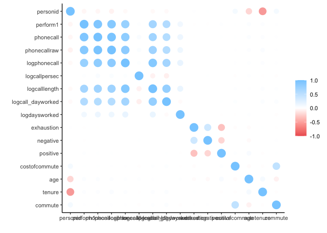
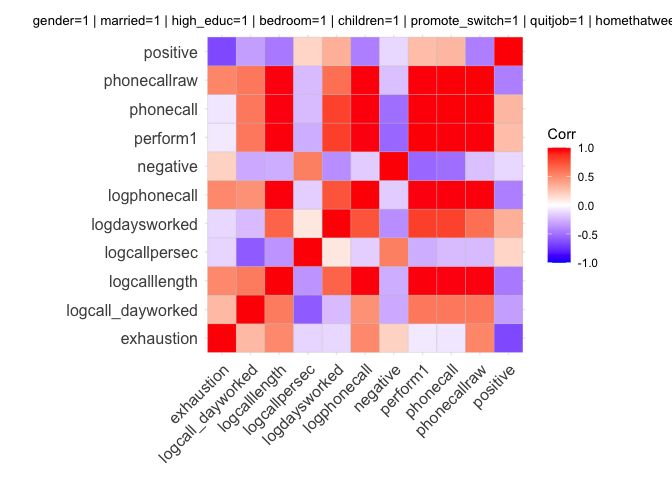
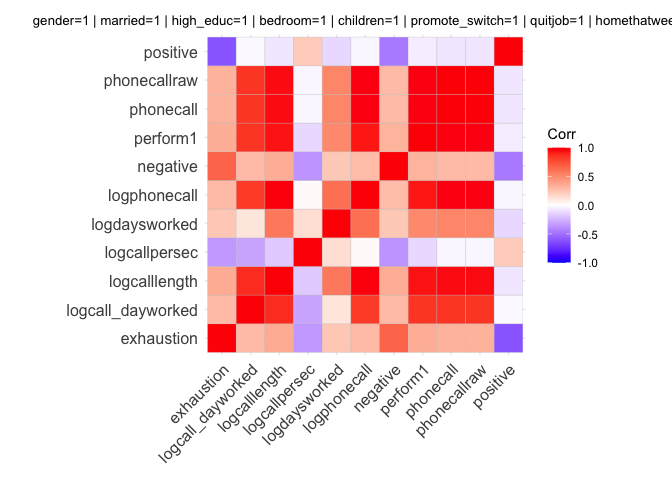
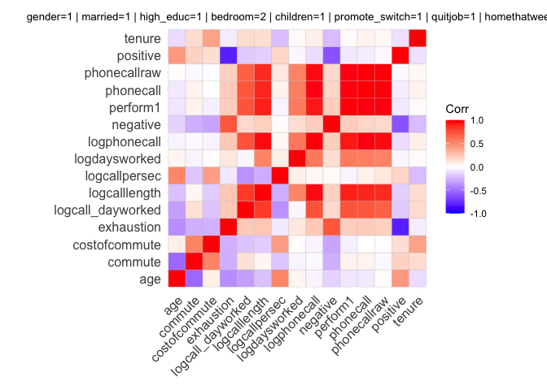
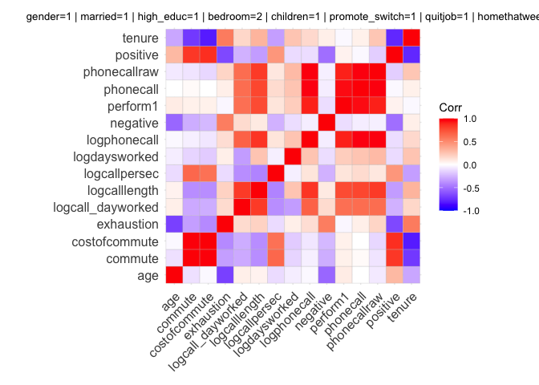

Group Assignment Trimester 1 25/26
================
2025-09-16

You are a consultant for Pacific Insights Analytics (PIA), a boutique
data analytics firm specializing in workforce performance. PIA has been
hired by Huaxia Communications, a major Chinese company operating
several large call centers across the country. Huaxia is facing rising
operational challenges. Staff attrition is driving up recruitment and
training costs and retaining top performers is becoming increasingly
difficult. To address these issues, Huaxia has provided you with
historical data from one of its call centers. This data comes from
multiple administrative sources, including worker surveys, HR records,
and call center productivity logs. Because the data was collected from
different systems, it contains inconsistencies, formatting problems, and
other quality issues. Your task is to clean, explore, and analyze the
data in order to generate clear, evidence-based recommendations that can
help Huaxia’s management improve retention and boost productivity.
Important: You should not run any regression models. The goal is to
understand the data and identify patterns that can inform management
decisions through EDA and hypothesis testing.

## Packages

``` r
library(tidyverse)
```

    ## ── Attaching core tidyverse packages ──────────────────────── tidyverse 2.0.0 ──
    ## ✔ dplyr     1.1.4     ✔ readr     2.1.5
    ## ✔ forcats   1.0.0     ✔ stringr   1.5.1
    ## ✔ ggplot2   3.5.2     ✔ tibble    3.3.0
    ## ✔ lubridate 1.9.4     ✔ tidyr     1.3.1
    ## ✔ purrr     1.1.0     
    ## ── Conflicts ────────────────────────────────────────── tidyverse_conflicts() ──
    ## ✖ dplyr::filter() masks stats::filter()
    ## ✖ dplyr::lag()    masks stats::lag()
    ## ℹ Use the conflicted package (<http://conflicted.r-lib.org/>) to force all conflicts to become errors

``` r
library(stargazer)
```

    ## 
    ## Please cite as: 
    ## 
    ##  Hlavac, Marek (2022). stargazer: Well-Formatted Regression and Summary Statistics Tables.
    ##  R package version 5.2.3. https://CRAN.R-project.org/package=stargazer

``` r
library(haven)
library(corrr)
library(purrr)
library(glue)
library(dplyr)
library(tidyr)
library(ggplot2)
library(ggcorrplot)
library(glue)
library(patchwork)  
```

## Loading the data

``` r
data_perf <- read_dta("../data/performance_labeled.dta")
data_attitude <- read_dta("../data/attitude_labeled.dta")
data_endperiod <- read_dta("../data/endperiod_outcomes_labeled.dta")
data_sum_vol <- read_dta("../data/summary_volunteer_labeled.dta")
data_wage_new <- read_dta("../data/wage_new_labeled.dta")

tb.perf <- as_tibble(data_perf)
tb.attitude <- as_tibble(data_attitude)
tb.endperiod <- as_tibble(data_endperiod)
tb.sum_vul <- as_tibble(data_sum_vol)
tb.wage <- as_tibble(data_wage_new)

rm(data_perf)
rm(data_attitude)
rm(data_endperiod)
rm(data_sum_vol)
rm(data_wage_new)
```

# Cleaning data

## Clean summary_volunteer_labeled

``` r
glimpse(tb.sum_vul)
```

    ## Rows: 140
    ## Columns: 9
    ## $ personid  <chr> "33350", "40034", "31292", "21654", "36908", "13980", "44794…
    ## $ age       <dbl> 26, 19, 27, 29, 23, 1, 23, 25, 21, 23, 23, 30, 22, 22, 23, 2…
    ## $ tenure    <dbl> 22, 9, 24, 37, 15, 51, 3, 42, 3, 34, 24, 25, 3, 66, 9, 70, 4…
    ## $ children  <chr> "0", "0", "0", "0", "0", "0", "0", "0", "0", "0", "0", "0", …
    ## $ bedroom   <chr> "1", "1", "1", "1", "1", "1", "1", "1", "1", "1", "1", "1", …
    ## $ commute   <chr> "120", "300", "135", "80", "60", "  120", "40 min", "60", "1…
    ## $ gender    <chr> "m", "woman", "F", "f", "m", "woman", "male", "woman", "MALE…
    ## $ married   <chr> "SINGLE", "N", "NO", "N", "NO", "  single", " N", "NO", "sin…
    ## $ high_educ <chr> "Y", "no", "YES", "YES", "N", "NO", "n", "YES", "no", "Y", "…

``` r
# remove null values
#tb.sum_vul[is.na(tb.sum_vul)] <- 0  # Replace NA with 0

# convert ID to integer
tb.sum_vul[["personid"]] <- as.integer(tb.sum_vul[["personid"]])

# Clean Numbers with Extra Characters
# Remove non-numeric characters (e.g., commas, spaces)
tb.sum_vul[["commute"]]<- gsub("[^0-9.]", "", tb.sum_vul[["commute"]])
tb.sum_vul[["commute"]] <- as.integer(tb.sum_vul[["commute"]])

# convert "no" strings in the children column to 0 children
tb.sum_vul[["children"]] <- ifelse(tb.sum_vul[["children"]] %in% c("No", ""), "0", tb.sum_vul[["children"]])
# convert to boolean by first converting to integer
tb.sum_vul[["children"]] <- as.logical(as.integer(tb.sum_vul[["children"]]))
# Convert Tenure to integer, as float dont make sense for months
tb.sum_vul[["tenure"]] <- as.integer(tb.sum_vul[["tenure"]])

# convert bedroom to boolean by first converting 0s to False, 1 to true
tb.sum_vul[["bedroom"]]<- ifelse(
    tb.sum_vul[["bedroom"]] == "0", 
    "False", 
    "True"
    )
tb.sum_vul[["bedroom"]] <- as.logical(tb.sum_vul[["bedroom"]])
# normalize gender data by
# lower all charcters
tb.sum_vul[["gender"]] <- tolower(tb.sum_vul[["gender"]])
# trim whitespaces
tb.sum_vul[["gender"]] <- trimws(tb.sum_vul[["gender"]])
# cast all possible options for male and female
tb.sum_vul[["gender"]] <- ifelse(tb.sum_vul[["gender"]] %in% c("m", "male", "man"), "male", tb.sum_vul[["gender"]])
tb.sum_vul[["gender"]] <- ifelse(tb.sum_vul[["gender"]] %in% c("woman", "female", "f", "w","fem"), "female", tb.sum_vul[["gender"]])

# using a similar approach to the gender we convert the married status now
tb.sum_vul[["married"]] <- tolower(tb.sum_vul[["married"]])
# trim whitespaces
tb.sum_vul[["married"]] <- trimws(tb.sum_vul[["married"]])
# cast all possible options for married/not married
tb.sum_vul[["married"]] <- ifelse(tb.sum_vul[["married"]] %in% c("married", "yes", "y", "true"), "TRUE", tb.sum_vul[["married"]])
tb.sum_vul[["married"]] <- ifelse(tb.sum_vul[["married"]] %in% c("no", "not married", "n", "na", "single","false"), "FALSE", tb.sum_vul[["married"]])

# using a similar approach to the married column we convert the high_educ status now
tb.sum_vul[["high_educ"]] <- tolower(tb.sum_vul[["high_educ"]])
# trim whitespaces
tb.sum_vul[["high_educ"]] <- trimws(tb.sum_vul[["high_educ"]])
# cast all possible options for high_educ/not high_educ
tb.sum_vul[["high_educ"]] <- ifelse(tb.sum_vul[["high_educ"]] %in% c("yes", "y"), "TRUE", tb.sum_vul[["high_educ"]])
tb.sum_vul[["high_educ"]] <- ifelse(tb.sum_vul[["high_educ"]] %in% c("no", "n","false"), "FALSE", tb.sum_vul[["high_educ"]])

# convert to boolean
tb.sum_vul[["high_educ"]] <- as.logical(tb.sum_vul[["high_educ"]])
# Convert to numeric (if appropriate)
#tb.sum_vul <- as.numeric(tb.sum_vul) 
```

## Cleaning tb.attitude

``` r
glimpse(tb.attitude)
```

    ## Rows: 2,379
    ## Columns: 5
    ## $ personid   <dbl> 4122, 4122, 4122, 4122, 4122, 4122, 4122, 4122, 4122, 4122,…
    ## $ year_week  <chr> "202249", "202250", "202251", "202252", "202253", "202302",…
    ## $ exhaustion <dbl> 9, 8, 8, 6, 12, 12, 12, 12, 10, 12, 11, 12, 12, 12, 14, 12,…
    ## $ negative   <dbl> 20, 21, 20, 17, 19, 18, 20, 16, 18, 24, 18, 19, 20, 19, 18,…
    ## $ positive   <dbl> 20, 25, 24, 22, 19, 19, 19, 22, 20, 23, 23, 22, 22, 24, 23,…

``` r
unique(tb.attitude[["exhausting"]])
```

    ## NULL

``` r
unique(tb.attitude[["positive"]])
```

    ##  [1] 20.00000 25.00000 24.00000 22.00000 19.00000 23.00000 21.00000 18.00000
    ##  [9] 17.00000  8.00000 16.00000 32.00000 34.00000 30.00000 29.00000 31.00000
    ## [17] 24.24000 28.00000 22.56000 27.00000 26.00000 28.13000 33.00000 35.00000
    ## [25]  9.00000 12.00000 14.00000 13.00000 15.00000 27.19000 11.00000 10.00000
    ## [33] 38.00000 26.28000 36.00000 23.79000 23.48000 37.00000 39.00000 40.00000
    ## [41] 21.91000 22.13000 23.46000 27.18000 26.88000 27.11000 26.04000 25.04065
    ## [49] 27.05000

``` r
unique(tb.attitude[["negative"]])
```

    ##  [1] 20.00000 21.00000 17.00000 19.00000 18.00000 16.00000 24.00000 28.00000
    ##  [9] 22.00000 26.00000 25.00000 27.00000 10.00000 15.00000 14.00000 13.00000
    ## [17] 17.55000 11.00000 12.00000 18.53000  9.00000 17.87716  8.00000 14.85000
    ## [25] 15.47000 23.00000 37.00000 16.22000 30.00000 17.98000 18.19000 32.00000
    ## [33] 29.00000 40.00000 18.77000 31.00000 19.75000 17.57000 14.89000 15.04000
    ## [41] 34.00000 39.00000 36.00000 35.00000 15.55000 15.94000 16.75610 15.10000

``` r
tb.attitude[["personid"]] = as.integer(tb.attitude[["personid"]])
# year_week should stay as string as it will be easier to distinct between year and month later on
# exhausting, negative and postive all contain float values therefore they should not be converted to an integer to avoid information loss
```

## Clean tb.endperiod

``` r
glimpse(tb.endperiod)
```

    ## Rows: 135
    ## Columns: 4
    ## $ personid       <dbl> 4122, 6278, 7720, 8834, 8854, 10098, 10356, 12426, 1297…
    ## $ promote_switch <dbl> 0, 0, 0, 0, 0, 0, 0, 0, 0, 1, 0, 0, 1, 1, 0, 0, 0, 1, 0…
    ## $ quitjob        <dbl> 0, 1, 0, 0, 0, 1, 0, 0, 0, 0, 0, 1, 0, 0, 0, 1, 1, 0, 0…
    ## $ costofcommute  <chr> "18", "12", "9", "0", "4", "12", "0", "0", "0", "6.00元"…

``` r
tb.endperiod[["personid"]] <- as.integer(tb.endperiod[["personid"]])
tb.endperiod[["promote_switch"]] <- as.logical(as.integer(tb.endperiod[["promote_switch"]]))
tb.endperiod[["quitjob"]] <- as.logical(as.integer(tb.endperiod[["quitjob"]]))
tb.endperiod[["costofcommute"]]<- gsub("[^0-9.]", "", tb.endperiod[["costofcommute"]])
tb.endperiod[["costofcommute"]] <- as.numeric(tb.endperiod[["costofcommute"]])
```

## Clean tb.perf

``` r
glimpse(tb.perf)
```

    ## Rows: 9,870
    ## Columns: 12
    ## $ personid          <dbl> 4122, 4122, 4122, 4122, 4122, 4122, 4122, 4122, 4122…
    ## $ year_week         <chr> "202201", "202202", "202203", "202204", "202205", "2…
    ## $ perform1          <chr> "-1.14160859584808", "0.414592355489731", "1.0139772…
    ## $ phonecall         <chr> "-1.13219404220581", "0.312170952558517", "1.0971519…
    ## $ phonecallraw      <chr> "223", "499", "649", "709", "403", "760", "268", "73…
    ## $ homethatweek      <dbl> 0, 0, 0, 0, 0, 0, 0, 0, 0, 0, 0, 0, 0, 0, 0, 0, 0, 0…
    ## $ logphonecall      <chr> "5.40717172622681", "6.21260595321655", "6.475432872…
    ## $ logcallpersec     <chr> "-5.10147857666016", "-5.15978050231934", "-5.142978…
    ## $ logcalllength     <chr> "10.5086498260498", "11.372386932373", "11.618411064…
    ## $ logcall_dayworked <chr> "9.41003799438477", "9.58062744140625", "9.826651573…
    ## $ logdaysworked     <chr> "1.0986123085022", "1.7917594909668", "1.79175949096…
    ## $ date              <chr> "2022-01-03", "2022-01-10", "2022-01-17", "2022-01-2…

``` r
#unique(tb.perf[["year_week"]])
unique(tb.perf[["homethatweek"]])
```

    ## [1] 0 1

``` r
tb.perf[["personid"]] <- as.integer(tb.perf[["personid"]])
# trim year_week and remove all not nuemerical characters
tb.perf[["year_week"]] <- trimws(tb.perf[["year_week"]])
tb.perf[["year_week"]]<- gsub("[^0-9.]", "", tb.perf[["year_week"]])
# convert to float/doubles
tb.perf[["perform1"]] <- as.numeric(tb.perf[["perform1"]])
```

    ## Warning: NAs introduced by coercion

``` r
tb.perf[["phonecall"]] <- as.numeric(tb.perf[["phonecall"]])
```

    ## Warning: NAs introduced by coercion

``` r
# convert to integer
tb.perf[["phonecallraw"]] <- as.integer(tb.perf[["phonecallraw"]])
```

    ## Warning: NAs introduced by coercion

``` r
# convert to boolean
tb.perf[["homethatweek"]] <- as.logical(as.integer(tb.perf[["homethatweek"]]))
# convert to float/doubles
tb.perf[["logphonecall"]] <- as.numeric(tb.perf[["logphonecall"]])
```

    ## Warning: NAs introduced by coercion

``` r
tb.perf[["logcallpersec"]] <- as.numeric(tb.perf[["logcallpersec"]])
```

    ## Warning: NAs introduced by coercion

``` r
tb.perf[["logcalllength"]] <- as.numeric(tb.perf[["logcalllength"]])
```

    ## Warning: NAs introduced by coercion

``` r
tb.perf[["logcall_dayworked"]] <- as.numeric(tb.perf[["logcall_dayworked"]])
```

    ## Warning: NAs introduced by coercion

``` r
tb.perf[["logdaysworked"]] <- as.numeric(tb.perf[["logdaysworked"]])
```

    ## Warning: NAs introduced by coercion

``` r
# convert to Date
tb.perf[["date"]] <- as.Date(tb.perf[["date"]])
```

## Clean tb.wage

``` r
glimpse(tb.wage)
```

    ## Rows: 3,007
    ## Columns: 5
    ## $ basewage   <chr> "1650", "1650", "1650", "1650", "1650", "1650", "1800", "18…
    ## $ grosswage  <chr> "3650.76000976562", "4775.52001953125", "4358", "4801", "40…
    ## $ personid   <chr> "4122", "4122", "4122", "4122", "4122", "4122", "4122", "41…
    ## $ wage_month <chr> "202201", "202202", "202203", "202204", "202205", "202206",…
    ## $ bonustotal <chr> "2000.76000976562", "3125.52001953125", "2708", "3151", "23…

``` r
#unique(tb.wage[["basewage"]])
```

``` r
tb.wage[["personid"]] <- as.integer(tb.wage[["personid"]])
tb.wage[["basewage"]] <- as.integer(tb.wage[["basewage"]])
```

    ## Warning: NAs introduced by coercion

``` r
tb.wage[["grosswage"]] <- as.numeric(tb.wage[["grosswage"]])
```

    ## Warning: NAs introduced by coercion

``` r
tb.wage[["wage_month"]] <- trimws(tb.wage[["wage_month"]])
tb.wage[["wage_month"]]<- gsub("[^0-9.]", "", tb.wage[["wage_month"]])
tb.wage <- rename(tb.wage, year_month=wage_month)
tb.wage[["bonustotal"]] <- as.numeric(tb.wage[["bonustotal"]])
```

    ## Warning: NAs introduced by coercion

# Merging data together

``` r
tb.worker_details <- merge(tb.endperiod, tb.sum_vul, by="personid", all=TRUE)
tb.perf_attitude <- merge(tb.perf, tb.attitude, by=c("personid", "year_week"))
tb.perf_attitude <- merge(tb.perf_attitude, tb.worker_details, by=c("personid"))
```

``` r
tb.perf %>% group_by(personid, year_week) %>% filter(n()>1)
```

    ## # A tibble: 0 × 12
    ## # Groups:   personid, year_week [0]
    ## # ℹ 12 variables: personid <int>, year_week <chr>, perform1 <dbl>,
    ## #   phonecall <dbl>, phonecallraw <int>, homethatweek <lgl>,
    ## #   logphonecall <dbl>, logcallpersec <dbl>, logcalllength <dbl>,
    ## #   logcall_dayworked <dbl>, logdaysworked <dbl>, date <date>

``` r
tb.attitude %>% group_by(personid, year_week) %>% filter(n()>1)
```

    ## # A tibble: 0 × 5
    ## # Groups:   personid, year_week [0]
    ## # ℹ 5 variables: personid <int>, year_week <chr>, exhaustion <dbl>,
    ## #   negative <dbl>, positive <dbl>

Note: all now resulted dataframes still contain NA values

# Eploration

## General correlations

In this section we try to get as much information as possible by looking
at the data.

1.  We check for any correlation between any of our numerical value over
    the performance and attitude of all employees

``` r
# use tb.perf_attitude as df; renaming for better readability
df <- tb.perf_attitude
# create.a correlation matrix for the full population
cor_matrix <- df %>% 
  correlate(diagonal = 1)
```

    ## Non-numeric variables removed from input: `year_week`, `homethatweek`, `date`, `promote_switch`, `quitjob`, `children`, `bedroom`, `gender`, `married`, and `high_educ`
    ## Correlation computed with
    ## • Method: 'pearson'
    ## • Missing treated using: 'pairwise.complete.obs'

``` r
cor_matrix %>%
  rearrange() %>%            # rearrange by correlations
  shave() %>%                # Shave off the upper triangle for a clean result
  fashion(decimals = 3)      # Clean presentation
```

    ##                 term personid negative exhaustion costofcommute commute
    ## 1           personid    1.000                                          
    ## 2           negative     .034    1.000                                 
    ## 3         exhaustion     .060     .587      1.000                      
    ## 4      costofcommute     .250    -.007      -.083         1.000        
    ## 5            commute     .248     .059      -.041          .675   1.000
    ## 6      logcallpersec    -.005     .043      -.005         -.060   -.071
    ## 7           positive     .000    -.444      -.557          .086    .048
    ## 8                age    -.443    -.131      -.111         -.110   -.232
    ## 9             tenure    -.732     .029       .035         -.072   -.053
    ## 10     logdaysworked    -.019     .014       .021         -.038   -.068
    ## 11 logcall_dayworked    -.134    -.001       .005          .105    .136
    ## 12     logcalllength    -.143     .009       .015          .074    .081
    ## 13          perform1    -.184    -.047      -.049          .050    .066
    ## 14      logphonecall    -.146     .021       .013          .057    .060
    ## 15         phonecall    -.181    -.018      -.023          .041    .062
    ## 16      phonecallraw    -.227     .007      -.003          .051    .058
    ##    logcallpersec positive   age tenure logdaysworked logcall_dayworked
    ## 1                                                                     
    ## 2                                                                     
    ## 3                                                                     
    ## 4                                                                     
    ## 5                                                                     
    ## 6          1.000                                                      
    ## 7          -.006    1.000                                             
    ## 8           .087     .196 1.000                                       
    ## 9          -.045    -.057  .235  1.000                                
    ## 10          .010    -.029  .075  -.006         1.000                  
    ## 11         -.252     .037  .030   .134         -.122             1.000
    ## 12         -.231     .023  .067   .126          .367              .879
    ## 13          .092     .072  .134   .119          .298              .745
    ## 14          .106     .025  .096   .112          .379              .812
    ## 15          .173     .048  .130   .125          .340              .735
    ## 16          .160     .040  .121   .162          .324              .729
    ##    logcalllength perform1 logphonecall phonecall phonecallraw
    ## 1                                                            
    ## 2                                                            
    ## 3                                                            
    ## 4                                                            
    ## 5                                                            
    ## 6                                                            
    ## 7                                                            
    ## 8                                                            
    ## 9                                                            
    ## 10                                                           
    ## 11                                                           
    ## 12         1.000                                             
    ## 13          .814    1.000                                    
    ## 14          .942     .864        1.000                       
    ## 15          .827     .964         .904     1.000             
    ## 16          .839     .941         .913      .985        1.000

``` r
# Correlation plot
cor_matrix %>% rplot()
```

<!-- -->

Here we can see that the performance metric “perform1” has a correlation
to phonecall, phonecallraw, logphonecall, logcalllength, which gives us
a hint on how this metrics was calculated. Furthermore we can see, a
light negative correlation between “negative” and “positive” from the
attitude dataset, which makes sense as these are opposites. Because of
the timeseries data of the performance data set, the light correlation
can be explained as the attitude may change from day to day, or not
(what we can not infer from that). There is also a slight correlation
between exhaustion and negative attitude, which may seem logical at
first.

## Subgroups/Personas of workers

Though we have some correlation between some variables, most of them are
not strong/significant, except the performance measurements and score
which can be explained because the observational variables are used to
calculate the score with a determined function. Therefore, a deeper
exploration is needed, which we perform in this exploratory approach by
identifying subgroups of all observed workers by dividing them using the
categorical variables (7) to create individual groups, where a maximum
of 49 are possible. After Identifying the groups we will look at the
correlations between all numerical variables within the groups. Doing
so, we can identify certain personas for the groups, e.g. high
performer, low performer, etc., in order to find more insights on how to
solve our clients problems.

### Create groups for the whole dataset of all performances, attitudes for all workers

``` r
# define categorical variables
cat_cols <- c("gender","married","high_educ","bedroom","children","promote_switch","quitjob", "homethatweek")

# factors
df <- df %>% mutate(across(all_of(cat_cols), ~ factor(.x)))

# build grid of categories
lvls <- lapply(df[cat_cols], levels)
grid <- tidyr::expand_grid(!!!lvls)

# remove personid as not needed for computations of groups
df <- df %>% select(-`personid`)

# create summary for each category/group of people working at the company
summary_df <- df %>%
  group_by(across(all_of(cat_cols))) %>%
  summarise(
    # add number per category to filter later
    n = n(),
    across(where(is.numeric),
           list(mean = ~mean(.x, na.rm = TRUE),
                sd   = ~sd(.x,   na.rm = TRUE),
                med  = ~median(.x, na.rm = TRUE),
                min  = ~min(.x, na.rm = TRUE),
                max  = ~max(.x, na.rm = TRUE)),
           .names = "{.col}_{.fn}"),
)
```

    ## Warning: There were 10 warnings in `summarise()`.
    ## The first warning was:
    ## ℹ In argument: `across(...)`.
    ## ℹ In group 12: `gender = female`, `married = TRUE`, `high_educ = TRUE`,
    ##   `bedroom = TRUE`, `children = FALSE`, `promote_switch = FALSE`, `quitjob =
    ##   FALSE`, `homethatweek = FALSE`.
    ## Caused by warning in `min()`:
    ## ! no non-missing arguments to min; returning Inf
    ## ℹ Run `dplyr::last_dplyr_warnings()` to see the 9 remaining warnings.

    ## `summarise()` has grouped output by 'gender', 'married', 'high_educ',
    ## 'bedroom', 'children', 'promote_switch', 'quitjob'. You can override using the
    ## `.groups` argument.

using the summary_df we can get a more detailed glimpse for each group
and their statistics to get a better understanding.

### Create correlation matrices for all groups

``` r
# create a funcition for create the correalation matrices as heatmap
plot_cor_heatmap <- function(.x, title){
  # "count" how many columns/numerical values we have from the given parameter .x
  nums <- .x %>% select(where(is.numeric))
  # where each column (numerical variable) should have at least 2 rows without NAs
  # keep contains only the col names to keep based on the condition
  keep <- sapply(nums, function(v) sum(!is.na(v)) > 1)
  # drop cols which do not meet criteria
  nums <- nums[, keep, drop = FALSE]
  # if too few columns or too few rows to compute correlation, just return NULL
  if (ncol(nums) < 2 || nrow(nums) < 3) return(NULL)
  
  # create the acutal matrics based on how many
  cm <- cor(nums, use = "pairwise.complete.obs")
  
  # enforce alphabetical order of variables for consistent axes, to better compare plots later
  ord <- sort(colnames(cm))
  cm <- cm[ord, ord]
  
  # create correlation plot, hc.order is important to keep our defined order
  ggcorrplot(cm, hc.order = FALSE, lab = FALSE) +
    ggtitle(title) +
    theme(plot.title = element_text(hjust = 0.5, size = 10))
}
# use the function and across to dynamically create a matrix for each group we have in cat_cols
# in the end we will have a list of our grouped worker matrices
plots <- df %>%
  group_by(across(all_of(cat_cols))) %>%
  # for each group create a title and plot the matrix
  group_map(~{
    title <- glue::glue_collapse(glue("{names(.y)}={as.character(.y)}"), sep = " | ")
    plot_cor_heatmap(.x, title)
  })
```

    ## Warning in cor(nums, use = "pairwise.complete.obs"): the standard deviation is
    ## zero
    ## Warning in cor(nums, use = "pairwise.complete.obs"): the standard deviation is
    ## zero
    ## Warning in cor(nums, use = "pairwise.complete.obs"): the standard deviation is
    ## zero
    ## Warning in cor(nums, use = "pairwise.complete.obs"): the standard deviation is
    ## zero
    ## Warning in cor(nums, use = "pairwise.complete.obs"): the standard deviation is
    ## zero
    ## Warning in cor(nums, use = "pairwise.complete.obs"): the standard deviation is
    ## zero
    ## Warning in cor(nums, use = "pairwise.complete.obs"): the standard deviation is
    ## zero
    ## Warning in cor(nums, use = "pairwise.complete.obs"): the standard deviation is
    ## zero
    ## Warning in cor(nums, use = "pairwise.complete.obs"): the standard deviation is
    ## zero
    ## Warning in cor(nums, use = "pairwise.complete.obs"): the standard deviation is
    ## zero

``` r
# define the size of the plot
dev.new(width = 20, height = 8)
# use wrap_plots to plot (multiple) of the plots
wrap_plots(plots[1:2])  # show 2 plots at the same time and compare them
```

### Save the plots as image files

``` r
# save each plot of the matrix (from ChatGPT)
library(purrr)

# build file names for each matrix from group variables
group_names <- df %>%
  distinct(across(all_of(cat_cols))) %>%
  mutate(fname = pmap_chr(across(everything()),
                          ~paste(cat_cols, c(...), sep="=", collapse="_"))) %>%
  pull(fname)

# match names to plots (plots list comes from previous code)
valid_idx <- which(!sapply(plots, is.null))

walk(valid_idx, function(i){
  ggsave(
    filename = paste0("/Users/max/Documents/Master/Courses/Statistics/Group Project/results/corr_", group_names[i], ".png"),
    plot     = plots[[i]],
    width    = 10,
    height   = 8,
    dpi      = 300
  )
})
```

## Analyzing the groups and identifying personas associated with them

In general we have 23 groups with 7 different worker characteristics
(bound to the worker) and one characteristic on if they worked at least
once from how in that week of their performance. So the groups describe
the performance of week of certain workers based on if they were working
from home and their circumstances.

For each group we will describe what the correlations implies for the
group and compare them to each other.

### Group 1:

Male, unemployed employees with low education, with no access to the
bedroom in the office, no promote options who not quit, who have not
worked from home during that week:  

``` r
wrap_plots(plots[1])
```

<!-- -->

**Conclusions**

1.  Call-volume metrics (raw counts, logs, calls per day, call length)
    cluster tightly, indicating they reflect the same workload.

2.  Higher workload links to higher exhaustion and more negative mood.

3.  Positive mood decreases with rising exhaustion and workload.

4.  Faster call rate (calls per second) comes with shorter call length.

This supports the idea that heavier work increases fatigue and worsens
mood, while efficiency trades off with call duration.

Furthermore we see clusters for the performance metrics, showing a very
similar view as the general impression from the beginning.

### Group 2:

Male, unemployed employees with low education, with no access to the
bedroom in the office, no promote options who not quit, who have worked
from home during that week:

``` r
wrap_plots(plots[2])
```

<!-- -->

**Conclusions**

The pattern matches the previous group: call-volume indicators remain
tightly linked to each other and to exhaustion and negative mood.
Positive mood still drops as workload rises. Logcallpersec again trades
off with call length. No major structural shift is visible compared to
the earlier matrix.

There, for this type of individuals, working from home does not make a
significant difference.

### Group 3:

Male, unemployed employees with low education, with access to the
bedroom in the office, no promote options who not quit, who have not
worked from home during that week:

``` r
wrap_plots(plots[3])
```

<!-- -->

**Conclusions**

The core performance cluster (phonecall measures, performance,
exhaustion, negative mood) remains strong.

New: • Age tracks tenure and commuting cost, suggesting older employees
stay longer and spend more on commuting. • Commute and cost are strongly
linked as expected. • Positive mood still drops with higher workload and
exhaustion. The structure is otherwise similar to earlier groups.Results

### Group 4:

Male, unemployed employees with low education, with access to the
bedroom in the office, no promote options who not quit, who have not
worked from home during that week:

``` r
wrap_plots(plots[4])
```

<!-- -->

**Conclusions**

The same core workload cluster (phonecall measures, performance,
exhaustion, negative mood) persists.  

New demographics show:  

• Age strongly raises commuting cost and distance.  

• Commute and cost remain tightly linked.  

• Positive mood again falls with higher workload and exhaustion.  

Compared to the previous male subgroup, age is now more tied to commute
cost but tenure links to age are weaker.
