Group Assignment Trimester 1 25/26
================
2025-09-16

You are a consultant for Pacific Insights Analytics (PIA), a boutique
data analytics firm specializing in workforce performance. PIA has been
hired by Huaxia Communications, a major Chinese company operating
several large call centers across the country. Huaxia is facing rising
operational challenges. Staff attrition is driving up recruitment and
training costs and retaining top performers is becoming increasingly
difficult. To address these issues, Huaxia has provided you with
historical data from one of its call centers. This data comes from
multiple administrative sources, including worker surveys, HR records,
and call center productivity logs. Because the data was collected from
different systems, it contains inconsistencies, formatting problems, and
other quality issues. Your task is to clean, explore, and analyze the
data in order to generate clear, evidence-based recommendations that can
help Huaxia’s management improve retention and boost productivity.
Important: You should not run any regression models. The goal is to
understand the data and identify patterns that can inform management
decisions through EDA and hypothesis testing.

## Packages

``` r
library(tidyverse)
```

    ## ── Attaching core tidyverse packages ──────────────────────── tidyverse 2.0.0 ──
    ## ✔ dplyr     1.1.4     ✔ readr     2.1.5
    ## ✔ forcats   1.0.0     ✔ stringr   1.5.1
    ## ✔ ggplot2   3.5.2     ✔ tibble    3.3.0
    ## ✔ lubridate 1.9.4     ✔ tidyr     1.3.1
    ## ✔ purrr     1.1.0     
    ## ── Conflicts ────────────────────────────────────────── tidyverse_conflicts() ──
    ## ✖ dplyr::filter() masks stats::filter()
    ## ✖ dplyr::lag()    masks stats::lag()
    ## ℹ Use the conflicted package (<http://conflicted.r-lib.org/>) to force all conflicts to become errors

``` r
library(haven)
library(corrr)
library(purrr)
library(glue)
library(dplyr)
library(tidyr)
library(ggplot2)
library(ggcorrplot)
library(glue)
library(patchwork)
library(lubridate)
library(ISOweek)
library(skimr)
```

    ## 
    ## Attaching package: 'skimr'
    ## 
    ## The following object is masked from 'package:corrr':
    ## 
    ##     focus

``` r
library(stargazer)
```

    ## 
    ## Please cite as: 
    ## 
    ##  Hlavac, Marek (2022). stargazer: Well-Formatted Regression and Summary Statistics Tables.
    ##  R package version 5.2.3. https://CRAN.R-project.org/package=stargazer

## Loading the data

``` r
data_perf <- read_dta("../data/performance_labeled.dta")
data_attitude <- read_dta("../data/attitude_labeled.dta")
data_endperiod <- read_dta("../data/endperiod_outcomes_labeled.dta")
data_sum_vol <- read_dta("../data/summary_volunteer_labeled.dta")
data_wage_new <- read_dta("../data/wage_new_labeled.dta")

performance <- as_tibble(data_perf)
attitude <- as_tibble(data_attitude)
endperiod <- as_tibble(data_endperiod)
volunteer <- as_tibble(data_sum_vol)
wage <- as_tibble(data_wage_new)

rm(data_perf)
rm(data_attitude)
rm(data_endperiod)
rm(data_sum_vol)
rm(data_wage_new)
```

# Cleaning data

Here come some handy functions to reduce duplicate code for cleaning the
data:

Extract a numeric number from a string with different decimal
separators:

``` r
extract_numeric <- function(x) {
  # remove leading/trailing spaces
  x <- trimws(x)
  
  # normalize dash types (en-dash, em-dash) to minus
  x <- gsub("–|—", "-", x)  
  
  # allow scientific notation: replace commas in mantissa
  if (grepl("[eE]", x)) {
    # if comma before e → decimal comma
    x <- sub(",", ".", x)
    # remove thousand separators before e
    x <- gsub("\\.(?=\\d{3}[eE])", "", x, perl = TRUE)
    x <- gsub(",(?=\\d{3}[eE])", "", x, perl = TRUE)
    return(as.numeric(x))
  }
  
  # remove spaces
  x <- gsub(" ", "", x)
  
  # case 1: comma used as decimal
  if (grepl(",", x) & !grepl("\\.", x)) {
    x <- gsub(",", ".", x)
  }
  
  # case 2: both comma and dot appear
  # assume comma is thousands separator, remove it
  if (grepl(",.*\\.", x)) {
    x <- gsub(",", "", x)
  }
  
  as.numeric(x)
}

find_non_numeric_chars <- function(x) {
  non_numeric <- gsub("[-0-9]", "", x)  # remove digits, minus, dot, comma
  unique(non_numeric[non_numeric != ""])
}

find_non_numeric_rows <- function(x) {
  non_numeric <- !grepl("^[-]?[0-9]+([0-9]+)?$",x) # remove digits, minus, dot, comma
  non_numeric <- non_numeric[non_numeric != ""]
  x[non_numeric]
}
```

## Clean volunteer

Rows: 140 Columns: 9 \$ personid <chr> “33350”, “40034”, “31292”,
“21654”, “36908”, “13980”, “44794… \$ age <dbl> 26, 19, 27, 29, 23, 1,
23, 25, 21, 23, 23, 30, 22, 22, 23, 2… \$ tenure <dbl> 22, 9, 24, 37,
15, 51, 3, 42, 3, 34, 24, 25, 3, 66, 9, 70, 4… \$ children <chr>”0”,
“0”, “0”, “0”, “0”, “0”, “0”, “0”, “0”, “0”, “0”, “0”, … \$ bedroom
<chr> “1”, “1”, “1”, “1”, “1”, “1”, “1”, “1”, “1”, “1”, “1”, “1”, … \$
commute <chr> “120”, “300”, “135”, “80”, “60”, ” 120”, “40 min”, “60”,
“1… \$ gender <chr>”m”, “woman”, “F”, “f”, “m”, “woman”, “male”,
“woman”, “MALE… \$ married <chr>”SINGLE”, “N”, “NO”, “N”, “NO”, ”
single”, ” N”, “NO”, “sin… \$ high_educ <chr>”Y”, “no”, “YES”, “YES”,
“N”, “NO”, “n”, “YES”, “no”, “Y”, “…

================================================== Statistic N Mean
St. Dev. Min Median Max  
————————————————– age 140 23.536 4.352 1 23 35  
tenure 140 22.971 24.296 2.000 13.000 150.000 ————————————————– \[1\] ”
” ” min” ” MIN” ” ” ” minute” ” minutes” “. h”  
\[8\] ” MIN”  
\[1\] ” 120” “40 min” ” 50 MIN” ” 170” ” 210”  
\[6\] “40 minute” “240 minutes” “1.2 h” ” 180” ” 90 MIN”  
\[11\] “40 minute” “30 minutes” ” 180” “120 MIN” ” 120”  
\[16\] “50 min” “100 min” ” 120” “60 minutes” “1.2 h”  
\[21\] “180 minutes” ” 150” “2.3 h”

We can see a lot of columns with numerical values within strstrings and
additional chars. Furthermore, categorical variables like married and
gender contain different labels for the same categories.

``` r
# convert to integer to remove leading zeros an than to str
volunteer$personid <- as.character(as.integer(volunteer$personid))
# Clean Numbers with extra characters
# Remove non-numeric characters, except dots and commas and convert to numeric
volunteer[["commute"]] <- sapply(volunteer$commute, extract_numeric)
```

    ## Warning in FUN(X[[i]], ...): NAs introduced by coercion
    ## Warning in FUN(X[[i]], ...): NAs introduced by coercion
    ## Warning in FUN(X[[i]], ...): NAs introduced by coercion
    ## Warning in FUN(X[[i]], ...): NAs introduced by coercion
    ## Warning in FUN(X[[i]], ...): NAs introduced by coercion
    ## Warning in FUN(X[[i]], ...): NAs introduced by coercion
    ## Warning in FUN(X[[i]], ...): NAs introduced by coercion
    ## Warning in FUN(X[[i]], ...): NAs introduced by coercion
    ## Warning in FUN(X[[i]], ...): NAs introduced by coercion
    ## Warning in FUN(X[[i]], ...): NAs introduced by coercion
    ## Warning in FUN(X[[i]], ...): NAs introduced by coercion
    ## Warning in FUN(X[[i]], ...): NAs introduced by coercion
    ## Warning in FUN(X[[i]], ...): NAs introduced by coercion
    ## Warning in FUN(X[[i]], ...): NAs introduced by coercion
    ## Warning in FUN(X[[i]], ...): NAs introduced by coercion

``` r
volunteer[["commute"]] <- as.numeric(volunteer[["commute"]])

# convert "no" strings in the children column to 0 children
volunteer[["children"]] <- ifelse(volunteer[["children"]] %in% c("No", ""), "0", volunteer[["children"]])
# convert to boolean by first converting to integer
volunteer[["children"]] <- as.logical(as.integer(volunteer[["children"]]))
# Convert Tenure to integer, as float dont make sense for months
volunteer[["tenure"]] <- as.integer(volunteer[["tenure"]])

# convert bedroom to boolean by first converting 0s to False, 1 to true
volunteer[["bedroom"]]<- ifelse(
    volunteer[["bedroom"]] == "0", 
    0, 
    1
    )
volunteer[["bedroom"]] <- as.integer(volunteer[["bedroom"]])
# normalize gender data by
# lower all charcters
volunteer[["gender"]] <- tolower(volunteer[["gender"]])
# trim whitespaces
volunteer[["gender"]] <- trimws(volunteer[["gender"]])
# cast all possible options for male and female
volunteer[["gender"]] <- ifelse(volunteer[["gender"]] %in% c("m", "male", "man"), "male", volunteer[["gender"]])
volunteer[["gender"]] <- ifelse(volunteer[["gender"]] %in% c("woman", "female", "f", "w","fem"), "female", volunteer[["gender"]])

# using a similar approach to the gender we convert the married status now
volunteer[["married"]] <- tolower(volunteer[["married"]])
# trim whitespaces
volunteer[["married"]] <- trimws(volunteer[["married"]])
# cast all possible options for married/not married
volunteer[["married"]] <- ifelse(volunteer[["married"]] %in% c("married", "yes", "y", "true"), "TRUE", volunteer[["married"]])
volunteer[["married"]] <- ifelse(volunteer[["married"]] %in% c("no", "not married", "n", "na", "single","false"), "FALSE", volunteer[["married"]])

# using a similar approach to the married column we convert the high_educ status now
volunteer[["high_educ"]] <- tolower(volunteer[["high_educ"]])
# trim whitespaces
volunteer[["high_educ"]] <- trimws(volunteer[["high_educ"]])
# cast all possible options for high_educ/not high_educ
volunteer[["high_educ"]] <- ifelse(volunteer[["high_educ"]] %in% c("yes", "y"), "TRUE", volunteer[["high_educ"]])
volunteer[["high_educ"]] <- ifelse(volunteer[["high_educ"]] %in% c("no", "n","false"), "FALSE", volunteer[["high_educ"]])

# convert to boolean
volunteer[["high_educ"]] <- as.logical(volunteer[["high_educ"]])

# create numerical variable cols for gender and married
volunteer$gender_num <-as.integer(ifelse(volunteer$gender=="male",0,1))
volunteer$married_num <-as.integer(ifelse(volunteer$married==FALSE,0,1))
volunteer$high_educ_num <-as.integer(ifelse(volunteer$high_educ==FALSE,0,1))
volunteer$children_num <-as.integer(ifelse(volunteer$children==FALSE,0,1))

# remove duplicates on same personid
volunteer <- volunteer %>%
  distinct(personid, .keep_all = TRUE)
```

``` r
# Now we have much better insights using stargazer
stargazer(as.data.frame(volunteer), type = "text", median = TRUE, header = TRUE)
```

    ## 
    ## =================================================
    ## Statistic      N   Mean   St. Dev. Min Median Max
    ## -------------------------------------------------
    ## age           135 23.452   4.315    1    23   35 
    ## tenure        135 23.385   24.608   2    13   150
    ## children      135  0.148   0.357    0    0     1 
    ## bedroom       135  0.978   0.148    0    1     1 
    ## commute       122 104.721  68.544   1    85   300
    ## high_educ     135  0.415   0.495    0    0     1 
    ## gender_num    135  0.496   0.502    0    0     1 
    ## married_num   135  0.200   0.401    0    0     1 
    ## high_educ_num 135  0.415   0.495    0    0     1 
    ## children_num  135  0.148   0.357    0    0     1 
    ## -------------------------------------------------

## Clean attitude

``` r
glimpse(attitude)
```

    ## Rows: 2,379
    ## Columns: 5
    ## $ personid   <dbl> 4122, 4122, 4122, 4122, 4122, 4122, 4122, 4122, 4122, 4122,…
    ## $ year_week  <chr> "202249", "202250", "202251", "202252", "202253", "202302",…
    ## $ exhaustion <dbl> 9, 8, 8, 6, 12, 12, 12, 12, 10, 12, 11, 12, 12, 12, 14, 12,…
    ## $ negative   <dbl> 20, 21, 20, 17, 19, 18, 20, 16, 18, 24, 18, 19, 20, 19, 18,…
    ## $ positive   <dbl> 20, 25, 24, 22, 19, 19, 19, 22, 20, 23, 23, 22, 22, 24, 23,…

``` r
stargazer(as.data.frame(attitude), type = "text", median = TRUE, header = TRUE)
```

    ## 
    ## ==========================================================
    ## Statistic    N      Mean     St. Dev.   Min  Median  Max  
    ## ----------------------------------------------------------
    ## personid   2,379 33,005.050 10,331.780 4,122 36,288 45,442
    ## exhaustion 2,379   8.612      7.794    0.000 7.000  36.000
    ## negative   2,379   16.651     6.848    8.000 16.000 40.000
    ## positive   2,379   24.215     6.668    8.000 24.000 40.000
    ## ----------------------------------------------------------

``` r
unique(attitude[["exhausting"]])
```

    ## NULL

``` r
unique(attitude[["positive"]])
```

    ##  [1] 20.00000 25.00000 24.00000 22.00000 19.00000 23.00000 21.00000 18.00000
    ##  [9] 17.00000  8.00000 16.00000 32.00000 34.00000 30.00000 29.00000 31.00000
    ## [17] 24.24000 28.00000 22.56000 27.00000 26.00000 28.13000 33.00000 35.00000
    ## [25]  9.00000 12.00000 14.00000 13.00000 15.00000 27.19000 11.00000 10.00000
    ## [33] 38.00000 26.28000 36.00000 23.79000 23.48000 37.00000 39.00000 40.00000
    ## [41] 21.91000 22.13000 23.46000 27.18000 26.88000 27.11000 26.04000 25.04065
    ## [49] 27.05000

``` r
unique(attitude[["negative"]])
```

    ##  [1] 20.00000 21.00000 17.00000 19.00000 18.00000 16.00000 24.00000 28.00000
    ##  [9] 22.00000 26.00000 25.00000 27.00000 10.00000 15.00000 14.00000 13.00000
    ## [17] 17.55000 11.00000 12.00000 18.53000  9.00000 17.87716  8.00000 14.85000
    ## [25] 15.47000 23.00000 37.00000 16.22000 30.00000 17.98000 18.19000 32.00000
    ## [33] 29.00000 40.00000 18.77000 31.00000 19.75000 17.57000 14.89000 15.04000
    ## [41] 34.00000 39.00000 36.00000 35.00000 15.55000 15.94000 16.75610 15.10000

We see that we do not have missing values, and the data types for all
columns already fit. We only need to convert personid to a string.

``` r
# convert to integer to remove leading zeros an than to str
attitude$personid <- as.character(as.integer(attitude$personid))
# remove duplicates on same personid and year_week
attitude <- attitude %>%
  distinct(personid, year_week, .keep_all = TRUE)
```

## Clean endperiod

``` r
glimpse(endperiod)
```

    ## Rows: 135
    ## Columns: 4
    ## $ personid       <dbl> 4122, 6278, 7720, 8834, 8854, 10098, 10356, 12426, 1297…
    ## $ promote_switch <dbl> 0, 0, 0, 0, 0, 0, 0, 0, 0, 1, 0, 0, 1, 1, 0, 0, 0, 1, 0…
    ## $ quitjob        <dbl> 0, 1, 0, 0, 0, 1, 0, 0, 0, 0, 0, 1, 0, 0, 0, 1, 1, 0, 0…
    ## $ costofcommute  <chr> "18", "12", "9", "0", "4", "12", "0", "0", "0", "6.00元"…

``` r
stargazer(as.data.frame(endperiod), type = "text", median = TRUE, header = TRUE)
```

    ## 
    ## ============================================================
    ## Statistic       N     Mean     St. Dev.   Min  Median  Max  
    ## ------------------------------------------------------------
    ## personid       135 32,716.780 10,835.700 4,122 37,292 45,442
    ## promote_switch 135   0.163      0.371      0     0      1   
    ## quitjob        135   0.296      0.458      0     0      1   
    ## ------------------------------------------------------------

``` r
# check character columns with numerical values to extract for non numeric chars to
# be aware for special cases
find_non_numeric_chars(endperiod$costofcommute)
```

    ##  [1] ".元"      ".元 /月"  "."        "人民币 ." "NA"       "CNY ."   
    ##  [7] "  "       ","        ". 元"     "¥."       " "

``` r
find_non_numeric_rows(endperiod$costofcommute)
```

    ##  [1] "6.00元"           "-"                "25.00元 /月"      "11.8181819915771"
    ##  [5] "人民币 14.00"     "NA"               "CNY 3.00"         "  6"             
    ##  [9] "2,00"             "17.7272720336914" "  0"              "4.54545450210571"
    ## [13] "2,00"             "0.00 元"          "¥10.00"           " 10"             
    ## [17] "0,00"

``` r
# here we only need to take care of the decimal dots (will be added to the extraction function), any other chars can be ignored
```

No missing values, promote_switch and quitjob are logical values, though
we also will create a numerical version (0-1) for them to compute
statistics. costofcommute need to be converted to doubles.

``` r
# convert to integer to remove leading zeros an than to str
endperiod$personid <- as.character(as.integer(endperiod$personid))
# convert to integers
endperiod[["promote_switch_num"]] <- as.integer(endperiod[["promote_switch"]])
endperiod[["quitjob_num"]] <- as.integer(endperiod[["quitjob"]])
# convert to logical (too have numerical and categorical variables)
endperiod[["promote_switch"]] <- as.logical(endperiod[["promote_switch_num"]])
endperiod[["quitjob"]] <- as.logical(endperiod[["quitjob_num"]])
# extract numbers from string. Both, dots and commas are used as decimal separators
endperiod[["costofcommute"]]<- gsub("[^0-9.,]", "", endperiod[["costofcommute"]])
endperiod[["costofcommute"]] <- as.numeric(endperiod[["costofcommute"]])
```

    ## Warning: NAs introduced by coercion

``` r
# remove duplicates on same personid
endperiod <- endperiod %>%
  distinct(personid, .keep_all = TRUE)
```

``` r
glimpse(endperiod)
```

    ## Rows: 135
    ## Columns: 6
    ## $ personid           <chr> "4122", "6278", "7720", "8834", "8854", "10098", "1…
    ## $ promote_switch     <lgl> FALSE, FALSE, FALSE, FALSE, FALSE, FALSE, FALSE, FA…
    ## $ quitjob            <lgl> FALSE, TRUE, FALSE, FALSE, FALSE, TRUE, FALSE, FALS…
    ## $ costofcommute      <dbl> 18.00000, 12.00000, 9.00000, 0.00000, 4.00000, 12.0…
    ## $ promote_switch_num <int> 0, 0, 0, 0, 0, 0, 0, 0, 0, 1, 0, 0, 1, 1, 0, 0, 0, …
    ## $ quitjob_num        <int> 0, 1, 0, 0, 0, 1, 0, 0, 0, 0, 0, 1, 0, 0, 0, 1, 1, …

``` r
stargazer(as.data.frame(endperiod), type = "text", median = TRUE, header = TRUE)
```

    ## 
    ## =========================================================
    ## Statistic           N  Mean  St. Dev.  Min  Median  Max  
    ## ---------------------------------------------------------
    ## promote_switch     135 0.163  0.371     0     0      1   
    ## quitjob            135 0.296  0.458     0     0      1   
    ## costofcommute      130 7.555  7.283   0.000 6.000  55.000
    ## promote_switch_num 135 0.163  0.371     0     0      1   
    ## quitjob_num        135 0.296  0.458     0     0      1   
    ## ---------------------------------------------------------

Cost of commute has two missing values, which needs to be considered
during analysis.

## Clean performance

``` r
glimpse(performance)
```

    ## Rows: 9,870
    ## Columns: 12
    ## $ personid          <dbl> 4122, 4122, 4122, 4122, 4122, 4122, 4122, 4122, 4122…
    ## $ year_week         <chr> "202201", "202202", "202203", "202204", "202205", "2…
    ## $ perform1          <chr> "-1.14160859584808", "0.414592355489731", "1.0139772…
    ## $ phonecall         <chr> "-1.13219404220581", "0.312170952558517", "1.0971519…
    ## $ phonecallraw      <chr> "223", "499", "649", "709", "403", "760", "268", "73…
    ## $ homethatweek      <dbl> 0, 0, 0, 0, 0, 0, 0, 0, 0, 0, 0, 0, 0, 0, 0, 0, 0, 0…
    ## $ logphonecall      <chr> "5.40717172622681", "6.21260595321655", "6.475432872…
    ## $ logcallpersec     <chr> "-5.10147857666016", "-5.15978050231934", "-5.142978…
    ## $ logcalllength     <chr> "10.5086498260498", "11.372386932373", "11.618411064…
    ## $ logcall_dayworked <chr> "9.41003799438477", "9.58062744140625", "9.826651573…
    ## $ logdaysworked     <chr> "1.0986123085022", "1.7917594909668", "1.79175949096…
    ## $ date              <chr> "2022-01-03", "2022-01-10", "2022-01-17", "2022-01-2…

``` r
stargazer(as.data.frame(performance), type = "text", median = TRUE, header = TRUE)
```

    ## 
    ## ============================================================
    ## Statistic      N      Mean     St. Dev.   Min  Median  Max  
    ## ------------------------------------------------------------
    ## personid     9,870 32,493.740 10,623.780 4,122 36,908 45,442
    ## homethatweek 9,870   0.196      0.397      0     0      1   
    ## ------------------------------------------------------------

``` r
unique(performance[["homethatweek"]])
```

    ## [1] 0 1

``` r
# check character columns with numerical values to extract for non numeric chars to
# be aware for special cases
find_non_numeric_chars(performance$perform1)
```

    ## [1] "."  "−." ".e"

``` r
find_non_numeric_rows(performance$perform1)
```

    ##    [1] "-1.14160859584808"     "0.414592355489731"     "1.01397728919983"     
    ##    [4] "1.48123145103455"      "-0.115042857825756"    "1.50707173347473"     
    ##    [7] "-1.030876994133"       "-1.95539164543152"     "-0.738451957702637"   
    ##   [10] "1.17386746406555"      "0.627375185489655"     "1.20425045490265"     
    ##   [13] "1.0019656419754"       "0.503117263317108"     "1.07030260562897"     
    ##   [16] "-0.102425344288349"    "0.29104095697403"      "0.924341797828674"    
    ##   [19] "0.331013560295105"     "0.122268483042717"     "0.862869441509247"    
    ##   [22] "0.216748893260956"     "0.496959984302521"     "0.23905673623085"     
    ##   [25] "0.584475457668304"     "-0.852615475654602"    "-0.610560357570648"   
    ##   [28] "0.0436357036232948"    "-0.261608630418777"    "-1.20701801776886"    
    ##   [31] "0.223511546850204"     "0.178189322352409"     "0.36573714017868"     
    ##   [34] "-0.0396406911313534"   "-1.08629310131073"     "-1.04339337348938"    
    ##   [37] "0.333738923072815"     "0.557019233703613"     "-0.313694000244141"   
    ##   [40] "0.66976922750473"      "-1.30725204944611"     "-1.79267525672913"    
    ##   [43] "-0.534451723098755"    "-0.366082310676575"    "-0.686871290206909"   
    ##   [46] "-0.207605510950089"    "-0.0749696418642998"   "-0.94800466299057"    
    ##   [49] "-0.693533360958099"    "1.13783097267151"      "0.0686689540743828"   
    ##   [52] "-0.0441826805472374"   "-1.66205835342407"     "-1.19551146030426"    
    ##   [55] "0.594265937805176"     "1.45094907283783"      "-0.462985157966614"   
    ##   [58] "0.856105744838715"     "0.0319264940917492"    "-0.0424667298793793"  
    ##   [61] "0.284983307123184"     "0.746988475322723"     "1.19768953323364"     
    ##   [64] "1.12773764133453"      "1.00418615341187"      "1.9444477558136"      
    ##   [67] "0.815326511859894"     "0.919193863868713"     "0.601736128330231"    
    ##   [70] "1.72136878967285"      "0.782318949699402"     "1.23110067844391"     
    ##   [73] "0.964112520217896"     "1.1091639995575"       "1.76790261268616"     
    ##   [76] "-0.109087347984314"    "0.93847393989563"      "1.03951513767242"     
    ##   [79] "0.517147839069366"     "0.669063687324524"     "1.52433276176453"     
    ##   [82] "1.6029657125473"       "1.16155290603638"      "1.51131129264832"     
    ##   [85] "0.525424599647522"     "0.983291327953339"     "-3.01497077941895"    
    ##   [88] "-0.577894032001495"    "0.611719131469727"     "1.33291471004486"     
    ##   [91] "1.39778327941895"      "1.37118053436279"      "0.850241005420685"    
    ##   [94] "-1.04689383506775"     "1.12069439888"         "0.633314907550812"    
    ##   [97] "0.720784783363342"     "-2.99301290512085"     "-0.35570016503334"    
    ##  [100] "-3.03093647956848"     "-0.051927138119936"    "0.372191816568375"    
    ##  [103] "0.817967534065247"     "0.832927823066711"     "-3.03093647956848"    
    ##  [106] "-2.01763105392456"     "1.98618471622467"      "1.31258511543274"     
    ##  [109] "1.77794563770294"      "0.711796462535858"     "1.00221717357635"     
    ##  [112] "-2.05788731575012"     "1.35617959499359"      "-0.380663484334946"   
    ##  [115] "0.155431643128395"     "0.143518403172493"     "-1.190762758255"      
    ##  [118] "0.0601258352398872"    "-0.289328753948212"    "-0.920729696750641"   
    ##  [121] "-2.01674628257751"     "0.342072159051895"     "-0.551419734954834"   
    ##  [124] "0.445320099592209"     "-0.249618023633957"    "-0.126514688134193"   
    ##  [127] "-1.60375463962555"     "-0.595101535320282"    "-0.63878333568573"    
    ##  [130] "-0.297270894050598"    "0.282506048679352"     "0.250737428665161"    
    ##  [133] "0.111749820411205"     "-1.26621317863464"     "0.162243127822876"    
    ##  [136] "-1.56922137737274"     "-2.19928741455078"     "0.196547910571098"    
    ##  [139] "0.539209604263306"     "0.810285925865173"     "-3.01197481155396"    
    ##  [142] "1.76964092254639"      "0.443997174501419"     "0.130673840641975"    
    ##  [145] "-0.10718446969986"     "0.721427977085114"     "-0.197369486093521"   
    ##  [148] "1.69912207126617"      "1.48356378078461"      "1.45396482944489"     
    ##  [151] "1.51619958877563"      "1.4696090221405"       "0.0913619622588158"   
    ##  [154] "-1.94514155387878"     "-2.99900507926941"     "0.421114951372147"    
    ##  [157] "0.433722347021103"     "-0.0718945264816284"   "0.866528391838074"    
    ##  [160] "-1.24954354763031"     "-1.94180357456207"     "-1.36862337589264"    
    ##  [163] "-1.17767715454102"     "0.449044913053513"     "-0.460784524679184"   
    ##  [166] "−0.045975536108017"    "-0.00407044915482402"  "-1.93303525447845"    
    ##  [169] "-0.51901763677597"     "-0.439168453216553"    "-3.03093647956848"    
    ##  [172] "-2.22792148590088"     "0.703833818435669"     "0.408446609973907"    
    ##  [175] "1.16686177253723"      "-1.42520773410797"     "-0.239877134561539"   
    ##  [178] "-0.773163318634033"    "-0.633432269096375"    "-0.499734163284302"   
    ##  [181] "-1.0511189699173"      "-0.823474526405334"    "-1.49170470237732"    
    ##  [184] "-1.34202039241791"     "-0.000390452129067853" "-0.758565306663513"   
    ##  [187] "-0.610167503356934"    "-0.149109870195389"    "-0.0962257906794548"  
    ##  [190] "0.222124978899956"     "-0.186732411384583"    "-2.90321040153503"    
    ##  [193] "-0.261531233787537"    "-0.273444473743439"    "-1.53227531909943"    
    ##  [196] "-1.08751475811005"     "-0.99618011713028"     "-0.801597416400909"   
    ##  [199] "-0.182109743356705"    "0.0601258352398872"    "-0.4600850045681"     
    ##  [202] "-0.785713195800781"    "-2.18353152275085"     "-1.72526001930237"    
    ##  [205] "-0.851021885871887"    "-0.719273805618286"    "0.46867036819458"     
    ##  [208] "-0.111186072230339"    "-2.95742154121399"     "0.200529202818871"    
    ##  [211] "-0.66508287191391"     "-0.462494224309921"    "-0.338407278060913"   
    ##  [214] "-0.201993986964226"    "-0.230607807636261"    "0.638985574245453"    
    ##  [217] "0.042862057685852"     "0.476612627506256"     "0.128320932388306"    
    ##  [220] "-0.0942351445555687"   "0.78231531381607"      "0.444278120994568"    
    ##  [223] "0.882754802703857"     "-1.90343511104584"     "0.00355051760561764"  
    ##  [226] "1.22499513626099"      "1.4202835559845"       "-0.786071121692657"   
    ##  [229] "-1.60807585716248"     "1.14631533622742"      "1.34982407093048"     
    ##  [232] "-1.50297939777374"     "0.383778274059296"     "0.617243409156799"    
    ##  [235] "0.587979912757874"     "1.31927216053009"      "2.10141658782959"     
    ##  [238] "0.640738189220428"     "0.163038685917854"     "1.94378435611725"     
    ##  [241] "-0.00917504634708166"  "0.212727651000023"     "1.01361393928528"     
    ##  [244] "1.40107142925262"      "1.16904199123383"      "0.614816725254059"    
    ##  [247] "-0.700459659099579"    "-2.73838782310486"     "0.451441019773483"    
    ##  [250] "0.226616367697716"     "0.535641729831696"     "-0.152225598692894"   
    ##  [253] "0.845410108566284"     "-0.00756669091060758"  "0.552427291870117"    
    ##  [256] "0.524129390716553"     "0.194951370358467"     "0.54259866476059"     
    ##  [259] "-0.295721352100372"    "-0.233802184462547"    "0.653686344623566"    
    ##  [262] "0.0596258044242859"    "2.09542536735535"      "0.267887473106384"    
    ##  [265] "1.3305367231369"       "0.952165067195892"     "0.726622402667999"    
    ##  [268] "0.599219381809235"     "-0.06777723133564"     "-2.76621556282043"    
    ##  [271] "0.292595595121384"     "0.264050036668777"     "0.243179365992546"    
    ##  [274] "1.05607318878174"      "0.716075778007507"     "0.224932804703712"    
    ##  [277] "0.551016449928284"     "1.17842555046082"      "0.847316324710846"    
    ##  [280] "-0.0593593642115593"   "-2.75230169296265"     "-1.38159263134003"    
    ##  [283] "0.67408674955368"      "0.354985028505325"     "0.991752564907074"    
    ##  [286] "1.08028602600098"      "1.2290301322937"       "0.946173787117004"    
    ##  [289] "1.38710737228394"      "1.30340206623077"      "1.37705600261688"     
    ##  [292] "-2.73143076896667"     "2.02036046981812"      "0.963652193546295"    
    ##  [295] "1.47900795936584"      "1.76716268062592"      "2.0462064743042"      
    ##  [298] "0.920004665851593"     "0.329286217689514"     "-0.307703882455826"   
    ##  [301] "0.133527532219887"     "0.993411123752594"     "1.52196276187897"     
    ##  [304] "2.55316948890686"      "2.22857189178467"      "1.99057638645172"     
    ##  [307] "1.95339047908783"      "1.76741027832031"      "1.50183498859406"     
    ##  [310] "-2.33301019668579"     "-2.33301019668579"     "-2.33301019668579"    
    ##  [313] "-2.33301019668579"     "-1.62339901924133"     "2.64558100700378"     
    ##  [316] "2.09141731262207"      "1.80010211467743"      "3.32107520103455"     
    ##  [319] "2.35961651802063"      "0.746081650257111"     "2.25897836685181"     
    ##  [322] "1.98855865001678"      "3.52810382843018"      "1.14489698410034"     
    ##  [325] "1.68947124481201"      "1.27945125102997"      "2.16692018508911"     
    ##  [328] "1.33072888851166"      "1.3470813035965"       "0.876798808574677"    
    ##  [331] "1.31912088394165"      "0.510384678840637"     "1.47507405281067"     
    ##  [334] "1.55148601531982"      "0.834000170230865"     "-0.357502549886703"   
    ##  [337] "-2.28536605834961"     "0.916569650173187"     "0.516844868659973"    
    ##  [340] "0.625961661338806"     "0.357560962438583"     "0.340400964021683"    
    ##  [343] "-2.30918836593628"     "-0.446834594011307"    "2.02388739585876"     
    ##  [346] "0.525323987007141"     "0.624951720237732"     "0.959772288799286"    
    ##  [349] "0.619299709796906"     "0.548237204551697"     "0.300831943750381"    
    ##  [352] "0.163855865597725"     "0.200194254517555"     "-0.044889185577631"   
    ##  [355] "0.444773465394974"     "0.777472972869873"     "0.278524100780487"    
    ##  [358] "0.409040421247482"     "0.871045589447021"     "0.203625127673149"    
    ##  [361] "1.3245712518692"       "-0.0529652312397957"   "0.988236427307129"    
    ##  [364] "-2.32705473899841"     "0.823198795318604"     "-1.09376335144043"    
    ##  [367] "0.884772181510925"     "1.60134983062744"      "1.45539033412933"     
    ##  [370] "1.34930193424225"      "2.26907229423523"      "1.38453030586243"     
    ##  [373] "2.70897102355957"      "1.80878353118896"      "2.25504112243652"     
    ##  [376] "1.06656682491302"      "1.57722532749176"      "1.05092144012451"     
    ##  [379] "1.26027238368988"      "1.14338290691376"      "0.793926954269409"    
    ##  [382] "-2.29727697372437"     "1.09260988235474"      "0.206049099564552"    
    ##  [385] "1.91396379470825"      "3.03743243217468"      "1.33708798885345"     
    ##  [388] "-0.702517151832581"    "1.5727846622467"       "1.7828414440155"      
    ##  [391] "2.46025371551514"      "-2.51363658905029"     "0.652236223220825"    
    ##  [394] "-0.210318818688393"    "0.932040214538574"     "0.893754243850708"    
    ##  [397] "-0.707973122596741"    "0.409130483865738"     "-2.4005286693573"     
    ##  [400] "0.65859067440033"      "-2.2797999382019"      "0.274406522512436"    
    ##  [403] "0.0345372334122658"    "0.744452476501465"     "1.07046449184418"     
    ##  [406] "0.0821129605174065"    "0.399095982313156"     "1.22610032558441"     
    ##  [409] "-0.929825067520142"    "-0.0828938633203506"   "0.919412553310394"    
    ##  [412] "0.237809807062149"     "1.41240167617798"      "-0.333420515060425"   
    ##  [415] "0.766369879245758"     "-1.5635507106781"      "1.35585784912109"     
    ##  [418] "0.883178055286407"     "0.754788279533386"     "0.834898114204407"    
    ##  [421] "-0.314438313245773"    "-1.37660622596741"     "0.704155385494232"    
    ##  [424] "0.941028654575348"     "0.653925538063049"     "-1.87098336219788"    
    ##  [427] "-0.347375333309174"    "0.959970235824585"     "1.1452659368515"      
    ##  [430] "-0.029024600982666"    "0.669268429279327"     "-1.39488422870636"    
    ##  [433] "0.120016433298588"     "0.589077293872833"     "-0.359620481729507"   
    ##  [436] "-0.780844926834106"    "-0.705278217792511"    "0.547151863574982"    
    ##  [439] "0.994234323501587"     "-0.307118982076645"    "-0.405909776687622"   
    ##  [442] "-1.7298846244812"      "-1.02623391151428"     "0.559744596481323"    
    ##  [445] "1.83310985565186"      "1.10452103614807"      "1.0654571056366"      
    ##  [448] "1.43792748451233"      "0.657858729362488"     "0.866199672222137"    
    ##  [451] "0.641607522964478"     "-0.346297591924667"    "-1.78359079360962"    
    ##  [454] "1.49728083610535"      "1.72964596748352"      "1.26319944858551"     
    ##  [457] "0.551467299461365"     "0.71468836069107"      "0.865897297859192"    
    ##  [460] "-0.341150194406509"    "0.427613466978073"     "-0.158043757081032"   
    ##  [463] "0.535114467144012"     "0.589320361614227"     "0.412572979927063"    
    ##  [466] "-1.83910799026489"     "-1.30149841308594"     "0.216849520802498"    
    ##  [469] "0.909503996372223"     "0.60456258058548"      "0.36432358622551"     
    ##  [472] "1.13550972938538"      "0.226338088512421"     "-0.993326902389526"   
    ##  [475] "-0.738149106502533"    "-0.212148010730743"    "0.187677875161171"    
    ##  [478] "0.258134484291077"     "0.245617613196373"     "0.198983013629913"    
    ##  [481] "0.017593028023839"     "1.11178874969482"      "-0.484788298606873"   
    ##  [484] "0.435284435749054"     "0.811187148094177"     "0.084011860191822"    
    ##  [487] "-0.0365112274885178"   "-1.58029651641846"     "-0.496497511863708"   
    ##  [490] "-0.287449538707733"    "-0.257067114114761"    "-0.295423924922943"   
    ##  [493] "-0.11988826841116"     "-0.461269229650497"    "-0.0914231315255165"  
    ##  [496] "0.161130473017693"     "-0.301480561494827"    "-0.03509820997715"    
    ##  [499] "0.087140828371048"     "-1.86787617206573"     "-1.52346682548523"    
    ##  [502] "0.178189322352409"     "0.25732684135437"      "0.162341699004173"    
    ##  [505] "0.176776304841042"     "0.013858194462955"     "0.0316235572099686"   
    ##  [508] "0.57377564907074"      "0.232192426919937"     "0.629494726657867"    
    ##  [511] "0.997422575950623"     "0.467686653137207"     "-0.0354011356830597"  
    ##  [514] "-0.02712382376194"     "0.902639746665955"     "-0.0672981888055801"  
    ##  [517] "0.532591819763184"     "0.0697790384292603"    "0.29750120639801"     
    ##  [520] "0.338280916213989"     "0.285893142223358"     "-0.671023666858673"   
    ##  [523] "1.38170325756073"      "0.986319780349731"     "0.684103190898895"    
    ##  [526] "0.150834277272224"     "0.789889216423035"     "1.26168584823608"     
    ##  [529] "0.285405844449997"     "0.836929500102997"     "0.733835697174072"    
    ##  [532] "0.881509006023407"     "0.864537835121155"     "-0.139075383543968"   
    ##  [535] "0.278709381818771"     "1.10072708129883"      "0.331573188304901"    
    ##  [538] "-2.67968964576721"     "-2.87926197052002"     "-2.63179230690002"    
    ##  [541] "-2.85531306266785"     "-0.863991618156433"    "-2.53527307510376"    
    ##  [544] "2.46260547637939"      "3.34343838691711"      "1.05707168579102"     
    ##  [547] "-1.78713262081146"     "-0.157373741269112"    "0.662572026252747"    
    ##  [550] "-2.82404494285583"     "-2.89522767066956"     "-2.89522767066956"    
    ##  [553] "-2.7994327545166"      "-3.00698804855347"     "-3.03093647956848"    
    ##  [556] "-1.01563477516174"     "1.06353902816772"      "1.24957251548767"     
    ##  [559] "1.07080686092377"      "0.946851849555969"     "1.57379353046417"     
    ##  [562] "0.620712697505951"     "1.93495869636536"      "1.02891647815704"     
    ##  [565] "1.06949508190155"      "1.39512884616852"      "2.16197466850281"     
    ##  [568] "1.10926520824432"      "1.97139883041382"      "1.56430542469025"     
    ##  [571] "1.23988282680511"      "0.791403412818909"     "1.67089867591858"     
    ##  [574] "0.300125449895859"     "0.35957932472229"      "0.925149857997894"    
    ##  [577] "0.278423994779587"     "0.497060626745224"     "0.417620688676834"    
    ##  [580] "0.490802198648453"     "0.295987010002136"     "-0.0248020049184561"  
    ##  [583] "0.49282106757164"      "0.226539850234985"     "0.130242869257927"    
    ##  [586] "0.0856271684169769"    "-1.66094768047333"     "0.393596410751343"    
    ##  [589] "0.310724556446075"     "-0.259791523218155"    "-0.753189027309418"   
    ##  [592] "-0.122613169252872"    "-0.529504656791687"    "-2.29132151603699"    
    ##  [595] "-0.672235429286957"    "-1.83961284160614"     "-2.32705473899841"    
    ##  [598] "-2.3243293762207"      "-2.33301019668579"     "-2.32109928131104"    
    ##  [601] "-2.33028483390808"     "-2.32705473899841"     "-2.30323266983032"    
    ##  [604] "-1.48157644271851"     "0.372802704572678"     "-0.641549170017242"   
    ##  [607] "-1.2090368270874"      "0.000433023466030136"  "-1.2253897190094"     
    ##  [610] "0.151237845420837"     "0.299822479486465"     "-1.08750486373901"    
    ##  [613] "-0.0572042688727379"   "-0.370120048522949"    "-0.262619078159332"   
    ##  [616] "0.584172487258911"     "0.286902040243149"     "0.964819490909576"    
    ##  [619] "0.797157168388367"     "0.108237452805042"     "1.09392237663269"     
    ##  [622] "0.25349086523056"      "0.947962403297424"     "-2.30323266983032"    
    ##  [625] "1.1597353219986"       "0.75072431564331"      "0.972692728042603"    
    ##  [628] "0.994798839092255"     "0.759607017040253"     "0.682185411453247"    
    ##  [631] "0.624346911907196"     "1.06878852844238"      "1.09614288806915"     
    ##  [634] "0.405305624008179"     "1.11269772052765"      "0.116111196577549"    
    ##  [637] "1.42278695106506"      "0.707118093967438"     "1.49647307395935"     
    ##  [640] "0.82370400428772"      "1.59075164794922"      "-2.00541210174561"    
    ##  [643] "0.918346166610718"     "1.98671400547028"      "2.6877772808075"      
    ##  [646] "1.90105223655701"      "0.697854340076447"     "1.19882607460022"     
    ##  [649] "2.50162434577942"      "1.58749651908875"      "0.592510223388672"    
    ##  [652] "2.03422403335571"      "1.66904819011688"      "1.89912104606628"     
    ##  [655] "2.60595273971558"      "1.169264793396"        "1.81969833374023"     
    ##  [658] "2.67911148071289"      "1.57791566848755"      "0.299304783344269"    
    ##  [661] "1.26497769355774"      "2.06593918800354"      "1.6318621635437"      
    ##  [664] "0.730930089950562"     "-2.71751737594604"     "0.0519509613513947"   
    ##  [667] "0.0243208985775709"    "0.380658775568008"     "1.13277149200439"     
    ##  [670] "0.752989053726196"     "-1.32044160366058"     "0.422597646713257"    
    ##  [673] "0.95263534784317"      "0.307227313518524"     "1.03064727783203"     
    ##  [676] "0.76046633720398"      "0.232162445783615"     "0.045464351773262"    
    ##  [679] "0.894851386547089"     "0.504001796245575"     "1.70222425460815"     
    ##  [682] "0.317353844642639"     "0.429679960012436"     "-0.19471001625061"    
    ##  [685] "1.05768167972565"      "-2.76621556282043"     "-0.282748103141785"   
    ##  [688] "0.800771832466125"     "0.238871663808823"     "0.245803490281105"    
    ##  [691] "0.398880273103714"     "0.239812225103378"     "0.372240900993347"    
    ##  [694] "0.136176735162735"     "-0.237887278199196"    "1.19283473491669"     
    ##  [697] "0.891434073448181"     "-0.708159625530243"    "0.479268610477448"    
    ##  [700] "-0.0339333079755306"   "-2.16472792625427"     "2.01620006561279"     
    ##  [703] "0.926243603229523"     "1.00420534610748"      "0.938448786735535"    
    ##  [706] "0.846820950508118"     "-2.76621556282043"     "-2.05220413208008"    
    ##  [709] "1.16711091995239"      "1.32211887836456"      "1.85886573791504"     
    ##  [712] "0.181037589907646"     "0.533958077430725"     "0.637371003627777"    
    ##  [715] "-2.75230169296265"     "0.029644375666976"     "0.82354873418808"     
    ##  [718] "0.489319890737534"     "1.47732448577881"      "1.18652057647705"     
    ##  [721] "2.4626796245575"       "4.16331005096436"      "3.17213582992554"     
    ##  [724] "2.15920042991638"      "2.27390313148499"      "1.77124774456024"     
    ##  [727] "2.63860845565796"      "-2.37808632850647"     "-2.0275297164917"     
    ##  [730] "-1.83460867404938"     "0.808651506900787"     "0.777515709400177"    
    ##  [733] "0.945764064788818"     "0.712167978286743"     "1.58584856987"        
    ##  [736] "0.987915277481079"     "0.110971316695213"     "1.06466698646545"     
    ##  [739] "1.16738045215607"      "1.19213080406189"      "1.19213080406189"     
    ##  [742] "0.53145968914032"      "0.836089491844177"     "1.24992763996124"     
    ##  [745] "1.06844234466553"      "1.14281725883484"      "1.15044569969177"     
    ##  [748] "1.03298735618591"      "0.910231232643127"     "0.228662848472595"    
    ##  [751] "1.38926184177399"      "-0.117528408765793"    "1.33138728141785"     
    ##  [754] "1.40260803699493"      "1.29924130439758"      "0.928797602653503"    
    ##  [757] "1.35251748561859"      "1.69922089576721"      "-0.539429545402527"   
    ##  [760] "0.902758061885834"     "0.256023198366165"     "0.618682980537415"    
    ##  [763] "0.881737172603607"     "0.280540496110916"     "0.303892344236374"    
    ##  [766] "1.51302778720856"      "-0.526891827583313"    "0.855355143547058"    
    ##  [769] "0.637715578079224"     "0.0985113382339478"    "0.162771284580231"    
    ##  [772] "0.745246291160583"     "-0.563791394233704"    "0.375858515501022"    
    ##  [775] "0.535701334476471"     "0.45708492398262"      "0.245473891496658"    
    ##  [778] "-1.41536343097687"     "0.646618962287903"     "0.69336861371994"     
    ##  [781] "0.719485759735107"     "0.385397791862488"     "-0.0549460686743259"  
    ##  [784] "0.926109969615936"     "-1.70691180229187"     "-0.0696592852473259"  
    ##  [787] "-0.224483489990234"    "-0.261026352643967"    "-0.637933135032654"   
    ##  [790] "0.801100671291351"     "0.619615316390991"     "0.303426176309586"    
    ##  [793] "1.07762491703033"      "0.317828595638275"     "0.991224527359009"    
    ##  [796] "0.267504900693893"     "0.716176509857178"     "0.000163122487720102" 
    ##  [799] "0.0735278576612473"    "1.09058284759521"      "0.0623569712042809"   
    ##  [802] "-0.0262648649513721"   "-0.359575897455215"    "0.699397265911102"    
    ##  [805] "0.105285212397575"     "0.124084658920765"     "0.61922687292099"     
    ##  [808] "0.876252472400665"     "1.41370129585266"      "0.90353512763977"     
    ##  [811] "-0.079897791147232"    "1.54716634750366"      "0.94903177022934"     
    ##  [814] "1.97566938400269"      "1.61173367500305"      "0.922428965568542"    
    ##  [817] "-0.0359613560140133"   "1.12409341335297"      "0.640996515750885"    
    ##  [820] "1.70553779602051"      "-1.11813724040985"     "2.36015486717224"     
    ##  [823] "1.89815282821655"      "1.39144909381866"      "0.117744840681553"    
    ##  [826] "0.842901349067688"     "1.66421473026276"      "-2.05523300170898"    
    ##  [829] "-1.1620329618454"      "1.59371626377106"      "0.352265119552612"    
    ##  [832] "0.555879592895508"     "0.216193720698357"     "1.46631157398224"     
    ##  [835] "2.00591158866882"      "2.64092373847961"      "1.10108935832977"     
    ##  [838] "2.4443678855896"       "0.83694976568222"      "1.34021377563477"     
    ##  [841] "0.39280241727829"      "1.51821041107178"      "0.720503807067871"    
    ##  [844] "1.62731671333313"      "2.10234951972961"      "1.0980931520462"      
    ##  [847] "0.466700047254562"     "1.17291498184204"      "2.05308437347412"     
    ##  [850] "1.1103789806366"       "-2.5715274810791"      "0.994958817958832"    
    ##  [853] "-1.25782775878906"     "1.52782189846039"      "1.54314434528351"     
    ##  [856] "0.842640697956085"     "-0.16441211104393"     "-1.70460891723633"    
    ##  [859] "1.15294754505157"      "-0.0662645399570465"   "0.963731467723846"    
    ##  [862] "1.38014853000641"      "0.949394047260284"     "0.665205836296082"    
    ##  [865] "0.790359199047089"     "2.19456577301025"      "-0.0309339165687561"  
    ##  [868] "-0.943779826164246"    "-0.00730689009651542"  "1.19553649425507"     
    ##  [871] "0.649923920631409"     "0.267750710248947"     "0.463020026683807"    
    ##  [874] "1.43801939487457"      "0.557145714759827"     "-2.64009857177734"    
    ##  [877] "-1.34125351905823"     "-0.700826287269592"    "-1.15560436248779"    
    ##  [880] "-0.814353942871094"    "-0.985678434371948"    "-0.97404134273529"    
    ##  [883] "-1.67795145511627"     "-1.22071886062622"     "-1.29661595821381"    
    ##  [886] "-1.06149768829346"     "-1.06126463413239"     "-1.18627381324768"    
    ##  [889] "-0.918776750564575"    "-1.05795538425446"     "-1.0378350019455"     
    ##  [892] "-1.32144391536713"     "-0.600567400455475"    "-1.05394685268402"    
    ##  [895] "-0.25492000579834"     "-0.957307994365692"    "-0.43126305937767"    
    ##  [898] "-0.660151243209839"    "-0.412075132131577"    "-0.531677305698395"   
    ##  [901] "-0.532143533229828"    "-0.627772390842438"    "-0.710475027561188"   
    ##  [904] "-1.07531034946442"     "-0.790846645832062"    "-0.906906545162201"   
    ##  [907] "-0.771580994129181"    "-0.268111020326614"    "-1.25886166095734"    
    ##  [910] "-0.669845879077911"    "-1.18997156620026"     "-0.890328586101532"   
    ##  [913] "-0.905663430690765"    "-0.886941611766815"    "-0.71370655298233"    
    ##  [916] "-1.48358595371246"     "-1.40944421291351"     "-0.805015981197357"   
    ##  [919] "-1.3356910943985"      "-0.975485801696777"    "-1.31689167022705"    
    ##  [922] "-1.41761660575867"     "-1.74645304679871"     "-0.635090053081512"   
    ##  [925] "-0.761621594429016"    "-0.426322162151337"    "-0.135628566145897"   
    ##  [928] "-0.678639948368073"    "-0.898190259933472"    "-0.549855172634125"   
    ##  [931] "-0.454148709774017"    "-0.485206782817841"    "-0.475946575403214"   
    ##  [934] "-0.693896949291229"    "-1.10750210285187"     "-0.591540217399597"   
    ##  [937] "-0.717093467712402"    "-0.476490467786789"    "-0.336457163095474"   
    ##  [940] "-0.650502622127533"    "-0.570053219795227"    "-0.522805631160736"   
    ##  [943] "-1.16214513778687"     "-1.61860060691833"     "-0.546002089977264"   
    ##  [946] "-1.3619636297226"      "-1.58330094814301"     "-0.511479377746582"   
    ##  [949] "-0.426089078187943"    "-0.323965400457382"    "-0.980582058429718"   
    ##  [952] "1.3091231584549"       "1.29962980747223"      "1.56074154376984"     
    ##  [955] "1.18380308151245"      "0.362822890281677"     "-0.275584161281586"   
    ##  [958] "-0.725498974323273"    "1.69505703449249"      "-2.97247743606567"    
    ##  [961] "-2.91806721687317"     "-2.84015011787415"     "-2.96469330787659"    
    ##  [964] "0.0816225931048393"    "0.916927397251129"     "1.18476712703705"     
    ##  [967] "1.33477413654327"      "-1.26785707473755"     "1.61760604381561"     
    ##  [970] "1.42238593101501"      "-2.66282892227173"     "0.315995573997498"    
    ##  [973] "1.61546230316162"      "2.66046738624573"      "-0.0684938207268715"  
    ##  [976] "0.957090318202972"     "-0.421692073345184"    "1.58316087722778"     
    ##  [979] "0.282373487949371"     "0.99947464466095"      "0.375780820846558"    
    ##  [982] "0.12007612735033"      "0.925099790096283"     "1.32383620738983"     
    ##  [985] "0.332541793584824"     "2.3856840133667"       "0.635727167129517"    
    ##  [988] "1.07692563533783"      "0.348808944225311"     "-0.591462552547455"   
    ##  [991] "0.499935448169708"     "1.11954319477081"      "-1.68772387504578"    
    ##  [994] "0.726881265640259"     "-1.41360819339752"     "1.27004790306091"     
    ##  [997] "1.17465233802795"      "1.48745453357697"      "-0.652335584163666"   
    ## [1000] "1.65076184272766"      "1.91510534286499"      "-2.60534262657166"    
    ## [1003] "-1.04460883140564"     "2.73804211616516"      "1.6610004901886"      
    ## [1006] "0.640823423862457"     "0.705627202987671"     "2.0313982963562"      
    ## [1009] "0.621246993541718"     "0.0544176325201988"    "0.461015731096268"    
    ## [1012] "0.683518528938293"     "0.52238667011261"      "1.2807844877243"      
    ## [1015] "1.05820393562317"      "1.85030150413513"      "1.00889027118683"     
    ## [1018] "1.32208096981049"      "1.76335716247559"      "1.37294864654541"     
    ## [1021] "1.43821847438812"      "-3.00698804855347"     "0.941712498664856"    
    ## [1024] "0.888124167919159"     "0.683565139770508"     "0.570778906345367"    
    ## [1027] "0.702185153961182"     "-0.732866287231445"    "0.464347153902054"    
    ## [1030] "0.636652946472168"     "0.681554198265076"     "-3.01497077941895"    
    ## [1033] "-0.861163556575775"    "-0.293299853801727"    "-1.36151897907257"    
    ## [1036] "0.259727150201797"     "0.820581078529358"     "0.805319488048553"    
    ## [1039] "1.39506816864014"      "0.413413047790527"     "1.52778112888336"     
    ## [1042] "1.28031158447266"      "-3.03093647956848"     "-1.94081842899323"    
    ## [1045] "1.16754555702209"      "1.181520819664"        "2.10063982009888"     
    ## [1048] "0.769325315952301"     "0.0957664847373962"    "-0.875292241573334"   
    ## [1051] "0.922087073326111"     "0.987879753112793"     "-0.444517433643341"   
    ## [1054] "-0.958137512207031"    "0.584713399410248"     "-0.263866454362869"   
    ## [1057] "-0.224314272403717"    "0.131296753883362"     "0.577736020088196"    
    ## [1060] "0.627623975276947"     "0.335574775934219"     "0.173523426055908"    
    ## [1063] "-2.96707367897034"     "-0.26550230383873"     "-0.297270894050598"   
    ## [1066] "-1.11531233787537"     "-0.869105756282806"    "-0.0828328654170036"  
    ## [1069] "0.747121810913086"     "-0.0907750129699707"   "0.441349029541016"    
    ## [1072] "-1.54418849945068"     "-2.17956042289734"     "-1.11681020259857"    
    ## [1075] "0.699811935424805"     "1.08170425891876"      "-1.25919556617737"    
    ## [1078] "-1.04761838912964"     "-2.25548911094666"     "0.990232706069946"    
    ## [1081] "-0.391592711210251"    "0.198457255959511"     "-0.341383099555969"   
    ## [1084] "0.438285917043686"     "0.0567762218415737"    "1.01848423480988"     
    ## [1087] "0.491593241691589"     "1.25563824176788"      "0.623663008213043"    
    ## [1090] "1.17019975185394"      "-0.273599684238434"    "1.36410140991211"     
    ## [1093] "1.53642749786377"      "1.43572747707367"      "-1.99235510826111"    
    ## [1096] "2.04055833816528"      "1.16000640392303"      "0.770733714103699"    
    ## [1099] "0.903829336166382"     "1.43810069561005"      "0.721207976341248"    
    ## [1102] "1.74414527416229"      "1.40709328651428"      "1.49725794792175"     
    ## [1105] "2.04713273048401"      "1.80501234531403"      "-0.4075787961483"     
    ## [1108] "0.0176066160202026"    "1.31562185287476"      "1.05916392803192"     
    ## [1111] "0.246777847409248"     "0.696192920207977"     "0.634682655334473"    
    ## [1114] "1.67955756187439"      "0.917723119258881"     "0.764077961444855"    
    ## [1117] "1.36555051803589"      "-1.62475955486298"     "0.539893448352814"    
    ## [1120] "1.57575976848602"      "1.78964900970459"      "1.85922348499298"     
    ## [1123] "0.441424280405045"     "2.16385984420776"      "1.3488804101944"      
    ## [1126] "1.04912936687469"      "1.3804497718811"       "1.45133090019226"     
    ## [1129] "1.14265239238739"      "2.09002304077148"      "0.516547381877899"    
    ## [1132] "1.78506529331207"      "-0.0060204342007637"   "1.79930102825165"     
    ## [1135] "1.09676611423492"      "0.224477872252464"     "0.412448197603226"    
    ## [1138] "0.923735737800598"     "-1.22123086452484"     "-0.86797285079956"    
    ## [1141] "1.15125823020935"      "1.88148283958435"      "-0.101815104484558"   
    ## [1144] "-1.40252530574799"     "-2.94710612297058"     "-2.66334104537964"    
    ## [1147] "-0.230245530605316"    "-0.145450204610825"    "-0.785127460956573"   
    ## [1150] "-0.540955364704132"    "-0.428169071674347"    "-1.94910264015198"    
    ## [1153] "-0.926486909389496"    "-1.69529891014099"     "-0.472105473279953"   
    ## [1156] "-0.324090242385864"    "-0.196986898779869"    "-0.621126174926758"   
    ## [1159] "-2.52461576461792"     "0.66755872964859"      "-0.666369318962097"   
    ## [1162] "0.0793977826833725"    "-0.903905987739563"    "-1.34567999839783"    
    ## [1165] "-2.66368317604065"     "-0.864292800426483"    "-0.119168967008591"   
    ## [1168] "-0.535667300224304"    "0.139340609312057"     "-0.284798681735992"   
    ## [1171] "-0.444497138261795"    "-1.57919478416443"     "-0.464122533798218"   
    ## [1174] "0.24577234685421"      "-0.476729959249496"    "-0.0256662126630545"  
    ## [1177] "-0.216592013835907"    "-1.05857706069946"     "-0.174707248806953"   
    ## [1180] "-0.0932296440005302"   "-0.200324952602386"    "-1.01003646850586"    
    ## [1183] "-2.29108047485352"     "-3.00831508636475"     "-1.62972605228424"    
    ## [1186] "0.371528267860413"     "0.790660440921783"     "0.239478841423988"    
    ## [1189] "0.0757990926504135"    "0.593119502067566"     "-0.665363848209381"   
    ## [1192] "0.217541113495827"     "0.110384851694107"     "0.489301323890686"    
    ## [1195] "-0.119148634374142"    "1.08270955085754"      "0.464668750762939"    
    ## [1198] "0.523887038230896"     "-0.085568368434906"    "0.884444177150726"    
    ## [1201] "-0.672019600868225"    "0.707212567329407"     "-0.471099972724915"   
    ## [1204] "0.33957639336586"      "1.06674385070801"      "0.58672434091568"     
    ## [1207] "0.358237028121948"     "0.469012290239334"     "0.581778228282928"    
    ## [1210] "0.397145986557007"     "1.32392632961273"      "0.574377596378326"    
    ## [1213] "0.155969932675362"     "-2.4996817111969"      "0.268052011728287"    
    ## [1216] "0.276657789945602"     "1.63151800632477"      "-0.0942148119211197"  
    ## [1219] "1.07374155521393"      "-0.244945183396339"    "-1.93583166599274"    
    ## [1222] "-0.770167231559753"    "0.462295532226562"     "-0.374641746282578"   
    ## [1225] "-0.766849458217621"    "0.77501630783081"      "-0.0795354694128036"  
    ## [1228] "-0.906560182571411"    "0.037191417068243"     "-0.704635083675385"   
    ## [1231] "-2.55290770530701"     "-0.0396616794168949"   "-0.119470246136189"   
    ## [1234] "-0.897913753986359"    "-1.21125745773315"     "0.883760333061218"    
    ## [1237] "-0.747203707695007"    "-0.234589099884033"    "-0.179331764578819"   
    ## [1240] "-1.15668392181396"     "-1.16201257705688"     "-1.05622410774231"    
    ## [1243] "-0.172736927866936"    "-0.712617993354797"    "-0.389581710100174"   
    ## [1246] "0.248104929924011"     "0.131980627775192"     "-0.664740920066833"   
    ## [1249] "0.00558147393167019"   "0.248023629188538"     "-2.31870913505554"    
    ## [1252] "-2.20161986351013"     "-0.385942399501801"    "-1.47943925857544"    
    ## [1255] "-0.440878063440323"    "-2.90552258491516"     "-1.74953043460846"    
    ## [1258] "-1.74186909198761"     "0.497544825077057"     "-1.05926096439362"    
    ## [1261] "0.0368494801223278"    "-0.533977925777435"    "-0.261232614517212"   
    ## [1264] "-0.799806833267212"    "0.395415961742401"     "0.679543256759644"    
    ## [1267] "0.665185570716858"     "0.461009114980698"     "-1.93510055541992"    
    ## [1270] "0.16339285671711"      "0.993166983127594"     "0.461948096752167"    
    ## [1273] "0.387495577335358"     "-0.509847700595856"    "0.650984227657318"    
    ## [1276] "-0.244215309619904"    "0.197060912847519"     "-0.196656957268715"   
    ## [1279] "0.345422029495239"     "-0.282746523618698"    "-0.362885177135468"   
    ## [1282] "0.0625900700688362"    "-1.2186986207962"      "0.0497875399887562"   
    ## [1285] "-0.243282914161682"    "-1.19943308830261"     "0.368307679891586"    
    ## [1288] "-0.319879204034805"    "-0.0617976412177086"   "-0.227870434522629"   
    ## [1291] "-0.738735973834991"    "-0.720558106899261"    "0.170399829745293"    
    ## [1294] "-0.433251410722733"    "-0.310650765895844"    "0.106372997164726"    
    ## [1297] "-0.0854602679610252"   "-0.0854602679610252"   "0.0750818103551865"   
    ## [1300] "0.00424933899194002"   "-2.44242382049561"     "-0.661129534244537"   
    ## [1303] "-0.247602239251137"    "-0.362807422876358"    "0.639735579490662"    
    ## [1306] "-0.773491740226746"    "-1.13863790035248"     "1.00309467315674"     
    ## [1309] "-0.345950454473495"    "0.221189722418785"     "0.374149173498154"    
    ## [1312] "0.321837097406387"     "-0.414296597242355"    "-1.00985312461853"    
    ## [1315] "-1.12999927997589"     "0.270814120769501"     "0.78393280506134"     
    ## [1318] "0.572833955287933"     "0.314208567142487"     "-0.421536684036255"   
    ## [1321] "0.897149622440338"     "1.04524600505829"      "1.04325759410858"     
    ## [1324] "-0.912903487682343"    "-0.0596538744866848"   "1.04641139507294"     
    ## [1327] "-0.918155074119568"    "-0.211447864770889"    "0.529905796051025"    
    ## [1330] "-0.467696458101273"    "-0.340310275554657"    "0.538932859897614"    
    ## [1333] "-0.231257379055023"    "0.538078188896179"     "-1.03760194778442"    
    ## [1336] "0.298796027898788"     "0.864615380764008"     "-0.304699778556824"   
    ## [1339] "0.380799412727356"     "-0.603721261024475"    "-0.0263425540179014"  
    ## [1342] "-0.936333000659943"    "-0.707910895347595"    "0.171021401882172"    
    ## [1345] "0.493161588907242"     "-0.581146359443665"    "-0.410210371017456"   
    ## [1348] "0.501023173332214"     "0.639891028404236"     "1.02138197422028"     
    ## [1351] "0.602369844913483"     "1.05274832248688"      "1.62092161178589"     
    ## [1354] "1.28228187561035"      "1.4103296995163"       "1.34353148937225"     
    ## [1357] "0.0368494801223278"    "0.837572634220123"     "0.232440456748009"    
    ## [1360] "-1.0007061958313"      "-1.99102795124054"     "-2.33666563034058"    
    ## [1363] "-2.30805158615112"     "-1.65124046802521"     "0.949634432792664"    
    ## [1366] "1.87410235404968"      "1.71078503131866"      "0.92275059223175"     
    ## [1369] "1.61199426651001"      "-0.148405686020851"    "0.825628817081451"    
    ## [1372] "0.706125736236572"     "0.598708808422089"     "2.39930438995361"     
    ## [1375] "1.50284731388092"      "2.41233468055725"      "1.63558065891266"     
    ## [1378] "2.48749852180481"      "1.53009331226349"      "0.377137959003448"    
    ## [1381] "1.52780151367188"      "2.07031631469727"      "2.32182812690735"     
    ## [1384] "0.855166792869568"     "-0.118204139173031"    "1.33884596824646"     
    ## [1387] "0.146981552243233"     "-0.914884984493256"    "0.839864492416382"    
    ## [1390] "-0.0393807142972946"   "0.478582918643951"     "0.826190710067749"    
    ## [1393] "0.814910471439362"     "1.19680273532867"      "0.352766007184982"    
    ## [1396] "1.1621356010437"       "1.13758444786072"      "0.599352061748505"    
    ## [1399] "-0.19600173830986"     "0.927354693412781"     "-0.133766993880272"   
    ## [1402] "-0.828380048274994"    "1.02218461036682"      "0.261396199464798"    
    ## [1405] "-0.813761651515961"    "-0.123834125697613"    "-1.40558218955994"    
    ## [1408] "-0.768518507480621"    "-2.04663991928101"     "-1.6452157497406"     
    ## [1411] "1.59611892700195"      "1.33099853992462"      "1.1749312877655"      
    ## [1414] "1.11514592170715"      "0.962621033191681"     "2.00439453125"        
    ## [1417] "1.33539569377899"      "0.918481409549713"     "1.77320718765259"     
    ## [1420] "1.86470377445221"      "2.02875661849976"      "1.40221965312958"     
    ## [1423] "2.04668712615967"      "1.85653150081635"      "1.79663681983948"     
    ## [1426] "1.60164964199066"      "1.63309621810913"      "2.0449001789093"      
    ## [1429] "1.76304650306702"      "1.51789104938507"      "0.51573646068573"     
    ## [1432] "1.79309439659119"      "0.156820312142372"     "1.78484427928925"     
    ## [1435] "1.5297611951828"       "2.21502757072449"      "1.48352384567261"     
    ## [1438] "1.93876779079437"      "1.25525712966919"      "2.04050302505493"     
    ## [1441] "1.79604697227478"      "1.56529402732849"      "-0.199888497591019"   
    ## [1444] "1.13565492630005"      "0.434976249933243"     "1.64753043651581"     
    ## [1447] "-1.03242802619934"     "0.519356489181519"     "-0.0266533493995667"  
    ## [1450] "1.24229919910431"      "1.15737509727478"      "-0.138160824775696"   
    ## [1453] "0.860762178897858"     "0.39667809009552"      "0.492695420980453"    
    ## [1456] "1.05380690097809"      "-1.20667326450348"     "0.321293205022812"    
    ## [1459] "-0.269710898399353"    "0.377490162849426"     "0.46879968047142"     
    ## [1462] "0.154009014368057"     "1.03968346118927"      "1.60783362388611"     
    ## [1465] "0.533292710781097"     "0.804953753948212"     "0.9050572514534"      
    ## [1468] "0.864926099777222"     "0.115523718297482"     "0.302183002233505"    
    ## [1471] "1.10891604423523"      "0.381731808185577"     "1.33301877975464"     
    ## [1474] "0.333784967660904"     "-0.568654596805573"    "2.17902851104736"     
    ## [1477] "1.50306844711304"      "1.17827224731445"      "0.25925475358963"     
    ## [1480] "1.51605796813965"      "-0.180234402418137"    "0.249016240239143"    
    ## [1483] "0.333707273006439"     "0.154132664203644"     "0.556210100650787"    
    ## [1486] "-0.642796397209167"    "-0.778432607650757"    "0.442449361085892"    
    ## [1489] "0.0706847980618477"    "1.274289727211"        "1.47651672363281"     
    ## [1492] "2.19385099411011"      "1.39236962795258"      "1.76576578617096"     
    ## [1495] "0.884505152702332"     "1.66586351394653"      "1.66755282878876"     
    ## [1498] "1.70845246315002"      "0.833249449729919"     "-0.330383777618408"   
    ## [1501] "0.43971461057663"      "1.13663983345032"      "1.17753958702087"     
    ## [1504] "0.613689541816711"     "0.960975646972656"     "-0.304163485765457"   
    ## [1507] "0.049155592918396"     "0.815252423286438"     "1.30761861801147"     
    ## [1510] "1.03348517417908"      "0.0840832740068436"    "1.13792634010315"     
    ## [1513] "1.19517421722412"      "-2.98303937911987"     "-3.03093647956848"    
    ## [1516] "-1.80707967281342"     "2.02079057693481"      "1.55038237571716"     
    ## [1519] "2.09432578086853"      "0.474581301212311"     "0.0424997918307781"   
    ## [1522] "0.158241525292397"     "1.15622460842133"      "-0.99618011713028"    
    ## [1525] "0.596220970153809"     "0.306332498788834"     "0.659758150577545"    
    ## [1528] "-0.80556857585907"     "0.635931730270386"     "-0.829394996166229"   
    ## [1531] "0.71535325050354"      "0.350014328956604"     "-0.0987171605229378"  
    ## [1534] "-0.352865964174271"    "0.449291199445724"     "0.596220970153809"    
    ## [1537] "0.584307730197906"     "0.723295331001282"     "-1.13119673728943"    
    ## [1540] "-0.348894894123077"    "-0.0828328654170036"   "0.810659050941467"    
    ## [1543] "0.3261878490448"       "1.34675419330597"      "-1.60375463962555"    
    ## [1546] "0.82522588968277"      "-0.693676352500916"    "0.268373608589172"    
    ## [1549] "1.17621231079102"      "0.500219345092773"     "0.245088487863541"    
    ## [1552] "0.347819894552231"     "1.22809100151062"      "0.569671750068665"    
    ## [1555] "0.0930513218045235"    "-0.120516389608383"    "0.260370373725891"    
    ## [1558] "-1.43518126010895"     "0.0597926676273346"    "0.492578387260437"    
    ## [1561] "1.11626958847046"      "-0.150115370750427"    "1.45993685722351"     
    ## [1564] "0.41071817278862"      "1.13792634010315"      "1.05276870727539"     
    ## [1567] "0.728745937347412"     "0.595952689647675"     "0.829781889915466"    
    ## [1570] "0.901126444339752"     "-1.04877281188965"     "-0.948047757148743"   
    ## [1573] "-1.56302535533905"     "-0.711453318595886"    "-2.22139739990234"    
    ## [1576] "-2.94912528991699"     "-2.97247743606567"     "-2.88685393333435"    
    ## [1579] "-1.77061367034912"     "0.158451974391937"     "0.843407332897186"    
    ## [1582] "-1.2611608505249"      "-0.0186363086104393"   "0.134789332747459"    
    ## [1585] "0.267271816730499"     "-0.529579520225525"    "-1.27318632602692"    
    ## [1588] "-2.69789552688599"     "-2.5778272151947"      "0.666085958480835"    
    ## [1591] "-0.0266533493995667"   "-0.409044921398163"    "-0.359575897455215"   
    ## [1594] "-0.777733385562897"    "1.37481343746185"      "0.160938292741776"    
    ## [1597] "0.291711360216141"     "-0.0177816357463598"   "-1.04429817199707"    
    ## [1600] "1.20995199680328"      "1.21781361103058"      "-0.215844884514809"   
    ## [1603] "0.165536642074585"     "0.183590844273567"     "-2.28258109092712"    
    ## [1606] "1.01597487926483"      "0.668339133262634"     "1.02737891674042"     
    ## [1609] "-2.18822240829468"     "1.3099137544632"       "-0.257074385881424"   
    ## [1612] "1.14725589752197"      "0.0337545536458492"    "-1.32568991184235"    
    ## [1615] "-0.642600476741791"    "1.28092300891876"      "-1.26835107803345"    
    ## [1618] "-2.53039884567261"     "0.912082195281982"     "1.91788804531097"     
    ## [1621] "0.533983170986176"     "1.33865690231323"      "0.491994172334671"    
    ## [1624] "0.436734050512314"     "1.44234240055084"      "-0.107587352395058"   
    ## [1627] "-1.0807375907898"      "0.0687616243958473"    "-1.56735026836395"    
    ## [1630] "0.584142446517944"     "0.732391178607941"     "1.08914923667908"     
    ## [1633] "0.371770620346069"     "-1.72963798046112"     "0.135211110115051"    
    ## [1636] "0.311807751655579"     "-1.26790595054626"     "1.55313241481781"     
    ## [1639] "0.847513794898987"     "0.0351653732359409"    "0.370804995298386"    
    ## [1642] "0.262366503477097"     "-0.597764730453491"    "-0.0670592859387398"  
    ## [1645] "-0.144055396318436"    "-0.69206690788269"     "-0.0439845956861973"  
    ## [1648] "-0.429090619087219"    "-2.76621556282043"     "0.266006380319595"    
    ## [1651] "0.601175725460052"     "0.26286181807518"      "-0.193471610546112"   
    ## [1654] "0.332430779933929"     "0.729246556758881"     "0.0325161814689636"   
    ## [1657] "0.276998221874237"     "0.24701677262783"      "-2.75230169296265"    
    ## [1660] "0.136869609355927"     "0.394102275371552"     "-1.35136353969574"    
    ## [1663] "1.40109634399414"      "0.662822186946869"     "-0.0807254016399384"  
    ## [1666] "-2.2865846157074"      "-1.71894109249115"     "1.26455760002136"     
    ## [1669] "1.00207662582397"      "1.24509763717651"      "0.605458319187164"    
    ## [1672] "1.29236006736755"      "1.2798820734024"       "0.23164202272892"     
    ## [1675] "1.36145877838135"      "1.58081245422363"      "1.57142901420593"     
    ## [1678] "-0.614550352096558"    "0.797874927520752"     "0.687034904956818"    
    ## [1681] "0.759500741958618"     "0.818548142910004"     "-1.28273510932922"    
    ## [1684] "1.11101055145264"      "-0.597294449806213"    "1.13425767421722"     
    ## [1687] "0.283237159252167"     "1.89119851589203"      "1.91115367412567"     
    ## [1690] "0.902303636074066"     "1.13861548900604"      "1.90637576580048"     
    ## [1693] "1.47066533565521"      "-2.32705473899841"     "-2.33301019668579"    
    ## [1696] "-2.33301019668579"     "-2.32705473899841"     "-1.75098764896393"    
    ## [1699] "1.57540929317474"      "2.71856141090393"      "2.28340649604797"     
    ## [1702] "2.20083689689636"      "1.76931607723236"      "1.98411798477173"     
    ## [1705] "1.8625853061676"       "2.73662924766541"      "2.7153308391571"      
    ## [1708] "0.350999593734741"     "0.810077548027039"     "1.99290001392365"     
    ## [1711] "1.3205338716507"       "1.07474398612976"      "2.1998279094696"      
    ## [1714] "0.204030230641365"     "1.02598989009857"      "0.589926242828369"    
    ## [1717] "1.10542976856232"      "0.556918561458588"     "-2.19371223449707"    
    ## [1720] "0.824209213256836"     "0.464759528636932"     "0.289527297019958"    
    ## [1723] "0.84056156873703"      "0.507053911685944"     "-0.168238818645477"   
    ## [1726] "0.708833992481232"     "0.706915736198425"     "0.380272388458252"    
    ## [1729] "1.46084070205688"      "0.313348829746246"     "0.726397573947906"    
    ## [1732] "0.588613331317902"     "0.528958201408386"     "0.605370283126831"    
    ## [1735] "-0.653964340686798"    "0.7438605427742"       "-0.146738111972809"   
    ## [1738] "0.308906972408295"     "1.26996314525604"      "0.735684335231781"    
    ## [1741] "0.0548397041857243"    "0.467787325382233"     "0.94856733083725"     
    ## [1744] "0.606580495834351"     "-0.250303477048874"    "0.706410527229309"    
    ## [1747] "0.0301093962043524"    "0.391274571418762"     "-1.6002824306488"     
    ## [1750] "-0.620957732200623"    "1.0335601568222"       "0.944328188896179"    
    ## [1753] "0.775152146816254"     "0.720240294933319"     "0.64907717704773"     
    ## [1756] "1.8373498916626"       "1.14822840690613"      "1.90053844451904"     
    ## [1759] "0.739116191864014"     "0.714890658855438"     "1.40027725696564"     
    ## [1762] "1.01115119457245"      "1.16942620277405"      "0.485351920127869"    
    ## [1765] "0.908192157745361"     "0.157295003533363"     "1.18436551094055"     
    ## [1768] "1.44842600822449"      "2.31005477905273"      "2.12099289894104"     
    ## [1771] "1.40592980384827"      "1.06091463565826"      "1.76709508895874"     
    ## [1774] "1.7806214094162"       "-0.0437791049480438"   "0.825722932815552"    
    ## [1777] "1.1021990776062"       "1.17497766017914"      "1.43177020549774"     
    ## [1780] "0.276101648807526"     "0.537234961986542"     "1.30862247943878"     
    ## [1783] "0.673504531383514"     "1.05637216567993"      "1.18063008785248"     
    ## [1786] "1.86702620983124"      "1.13318848609924"      "1.36575496196747"     
    ## [1789] "0.889820396900177"     "1.52372765541077"      "1.99946022033691"     
    ## [1792] "1.20223152637482"      "0.841772794723511"     "0.988641023635864"    
    ## [1795] "1.11431193351746"      "0.966030716896057"     "-0.138663083314896"   
    ## [1798] "1.00963699817657"      "0.402681350708008"     "0.773839831352234"    
    ## [1801] "0.71297287940979"      "0.648976564407349"     "0.689756333827972"    
    ## [1804] "-1.56454944610596"     "0.535620152950287"     "0.363516420125961"    
    ## [1807] "0.88073593378067"      "0.216042369604111"     "0.266008228063583"    
    ## [1810] "0.375932186841965"     "0.154266655445099"     "-0.383544713258743"   
    ## [1813] "0.983796060085297"     "-0.217598289251328"    "0.599313139915466"    
    ## [1816] "1.13439905643463"      "0.295583426952362"     "0.278221666812897"    
    ## [1819] "-0.579167604446411"    "-0.910757482051849"    "-0.340342074632645"   
    ## [1822] "0.105512067675591"     "-0.297038704156876"    "0.14659520983696"     
    ## [1825] "-0.228802785277367"    "0.136904880404472"     "0.203525528311729"    
    ## [1828] "0.695005297660828"     "0.555707395076752"     "0.579024136066437"    
    ## [1831] "0.336161404848099"     "0.524314522743225"     "0.364626526832581"    
    ## [1834] "0.724479854106903"     "0.662098824977875"     "0.643525779247284"    
    ## [1837] "0.455271452665329"     "0.459813952445984"     "1.07625806331635"     
    ## [1840] "0.481717705726624"     "0.901530146598816"     "1.22948527336121"     
    ## [1843] "0.637267291545868"     "0.670173764228821"     "0.171123743057251"    
    ## [1846] "-1.95741045475006"     "0.699144184589386"     "0.928278803825378"    
    ## [1849] "-0.238291338086128"    "-1.92541217803955"     "0.802103698253632"    
    ## [1852] "0.328792870044708"     "1.51403725147247"      "1.43338549137115"     
    ## [1855] "1.0966477394104"       "1.13177502155304"      "0.585888504981995"    
    ## [1858] "1.67544066905975"      "1.50535583496094"      "-1.59614408016205"    
    ## [1861] "-0.29946169257164"     "0.456482172012329"     "0.654426872730255"    
    ## [1864] "1.0572806596756"       "0.526737034320831"     "1.0423412322998"      
    ## [1867] "1.41471087932587"      "0.44285523891449"      "0.846314787864685"    
    ## [1870] "0.866704881191254"     "0.193935811519623"     "1.23231148719788"     
    ## [1873] "1.11562442779541"      "0.277110546827316"     "-0.120695926249027"   
    ## [1876] "0.778886556625366"     "1.20818650722504"      "0.373912811279297"    
    ## [1879] "-0.718364775180817"    "0.642313539981842"     "0.227649956941605"    
    ## [1882] "0.042222186923027"     "0.49302288889885"      "0.0100222118198872"   
    ## [1885] "-2.32109928131104"     "0.133775398135185"     "0.280946522951126"    
    ## [1888] "0.294270575046539"     "0.492921710014343"     "0.301033705472946"    
    ## [1891] "0.277009934186935"     "-0.389904290437698"    "-0.647101104259491"   
    ## [1894] "-0.10868377238512"     "-0.405146569013596"    "-0.129982188344002"   
    ## [1897] "0.0658424198627472"    "-0.352960050106049"    "1.00519514083862"     
    ## [1900] "-1.30533444881439"     "0.0332383587956429"    "0.0725039169192314"   
    ## [1903] "0.0299076121300459"    "0.308503895998001"     "-1.34419643878937"    
    ## [1906] "-0.559686243534088"    "-0.754905462265015"    "-1.52568757534027"    
    ## [1909] "-1.25405669212341"     "-0.0469080694019794"   "-0.637309491634369"   
    ## [1912] "-0.186811834573746"    "-0.163999259471893"    "0.0480765365064144"   
    ## [1915] "0.0995565578341484"    "-0.0113768391311169"   "-1.75946581363678"    
    ## [1918] "-2.30918836593628"     "-0.0612420439720154"   "0.403993219137192"    
    ## [1921] "-0.124531909823418"    "-1.30129659175873"     "0.323543876409531"    
    ## [1924] "0.21038930118084"      "0.586292028427124"     "0.702373743057251"    
    ## [1927] "−0.40373307466507"     "0.158001005649567"     "0.721148610115051"    
    ## [1930] "-0.00451303739100695"  "-0.236979469656944"    "-0.794473946094513"   
    ## [1933] "-1.03743779659271"     "0.0812864676117897"    "-0.224563732743263"   
    ## [1936] "0.0700819715857506"    "0.150127753615379"     "-0.0469080694019794"  
    ## [1939] "0.384511917829514"     "-1.74089276790619"     "0.532692492008209"    
    ## [1942] "0.144676983356476"     "0.684204399585724"     "0.411361753940582"    
    ## [1945] "0.192623943090439"     "0.933738529682159"     "1.73035669326782"     
    ## [1948] "1.77838122844696"      "1.4275598526001"       "2.05035305023193"     
    ## [1951] "0.111826010048389"     "-2.43911457061768"     "2.78100180625916"     
    ## [1954] "1.77090799808502"      "1.88334786891937"      "0.799811542034149"    
    ## [1957] "0.295486807823181"     "-1.70511043071747"     "1.10089910030365"     
    ## [1960] "2.07246160507202"      "-2.98804521560669"     "-2.98804521560669"    
    ## [1963] "-1.10742437839508"     "1.97266900539398"      "2.88297009468079"     
    ## [1966] "2.22413206100464"      "2.1348888874054"       "1.74300384521484"     
    ## [1969] "2.23269295692444"      "1.44144999980927"      "2.645676612854"       
    ## [1972] "0.493161588907242"     "0.0470221787691116"    "-0.100639663636684"   
    ## [1975] "1.45176637172699"      "1.2247428894043"       "1.72544753551483"     
    ## [1978] "1.19267463684082"      "-0.904886484146118"    "1.20049047470093"     
    ## [1981] "0.398511052131653"     "-2.85571813583374"     "-2.88693165779114"    
    ## [1984] "0.603069186210632"     "1.60600066184998"      "1.04956519603729"     
    ## [1987] "1.19857978820801"      "1.87949478626251"      "0.930739998817444"    
    ## [1990] "1.91895842552185"      "1.97445619106293"      "1.95565664768219"     
    ## [1993] "1.48947465419769"      "1.70587122440338"      "1.01383113861084"     
    ## [1996] "2.27114653587341"      "-0.276950985193253"    "2.29434299468994"     
    ## [1999] "2.25012564659119"      "1.58957815170288"      "-0.768628537654877"   
    ## [2002] "0.199858009815216"     "2.17812776565552"      "0.637358784675598"    
    ## [2005] "0.886056482791901"     "0.331485748291016"     "0.605523765087128"    
    ## [2008] "0.540875315666199"     "1.87595248222351"      "1.82632791996002"     
    ## [2011] "1.24225330352783"      "1.26868116855621"      "1.79056227207184"     
    ## [2014] "2.10207533836365"      "2.24666094779968"      "1.81916570663452"     
    ## [2017] "-1.90259981155396"     "-0.795786380767822"    "-0.465508759021759"   
    ## [2020] "-0.34054434299469"     "-0.581085741519928"    "-0.85140472650528"    
    ## [2023] "-0.729872226715088"    "-0.616011679172516"    "-0.874722063541412"   
    ## [2026] "-0.633877694606781"    "-0.413019806146622"    "0.288617998361588"    
    ## [2029] "-0.278163254261017"    "-0.140177249908447"    "-0.75359308719635"    
    ## [2032] "0.180107057094574"     "0.337170332670212"     "-0.259994328022003"   
    ## [2035] "-0.380516916513443"    "0.521083950996399"     "0.513109505176544"    
    ## [2038] "-0.150171026587486"    "0.052719671279192"     "0.173747479915619"    
    ## [2041] "-0.408578991889954"    "-0.2569659948349"      "-1.04258620738983"    
    ## [2044] "0.0169866569340229"    "0.577005326747894"     "-0.772065460681915"   
    ## [2047] "0.100969068706036"     "0.299014359712601"     "-0.861498653888702"   
    ## [2050] "-1.18430650234222"     "-0.042366087436676"    "0.04464465752244"     
    ## [2053] "-0.898745894432068"    "-0.0729512572288513"   "-0.605614840984344"   
    ## [2056] "-0.649826884269714"    "-0.562210321426392"    "-0.887944877147675"   
    ## [2059] "-0.669005334377289"    "-1.20691740512848"     "-0.336304783821106"   
    ## [2062] "-1.10304951667786"     "-0.676878571510315"    "-0.571698367595673"   
    ## [2065] "-0.396970421075821"    "0.0628140866756439"    "-0.204476565122604"   
    ## [2068] "-0.46308633685112"     "-0.118475258350372"    "-0.37365311384201"    
    ## [2071] "-0.356493085622787"    "-0.475704342126846"    "0.190806344151497"    
    ## [2074] "-0.83131754398346"     "-0.119383551180363"    "-0.265041023492813"   
    ## [2077] "0.143263965845108"     "0.169104367494583"     "0.0853237360715866"   
    ## [2080] "0.207259848713875"     "0.0843142941594124"    "0.0399003773927689"   
    ## [2083] "1.03325617313385"      "0.561561226844788"     "0.343024671077728"    
    ## [2086] "0.106016270816326"     "0.3675537109375"       "-2.26235175132751"    
    ## [2089] "-0.108986705541611"    "-0.0973786413669586"   "0.160423472523689"    
    ## [2092] "0.0568585880100727"    "-0.00935846194624901"  "0.319203168153763"    
    ## [2095] "0.52390992641449"      "0.094206415116787"     "0.701363325119019"    
    ## [2098] "0.0922881588339806"    "0.230677768588066"     "-0.485192358493805"   
    ## [2101] "-2.25424218177795"     "-0.421847462654114"    "-0.394642502069473"   
    ## [2104] "0.271280288696289"     "-0.165521174669266"    "-0.185796856880188"   
    ## [2107] "-0.620376884937286"    "-0.241527631878853"    "-0.613603055477142"   
    ## [2110] "-0.244526073336601"    "-0.494078487157822"    "0.247462302446365"    
    ## [2113] "-0.182409927248955"    "-0.18295381963253"     "-0.833541870117188"   
    ## [2116] "-0.0161817464977503"   "-0.356499761343002"    "-0.0406990237534046"  
    ## [2119] "0.397889494895935"     "-0.473414301872253"    "0.0818556919693947"   
    ## [2122] "-1.15397262573242"     "-0.225882053375244"    "0.439963042736053"    
    ## [2125] "-0.392421036958694"    "-0.155904248356819"    "-0.182099133729935"   
    ## [2128] "-0.666381239891052"    "0.842086434364319"     "-0.248690009117126"   
    ## [2131] "0.0178747978061438"    "-1.55718374252319"     "0.52375340461731"     
    ## [2134] "-0.163998976349831"    "-0.315669357776642"    "-0.900288045406342"   
    ## [2137] "0.792928218841553"     "0.718553423881531"     "1.02789115905762"     
    ## [2140] "0.0146891912445426"    "0.0933832973241806"    "1.05206573009491"     
    ## [2143] "-0.160378947854042"    "-0.549855172634125"    "-1.7805871963501"     
    ## [2146] "-1.92354130744934"     "-1.16884124279022"     "-0.524204194545746"   
    ## [2149] "0.017641693353653"     "-1.44127929210663"     "0.168457373976707"    
    ## [2152] "-1.08570420742035"     "-1.22056353092194"     "0.247151494026184"    
    ## [2155] "-0.781385123729706"    "-0.705844879150391"    "-0.159789130091667"   
    ## [2158] "-0.371710926294327"    "-0.90393990278244"     "-0.502794802188873"   
    ## [2161] "-1.01288330554962"     "-2.08330631256104"     "-0.74900621175766"    
    ## [2164] "-1.12178075313568"     "-1.27228581905365"     "-1.7075332403183"     
    ## [2167] "-2.37345623970032"     "-2.55863904953003"     "-2.75246071815491"    
    ## [2170] "-2.92639517784119"     "-2.98820066452026"     "-1.53557956218719"    
    ## [2173] "-2.18048906326294"     "-0.855038464069366"    "-1.33652496337891"    
    ## [2176] "-0.188830703496933"    "0.648976027965546"     "0.635046124458313"    
    ## [2179] "-2.30969309806824"     "-0.41857123374939"     "0.468292534351349"    
    ## [2182] "0.961791217327118"     "0.154064893722534"     "0.12771925330162"     
    ## [2185] "-0.0272244717925787"   "0.087646059691906"     "0.300731301307678"    
    ## [2188] "0.106117933988571"     "-0.0767862275242805"   "-1.77460694313049"    
    ## [2191] "-1.56838548183441"     "-1.72120976448059"     "-0.270895391702652"   
    ## [2194] "-0.305517822504044"    "-0.114739932119846"    "-0.0746667087078094"  
    ## [2197] "-1.04288864135742"     "-0.280484586954117"    "0.0265768505632877"   
    ## [2200] "-0.316722333431244"    "-0.245054483413696"    "-1.01048696041107"    
    ## [2203] "-0.519713640213013"    "-1.34419643878937"     "-0.848578214645386"   
    ## [2206] "-2.0401816368103"      "-0.959814548492432"    "-0.58865612745285"    
    ## [2209] "-1.03723609447479"     "-0.307032495737076"    "-0.717456519603729"   
    ## [2212] "-2.32109928131104"     "-0.787509024143219"    "-0.730477571487427"   
    ## [2215] "-0.642760336399078"    "-1.03471255302429"     "-0.620250701904297"   
    ## [2218] "-1.45906591415405"     "-0.576643943786621"    "-0.430582880973816"   
    ## [2221] "-0.33256995677948"     "-0.508710980415344"    "-0.725026786327362"   
    ## [2224] "-0.348619341850281"    "-0.510326266288757"    "-1.02936279773712"    
    ## [2227] "-0.854634881019592"    "-0.360631495714188"    "-0.363760471343994"   
    ## [2230] "0.124287359416485"     "-0.276547968387604"    "-0.275740295648575"   
    ## [2233] "-0.307233780622482"    "-0.583911836147308"    "-0.668298304080963"   
    ## [2236] "-1.15069353580475"     "1.22595226764679"      "0.18707200884819"     
    ## [2239] "0.132160618901253"     "-0.256157845258713"    "-0.247678741812706"   
    ## [2242] "-0.52425616979599"     "-0.348114639520645"    "-0.703122556209564"   
    ## [2245] "-0.72139310836792"     "-0.151381239295006"    "0.0123440343886614"   
    ## [2248] "0.233000099658966"     "0.0993547663092613"    "0.03727613016963"     
    ## [2251] "-0.190243735909462"    "-0.858167350292206"    "-0.237281888723373"   
    ## [2254] "-1.03400599956512"     "-0.502755999565125"    "-0.201246440410614"   
    ## [2257] "-0.308647304773331"    "-0.326513797044754"    "-0.272914290428162"   
    ## [2260] "-0.616415202617645"    "0.00941634643822908"   "-0.0884959548711777"  
    ## [2263] "0.246021181344986"     "-0.66870242357254"     "-1.76723849773407"    
    ## [2266] "-1.1249532699585"      "-0.469546526670456"    "-0.583912312984467"   
    ## [2269] "-1.02936339378357"     "0.404599100351334"     "-0.0696199983358383"  
    ## [2272] "-1.05439615249634"     "-0.413928121328354"    "-1.19601583480835"    
    ## [2275] "0.0667507201433182"    "-0.0712353214621544"   "-1.68214547634125"    
    ## [2278] "-1.34379267692566"     "-0.723008394241333"    "-1.11990654468536"    
    ## [2281] "-1.22256314754486"     "-0.907426714897156"    "-0.497103363275528"   
    ## [2284] "-0.603393614292145"    "-0.899048745632172"    "-1.06438934803009"    
    ## [2287] "-0.901673018932343"    "-1.85990166664124"     "-1.30210423469543"    
    ## [2290] "-1.01896595954895"     "-0.849486947059631"    "-1.02360916137695"    
    ## [2293] "-0.440778970718384"    "-1.19944763183594"     "-0.637612998485565"   
    ## [2296] "-1.20520186424255"     "-0.846660435199738"    "-0.84484338760376"    
    ## [2299] "-1.22458207607269"     "-1.01200103759766"     "-1.25011897087097"    
    ## [2302] "-1.60795342922211"     "-1.11364817619324"     "-0.76298052072525"    
    ## [2305] "-0.808706760406494"    "-0.509115040302277"    "-1.09406578540802"    
    ## [2308] "-0.286944806575775"    "-1.96235644817352"     "-0.701104164123535"   
    ## [2311] "-1.09426808357239"     "-0.810927450656891"    "-1.1343412399292"     
    ## [2314] "-0.385664761066437"    "-0.530009865760803"    "-2.33301019668579"    
    ## [2317] "-0.437548339366913"    "-0.704838991165161"    "-0.523953199386597"   
    ## [2320] "-1.17582750320435"     "-0.580480456352234"    "-0.0598290227353573"  
    ## [2323] "0.0104257892817259"    "-0.692524433135986"    "-0.686972498893738"   
    ## [2326] "-1.95589637756348"     "-0.623884379863739"    "-1.01099157333374"    
    ## [2329] "-0.599457025527954"    "-0.353666543960571"    "-0.912574589252472"   
    ## [2332] "-0.4377501308918"      "0.447195917367935"     "-0.396062105894089"   
    ## [2335] "-0.572001278400421"    "-0.311170905828476"    "-0.635795891284943"   
    ## [2338] "-0.545756876468658"    "-0.957997977733612"    "-2.52018547058105"    
    ## [2341] "0.464169591665268"     "0.0550392158329487"    "-0.0905565470457077"  
    ## [2344] "0.959933340549469"     "0.459073305130005"     "-0.160534337162971"   
    ## [2347] "0.97379195690155"      "0.182937502861023"     "-0.185641467571259"   
    ## [2350] "-0.170539781451225"    "0.346944242715836"     "-0.11196593940258"    
    ## [2353] "0.30101752281189"      "-0.693353116512299"    "0.40189802646637"     
    ## [2356] "0.703296303749084"     "0.173942148685455"     "-0.604032039642334"   
    ## [2359] "0.476272851228714"     "0.398200273513794"     "0.220956593751907"    
    ## [2362] "0.111592903733253"     "0.69197005033493"      "0.428092867136002"    
    ## [2365] "0.603969752788544"     "0.560808479785919"     "0.659700572490692"    
    ## [2368] "-0.0224117375910282"   "-1.66659331321716"     "0.636659502983093"    
    ## [2371] "-1.04083347320557"     "0.445991724729538"     "0.309189975261688"    
    ## [2374] "0.372782379388809"     "0.158451974391937"     "0.09333735704422"     
    ## [2377] "0.45000022649765"      "0.604979813098907"     "-0.180778279900551"   
    ## [2380] "-0.790302813053131"    "-0.41814973950386"     "0.255634695291519"    
    ## [2383] "-1.21948993206024"     "-0.572786748409271"    "0.284238249063492"    
    ## [2386] "-0.276484787464142"    "0.0736832544207573"    "-1.2299473285675"     
    ## [2389] "-1.12291467189789"     "0.617471575737"        "-0.335058599710464"   
    ## [2392] "-0.714762508869171"    "-0.469840228557587"    "-0.14563399553299"    
    ## [2395] "0.394813358783722"     "-0.124146893620491"    "-0.819340765476227"   
    ## [2398] "-0.830232620239258"    "-0.204130113124847"    "-0.279359579086304"   
    ## [2401] "-0.0572452396154404"   "-0.281425684690475"    "-0.014239308424294"   
    ## [2404] "0.268514961004257"     "-0.0758892744779587"   "0.490519851446152"    
    ## [2407] "0.568670094013214"     "-0.185097575187683"    "0.77938050031662"     
    ## [2410] "0.0581153631210327"    "-0.14563399553299"     "0.823318779468536"    
    ## [2413] "-0.756602942943573"    "0.914939045906067"     "0.69737708568573"     
    ## [2416] "-0.105891346931458"    "-0.822960793972015"    "-0.273486316204071"   
    ## [2419] "-0.0460743568837643"   "0.131324708461761"     "-0.367670625448227"   
    ## [2422] "-0.599945783615112"    "-0.982958972454071"    "0.314519345760345"    
    ## [2425] "-0.692498505115509"    "-2.79506921768188"     "-0.734795987606049"   
    ## [2428] "2.3957257270813"       "2.27698802947998"      "0.973603367805481"    
    ## [2431] "-1.30439794063568"     "-0.51801210641861"     "-1.85531890392303"    
    ## [2434] "-0.490725457668304"    "1.02886068820953"      "-2.03291296958923"    
    ## [2437] "-2.79145002365112"     "-2.91917610168457"     "-1.31821036338806"    
    ## [2440] "1.13963603973389"      "1.60529780387878"      "-1.9647468328476"     
    ## [2443] "2.03247380256653"      "3.509108543396"        "2.90132212638855"     
    ## [2446] "1.77364265918732"      "2.17188310623169"      "1.74273705482483"     
    ## [2449] "2.49984526634216"      "3.92257046699524"      "1.15924108028412"     
    ## [2452] "1.05482041835785"      "-0.0958838388323784"   "1.19748663902283"     
    ## [2455] "0.881488680839539"     "1.61696076393127"      "0.886153876781464"    
    ## [2458] "-0.49239444732666"     "0.242112666368484"     "0.930672466754913"    
    ## [2461] "1.69248676300049"      "0.531186044216156"     "0.646565556526184"    
    ## [2464] "1.11832118034363"      "1.88739371299744"      "-0.045352641493082"   
    ## [2467] "1.76197981834412"      "1.12632429599762"      "0.913379549980164"    
    ## [2470] "0.56010115146637"      "1.174844622612"        "0.826231360435486"    
    ## [2473] "0.942355692386627"     "0.462999731302261"     "0.110022582113743"    
    ## [2476] "0.915370285511017"     "0.0963690504431725"    "0.150620892643929"    
    ## [2479] "1.3161838054657"       "1.04181003570557"      "0.744774043560028"    
    ## [2482] "1.52317690849304"      "-0.0439848974347115"   "0.554149508476257"    
    ## [2485] "0.838557779788971"     "1.28429281711578"      "0.712158620357513"    
    ## [2488] "-1.08755314350128"     "0.94231504201889"      "1.40572547912598"     
    ## [2491] "0.956953704357147"     "1.14556729793549"      "1.30753743648529"     
    ## [2494] "0.128341272473335"     "-0.660929799079895"    "-0.0944514647126198"  
    ## [2497] "0.167691349983215"     "0.105107970535755"     "0.466172516345978"    
    ## [2500] "-0.10363707691431"     "-0.765100598335266"    "-1.47390508651733"    
    ## [2503] "0.0761386156082153"    "0.459813445806503"     "0.0294028855860233"   
    ## [2506] "0.358065694570541"     "0.839955687522888"     "0.519873201847076"    
    ## [2509] "0.341813981533051"     "0.0543349869549274"    "0.197569489479065"    
    ## [2512] "0.245718240737915"     "-0.138158872723579"    "-0.991005659103394"   
    ## [2515] "0.122267462313175"     "-0.258379012346268"    "-0.0265184659510851"  
    ## [2518] "-0.480347454547882"    "0.163148865103722"     "-0.525871455669403"   
    ## [2521] "-0.0151121765375137"   "-0.243944406509399"    "-0.417764097452164"   
    ## [2524] "-1.43302428722382"     "-0.374662578105927"    "-0.313795149326324"   
    ## [2527] "0.571251571178436"     "-0.517392337322235"    "-1.89644241333008"    
    ## [2530] "-0.156731382012367"    "-0.108784921467304"    "-0.465508759021759"   
    ## [2533] "-0.429372161626816"    "0.36139589548111"      "-0.177222639322281"   
    ## [2536] "-0.419884145259857"    "-0.0651791617274284"   "-0.588353633880615"   
    ## [2539] "-0.73855310678482"     "-0.830611050128937"    "-1.07892465591431"    
    ## [2542] "-0.78962904214859"     "-0.913785815238953"    "-0.868766009807587"   
    ## [2545] "-0.820617854595184"    "-0.777919769287109"    "-0.975359797477722"   
    ## [2548] "-1.1185941696167"      "-0.628830432891846"    "-0.687477231025696"   
    ## [2551] "-0.385160028934479"    "-0.572001278400421"    "-1.04995477199554"    
    ## [2554] "-0.276952028274536"    "-0.261709779500961"    "-0.63418060541153"    
    ## [2557] "-0.387178897857666"    "-0.724724411964417"    "-0.323485493659973"   
    ## [2560] "-0.236676514148712"    "0.24258928000927"      "-0.0932402238249779"  
    ## [2563] "0.0186019651591778"    "-0.142095491290092"    "-0.319347083568573"   
    ## [2566] "-0.0333822593092918"   "-0.81264340877533"     "0.0510042309761047"   
    ## [2569] "-0.258984386920929"    "-0.224260807037354"    "-0.23273991048336"    
    ## [2572] "0.103897251188755"     "-0.202861249446869"    "0.028695872053504"    
    ## [2575] "0.464254796504974"     "0.333031922578812"     "0.361497074365616"    
    ## [2578] "0.0453511513769627"    "-0.0413566455245018"   "-0.486605376005173"   
    ## [2581] "-2.30323266983032"     "-2.30323266983032"     "-2.28536605834961"    
    ## [2584] "-2.25558876991272"     "-0.485494792461395"    "-0.674960374832153"   
    ## [2587] "-0.669004797935486"    "-0.525366723537445"    "-0.579571664333344"   
    ## [2590] "-0.475602686405182"    "-0.00834851525723934"  "0.163654074072838"    
    ## [2593] "-0.7845818400383"      "-0.993932723999023"    "-0.347105205059052"   
    ## [2596] "-0.374460250139236"    "-0.740269064903259"    "0.268530815839767"    
    ## [2599] "-1.18541717529297"     "-1.26536178588867"     "-1.21216630935669"    
    ## [2602] "-1.19197797775269"     "-0.965669393539429"    "-2.18896794319153"    
    ## [2605] "-1.58352661132812"     "-1.53063356876373"     "-0.923476159572601"   
    ## [2608] "-1.32219135761261"     "-0.779434025287628"    "-1.13999390602112"    
    ## [2611] "-1.32562327384949"     "-1.61421239376068"     "-1.24800002574921"    
    ## [2614] "-1.54981243610382"     "-0.654873132705688"    "-1.16744947433472"    
    ## [2617] "-1.42908751964569"     "-1.33157885074615"     "-1.7649165391922"     
    ## [2620] "-1.46774780750275"     "-1.83890628814697"     "-1.81235885620117"    
    ## [2623] "-1.73503839969635"     "-1.72948658466339"     "-2.2075412273407"     
    ## [2626] "-2.3243293762207"      "-1.52689874172211"     "-1.73544204235077"    
    ## [2629] "-1.8197273015976"      "-1.57524919509888"     "-1.62925243377686"    
    ## [2632] "-0.860388100147247"    "-0.821727871894836"    "-1.69032168388367"    
    ## [2635] "-2.32705473899841"     "-1.45210194587708"     "-0.788417398929596"   
    ## [2638] "-0.418470591306686"    "-0.419883608818054"    "-1.04076862335205"    
    ## [2641] "-0.767421841621399"    "-0.459653913974762"    "-0.632767081260681"   
    ## [2644] "-1.39608013629913"     "-1.63500607013702"     "-1.23467600345612"    
    ## [2647] "-1.07811689376831"     "-2.05633211135864"     "-1.32047545909882"    
    ## [2650] "-0.892790377140045"    "-1.09800231456757"     "-1.14251685142517"    
    ## [2653] "-0.986361980438232"    "-0.719576001167297"    "-1.21055102348328"    
    ## [2656] "-0.965063571929932"    "-0.929431676864624"    "-0.883200645446777"   
    ## [2659] "-1.19117045402527"     "-0.553024232387543"    "-0.523044943809509"   
    ## [2662] "-0.979498147964478"    "-0.750161230564117"    "-0.834850609302521"   
    ## [2665] "-0.291890889406204"    "-1.12727522850037"     "0.849557101726532"    
    ## [2668] "0.263728767633438"     "1.52418255805969"      "0.90145605802536"     
    ## [2671] "1.0198723077774"       "-0.511637330055237"    "0.594043672084808"    
    ## [2674] "0.611698806285858"     "0.354536682367325"     "0.428353011608124"    
    ## [2677] "1.76169884204865"      "-0.311462491750717"    "-1.60000514984131"    
    ## [2680] "-0.00970043521374464"  "0.678216099739075"     "-3.03093647956848"    
    ## [2683] "-1.19000363349915"     "1.43134319782257"      "1.73105370998383"     
    ## [2686] "1.33319568634033"      "1.38780975341797"      "0.449688136577606"    
    ## [2689] "1.81920731067657"      "1.55376100540161"      "1.86819159984589"     
    ## [2692] "0.606007874011993"     "0.529516994953156"     "-0.438142627477646"   
    ## [2695] "1.59138369560242"      "0.0438472107052803"    "0.0518301017582417"   
    ## [2698] "0.464587420225143"     "-0.774852633476257"    "0.674878120422363"    
    ## [2701] "-2.18353152275085"     "-0.674523055553436"    "-0.622899055480957"   
    ## [2704] "-0.333010584115982"    "-0.491853594779968"    "-0.150341138243675"   
    ## [2707] "-0.245646938681602"    "0.230882063508034"     "-0.348894894123077"   
    ## [2710] "-0.257560163736343"    "-1.41314303874969"     "-0.749973475933075"   
    ## [2713] "-0.698349475860596"    "-0.424345314502716"    "0.211026683449745"    
    ## [2716] "0.385753989219666"     "0.298390328884125"     "-1.34960579872131"    
    ## [2719] "0.340903490781784"     "-0.440898448228836"    "1.33120501041412"     
    ## [2722] "1.41702616214752"      "1.16923499107361"      "0.305593192577362"    
    ## [2725] "-0.427888125181198"    "1.6059410572052"       "-0.920234024524689"   
    ## [2728] "-0.102559961378574"    "0.234752669930458"     "0.321941584348679"    
    ## [2731] "-2.33301019668579"     "-0.450064718723297"    "1.37534463405609"     
    ## [2734] "2.11836862564087"      "0.764654219150543"     "2.08990287780762"     
    ## [2737] "-0.420590102672577"    "-2.28536605834961"     "-2.33301019668579"    
    ## [2740] "-0.809110343456268"    "-0.12695387005806"     "-0.707563877105713"   
    ## [2743] "2.01258254051208"      "2.86280560493469"      "1.37292218208313"     
    ## [2746] "1.3373908996582"       "0.533197700977325"     "2.1098895072937"      
    ## [2749] "-0.37839686870575"     "1.24260807037354"      "0.0475728362798691"   
    ## [2752] "2.53313374519348"      "-0.508205711841583"    "0.587907791137695"    
    ## [2755] "0.609306931495667"     "0.239561468362808"     "0.642314493656158"    
    ## [2758] "0.823099195957184"     "1.80969226360321"      "0.546723544597626"    
    ## [2761] "0.70883446931839"      "0.941704452037811"     "0.66028219461441"     
    ## [2764] "-0.664664149284363"    "-1.28585267066956"     "0.32707691192627"     
    ## [2767] "0.250059455633163"     "1.70380568504333"      "0.320414900779724"    
    ## [2770] "1.02538394927979"      "0.0487840734422207"    "-2.32705473899841"    
    ## [2773] "-1.9470134973526"      "0.0490864925086498"    "0.368866562843323"    
    ## [2776] "0.214629352092743"     "0.139428496360779"     "0.249251291155815"    
    ## [2779] "-0.314501643180847"    "1.60528743267059"      "-0.852211892604828"   
    ## [2782] "0.201607257127762"     "1.84431433677673"      "0.956643342971802"    
    ## [2785] "0.762432992458344"     "1.35677111148834"      "-0.139672517776489"   
    ## [2788] "0.754156708717346"     "0.40863636136055"      "0.994092285633087"    
    ## [2791] "1.71995627880096"      "1.84340643882751"      "1.70642995834351"     
    ## [2794] "2.04205775260925"      "0.613445281982422"     "3.36680221557617"     
    ## [2797] "2.89762949943542"      "2.6852502822876"       "0.0910779610276222"   
    ## [2800] "1.14368641376495"      "1.40895819664001"      "-2.30323266983032"    
    ## [2803] "-2.32705473899841"     "-2.32705473899841"     "-1.24891638755798"    
    ## [2806] "-0.042573768645525"    "-0.439439713954926"    "0.122510612010956"    
    ## [2809] "0.858358204364777"     "1.04599690437317"      "-0.684837222099304"   
    ## [2812] "1.8161586523056"       "0.504446983337402"     "0.324978530406952"    
    ## [2815] "-2.64217972755432"     "0.361198902130127"     "2.18388342857361"     
    ## [2818] "1.64235854148865"      "0.609048068523407"     "0.897920727729797"    
    ## [2821] "1.39914011955261"      "1.51646673679352"      "0.238376304507256"    
    ## [2824] "0.525540292263031"     "0.811566174030304"     "0.576640069484711"    
    ## [2827] "0.324730843305588"     "0.439656019210815"     "1.22301363945007"     
    ## [2830] "0.725136399269104"     "-0.313720226287842"    "0.789952456951141"    
    ## [2833] "0.890938758850098"     "0.584587633609772"     "0.234786555171013"    
    ## [2836] "1.69949984550476"      "0.148406967520714"     "-2.11194443702698"    
    ## [2839] "0.45304936170578"      "-0.56352573633194"     "0.0565063320100307"   
    ## [2842] "0.580254912376404"     "0.632542908191681"     "1.74270224571228"     
    ## [2845] "-0.0380183979868889"   "0.463918924331665"     "0.545990884304047"    
    ## [2848] "0.525044918060303"     "0.386377304792404"     "-0.191342860460281"   
    ## [2851] "0.664480686187744"     "0.286826878786087"     "0.759253084659576"    
    ## [2854] "-0.621532320976257"    "-0.578107297420502"    "0.984052658081055"    
    ## [2857] "-0.212683811783791"    "-0.147174879908562"    "1.42045593261719"     
    ## [2860] "0.175046294927597"     "0.310124188661575"     "-2.07357025146484"    
    ## [2863] "-2.60930109024048"     "-0.12848311662674"     "0.547599196434021"    
    ## [2866] "0.379915744066238"     "0.986404001712799"     "0.562008321285248"    
    ## [2869] "0.847984075546265"     "0.221070319414139"     "-0.083869956433773"   
    ## [2872] "1.51092064380646"      "1.70861065387726"      "1.45311164855957"     
    ## [2875] "-0.48261696100235"     "-1.07308769226074"     "-2.75925850868225"    
    ## [2878] "-0.580038607120514"    "0.749176740646362"     "0.285613596439362"    
    ## [2881] "0.882520854473114"     "-0.305352538824081"    "0.898143291473389"    
    ## [2884] "2.09941005706787"      "1.34724712371826"      "-0.447832494974136"   
    ## [2887] "0.200199604034424"     "0.204087182879448"     "1.79404962062836"     
    ## [2890] "1.63451135158539"      "-0.616679131984711"    "0.410194993019104"    
    ## [2893] "0.665719032287598"     "0.987692534923553"     "0.136424407362938"    
    ## [2896] "0.2533058822155"       "0.273903787136078"     "1.10888171195984"     
    ## [2899] "0.570673823356628"     "1.20815932750702"      "-1.20068836212158"    
    ## [2902] "1.50349354743958"      "-0.556716203689575"    "-2.75925850868225"    
    ## [2905] "0.101639933884144"     "1.02297246456146"      "2.04217171669006"     
    ## [2908] "1.15158867835999"      "0.5599045753479"       "1.02777540683746"     
    ## [2911] "-0.43050143122673"     "0.550273478031158"     "0.251374632120132"    
    ## [2914] "-0.268091291189194"    "0.207454338669777"     "0.5299232006073"      
    ## [2917] "0.335600405931473"     "0.604542851448059"     "-0.865518987178802"   
    ## [2920] "-0.13803905248642"     "0.250136256217957"     "0.713724434375763"    
    ## [2923] "-0.773643434047699"    "0.0447965413331985"    "0.310371875762939"    
    ## [2926] "-0.187257751822472"    "0.167866811156273"     "0.0157807376235723"   
    ## [2929] "-0.240041121840477"    "0.460131645202637"     "-0.53705883026123"    
    ## [2932] "-0.189584046602249"    "-1.30407619476318"     "0.0848794132471085"   
    ## [2935] "-1.13926446437836"     "-1.67021763324738"     "−0.293294757604599"   
    ## [2938] "-0.275048196315765"    "-0.377743124961853"    "-0.111647374927998"   
    ## [2941] "-0.871262609958649"    "-0.606405198574066"    "-0.313670098781586"   
    ## [2944] "-0.042326096445322"    "-1.57831692695618"     "-0.0485650449991226"  
    ## [2947] "-0.0593593642115593"   "-0.438176244497299"    "-0.256306260824203"   
    ## [2950] "-0.10639912635088"     "0.565870821475983"     "0.00924396608024836"  
    ## [2953] "0.406332492828369"     "0.444681644439697"     "-0.0454455725848675"  
    ## [2956] "0.413066804409027"     "0.0555407106876373"    "-1.0576878786087"     
    ## [2959] "0.306509345769882"     "0.891261637210846"     "-1.06969559192657"    
    ## [2962] "-1.17838180065155"     "-2.76621556282043"     "-2.3437008857727"     
    ## [2965] "0.0728216543793678"    "-0.070153683423996"    "-0.267348259687424"   
    ## [2968] "-0.913251638412476"    "-1.57428193092346"     "-1.61768198013306"    
    ## [2971] "-0.234965324401855"    "0.244144976139069"     "0.216119885444641"    
    ## [2974] "1.03161287307739"      "0.728826463222504"     "0.371795684099197"    
    ## [2977] "-1.30793869495392"     "0.351420372724533"     "0.196412339806557"    
    ## [2980] "0.523906826972961"     "0.392691493034363"     "0.951199412345886"    
    ## [2983] "-0.0456681698560715"   "0.990837156772614"     "0.176977559924126"    
    ## [2986] "0.593030631542206"     "0.731202900409698"     "0.716596245765686"    
    ## [2989] "1.24918282032013"      "1.14582014083862"      "0.435621082782745"    
    ## [2992] "0.547154009342194"     "1.0246559381485"       "0.851451516151428"    
    ## [2995] "0.0954009890556335"    "0.281578660011292"     "-0.241674542427063"   
    ## [2998] "-0.00296117551624775"  "0.264570444822311"     "0.525838136672974"    
    ## [3001] "0.0759662017226219"    "-1.0646448135376"      "-2.77317237854004"    
    ## [3004] "0.227632150053978"     "0.172422185540199"     "0.704613626003265"    
    ## [3007] "0.0879738181829453"    "0.372786402702332"     "0.0553682595491409"   
    ## [3010] "0.325721561908722"     "-1.02003157138824"     "-0.153141066431999"   
    ## [3013] "-0.148833364248276"    "-0.48977142572403"     "0.453619956970215"    
    ## [3016] "-0.719399094581604"    "-0.0626763477921486"   "-0.174977377057076"   
    ## [3019] "0.142911031842232"     "-0.27338969707489"     "-0.153636425733566"   
    ## [3022] "-0.752499997615814"    "-0.301192194223404"    "-0.483334928750992"   
    ## [3025] "-0.193719297647476"    "-0.565826952457428"    "-0.097040705382824"   
    ## [3028] "-0.317037224769592"    "-0.252246260643005"    "-0.452833086252213"   
    ## [3031] "-0.160841003060341"    "-0.230657607316971"    "-0.0254903603345156"  
    ## [3034] "-0.288218945264816"    "-0.278663009405136"    "0.670497000217438"    
    ## [3037] "-1.17719352245331"     "0.0100120697170496"    "-1.17310845851898"    
    ## [3040] "-1.75444340705872"     "0.334857374429703"     "-0.0953320637345314"  
    ## [3043] "0.369914621114731"     "0.318046689033508"     "0.642694532871246"    
    ## [3046] "-0.196616172790527"    "0.141227453947067"     "0.480729579925537"    
    ## [3049] "-0.246477589011192"    "-0.101818688213825"    "-0.0821612924337387"  
    ## [3052] "-0.00296117551624775"  "0.380188494920731"     "0.0337294787168503"   
    ## [3055] "-0.291833788156509"    "1.03812456130981"      "0.721621930599213"    
    ## [3058] "-0.0758972764015198"   "0.712511122226715"     "0.322156876325607"    
    ## [3061] "-0.16561895608902"     "-2.96439909934998"     "-1.22289991378784"    
    ## [3064] "0.582783699035645"     "0.49529355764389"      "0.20688371360302"     
    ## [3067] "0.968999147415161"     "0.0971139147877693"    "0.480312943458557"    
    ## [3070] "0.265739738941193"     "0.502914190292358"     "0.725148618221283"    
    ## [3073] "0.369175404310226"     "0.41876208782196"      "0.388198256492615"    
    ## [3076] "1.35085082054138"      "-0.463096767663956"    "-0.167709529399872"   
    ## [3079] "0.0491962470114231"    "0.64363044500351"      "0.167250230908394"    
    ## [3082] "0.890778362751007"     "0.735765337944031"     "0.482645511627197"    
    ## [3085] "0.270706206560135"     "0.722453832626343"     "0.290995180606842"    
    ## [3088] "0.256368786096573"     "-0.181363046169281"    "0.420712053775787"    
    ## [3091] "−0.76751297712326"     "0.508222579956055"     "-0.5489382147789"     
    ## [3094] "0.61101496219635"      "-0.217577174305916"    "-0.329398602247238"   
    ## [3097] "-0.540955364704132"    "-0.167387902736664"    "-0.389602065086365"   
    ## [3100] "0.0934339091181755"    "0.663597822189331"     "0.185267612338066"    
    ## [3103] "0.57379537820816"      "0.740068316459656"     "0.18249149620533"     
    ## [3106] "1.1369411945343"       "0.847244918346405"     "-0.572886884212494"   
    ## [3109] "-0.72293347120285"     "-0.0476242415606976"   "0.107690006494522"    
    ## [3112] "0.36784827709198"      "-0.393241405487061"    "-0.504358649253845"   
    ## [3115] "0.725087702274323"     "-1.66803240776062"     "-1.51066660881042"    
    ## [3118] "1.22515594959259"      "0.454996526241302"     "1.02023458480835"     
    ## [3121] "0.973945319652557"     "1.56743490695953"      "0.295338749885559"    
    ## [3124] "1.08675193786621"      "0.312631577253342"     "0.452061355113983"    
    ## [3127] "1.0042484998703"       "0.487953901290894"     "-0.236600056290627"   
    ## [3130] "1.02152109146118"      "-0.521008253097534"    "1.17024052143097"     
    ## [3133] "-0.0313368514180183"   "1.1243337392807"       "0.936725735664368"    
    ## [3136] "0.0840832740068436"    "0.841574251651764"     "0.825608432292938"    
    ## [3139] "-0.125845089554787"    "2.15825009346008"      "-1.45112669467926"    
    ## [3142] "-0.156388565897942"    "0.755712449550629"     "1.36484622955322"     
    ## [3145] "0.270404875278473"     "0.339918345212936"     "0.97559404373169"     
    ## [3148] "0.26370844244957"      "1.4369934797287"       "0.297309041023254"    
    ## [3151] "0.567742109298706"     "1.25201940536499"      "1.37313044071198"     
    ## [3154] "-1.29048371315002"     "0.644253253936768"     "0.421697199344635"    
    ## [3157] "0.997572362422943"     "1.72709274291992"      "2.00751972198486"     
    ## [3160] "1.15789365768433"      "-0.151784390211105"    "1.14892566204071"     
    ## [3163] "1.41334617137909"      "0.493925780057907"     "0.666231632232666"    
    ## [3166] "1.34552192687988"      "0.919693410396576"     "0.422743320465088"    
    ## [3169] "1.40200483798981"      "0.982168436050415"     "1.66522026062012"     
    ## [3172] "0.380154401063919"     "-0.387912690639496"    "-0.574555933475494"   
    ## [3175] "0.54453831911087"      "-0.593839406967163"    "0.942717909812927"    
    ## [3178] "-0.0706080868840218"   "0.776001453399658"     "-0.147782787680626"   
    ## [3181] "0.983898520469666"     "0.100028723478317"     "0.56243371963501"     
    ## [3184] "0.0957258269190788"    "0.944667935371399"     "-0.289182871580124"   
    ## [3187] "0.776021838188171"     "0.351520240306854"     "0.4286949634552"      
    ## [3190] "-0.653098404407501"    "0.79800009727478"      "1.38636076450348"     
    ## [3193] "0.554450869560242"     "-0.398268818855286"    "0.560785055160522"    
    ## [3196] "0.55213862657547"      "0.631625592708588"     "0.736087024211884"    
    ## [3199] "0.878472208976746"     "0.861521363258362"     "0.81726336479187"     
    ## [3202] "-0.240411370992661"    "0.834706723690033"     "1.02629220485687"     
    ## [3205] "1.47325706481934"      "-1.4099086523056"      "-0.135735914111137"   
    ## [3208] "0.350697129964828"     "1.11834967136383"      "0.0971340909600258"   
    ## [3211] "2.21617984771729"      "-1.07367563247681"     "0.993082284927368"    
    ## [3214] "1.32608580589294"      "1.82574129104614"      "0.880634844303131"    
    ## [3217] "2.11392736434937"      "1.20283734798431"      "0.472834527492523"    
    ## [3220] "0.592549979686737"     "0.195854052901268"     "1.09735381603241"     
    ## [3223] "0.74658590555191"      "-0.00289823720231652"  "1.49203240871429"     
    ## [3226] "0.473137974739075"     "1.13934564590454"      "0.490802198648453"    
    ## [3229] "0.83006364107132"      "0.562672317028046"     "1.0958399772644"      
    ## [3232] "1.17871236801147"      "1.10865986347198"      "0.5336012840271"      
    ## [3235] "1.30408096313477"      "0.0526195392012596"    "-1.26970207691193"    
    ## [3238] "-0.146939888596535"    "0.330307006835938"     "0.188283741474152"    
    ## [3241] "1.24755358695984"      "-0.34236091375351"     "0.672394514083862"    
    ## [3244] "0.768893241882324"     "0.056253220885992"     "0.385320097208023"    
    ## [3247] "-0.38576540350914"     "-0.522943794727325"    "-0.562310516834259"   
    ## [3250] "-0.012184489518404"    "-1.47208797931671"     "0.267320096492767"    
    ## [3253] "-0.318135350942612"    "-0.301984757184982"    "0.152247786521912"    
    ## [3256] "0.743153989315033"     "0.377648115158081"     "0.309109270572662"    
    ## [3259] "-1.84607291221619"     "-1.48500847816467"     "0.261869311332703"    
    ## [3262] "0.484241276979446"     "0.320818513631821"     "-1.84425580501556"    
    ## [3265] "-1.72504508495331"     "-0.550500631332397"    "0.348274171352386"    
    ## [3268] "0.0241543930023909"    "-1.17300093173981"     "-2.32705473899841"    
    ## [3271] "-2.33301019668579"     "-2.32705473899841"     "-2.33301019668579"    
    ## [3274] "-1.86373817920685"     "1.37938237190247"      "1.2299907207489"      
    ## [3277] "1.80131387710571"      "-0.454506039619446"    "-2.30323266983032"    
    ## [3280] "-0.805375516414642"    "-2.2977819442749"      "-2.23055553436279"    
    ## [3283] "-2.19007802009583"     "-1.15745627880096"     "0.635551333427429"    
    ## [3286] "-1.67437279224396"     "-2.32109928131104"     "-2.32705473899841"    
    ## [3289] "-2.33301019668579"     "-2.32705473899841"     "-2.33301019668579"    
    ## [3292] "-2.33301019668579"     "-2.33301019668579"     "-0.361943393945694"   
    ## [3295] "1.23624861240387"      "0.578923523426056"     "0.773739159107208"    
    ## [3298] "0.615464150905609"     "-1.63611614704132"     "-0.81294584274292"    
    ## [3301] "-1.70192956924438"     "0.606379687786102"     "-0.452184230089188"   
    ## [3304] "-2.30918836593628"     "-0.407366722822189"    "0.625961661338806"    
    ## [3307] "0.693995833396912"     "0.791807472705841"     "-0.249899417161942"   
    ## [3310] "-0.90510493516922"     "0.337070167064667"     "0.729629218578339"    
    ## [3313] "-0.0970751941204071"   "-0.30723425745964"     "0.98339307308197"     
    ## [3316] "0.322736233472824"     "-0.215075179934502"    "0.713578283786774"    
    ## [3319] "1.32497584819794"      "0.555202126502991"     "-0.841815054416656"   
    ## [3322] "-2.32705473899841"     "-2.05502009391785"     "0.501299679279327"    
    ## [3325] "0.299419403076172"     "0.6517014503479"       "1.08362722396851"     
    ## [3328] "0.414894819259644"     "0.668054282665253"     "1.16569125652313"     
    ## [3331] "0.738309144973755"     "1.91547787189484"      "−0.938616812229156"   
    ## [3334] "-2.32705473899841"     "-2.32705473899841"     "-1.37922286987305"    
    ## [3337] "-0.33761715888977"     "-0.0699229389429092"   "0.244002804160118"    
    ## [3340] "0.578216552734375"     "-0.170661777257919"    "0.0153718460351229"   
    ## [3343] "-0.0794114917516708"   "0.592449307441711"     "-0.0141027346253395"  
    ## [3346] "0.255913317203522"     "0.57407808303833"      "0.951898574829102"    
    ## [3349] "0.712467670440674"     "-0.0805215686559677"   "0.477982342243195"    
    ## [3352] "0.529159486293793"     "1.23644983768463"      "0.298207223415375"    
    ## [3355] "0.475761711597443"     "1.08826887607574"      "0.759404718875885"    
    ## [3358] "0.306080430746078"     "0.733563780784607"     "-0.256360113620758"   
    ## [3361] "0.136904373764992"     "-0.118576399981976"    "0.543290615081787"    
    ## [3364] "0.504025101661682"     "0.484644383192062"     "-0.148252785205841"   
    ## [3367] "0.851866245269775"     "0.728012382984161"     "-0.91560286283493"    
    ## [3370] "-0.192666187882423"    "-0.326210886240005"    "-0.0842563956975937"  
    ## [3373] "-0.447945207357407"    "0.596688389778137"     "-0.0586172938346863"  
    ## [3376] "0.153256729245186"     "0.129131779074669"     "-0.238594278693199"   
    ## [3379] "-0.326816231012344"    "-0.481154590845108"    "-0.44481572508812"    
    ## [3382] "-0.181764632463455"    "-0.533037662506104"    "-0.629638075828552"   
    ## [3385] "0.255610853433609"     "-0.644072711467743"    "-0.224462583661079"   
    ## [3388] "-0.638016104698181"    "-0.392528563737869"    "0.133068904280663"    
    ## [3391] "0.609609305858612"     "-0.880879342556"       "-0.238998338580132"   
    ## [3394] "-0.360833317041397"    "-0.0373188816010952"   "-0.18751834332943"    
    ## [3397] "-0.126752078533173"    "-0.269583016633987"    "0.032128281891346"    
    ## [3400] "0.820171475410461"     "0.539152681827545"     "0.719230353832245"    
    ## [3403] "-0.234657645225525"    "-0.0278303306549788"   "0.0287970211356878"   
    ## [3406] "0.231182992458344"     "0.206250891089439"     "0.0808823853731155"   
    ## [3409] "-0.0502393282949924"   "-0.0252060871571302"   "0.0446451455354691"   
    ## [3412] "-0.924283802509308"    "0.274183869361877"     "0.042222186923027"    
    ## [3415] "0.762029469013214"     "0.596486568450928"     "0.548741936683655"    
    ## [3418] "0.33535373210907"      "0.0327336490154266"    "0.370177954435349"    
    ## [3421] "-2.32236862182617"     "-0.984418749809265"    "0.614715337753296"    
    ## [3424] "-0.683340609073639"    "-0.459115475416183"    "0.282731354236603"    
    ## [3427] "-0.00270269974134862"  "0.367225378751755"     "0.561509549617767"    
    ## [3430] "-0.340056002140045"    "0.613709807395935"     "0.46137136220932"     
    ## [3433] "0.669569730758667"     "0.399498879909515"     "0.225463032722473"    
    ## [3436] "0.94830733537674"      "-0.138432145118713"    "0.105076469480991"    
    ## [3439] "0.749418914318085"     "0.474963873624802"     "0.443052649497986"    
    ## [3442] "-0.43818324804306"     "-0.173380151391029"    "0.704859673976898"    
    ## [3445] "-0.00133494648616761"  "-0.418537467718124"    "-0.0140033243224025"  
    ## [3448] "0.792007863521576"     "0.478643894195557"     "0.541501522064209"    
    ## [3451] "0.059149444103241"     "-0.211645916104317"    "0.189871802926064"    
    ## [3454] "-1.78315126895905"     "-0.190693363547325"    "-0.117841862142086"   
    ## [3457] "0.320956408977509"     "0.289366811513901"     "-0.766507565975189"   
    ## [3460] "-1.12278199195862"     "-1.10647439956665"     "-1.07154667377472"    
    ## [3463] "-0.0333071649074554"   "-0.744871139526367"    "-0.96545684337616"    
    ## [3466] "0.0441688224673271"    "-0.407257169485092"    "-0.852348983287811"   
    ## [3469] "0.208210811018944"     "-0.899924755096436"    "-0.690639615058899"   
    ## [3472] "1.48857092857361"      "1.18845748901367"      "-0.10221803188324"    
    ## [3475] "1.38145530223846"      "0.373881191015244"     "-1.00336039066315"    
    ## [3478] "-2.38323593139648"     "0.422442048788071"     "-0.360686928033829"   
    ## [3481] "-0.543287873268127"    "-1.85163903236389"     "-0.361391127109528"   
    ## [3484] "-2.02364349365234"     "-0.753558218479156"    "-1.72823596000671"    
    ## [3487] "-0.229581996798515"    "-1.20430040359497"     "0.492960959672928"    
    ## [3490] "-0.520002841949463"    "-1.12945818901062"     "0.245752051472664"    
    ## [3493] "-0.0476445704698563"   "-0.653098404407501"    "-0.327428251504898"   
    ## [3496] "-1.09219789505005"     "-3.01497077941895"     "-0.391934633255005"   
    ## [3499] "0.274687469005585"     "0.42370817065239"      "0.116035155951977"    
    ## [3502] "-1.64935147762299"     "0.804615259170532"     "0.920739591121674"    
    ## [3505] "0.808979213237762"     "0.345588952302933"     "0.288039714097977"    
    ## [3508] "-1.66833364963531"     "-1.68029797077179"     "0.549464106559753"    
    ## [3511] "0.391475349664688"     "-0.258879691362381"    "0.30235680937767"     
    ## [3514] "0.250478178262711"     "0.00692889140918851"   "-0.0649374425411224"  
    ## [3517] "0.750383734703064"     "0.539832472801208"     "-0.359661132097244"   
    ## [3520] "0.681533873081207"     "0.573412775993347"     "-0.341362774372101"   
    ## [3523] "0.258782655000687"     "1.08904385566711"      "1.31626510620117"     
    ## [3526] "-0.0805409550666809"   "0.368450820446014"     "0.528853535652161"    
    ## [3529] "0.865844547748566"     "-1.04128420352936"     "0.80829530954361"     
    ## [3532] "0.265055894851685"     "0.177565693855286"     "0.583044350147247"    
    ## [3535] "0.664904594421387"     "-2.40487217903137"     "-1.22127163410187"    
    ## [3538] "-0.639465153217316"    "0.807591080665588"     "-0.215667814016342"   
    ## [3541] "0.46897166967392"      "-0.0702661424875259"   "0.613669157028198"    
    ## [3544] "-0.386927515268326"    "-0.122507020831108"    "-0.0210620425641537"  
    ## [3547] "0.286028742790222"     "-0.0396820157766342"   "0.545140862464905"    
    ## [3550] "-0.0828938633203506"   "0.226810440421104"     "0.534845769405365"    
    ## [3553] "0.80596274137497"      "-0.56293374300003"     "0.482584536075592"    
    ## [3556] "0.889451265335083"     "-0.909536004066467"    "0.638281345367432"    
    ## [3559] "-1.34668552875519"     "-0.816094219684601"    "-0.00405012303963304" 
    ## [3562] "-1.19032514095306"     "-0.252565830945969"    "0.532814502716064"    
    ## [3565] "-0.325738936662674"    "-0.693676352500916"    "-0.604838728904724"   
    ## [3568] "-1.86231672763824"     "-2.31110692024231"     "0.827839434146881"    
    ## [3571] "1.28577125072479"      "0.822697162628174"     "1.33924889564514"     
    ## [3574] "1.2147057056427"       "0.665153563022614"     "1.10627436637878"     
    ## [3577] "0.481881231069565"     "0.643278002738953"     "1.76798725128174"     
    ## [3580] "0.518501758575439"     "1.53692352771759"      "1.2466961145401"      
    ## [3583] "0.750932276248932"     "1.39513492584229"      "1.31737315654755"     
    ## [3586] "1.07930243015289"      "1.395756483078"        "1.02197194099426"     
    ## [3589] "0.979975938796997"     "-0.178634494543076"    "-0.2251827865839"     
    ## [3592] "1.31558620929718"      "-1.51001393795013"     "1.29122424125671"     
    ## [3595] "1.39073801040649"      "1.34871029853821"      "1.08377718925476"     
    ## [3598] "0.986982941627502"     "2.50482034683228"      "0.887345612049103"    
    ## [3601] "1.0530298948288"       "1.32161486148834"      "1.09171652793884"     
    ## [3604] "0.922800779342651"     "0.752175509929657"     "0.547260701656342"    
    ## [3607] "0.101121306419373"     "0.976899802684784"     "-1.03799045085907"    
    ## [3610] "0.29054594039917"      "0.752408623695374"     "0.833712697029114"    
    ## [3613] "0.689437747001648"     "-0.239041313529015"    "0.372782379388809"    
    ## [3616] "0.39745506644249"      "1.99302244186401"      "0.720029652118683"    
    ## [3619] "1.84127426147461"      "2.11562299728394"      "2.77203822135925"     
    ## [3622] "2.54700326919556"      "2.31244325637817"      "1.62717700004578"     
    ## [3625] "1.33076560497284"      "1.35080826282501"      "-0.422779828310013"   
    ## [3628] "0.585092723369598"     "1.5000239610672"       "1.22859609127045"     
    ## [3631] "1.4162335395813"       "0.46171498298645"      "1.13759732246399"     
    ## [3634] "1.38980567455292"      "0.162538185715675"     "-0.174735441803932"   
    ## [3637] "0.17262127995491"      "0.964174926280975"     "0.276998192071915"    
    ## [3640] "1.24708449840546"      "0.747700750827789"     "1.29779672622681"     
    ## [3643] "0.224809736013412"     "1.19376254081726"      "1.81166076660156"     
    ## [3646] "0.985460758209229"     "1.37871241569519"      "1.03053271770477"     
    ## [3649] "1.05003142356873"      "0.375858515501022"     "1.0962690114975"      
    ## [3652] "1.32484638690948"      "1.42420470714569"      "1.72229361534119"     
    ## [3655] "-2.24885368347168"     "1.18990659713745"      "1.41041100025177"     
    ## [3658] "1.24112164974213"      "0.847566485404968"     "0.680267691612244"    
    ## [3661] "0.0827968344092369"    "1.53288996219635"      "0.808335900306702"    
    ## [3664] "0.98731791973114"      "1.3302401304245"       "0.483268409967422"    
    ## [3667] "0.196226313710213"     "1.56435751914978"      "1.36613273620605"     
    ## [3670] "1.82620525360107"      "2.01051568984985"      "1.99191617965698"     
    ## [3673] "1.60266387462616"      "1.72544407844543"      "1.75868237018585"     
    ## [3676] "1.48259902000427"      "0.701179683208466"     "1.47895967960358"     
    ## [3679] "0.286350339651108"     "0.587106943130493"     "1.33922851085663"     
    ## [3682] "1.34986555576324"      "1.17490565776825"      "1.30031967163086"     
    ## [3685] "2.38768196105957"      "1.04780232906342"      "1.01022040843964"     
    ## [3688] "1.28033185005188"      "0.996265590190887"     "1.32989823818207"     
    ## [3691] "-0.131153464317322"    "1.68251323699951"      "1.31393253803253"     
    ## [3694] "0.402796298265457"     "-0.214963644742966"    "0.377821803092957"    
    ## [3697] "1.28439450263977"      "1.06744801998138"      "1.17987203598022"     
    ## [3700] "-1.1288149356842"      "0.40508821606636"      "0.394813418388367"    
    ## [3703] "0.459360361099243"     "0.630962073802948"     "0.547131478786469"    
    ## [3706] "0.178591504693031"     "0.362539887428284"     "1.22304320335388"     
    ## [3709] "0.89612740278244"      "1.29438841342926"      "0.810004949569702"    
    ## [3712] "-0.204648151993752"    "1.17062306404114"      "0.983255326747894"    
    ## [3715] "0.922107338905334"     "0.767717242240906"     "0.142678663134575"    
    ## [3718] "1.19382691383362"      "1.29499089717865"      "1.41378974914551"     
    ## [3721] "1.00193619728088"      "0.380195021629333"     "1.71215283870697"     
    ## [3724] "0.405772089958191"     "0.417072683572769"     "0.994576275348663"    
    ## [3727] "0.718452215194702"     "0.0658052414655685"    "0.460304856300354"    
    ## [3730] "0.269721031188965"     "-0.0163562297821045"   "0.963308274745941"    
    ## [3733] "0.941329836845398"     "0.919734120368958"     "0.931698262691498"    
    ## [3736] "0.7837033867836"       "0.602087557315826"     "1.18847787380219"     
    ## [3739] "0.644253253936768"     "0.942013740539551"     "-1.95899641513824"    
    ## [3742] "0.192819282412529"     "-0.122981436550617"    "0.0702186152338982"   
    ## [3745] "-0.11243212968111"     "-0.779799461364746"    "-2.02835273742676"    
    ## [3748] "-0.528445780277252"    "-0.461621850728989"    "-0.376464664936066"   
    ## [3751] "-1.72294580936432"     "0.104042053222656"     "-0.155515760183334"   
    ## [3754] "-0.599945783615112"    "-0.235732078552246"    "0.0961027145385742"   
    ## [3757] "0.406295001506805"     "0.42388305068016"      "0.0666762813925743"   
    ## [3760] "-1.63747775554657"     "-0.303410708904266"    "-0.337933421134949"   
    ## [3763] "0.15136730670929"      "-0.39935028553009"     "-0.18031208217144"    
    ## [3766] "-1.9039648771286"      "0.376946270465851"     "-0.312561452388763"   
    ## [3769] "0.394036382436752"     "-0.0964757576584816"   "0.778214991092682"    
    ## [3772] "0.059980109333992"     "0.484989136457443"     "-0.987511336803436"   
    ## [3775] "-0.072968527674675"    "-0.933567643165588"    "0.714032769203186"    
    ## [3778] "0.409293472766876"     "0.398511052131653"     "-0.236664444208145"   
    ## [3781] "-0.382461547851562"    "-0.282668828964233"    "-0.00754312472417951" 
    ## [3784] "0.151211902499199"     "0.291633695363998"     "-0.827435493469238"   
    ## [3787] "-0.506849229335785"    "-0.626762270927429"    "-0.00575607782229781" 
    ## [3790] "0.243764564394951"     "-0.220474988222122"    "-0.771316230297089"   
    ## [3793] "0.374258607625961"     "0.155375823378563"     "-0.479022711515427"   
    ## [3796] "-0.928782165050507"    "-0.904808700084686"    "-1.98180425167084"    
    ## [3799] "-0.354790419340134"    "-0.385693103075027"    "0.636970281600952"    
    ## [3802] "1.39135944843292"      "-1.38492703437805"     "1.43312227725983"     
    ## [3805] "0.171176791191101"     "1.20648741722107"      "0.357214480638504"    
    ## [3808] "-0.250911474227905"    "1.15993905067444"      "0.27112489938736"     
    ## [3811] "0.539554417133331"     "0.546561419963837"     "-0.882855474948883"   
    ## [3814] "-0.708299458026886"    "-0.727331936359406"    "-0.428232848644257"   
    ## [3817] "-0.379463106393814"    "-0.631236970424652"    "-0.292441189289093"   
    ## [3820] "-0.515720963478088"    "-0.525337874889374"    "-1.83885025978088"    
    ## [3823] "0.294554442167282"     "-1.3685622215271"      "0.327331274747849"    
    ## [3826] "0.192586988210678"     "0.335314154624939"     "-0.456099033355713"   
    ## [3829] "0.0089805256575346"    "-1.20156478881836"     "0.377219259738922"    
    ## [3832] "0.453388452529907"     "0.582462131977081"     "0.808356285095215"    
    ## [3835] "1.16959726810455"      "0.644012987613678"     "1.10939371585846"     
    ## [3838] "0.608763694763184"     "0.567803144454956"     "1.01359915733337"     
    ## [3841] "0.739486038684845"     "0.781008541584015"     "-0.652373850345612"   
    ## [3844] "0.814328193664551"     "0.403500467538834"     "0.625714659690857"    
    ## [3847] "0.741798281669617"     "0.877869725227356"     "0.935398578643799"    
    ## [3850] "-0.250554859638214"    "0.838940322399139"     "0.35256639122963"     
    ## [3853] "0.336620897054672"     "0.415122717618942"     "0.295680671930313"    
    ## [3856] "0.00160019122995436"   "-0.88126415014267"     "-0.314719259738922"   
    ## [3859] "1.54817187786102"      "0.992264032363892"     "0.413795620203018"    
    ## [3862] "0.727481245994568"     "0.948046684265137"     "-0.140080854296684"   
    ## [3865] "-0.113477997481823"    "0.162605404853821"     "-0.260528385639191"   
    ## [3868] "0.129688680171967"     "-0.398871392011642"    "1.18691039085388"     
    ## [3871] "0.228841751813889"     "0.77071338891983"      "0.422421753406525"    
    ## [3874] "-1.2408766746521"      "0.176641523838043"     "1.62832224369049"     
    ## [3877] "1.77607691287994"      "0.628389120101929"     "-0.903222143650055"   
    ## [3880] "0.1367067694664"       "0.0961287692189217"    "0.539852857589722"    
    ## [3883] "-2.02895188331604"     "-1.7242546081543"      "0.0751558691263199"   
    ## [3886] "-0.104147687554359"    "-1.1071583032608"      "0.33294090628624"     
    ## [3889] "0.586121797561646"     "0.0538410730659962"    "-0.471421629190445"   
    ## [3892] "0.0917851999402046"    "1.01327753067017"      "0.202922746539116"    
    ## [3895] "0.594104707241058"     "-1.62276899814606"     ""                     
    ## [3898] ""                      ""                      ""                     
    ## [3901] ""                      ""                      ""                     
    ## [3904] ""                      "-2.13373494148254"     "-0.0426578037440777"  
    ## [3907] "-0.725888848304749"    "-0.0815464407205582"   "-0.104489624500275"   
    ## [3910] "-0.0778867676854134"   "0.122047737240791"     "-0.331006646156311"   
    ## [3913] "0.287013918161392"     "-0.413208782672882"    "-0.52398407459259"    
    ## [3916] "-0.0243797767907381"   "-0.00338657456450164"  "0.145996391773224"    
    ## [3919] "-0.500035405158997"    "0.235135272145271"     "-0.39090883731842"    
    ## [3922] "0.047869149595499"     "-0.276131898164749"    "-0.232940375804901"   
    ## [3925] "-0.105153165757656"    "-0.685673117637634"    "-0.199983015656471"   
    ## [3928] "0.424754321575165"     "-0.939798533916473"    "-0.62510746717453"    
    ## [3931] "0.688592553138733"     "0.4310682117939"       "-0.466072559356689"   
    ## [3934] "0.124359980225563"     "-0.190673038363457"    "-0.085206113755703"   
    ## [3937] "-0.0243391208350658"   "0.0997477695345879"    "-0.158721134066582"   
    ## [3940] "-0.859668374061584"    "-0.141749888658524"    "0.344583481550217"    
    ## [3943] "-0.444839090108871"    "-0.886230528354645"    "-0.644069314002991"   
    ## [3946] "-0.178688541054726"    "0.397809535264969"     "-0.088523842394352"   
    ## [3949] "-0.26523420214653"     "0.185849875211716"     "-0.320088624954224"   
    ## [3952] "-0.939497232437134"    "0.0598333142697811"    "0.0558317080140114"   
    ## [3955] "-0.0801990255713463"   "-1.43184328079224"     "-0.729226887226105"   
    ## [3958] "1.20209062099457"      "-0.346308887004852"    "-2.36560082435608"    
    ## [3961] "-1.20224869251251"     "-0.189606562256813"    "-0.0100017171353102"  
    ## [3964] "0.0196379330009222"    "0.430746585130692"     "0.167311206459999"    
    ## [3967] "-0.0469403676688671"   "0.099124863743782"     "-0.0971499606966972"  
    ## [3970] "-0.246190994977951"    "-0.302392840385437"    "-0.617788076400757"   
    ## [3973] "-0.186671420931816"    "0.225865945219994"     "0.156995743513107"    
    ## [3976] "0.0552291348576546"    "0.128744184970856"     "-0.237182289361954"   
    ## [3979] "0.0385998114943504"    "0.332961231470108"     "0.521232843399048"    
    ## [3982] "0.238131389021873"     "-0.45511382818222"     "-1.12941753864288"    
    ## [3985] "0.182633772492409"     "0.684248983860016"     "-0.737189531326294"   
    ## [3988] "0.853941321372986"     "-0.144082456827164"    "-0.187978193163872"   
    ## [3991] "-1.8889194726944"      "-1.02431297302246"     "-0.160711795091629"   
    ## [3994] "-1.00832688808441"     "-1.07820248603821"     "-0.754523038864136"   
    ## [3997] "0.3089719414711"       "-0.726894378662109"    "-0.476086765527725"   
    ## [4000] "-1.00933229923248"     "-0.151059880852699"    "-0.625750720500946"   
    ## [4003] "-0.467098355293274"    "-0.373615950345993"    "-0.12248669564724"    
    ## [4006] "-0.480027347803116"    "-0.11613217741251"     "0.216494992375374"    
    ## [4009] "-0.151059880852699"    "-0.343333095312119"    "0.370783448219299"    
    ## [4012] "0.645238518714905"     "0.116055488586426"     "0.0891310200095177"   
    ## [4015] "0.438468813896179"     "-1.76346480846405"     "-1.78910291194916"    
    ## [4018] "0.295700997114182"     "0.142698988318443"     "0.893534183502197"    
    ## [4021] "-0.465750902891159"    "-1.8090295791626"      "-0.180296584963799"   
    ## [4024] "0.0548668727278709"    "-0.174345001578331"    "-0.0232929717749357"  
    ## [4027] "0.427107185125351"     "0.609085321426392"     "0.237146258354187"    
    ## [4030] "0.858244240283966"     "0.0305559486150742"    "0.293026477098465"    
    ## [4033] "-0.123793460428715"    "-1.1191223859787"      "0.0278814360499382"   
    ## [4036] "-0.099181242287159"    "-0.286467730998993"    "-0.41021266579628"    
    ## [4039] "-1.46642887592316"     "-2.63806533813477"     "0.420068830251694"    
    ## [4042] "0.111028075218201"     "-0.242551654577255"    "0.2238549888134"      
    ## [4045] "0.250136226415634"     "-0.229581996798515"    "-0.123773142695427"   
    ## [4048] "-0.77847170829773"     "-0.761500477790833"    "0.0311991740018129"   
    ## [4051] "0.0355630405247211"    "-0.0373494178056717"   "-0.179010152816772"   
    ## [4054] "-0.584529459476471"    "-0.459799349308014"    "−0.286125779151917"   
    ## [4057] "0.314642578363419"     "-0.476469308137894"    "-1.6939514875412"     
    ## [4060] "-0.819049775600433"    "-0.211625576019287"    "0.127014175057411"    
    ## [4063] "0.552842795848846"     "-1.27779495716095"     "0.102422282099724"    
    ## [4066] "-0.0143452603369951"   "0.443716198205948"     "-0.249569714069366"   
    ## [4069] "-0.0137223685160279"   "0.0894322991371155"    "-0.72060090303421"    
    ## [4072] "-0.574213981628418"    "-0.972072064876556"    "-2.32202672958374"    
    ## [4075] "-0.251902282238007"    "0.184905380010605"     "0.246154934167862"    
    ## [4078] "-1.42916870117188"     "0.574780523777008"     "0.337264150381088"    
    ## [4081] "-0.00471366941928864"  "-0.639082610607147"    "-0.797795832157135"   
    ## [4084] "0.170246347784996"     "0.0724407136440277"    "-0.339714080095291"   
    ## [4087] "0.676807761192322"     "0.494951605796814"     "0.287718117237091"    
    ## [4090] "-0.470436424016953"    "0.413010150194168"     "-0.164351135492325"   
    ## [4093] "0.33197608590126"      "-0.287452846765518"    "-0.656074166297913"   
    ## [4096] "-0.95940363407135"     "-0.136783450841904"    "-0.79473876953125"    
    ## [4099] "0.517874419689178"     "-0.868335127830505"    "-0.924516677856445"   
    ## [4102] "0.293669700622559"     "0.125003203749657"     "-0.625148117542267"   
    ## [4105] "-0.94713819026947"     "-0.29778864979744"     "-0.994372010231018"   
    ## [4108] "-0.259180992841721"    "-0.977762997150421"    "-0.0486500523984432"  
    ## [4111] "0.100390993058681"     "0.212192088365555"     "-0.630094289779663"   
    ## [4114] "0.438668459653854"     "-0.358313709497452"    "-0.522677302360535"   
    ## [4117] "0.10771032422781"      "0.361554741859436"     "-0.141106650233269"   
    ## [4120] "0.549142479896545"     "0.241750419139862"     "0.477939695119858"    
    ## [4123] "0.251080751419067"     "-2.85271978378296"     "-0.799329936504364"   
    ## [4126] "-0.347193628549576"    "-0.0155601622536778"   "-0.101960517466068"   
    ## [4129] "-0.857670664787292"    "-0.280758142471313"    "-0.505637884140015"   
    ## [4132] "-1.01634800434113"     "-1.15922439098358"     "-1.55741679668427"    
    ## [4135] "-0.977039813995361"    "-0.527824223041534"    "-0.721257328987122"   
    ## [4138] "-1.65498805046082"     "0.145882532000542"     "-0.714017331600189"   
    ## [4141] "-1.61474752426147"     "-1.6223760843277"      "-0.861135303974152"   
    ## [4144] "-0.0762000679969788"   "-0.721645891666412"    "-0.859892070293427"   
    ## [4147] "-0.515876352787018"    "-1.27913737297058"     "-0.567365527153015"   
    ## [4150] "-0.856815934181213"    "-1.36274063587189"     "-0.636799454689026"   
    ## [4153] "-1.11197674274445"     "-0.405145883560181"    "-0.8451789021492"     
    ## [4156] "-0.909905016422272"    "-1.05826616287231"     "-0.821982443332672"   
    ## [4159] "-1.28536736965179"     "−0.879546165466309"    "-0.805792987346649"   
    ## [4162] "-0.438347697257996"    "-1.60766291618347"     "-0.813576936721802"   
    ## [4165] "-2.09070181846619"     "-0.825602471828461"    "-0.982104241847992"   
    ## [4168] "-1.43470668792725"     "-1.04122197628021"     "-0.549466669559479"   
    ## [4171] "-0.720914781093597"    "-0.995606064796448"    "-1.71154177188873"    
    ## [4174] "-0.410288095474243"    "-0.733872771263123"    "-1.00716555118561"    
    ## [4177] "-0.739435195922852"    "-0.867986857891083"    "-1.10711359977722"    
    ## [4180] "-1.38994550704956"     "-0.824281573295593"    "-0.556473672389984"   
    ## [4183] "-0.098262794315815"    "-0.828367829322815"    "-1.55640685558319"    
    ## [4186] "-0.531755030155182"    "-0.250678360462189"    "-0.779054164886475"   
    ## [4189] "-1.4129866361618"      "-1.81966245174408"     "-0.365216076374054"   
    ## [4192] "-0.29399511218071"     "-0.312872231006622"    "-0.136172443628311"   
    ## [4195] "0.0237480457872152"    "-2.04958271980286"     "0.560443103313446"    
    ## [4198] "0.387795329093933"     "0.39213889837265"      "0.554149508476257"    
    ## [4201] "0.335615426301956"     "0.406134366989136"     "0.114386454224586"    
    ## [4204] "0.127014175057411"     "-0.443170011043549"    "0.604680776596069"    
    ## [4207] "0.607013404369354"     "0.654287815093994"     "0.576066970825195"    
    ## [4210] "0.565771818161011"     "0.506553530693054"     "1.61032509803772"     
    ## [4213] "0.645641326904297"     "0.897092223167419"     "0.221441105008125"    
    ## [4216] "0.442026853561401"     "0.658891975879669"     "-1.20697486400604"    
    ## [4219] "1.30196833610535"      "0.949675023555756"     "0.326928347349167"    
    ## [4222] "1.02188324928284"      "0.564143419265747"     "0.609667539596558"    
    ## [4225] "1.67448949813843"      "0.496238023042679"     "0.539832472801208"    
    ## [4228] "0.565450191497803"     "0.854503273963928"     "0.921000242233276"    
    ## [4231] "-0.258900016546249"    "1.03845167160034"      "0.388418257236481"    
    ## [4234] "-1.68198728561401"     "-0.216933950781822"    "0.836587488651276"    
    ## [4237] "-0.121179930865765"    "-0.318439930677414"    "-0.101534150540829"   
    ## [4240] "0.24110721051693"      "0.287013918161392"     "-0.198696568608284"   
    ## [4243] "-1.0429939031601"      "0.12731546163559"      "0.0368291586637497"   
    ## [4246] "-0.648453593254089"    "0.944908261299133"     "0.804615259170532"    
    ## [4249] "0.14702220261097"      "0.119373209774494"     "-0.585534989833832"   
    ## [4252] "0.286028742790222"     "0.456987142562866"     "-1.72194242477417"    
    ## [4255] "0.177565693855286"     "0.37681633234024"      "0.137309312820435"    
    ## [4258] "0.594064056873322"     "0.559478282928467"     "0.56476628780365"     
    ## [4261] "0.81559431552887"      "0.6912060379982"       "-0.288820594549179"   
    ## [4264] "0.0195769369602203"    "0.485259026288986"     "-0.510733485221863"   
    ## [4267] "-0.40426105260849"     "0.329582542181015"     "-0.642461359500885"   
    ## [4270] "-0.663071870803833"    "-0.608498454093933"    "-0.136482164263725"   
    ## [4273] "0.109338723123074"     "0.39280241727829"      "0.329240590333939"    
    ## [4276] "0.563781201839447"     "0.61598140001297"      "0.419706583023071"    
    ## [4279] "0.38813728094101"      "-2.3938729763031"      "-0.775495886802673"   
    ## [4282] "0.321619957685471"     "0.451699107885361"     "-0.386927515268326"   
    ## [4285] "-0.047282300889492"    "-1.2871253490448"      "-0.451796144247055"   
    ## [4288] "-1.23522651195526"     "-0.273498058319092"    "-0.485075116157532"   
    ## [4291] "-0.0795964598655701"   "0.203505009412766"     "-0.270823538303375"   
    ## [4294] "-0.805396199226379"    "-0.412223637104034"    "-0.186007887125015"   
    ## [4297] "0.148609921336174"     "-0.241244867444038"    "-0.148104399442673"   
    ## [4300] "-1.5515661239624"      "-0.200666904449463"    "-1.46745479106903"    
    ## [4303] "0.461330682039261"     "-1.00734162330627"     "-0.341020852327347"   
    ## [4306] "-0.581553637981415"    "-0.11420252174139"     "-0.790114283561707"   
    ## [4309] "-1.18202066421509"     "-1.2907646894455"      "-0.204648151993752"   
    ## [4312] "-0.398590415716171"    "-1.03396475315094"     "-0.905534386634827"   
    ## [4315] "-0.48575896024704"     "0.0840832740068436"    "-0.95049661397934"    
    ## [4318] "-1.71359717845917"     "-2.15868902206421"     "-1.22593677043915"    
    ## [4321] "0.228157877922058"     "0.208170145750046"     "-0.329056650400162"   
    ## [4324] "-0.897934138774872"    "-0.855646431446075"    "-0.642078697681427"   
    ## [4327] "-0.532650828361511"    "-0.19131626188755"     "-0.318761497735977"   
    ## [4330] "-0.502648949623108"    "0.0385185144841671"    "-0.30645540356636"    
    ## [4333] "-0.562954068183899"    "-0.874286711215973"    "-1.81833970546722"    
    ## [4336] "-2.62109398841858"     "0.2530916929245"       "0.445706874132156"    
    ## [4339] "-0.00236076349392533"  "0.565792143344879"     "-0.383911073207855"   
    ## [4342] "-0.516965985298157"    "-0.723877906799316"    "0.434426546096802"    
    ## [4345] "-0.955121099948883"    "-1.30142211914062"     "-0.122787989675999"   
    ## [4348] "0.857560336589813"     "1.01655459403992"      "-0.552577614784241"   
    ## [4351] "0.253755271434784"     "0.61807370185852"      "0.61670595407486"     
    ## [4354] "0.348243147134781"     "-0.757861077785492"    "0.454715549945831"    
    ## [4357] "0.163289278745651"     "0.140325754880905"     "0.351540565490723"    
    ## [4360] "-0.840364515781403"    "0.266745209693909"     "0.140305444598198"    
    ## [4363] "0.534564793109894"     "-0.560560464859009"    "0.319971263408661"    
    ## [4366] "-0.121460892260075"    "0.243480443954468"     "0.212855637073517"    
    ## [4369] "0.118046127259731"     "0.114044517278671"     "0.795284986495972"    
    ## [4372] "0.623341381549835"     "-0.668058693408966"    "0.255827188491821"    
    ## [4375] "-1.00104808807373"     "-1.19364297389984"     "-0.0725580677390099"  
    ## [4378] "-0.704956650733948"    "-0.76117879152298"     "-0.43418163061142"    
    ## [4381] "0.137309312820435"     "0.475326180458069"     "-0.110481880605221"   
    ## [4384] "0.529557645320892"     "0.265116840600967"     "-0.193970441818237"   
    ## [4387] "-0.525653123855591"    "-1.81311249732971"     "0.361554741859436"    
    ## [4390] "0.277402639389038"     "0.00926146563142538"   "-0.817380666732788"   
    ## [4393] "-0.312748938798904"    "-0.448478400707245"    "-1.53992366790771"    
    ## [4396] "-0.755528509616852"    "-1.73512673377991"     "0.313664674758911"    
    ## [4399] "1.02667963504791"      "1.0232150554657"       "0.3438680768013"      
    ## [4402] "1.17687368392944"      "0.80141144990921"      "0.548161268234253"    
    ## [4405] "0.40575110912323"      "-0.0549460686743259"   "0.275910407304764"    
    ## [4408] "0.587469458580017"     "0.789385855197906"     "0.666552126407623"    
    ## [4411] "0.0890957489609718"    "0.155220419168472"     "-0.169296592473984"   
    ## [4414] "-0.0393781736493111"   "0.43704229593277"      "-0.0564682669937611"  
    ## [4417] "0.753153860569"        "0.400453507900238"     "0.986982941627502"    
    ## [4420] "1.64527726173401"      "-0.65334564447403"     "0.334095746278763"    
    ## [4423] "0.949228644371033"     "0.305103749036789"     "1.05404007434845"     
    ## [4426] "1.31799471378326"      "0.428435444831848"     "0.807129263877869"    
    ## [4429] "1.17418611049652"      "-0.0161040499806404"   "0.515425622463226"    
    ## [4432] "0.512427151203156"     "0.753263294696808"     "0.778603434562683"    
    ## [4435] "0.202188909053802"     "0.181291684508324"     "0.106217592954636"    
    ## [4438] "0.986438989639282"     "0.739372968673706"     "0.09333735704422"     
    ## [4441] "0.187832459807396"     "0.508418679237366"     "-0.165288090705872"   
    ## [4444] "-0.519418716430664"    "1.06953012943268"      "1.43374383449554"     
    ## [4447] "1.49169611930847"      "1.54217529296875"      "2.17955803871155"     
    ## [4450] "1.32355725765228"      "1.8824155330658"       "0.770120203495026"    
    ## [4453] "0.704850256443024"     "0.0351520217955112"    "0.623623847961426"    
    ## [4456] "0.359156906604767"     "1.55019223690033"      "0.11785464733839"     
    ## [4459] "1.02877736091614"      "0.559363901615143"     "0.868313074111938"    
    ## [4462] "0.462414294481277"     "0.670949101448059"     "0.671570718288422"    
    ## [4465] "1.18290233612061"      "-0.482875853776932"    "1.01745116710663"     
    ## [4468] "-0.16921891272068"     "1.01320958137512"      "-0.23725426197052"    
    ## [4471] "0.554733872413635"     "0.679354667663574"     "0.443070977926254"    
    ## [4474] "0.628098547458649"     "1.5503476858139"       "0.0744602233171463"   
    ## [4477] "0.609143733978271"     "0.900070428848267"     "1.24338686466217"     
    ## [4480] "0.881426453590393"     "0.915715992450714"     "-0.955736041069031"   
    ## [4483] "-0.592466354370117"    "-0.0353942774236202"   "-0.264006197452545"   
    ## [4486] "-0.57880026102066"     "-0.668992221355438"    "-1.21267092227936"    
    ## [4489] "-2.34682035446167"     "-0.753490746021271"    "0.17167916893959"     
    ## [4492] "-0.166857346892357"    "-0.970863103866577"    "0.496549516916275"    
    ## [4495] "0.200002074241638"     "-0.414929151535034"    "-0.5102219581604"     
    ## [4498] "0.980487942695618"     "1.06181693077087"      "-0.612148821353912"   
    ## [4501] "-0.225384294986725"    "-0.957617163658142"    "-0.451149523258209"   
    ## [4504] "-0.573031485080719"    "-0.0336605533957481"   "-0.511360049247742"   
    ## [4507] "-0.305277317762375"    "-1.06972062587738"     "0.138330593705177"    
    ## [4510] "-2.27653360366821"     "-0.877253830432892"    "0.080298975110054"    
    ## [4513] "-0.697785317897797"    "-0.0314816273748875"   "-0.0672818794846535"  
    ## [4516] "-0.292106539011002"    "-0.698776066303253"    "-0.427457183599472"   
    ## [4519] "-0.594124853610992"    "-0.587193012237549"    "-1.16493821144104"    
    ## [4522] "-0.697067439556122"    "-0.148610770702362"    "-1.5754451751709"     
    ## [4525] "-2.52272391319275"     "-2.59229302406311"     "-2.75925850868225"    
    ## [4528] "-2.75925850868225"     "-2.6340343952179"      "-2.6131637096405"     
    ## [4531] "-0.949497103691101"    "-1.26523172855377"     "-0.829298615455627"   
    ## [4534] "-0.976829290390015"    "-1.34680819511414"     "-0.833110928535461"   
    ## [4537] "-0.490737020969391"    "-1.41712021827698"     "-1.85255777835846"    
    ## [4540] "-1.75996434688568"     "-0.856160581111908"    "0.110750675201416"    
    ## [4543] "-0.356154501438141"    "-0.988366603851318"    "-0.505393862724304"   
    ## [4546] "-0.545451641082764"    "-0.411834716796875"    "-0.926224887371063"   
    ## [4549] "-0.0552491843700409"   "-0.0811705961823463"   "-0.227092951536179"   
    ## [4552] "-2.14336180686951"     "-1.03416800498962"     "-1.19326114654541"    
    ## [4555] "-1.138298869133"       "-0.658000349998474"    "-0.0816910192370415"  
    ## [4558] "-0.59053510427475"     "−0.685580253601074"    "-0.344642221927643"   
    ## [4561] "1.01091456413269"      "-0.261827290058136"    "-0.84224671125412"    
    ## [4564] "-2.00444650650024"     "-2.6891942024231"      "-2.39657473564148"    
    ## [4567] "-0.158203408122063"    "-0.598081052303314"    "0.340481132268906"    
    ## [4570] "-0.441346168518066"    "-0.0397666655480862"   "-0.855262041091919"   
    ## [4573] "0.111359812319279"     "-0.125545457005501"    "-0.219853416085243"   
    ## [4576] "0.16530354321003"      "-0.594927251338959"    "0.40575110912323"     
    ## [4579] "-0.746986091136932"    "0.104119747877121"     "0.12116389721632"     
    ## [4582] "-0.662372767925262"    "-0.143179416656494"    "-0.472792744636536"   
    ## [4585] "-0.429709106683731"    "-0.0467736348509789"   "0.123929262161255"    
    ## [4588] "-0.101727433502674"    "0.773973405361176"     "-0.675719201564789"   
    ## [4591] "0.444437772035599"     "0.82990550994873"      "1.24907302856445"     
    ## [4594] "1.27261197566986"      "-0.282979607582092"    "1.09264886379242"     
    ## [4597] "0.237301468849182"     "0.428403705358505"     "0.100732818245888"    
    ## [4600] "-0.151118755340576"    "-1.14494562149048"     "-0.351636558771133"   
    ## [4603] "0.679711401462555"     "1.07439339160919"      "0.0342196524143219"   
    ## [4606] "-0.398573309183121"    "0.37508150935173"      "0.273657202720642"    
    ## [4609] "-0.755935430526733"    "-0.75091689825058"     "0.078391045331955"    
    ## [4612] "-0.585154891014099"    "-0.0156378597021103"   "0.0230487678200006"   
    ## [4615] "-0.0264202542603016"   "-0.0539360009133816"   "0.483668267726898"    
    ## [4618] "0.825307130813599"     "0.449767112731934"     "1.85213446617126"     
    ## [4621] "1.21396040916443"      "-0.438736200332642"    "-0.425855964422226"   
    ## [4624] "1.03399729728699"      "0.546017527580261"     "-0.908351123332977"   
    ## [4627] "-0.898190259933472"    "0.695388734340668"     "0.516591131687164"    
    ## [4630] "0.590422034263611"     "0.225042834877968"     "-0.0721915513277054"  
    ## [4633] "1.13862156867981"      "-0.75231546163559"     "-0.328051626682281"   
    ## [4636] "-0.750528395175934"    "-0.136684581637383"    "-0.467307955026627"   
    ## [4639] "-0.689344644546509"    "-0.542304337024689"    "0.286692827939987"    
    ## [4642] "-1.01895785331726"     "0.91139680147171"      "-0.0507821552455425"  
    ## [4645] "0.113923847675323"     "0.503555476665497"     "-0.351947367191315"   
    ## [4648] "0.620858550071716"     "0.430890023708344"     "0.44669097661972"     
    ## [4651] "-2.61146259307861"     "0.353551536798477"     "0.80829530954361"     
    ## [4654] "1.30594956874847"      "0.403077244758606"     "0.611035287380219"    
    ## [4657] "-0.0402845777571201"   "0.531487345695496"     "-0.422197163105011"   
    ## [4660] "0.634963631629944"     "0.792993009090424"     "0.697800934314728"    
    ## [4663] "1.03615963459015"      "0.221823692321777"     "0.199483081698418"    
    ## [4666] "0.947664022445679"     "0.34952962398529"      "0.735101819038391"    
    ## [4669] "1.17983138561249"      "0.415061742067337"     "0.050804290920496"    
    ## [4672] "0.613025963306427"     "-0.226264268159866"    "0.943320572376251"    
    ## [4675] "0.560805380344391"     "0.664220690727234"     "0.744733452796936"    
    ## [4678] "0.334911227226257"     "1.03682339191437"      "1.40264809131622"     
    ## [4681] "1.61728227138519"      "0.883780598640442"     "0.814226567745209"    
    ## [4684] "0.924680233001709"     "0.703149974346161"     "0.495191931724548"    
    ## [4687] "0.772301137447357"     "1.40335237979889"      "0.609325587749481"    
    ## [4690] "-2.3972110748291"      "0.0611197650432587"    "0.367144078016281"    
    ## [4693] "0.563097298145294"     "-0.614169120788574"    "0.0577613823115826"   
    ## [4696] "-0.0972515717148781"   "-0.443190336227417"    "-0.164794698357582"   
    ## [4699] "-0.264892250299454"    "0.595008492469788"     "-1.06957638263702"    
    ## [4702] "-1.43751382827759"     "0.931958913803101"     "0.302295804023743"    
    ## [4705] "0.273360371589661"     "0.473274558782578"     "-0.300825417041779"   
    ## [4708] "-0.698300898075104"    "0.423427224159241"     "0.296946793794632"    
    ## [4711] "-0.949812710285187"    "-0.0306936334818602"   "0.198457255959511"    
    ## [4714] "0.0218282137066126"    "-0.294511586427689"    "-0.477474808692932"   
    ## [4717] "-0.76321017742157"     "0.383089512586594"     "-1.01635026931763"    
    ## [4720] "-0.46148869395256"     "-0.290509968996048"    "-0.541679859161377"   
    ## [4723] "0.222405940294266"     "-0.843039035797119"    "-0.696692824363708"   
    ## [4726] "-0.0197146218270063"   "-1.39361810684204"     "0.475224584341049"    
    ## [4729] "0.491511881351471"     "-0.111186072230339"    "0.0763813406229019"   
    ## [4732] "0.0191943366080523"    "0.580390155315399"     "0.193470507860184"    
    ## [4735] "0.493905484676361"     "-2.13807845115662"     "0.579746961593628"    
    ## [4738] "0.476331621408463"     "0.0105885621160269"    "0.648336172103882"    
    ## [4741] "0.816278159618378"     "-0.435187131166458"    "-0.139034703373909"   
    ## [4744] "-1.63242101669312"     "-1.91950368881226"     "0.402796298265457"    
    ## [4747] "1.31457567214966"      "1.60835492610931"      "1.23410356044769"     
    ## [4750] "0.791987597942352"     "1.93100845813751"      "0.922408640384674"    
    ## [4753] "0.883520007133484"     "0.67455643415451"      "0.054826233536005"    
    ## [4756] "1.0973687171936"       "0.525535762310028"     "2.07636952400208"     
    ## [4759] "2.32058238983154"      "1.29235708713531"      "-0.759530127048492"   
    ## [4762] "-0.195358514785767"    "1.30528616905212"      "1.08375585079193"     
    ## [4765] "1.67855215072632"      "1.11096119880676"      "0.699530959129333"    
    ## [4768] "0.91072541475296"      "0.592053055763245"     "-0.656737685203552"   
    ## [4771] "-1.37328851222992"     "1.05443775653839"      "1.52150785923004"     
    ## [4774] "0.992907226085663"     "2.1599395275116"       "-0.421211987733841"   
    ## [4777] "-1.37262499332428"     "0.429057210683823"     "0.55447119474411"     
    ## [4780] "-0.0736245289444923"   "0.586744725704193"     "0.946336984634399"    
    ## [4783] "0.697861909866333"     "1.18684947490692"      "1.56642949581146"     
    ## [4786] "0.382165342569351"     "0.319930583238602"     "-0.140162155032158"   
    ## [4789] "1.26307964324951"      "1.70185768604279"      "0.298033565282822"    
    ## [4792] "0.720483481884003"     "0.582763373851776"     "1.28996348381042"     
    ## [4795] "-1.68795919418335"     "0.149957358837128"     "-0.0626251921057701"  
    ## [4798] "1.07510924339294"      "0.108031943440437"     "1.13993728160858"     
    ## [4801] "1.40510261058807"      "1.45299994945526"      "0.184925690293312"    
    ## [4804] "1.08104050159454"      "1.07541060447693"      "1.09203994274139"     
    ## [4807] "-0.00875593349337578"  "0.921724736690521"     "-1.2013041973114"     
    ## [4810] "0.450351655483246"     "0.486244201660156"     "0.8937948346138"      
    ## [4813] "0.435411721467972"     "0.506614506244659"     "0.487933576107025"    
    ## [4816] "0.350535064935684"     "0.59971433877945"      "1.33615124225616"     
    ## [4819] "1.09803223609924"      "-2.51995253562927"     "-0.840471088886261"   
    ## [4822] "-0.83692878484726"     "-0.229812860488892"    "-1.05803298950195"    
    ## [4825] "-1.44758689403534"     "-0.457457959651947"    "-1.10481441020966"    
    ## [4828] "-0.657664954662323"    "-0.92924827337265"     "-0.267100930213928"   
    ## [4831] "-1.14879870414734"     "-0.333225607872009"    "-1.14580023288727"    
    ## [4834] "-1.60342121124268"     "-0.904886484146118"    "-0.836462616920471"   
    ## [4837] "-0.708998739719391"    "-0.646183252334595"    "-0.449674010276794"   
    ## [4840] "-0.504316985607147"    "-0.992607653141022"    "-0.680706024169922"   
    ## [4843] "0.360212951898575"     "-1.08438336849213"     "-0.742589116096497"   
    ## [4846] "-1.31611466407776"     "-1.17385983467102"     "0.185579225420952"    
    ## [4849] "0.574232578277588"     "-0.791203379631042"    "0.0400929190218449"   
    ## [4852] "-0.502996146678925"    "-0.0795870050787926"   "-0.407755821943283"   
    ## [4855] "-0.557716846466064"    "-0.188096031546593"    "0.430656939744949"    
    ## [4858] "-1.02433323860168"     "-0.867831408977509"    "-1.27303099632263"    
    ## [4861] "-1.42661201953888"     "-1.15681564807892"     "-0.453604817390442"   
    ## [4864] "-1.13377463817596"     "-0.464387208223343"    "0.270503342151642"    
    ## [4867] "-1.24013996124268"     "0.512504875659943"     "-0.247213751077652"   
    ## [4870] "0.356282114982605"     "-0.809102237224579"    "-0.957897841930389"   
    ## [4873] "-1.07610154151917"     "-0.546934425830841"    "-0.29523828625679"    
    ## [4876] "-2.19442534446716"     "-2.44674301147461"     "0.0130433458834887"   
    ## [4879] "0.816668510437012"     "0.759415566921234"     "0.487365990877151"    
    ## [4882] "0.939580023288727"     "-0.399894177913666"    "1.79399502277374"     
    ## [4885] "0.313431590795517"     "0.247617706656456"     "0.61152058839798"     
    ## [4888] "1.10234355926514"      "1.03415274620056"      "0.924556016921997"    
    ## [4891] "0.472497403621674"     "0.880462288856506"     "0.683797597885132"    
    ## [4894] "0.641490936279297"     "0.161838918924332"     "0.286071211099625"    
    ## [4897] "1.06034779548645"      "0.378313094377518"     "-0.310495376586914"   
    ## [4900] "1.07529389858246"      "0.24660761654377"      "0.820677101612091"    
    ## [4903] "0.931252181529999"     "0.517180919647217"     "1.00216233730316"     
    ## [4906] "0.561740815639496"     "1.04408061504364"      "0.767199456691742"    
    ## [4909] "-0.0250993929803371"   "0.740072309970856"     "0.000240819077589549" 
    ## [4912] "0.205621808767319"     "0.306191504001617"     "0.92972993850708"     
    ## [4915] "0.561896204948425"     "1.22774124145508"      "-1.30895221233368"    
    ## [4918] "-0.99953693151474"     "0.623157620429993"     "-0.158902704715729"   
    ## [4921] "-0.562036156654358"    "-0.471316486597061"    "-0.596248090267181"   
    ## [4924] "-0.337234139442444"    "0.488686859607697"     "1.37649083137512"     
    ## [4927] "1.04224753379822"      "1.43366611003876"      "-0.734571993350983"   
    ## [4930] "1.03870522975922"      "1.88689017295837"      "0.40890496969223"     
    ## [4933] "0.062201589345932"     "-0.289986580610275"    "1.02874565124512"     
    ## [4936] "-0.0967088490724564"   "0.433577686548233"     "0.681342959403992"    
    ## [4939] "0.657369673252106"     "0.0902612134814262"    "0.442449361085892"    
    ## [4942] "0.0479545444250107"    "0.159384340047836"     "1.03781878948212"     
    ## [4945] "1.17376589775085"      "0.288059592247009"     "-0.415384382009506"   
    ## [4948] "0.082865759730339"     "0.109060637652874"     "-0.0918456539511681"  
    ## [4951] "0.383409351110458"     "-0.0771324411034584"   "0.701463341712952"    
    ## [4954] "-0.373077720403671"    "-0.123680703341961"    "-0.264413297176361"   
    ## [4957] ""                      ""                      ""                     
    ## [4960] ""                      "-1.97614848613739"     "1.10620748996735"     
    ## [4963] "1.5099550485611"       "2.39098191261292"      "0.829317390918732"    
    ## [4966] "1.18127226829529"      "1.59373557567596"      "1.5258002281189"      
    ## [4969] "1.34110844135284"      "0.0209788288921118"    "1.41399443149567"     
    ## [4972] "1.30409491062164"      "1.21704757213593"      "-0.626087665557861"   
    ## [4975] "0.860016763210297"     "0.865537762641907"     "-0.381605595350266"   
    ## [4978] "-0.675751566886902"    "-2.4679844379425"      "0.907031416893005"    
    ## [4981] "0.909928321838379"     "-0.526512205600739"    "-0.787779808044434"   
    ## [4984] "1.37203049659729"      "-0.769310653209686"    "-1.14146840572357"    
    ## [4987] "-2.68968963623047"     "-2.74534487724304"     "-0.688947379589081"   
    ## [4990] "-1.61144292354584"     "-0.014696036465466"    "-0.198992624878883"   
    ## [4993] "0.0687616243958473"    "-0.123159646987915"    "0.863409042358398"    
    ## [4996] "-0.107092000544071"    "0.634276688098907"     "-0.119792498648167"   
    ## [4999] "0.0640087351202965"    "-0.205454170703888"    "-2.75230169296265"    
    ## [5002] "0.324113219976425"     "0.542673826217651"     "-1.16877567768097"    
    ## [5005] "-0.456918150186539"    "-0.772182464599609"    "0.387615650892258"    
    ## [5008] "-0.050718892365694"    "-0.467985242605209"    "0.627097189426422"    
    ## [5011] "-0.233777090907097"    "-0.669487535953522"    "-0.954770386219025"   
    ## [5014] "-0.869331359863281"    "0.818523049354553"     "-2.77317237854004"    
    ## [5017] "-0.287303477525711"    "-1.6440737247467"      "-2.51187968254089"    
    ## [5020] "-2.76621556282043"     "-2.1412079334259"      "0.792849361896515"    
    ## [5023] "0.300295501947403"     "0.547426700592041"     "0.0577196292579174"   
    ## [5026] "-0.25058776140213"     "-0.946600198745728"    "0.301261126995087"    
    ## [5029] "-0.0989468842744827"   "0.567777037620544"     "0.406580179929733"    
    ## [5032] "1.14866673946381"      "0.41472527384758"      "0.951644599437714"    
    ## [5035] "0.0749755054712296"    "1.22400438785553"      "0.719442903995514"    
    ## [5038] "0.417126834392548"     "0.748236179351807"     "0.937508225440979"    
    ## [5041] "1.16812670230865"      "0.905720889568329"     "-0.154551893472672"   
    ## [5044] "0.418637961149216"     "-0.0389338731765747"   "0.202924028038979"    
    ## [5047] "0.232162445783615"     "0.903219103813171"     "0.625636160373688"    
    ## [5050] "-1.2993232011795"      "-0.904513895511627"    "-0.31126856803894"    
    ## [5053] "-0.803872525691986"    "-0.119594976305962"    "-0.706450939178467"   
    ## [5056] "-1.41397559642792"     "0.299107283353806"     "0.501575231552124"    
    ## [5059] "-0.634975850582123"    "1.08729314804077"      "-0.349667876958847"   
    ## [5062] "0.7785404920578"       "0.726004838943481"     "-1.34514963626862"    
    ## [5065] "-1.09249746799469"     "-1.65127813816071"     "-1.29523801803589"    
    ## [5068] "-1.2165333032608"      "-1.12921321392059"     "-0.697340190410614"   
    ## [5071] "-0.752054810523987"    "-2.07834815979004"     "-1.61745929718018"    
    ## [5074] "-0.898867607116699"    "-1.24317264556885"     "-0.945882260799408"   
    ## [5077] "-1.60257995128632"     "-1.67455041408539"     "-0.901021361351013"   
    ## [5080] "-1.40751397609711"     "-1.56059086322784"     "-0.970838069915771"   
    ## [5083] "-0.686050534248352"    "-0.399331778287888"    "-0.389973372220993"   
    ## [5086] "-0.32493469119072"     "-0.657752633094788"    "0.620585441589355"    
    ## [5089] "1.71324121952057"      "2.04576134681702"      "-0.694691002368927"   
    ## [5092] "0.709836840629578"     "0.429604709148407"     "-0.0867166668176651"  
    ## [5095] "-0.322062879800797"    "-0.502769708633423"    "0.632593095302582"    
    ## [5098] "0.146005436778069"     "1.13784742355347"      "0.973060846328735"    
    ## [5101] "2.12087655067444"      "1.75669121742249"      "1.16334867477417"     
    ## [5104] "1.82821655273438"      "-2.13952422142029"     "0.830283045768738"    
    ## [5107] "-1.56202638149261"     "0.161634668707848"     "0.641405165195465"    
    ## [5110] "1.20889341831207"      "-0.467527627944946"    "0.127618134021759"    
    ## [5113] "0.236734434962273"     "-0.693230867385864"    "0.128122836351395"    
    ## [5116] "0.286498457193375"     "-1.19167506694794"     "1.47759759426117"     
    ## [5119] "-0.604100227355957"    "1.27995598316193"      "0.0888572782278061"   
    ## [5122] "1.16326880455017"      "0.203323721885681"     "1.62345635890961"     
    ## [5125] "-0.620351374149323"    "0.686627328395844"     "0.222805023193359"    
    ## [5128] "-0.104040652513504"    "0.350191920995712"     "0.740630388259888"    
    ## [5131] "-0.281695783138275"    "-1.26889479160309"     "-1.49469876289368"    
    ## [5134] "0.0993547663092613"    "0.338180273771286"     "0.840965151786804"    
    ## [5137] "0.515734791755676"     "0.457088559865952"     "0.34514519572258"     
    ## [5140] "0.32505801320076"      "-0.0450909771025181"   "0.0302105434238911"   
    ## [5143] "-0.151886463165283"    "-0.141085535287857"    "-0.417662978172302"   
    ## [5146] "-0.0833470970392227"   "-0.76015442609787"     "-1.28080475330353"    
    ## [5149] "-1.24446594715118"     "-1.09911131858826"     "-0.798510730266571"   
    ## [5152] "-0.0654810890555382"   "-0.304003655910492"    "-0.708976447582245"   
    ## [5155] "-1.43786919116974"     "0.329600006341934"     "-0.368908852338791"   
    ## [5158] "-0.179039224982262"    "0.233605965971947"     "-1.55819034576416"    
    ## [5161] "-2.32109928131104"     "0.416408956050873"     "-0.371432453393936"   
    ## [5164] "-0.105554819107056"    "-0.701104640960693"    "-0.549491226673126"   
    ## [5167] "0.315266579389572"     "0.460520446300507"     "1.09886884689331"     
    ## [5170] "0.905264496803284"     "1.10946750640869"      "1.68755435943604"     
    ## [5173] "1.27773535251617"      "0.248948842287064"     "1.59509205818176"     
    ## [5176] "1.5853009223938"       "0.362708806991577"     "0.781511306762695"    
    ## [5179] "0.967948496341705"     "0.171022579073906"     "1.11350429058075"     
    ## [5182] "0.516744196414948"     "1.11320173740387"      "0.555303752422333"    
    ## [5185] "-0.30450838804245"     "1.42854058742523"      "-0.804567813873291"   
    ## [5188] "1.07272505760193"      "1.15236687660217"      "1.06303417682648"     
    ## [5191] "2.05780458450317"      "1.07827651500702"      "-1.12101793289185"    
    ## [5194] "-0.0101406658068299"   "0.127313673496246"     "-1.71750509738922"    
    ## [5197] "-0.133483678102493"    "-0.245511949062347"    "-0.193001359701157"   
    ## [5200] "0.360085934400558"     "-0.221521809697151"    "0.23528191447258"     
    ## [5203] "0.15875606238842"      "-0.0931782126426697"   "0.434705585241318"    
    ## [5206] "0.124441862106323"     "-0.158464550971985"    "0.266476660966873"    
    ## [5209] "0.938746571540833"     "1.42008590698242"      "0.029694527387619"    
    ## [5212] "0.371598184108734"     "0.553295791149139"     "1.049884557724"       
    ## [5215] "0.768438994884491"     "0.610584318637848"     "0.815924048423767"    
    ## [5218] "0.550546228885651"     "-0.0334379523992538"   "0.578151226043701"    
    ## [5221] "1.05996084213257"      "0.560697853565216"     "0.14367912709713"     
    ## [5224] "-0.506804645061493"    "-1.45980203151703"     "-1.78033971786499"    
    ## [5227] "0.0579923912882805"    "-0.323523879051208"    "-0.423296868801117"   
    ## [5230] "-0.219838231801987"    "-0.486181646585464"    "0.409006774425507"    
    ## [5233] "-0.721775531768799"    "-0.412452399730682"    "0.0155832143500447"   
    ## [5236] "-0.664189100265503"    "-0.542802453041077"    "-0.770251214504242"   
    ## [5239] "-0.353975564241409"    "-1.32207489013672"     "-0.876535952091217"   
    ## [5242] "-0.904586017131805"    "-1.13614499568939"     "-0.919960856437683"   
    ## [5245] "-0.954027414321899"    "-1.33121073246002"     "-0.672359347343445"   
    ## [5248] "-0.520273268222809"    "-1.01785266399384"     "-0.669462442398071"   
    ## [5251] "-0.371949374675751"    "-1.96220970153809"     "-2.28586673736572"    
    ## [5254] "-0.809095740318298"    "-0.527180016040802"    "-0.651018381118774"   
    ## [5257] "-0.200898796319962"    "-0.4756098985672"      "-0.770498931407928"   
    ## [5260] "0.328420907258987"     "0.143431454896927"     "-0.7620809674263"     
    ## [5263] "-0.687734067440033"    "-0.559613108634949"    "0.271972566843033"    
    ## [5266] "-0.897901952266693"    "-1.34344112873077"     "-0.029575452208519"   
    ## [5269] "0.185370340943336"     "0.466790705919266"     "-0.206197187304497"   
    ## [5272] "0.211564511060715"     "-1.4694082736969"      "0.0661625787615776"   
    ## [5275] "-0.293021976947784"    "-0.310773223638535"    "-0.252939134836197"   
    ## [5278] "-0.147645145654678"    "-0.913382232189178"    "-0.20700016617775"    
    ## [5281] "-0.0953597500920296"   "0.0640253126621246"    "-0.449661105871201"   
    ## [5284] "-0.170863568782806"    "-0.748243510723114"    "0.0821942761540413"   
    ## [5287] "-0.226481467485428"    "0.139427974820137"     "0.186668440699577"    
    ## [5290] "0.565498411655426"     "0.607085227966309"     "0.301942557096481"    
    ## [5293] "0.419639080762863"     "-0.566550552845001"    "0.97279292345047"     
    ## [5296] "0.442148745059967"     "0.125699877738953"     "-0.441889047622681"   
    ## [5299] "0.257931679487228"     "0.574178755283356"     "0.0285952314734459"   
    ## [5302] "-0.0227836295962334"   "0.190604567527771"     "0.572361648082733"    
    ## [5305] "-0.192363753914833"    "-0.72916567325592"     "0.199890792369843"    
    ## [5308] "0.681680262088776"     "0.641102313995361"     "-0.90510493516922"    
    ## [5311] "-0.430179804563522"    "0.331315964460373"     "-0.248890474438667"   
    ## [5314] "-0.436235964298248"    "-0.881787657737732"    "0.274789243936539"    
    ## [5317] "-0.68919312953949"     "0.344135284423828"     "-0.308142572641373"   
    ## [5320] "0.507355809211731"     "-0.22032468020916"     "-0.563219308853149"   
    ## [5323] "-0.366788804531097"    "-0.556254327297211"    "-0.350234687328339"   
    ## [5326] "-0.799924790859222"    "-0.776708126068115"    "-0.433611214160919"   
    ## [5329] "-0.385361820459366"    "-0.677483916282654"    "-0.923173248767853"   
    ## [5332] "-0.565944671630859"    "-0.497910529375076"    "-0.401310622692108"   
    ## [5335] "-0.574928522109985"    "-0.561705112457275"    "-0.63963133096695"    
    ## [5338] "0.0294028855860233"    "-0.268876522779465"    "-0.0942491665482521"  
    ## [5341] "0.296592891216278"     "-0.106059528887272"    "0.123176790773869"    
    ## [5344] "0.324048608541489"     "0.0349543206393719"    "-0.033886980265379"   
    ## [5347] "0.145585268735886"     "-0.399594634771347"    "-0.406357824802399"   
    ## [5350] "-0.351344764232635"    "-0.726540982723236"    "-0.855946719646454"   
    ## [5353] "-0.300067037343979"    "-0.841714441776276"    "-1.67245507240295"    
    ## [5356] "-0.513152778148651"    "0.748604238033295"     "0.876495897769928"    
    ## [5359] "-0.117465816438198"    "0.057161521166563"     "-0.963852286338806"   
    ## [5362] "-0.536470115184784"    "-0.129477471113205"    "-1.6726998090744"     
    ## [5365] "-0.040511891245842"    "0.480980604887009"     "0.548627495765686"    
    ## [5368] "0.814369320869446"     "-1.4442777633667"      "-0.351590633392334"   
    ## [5371] "1.16029584407806"      "0.0355405062437057"    "0.300939828157425"    
    ## [5374] "-0.477034330368042"    "0.804953753948212"     "0.428636789321899"    
    ## [5377] "-1.30965149402618"     "1.1444947719574"       "0.247151494026184"    
    ## [5380] "0.238668277859688"     "-0.537751913070679"    "0.0498652346432209"   
    ## [5383] "0.540998995304108"     "-0.321044653654099"    "-2.34979367256165"    
    ## [5386] "0.501690745353699"     "0.0571829937398434"    "0.289613574743271"    
    ## [5389] "0.541232049465179"     "-0.392187923192978"    "0.290468215942383"    
    ## [5392] "0.655458927154541"     "-0.418382823467255"    "0.0206718984991312"   
    ## [5395] "0.228895962238312"     "0.764667272567749"     "0.392824947834015"    
    ## [5398] "0.170244425535202"     "-1.77981019020081"     "-1.65604424476624"    
    ## [5401] "-0.475402683019638"    "-0.600489735603333"    "-0.232500538229942"   
    ## [5404] "0.445447832345963"     "0.480125933885574"     "-0.0235772021114826"  
    ## [5407] "-0.610572814941406"    "0.0964135006070137"    "-1.66744804382324"    
    ## [5410] "0.511417090892792"     "0.619615316390991"     "0.369706243276596"    
    ## [5413] "0.245707005262375"     "0.679432332515717"     "-0.214057847857475"   
    ## [5416] "0.281628251075745"     "1.36637604236603"      "0.580617904663086"    
    ## [5419] "-0.317113876342773"    "-0.197822421789169"    "1.17586362361908"     
    ## [5422] "-0.688722968101501"    "-2.98804521560669"     "0.648218810558319"    
    ## [5425] "0.157629042863846"     "1.25634479522705"      "-1.55441844463348"    
    ## [5428] "-0.219309523701668"    "1.10782837867737"      "0.81312620639801"     
    ## [5431] "0.0699078291654587"    "1.11455619335175"      "0.596185803413391"    
    ## [5434] "0.427503108978271"     "0.566526293754578"     "0.82639491558075"     
    ## [5437] "0.724115908145905"     "0.182891562581062"     "0.277898788452148"    
    ## [5440] "0.582715749740601"     "0.426259905099869"     "0.447001785039902"    
    ## [5443] "0.590422034263611"     "0.610464632511139"     "0.608832955360413"    
    ## [5446] "-1.0831390619278"      "-0.144525676965714"    "0.0524964593350887"   
    ## [5449] "0.176037013530731"     "-0.407724559307098"    "-0.422108620405197"   
    ## [5452] "-0.728732407093048"    "0.249741211533546"     "-0.370761156082153"   
    ## [5455] "0.607439756393433"     "0.330054312944412"     "-1.16325461864471"    
    ## [5458] "0.501129984855652"     "-0.0470789857208729"   "-0.113305874168873"   
    ## [5461] "-0.249597057700157"    "0.209188058972359"     "1.00217688083649"     
    ## [5464] "-0.924541294574738"    "0.424406617879868"     "0.399253308773041"    
    ## [5467] "0.0928019359707832"    "0.137662783265114"     "-0.131527349352837"   
    ## [5470] "-0.186985000967979"    "-0.621729850769043"    "-1.18051052093506"    
    ## [5473] "0.246126383543015"     "-0.218377262353897"    "0.023010378703475"    
    ## [5476] "-0.279305726289749"    "-1.06246590614319"     "-0.688154220581055"   
    ## [5479] "-0.448450148105621"    "-1.01663947105408"     "-1.07734525203705"    
    ## [5482] "-1.94252717494965"     "-2.33674383163452"     "-0.991213381290436"   
    ## [5485] "-0.837393581867218"    "-1.08885765075684"     "-0.387248933315277"   
    ## [5488] "-0.602467477321625"    "-0.725365221500397"    "-1.68029403686523"    
    ## [5491] "-1.32663035392761"     "-1.2049959897995"      "-0.990495443344116"   
    ## [5494] "-0.88948404788971"     "-0.842221677303314"    "-0.610687792301178"   
    ## [5497] "-0.72586065530777"     "-1.06055974960327"     "-1.96364545822144"    
    ## [5500] "-1.3472785949707"      "-1.33284425735474"     "-0.645472288131714"   
    ## [5503] "-0.709495186805725"    "-0.618337571620941"    "-0.960241258144379"   
    ## [5506] "-1.33789503574371"     "-1.12148821353912"     "-0.543025016784668"   
    ## [5509] "-0.766388654708862"    "-0.636113882064819"    "-0.899783074855804"   
    ## [5512] "-2.43055057525635"     "-1.11020731925964"     "-0.505408465862274"   
    ## [5515] "-0.386382430791855"    "-0.510124444961548"    "0.355945616960526"    
    ## [5518] "0.59941428899765"      "0.988136291503906"     "0.579327046871185"    
    ## [5521] "0.634340107440948"     "0.0647323280572891"    "0.934840202331543"    
    ## [5524] "-0.230619877576828"    "1.35505568981171"      "0.748705387115479"    
    ## [5527] "1.00095617771149"      "1.12036907672882"      "1.05294024944305"     
    ## [5530] "-2.27941060066223"     "-2.32705473899841"     "-0.318236470222473"   
    ## [5533] "1.22484230995178"      "0.625760912895203"     "0.146393924951553"    
    ## [5536] "0.953413188457489"     "0.106320209801197"     "0.49484047293663"     
    ## [5539] "0.374519169330597"     "0.500695288181305"     "0.502007722854614"    
    ## [5542] "-0.107976779341698"    "1.80091083049774"      "0.730132937431335"    
    ## [5545] "0.737703204154968"     "0.177886888384819"     "-0.0827412158250809"  
    ## [5548] "-1.19884181022644"     "0.311330437660217"     "1.34284269809723"     
    ## [5551] "-0.534046649932861"    "0.696821808815002"     "0.134683698415756"    
    ## [5554] "-0.0329786911606789"   "0.306888580322266"     "0.35160493850708"     
    ## [5557] "0.787062227725983"     "-0.25312951207161"     "-0.64932119846344"    
    ## [5560] "-0.232435956597328"    "-0.0952581092715263"   "0.477478176355362"    
    ## [5563] "0.274991542100906"     "0.604360342025757"     "0.0891597121953964"   
    ## [5566] "0.314054846763611"     "0.966131389141083"     "0.601029574871063"    
    ## [5569] "0.17556457221508"      "0.64503937959671"      "-0.345692664384842"   
    ## [5572] "-0.127155646681786"    "0.498978853225708"     "-0.0872842222452164"  
    ## [5575] "0.624246180057526"     "0.854592144489288"     "0.779492378234863"    
    ## [5578] "0.253087759017944"     "0.123176790773869"     "1.5492650270462"      
    ## [5581] "-0.373450815677643"    "0.962699472904205"     "0.208471566438675"    
    ## [5584] "0.854794442653656"     "1.32073569297791"      "0.73740029335022"     
    ## [5587] "1.12824237346649"      "0.923232138156891"     "1.08170890808105"     
    ## [5590] "-0.231528162956238"    "1.34960544109344"      "1.13137125968933"     
    ## [5593] "-0.093138575553894"    "1.52211272716522"      "1.77628111839294"     
    ## [5596] "1.32800364494324"      "2.07355117797852"      "-0.0286374762654305"  
    ## [5599] "-0.624489784240723"    "0.74900883436203"      "1.70723807811737"     
    ## [5602] "1.67756128311157"      "1.20606791973114"      "1.53382205963135"     
    ## [5605] "-0.10424192994833"     "1.35646915435791"      "0.102787174284458"    
    ## [5608] "1.97624456882477"      "2.62862372398376"      "1.64011216163635"     
    ## [5611] "2.68838047981262"      "0.464558213949203"     "1.05859386920929"     
    ## [5614] "1.92254400253296"      "3.15603852272034"      "2.72774720191956"     
    ## [5617] "1.89226233959198"      "1.4386351108551"       "0.873872220516205"    
    ## [5620] "2.61519813537598"      "0.121057264506817"     "1.27147686481476"     
    ## [5623] "0.146998792886734"     "1.46679723262787"      "0.0956204310059547"   
    ## [5626] "1.77537298202515"      "0.650490701198578"     "0.929187655448914"    
    ## [5629] "2.48882102966309"      "0.619199573993683"     "0.704292476177216"    
    ## [5632] "0.915157616138458"     "-0.187013104557991"    "-0.583204805850983"   
    ## [5635] "0.00245241308584809"   "0.0342488028109074"    "-0.309151023626328"   
    ## [5638] "2.86159420013428"      "-1.06731605529785"     "0.661795318126678"    
    ## [5641] "-0.20023700594902"     "-1.06024992465973"     "-1.08710026741028"    
    ## [5644] "-1.136763215065"       "-1.43655681610107"     "-0.993528664112091"   
    ## [5647] "-0.0455956980586052"   "-1.57444167137146"     "-1.674675822258"      
    ## [5650] "-0.924687385559082"    "-1.45846104621887"     "-1.92763292789459"    
    ## [5653] "-1.76794493198395"     "-0.798814713954926"    "-1.87231755256653"    
    ## [5656] "-0.410495698451996"    "-0.372340202331543"    "-0.191757395863533"   
    ## [5659] "1.4103707075119"       "2.49528121948242"      "2.66365003585815"     
    ## [5662] "1.87429463863373"      "2.14713716506958"      "1.86036479473114"     
    ## [5665] "1.91901135444641"      "2.39565253257751"      "2.47892832756042"     
    ## [5668] "2.91882753372192"      "0.483232378959656"     "0.122268483042717"    
    ## [5671] "2.05083966255188"      "2.27856183052063"      "2.97606110572815"     
    ## [5674] "1.28439772129059"      "1.63506543636322"      "1.14005267620087"     
    ## [5677] "0.220584854483604"     "1.88297498226166"      "1.33022475242615"     
    ## [5680] "1.045774102211"        "0.673000335693359"     "2.17529940605164"     
    ## [5683] "1.50596225261688"      "2.44975662231445"      "-2.36127519607544"    
    ## [5686] "0.460161060094833"     "0.613929212093353"     "0.366986811161041"    
    ## [5689] "0.654526591300964"     "0.487132906913757"     "0.0461675077676773"   
    ## [5692] "1.17671847343445"      "0.320050030946732"     "0.451367050409317"    
    ## [5695] "0.679510056972504"     "-2.95690941810608"     "-0.131542354822159"   
    ## [5698] "0.529672622680664"     "0.0879302844405174"    "0.27867579460144"     
    ## [5701] "0.485999196767807"     "0.735908329486847"     "-0.0828502923250198"  
    ## [5704] "0.240222215652466"     "-0.0614868514239788"   "-0.234877407550812"   
    ## [5707] "0.55804306268692"      "0.766733348369598"     "-0.0519476160407066"  
    ## [5710] "0.147203385829926"     "-0.0623415261507034"   "0.489075362682343"    
    ## [5713] "0.336783409118652"     "0.252247780561447"     "0.848659038543701"    
    ## [5716] "-0.134618490934372"    "0.0315319821238518"    "0.888278007507324"    
    ## [5719] "-0.649181723594666"    "-0.618356764316559"    "0.469498962163925"    
    ## [5722] "1.47344052791595"      "0.201768711209297"     "-0.262393146753311"   
    ## [5725] "-0.811401426792145"    "0.0635224357247353"    "-0.499764621257782"   
    ## [5728] "0.225042834877968"     "0.0460121147334576"    "-0.297615110874176"   
    ## [5731] "-0.291152060031891"    "0.213794246315956"     "-0.153806418180466"   
    ## [5734] "-0.0101530821993947"   "0.0712286829948425"    "0.198335781693459"    
    ## [5737] "0.867412507534027"     "1.66348683834076"      "0.654604315757751"    
    ## [5740] "-2.11689686775208"     "0.398899585008621"     "-0.00322381476871669" 
    ## [5743] "-0.351714283227921"    "1.07614862918854"      "0.813203930854797"    
    ## [5746] "0.635882496833801"     "0.185890004038811"     "0.0728285908699036"   
    ## [5749] "1.45721936225891"      "1.01804101467133"      "0.851812839508057"    
    ## [5752] "-0.727021157741547"    "-0.0424543283879757"   "0.856676042079926"    
    ## [5755] "0.49109548330307"      "0.956701815128326"     "1.22349977493286"     
    ## [5758] "0.0312212016433477"    "-0.0890802964568138"   "0.305569916963577"    
    ## [5761] "1.06474471092224"      "0.775294184684753"     "0.361223042011261"    
    ## [5764] "0.510096192359924"     "-0.95513242483139"     "-0.436716079711914"   
    ## [5767] "-2.26381397247314"     "-0.202274948358536"    "0.478643894195557"    
    ## [5770] "0.261738121509552"     "0.55680376291275"      "0.828563928604126"    
    ## [5773] "-0.081827387213707"    "-0.103846408426762"    "-0.171348869800568"   
    ## [5776] "0.294333249330521"     "0.0328885279595852"    "-0.241888105869293"   
    ## [5779] "-0.454470664262772"    "0.0671526566147804"    "-0.780482709407806"   
    ## [5782] "-0.353990495204926"    "0.23447173833847"      "-0.22893875837326"    
    ## [5785] "0.233828499913216"     "-0.443210691213608"    "-0.156750828027725"   
    ## [5788] "-0.48937800526619"     "-0.338045030832291"    "0.0821332857012749"   
    ## [5791] "-0.313713818788528"    "-0.483084499835968"    "0.233808174729347"    
    ## [5794] "-0.017382038757205"    "0.131357714533806"     "0.485641628503799"    
    ## [5797] "0.250759124755859"     "0.0874213352799416"    "-0.0679132342338562"  
    ## [5800] "-0.587566256523132"    "-0.592854261398315"    "-0.163085013628006"   
    ## [5803] "-0.0882225632667542"   "-0.187697231769562"    "-1.32436525821686"    
    ## [5806] "0.271088778972626"     "-1.08719098567963"     "-0.0459958575665951"  
    ## [5809] "0.26107457280159"      "-0.809418141841888"    "-1.29542982578278"    
    ## [5812] "-0.777144610881805"    "-0.730252742767334"    "-0.202315583825111"   
    ## [5815] "-0.958760440349579"    "-2.19697523117065"     "-3.01497077941895"    
    ## [5818] "-2.46839332580566"     "0.560141801834106"     "0.537178337574005"    
    ## [5821] "-0.108169622719288"    "0.273681968450546"     "0.18922857940197"     
    ## [5824] "-0.415500730276108"    "0.314019680023193"     "-0.352301120758057"   
    ## [5827] "-0.485718339681625"    "-0.326060563325882"    "0.584754049777985"    
    ## [5830] "-0.817763268947601"    "0.185247302055359"     "-0.208629444241524"   
    ## [5833] "0.0578223541378975"    "-0.777828514575958"    "-0.392618507146835"   
    ## [5836] "0.495212256908417"     "0.113360650837421"     "-0.40922749042511"    
    ## [5839] "-0.713603079319"       "-1.19798648357391"     "0.498651951551437"    
    ## [5842] "-0.0116707505658269"   "0.136967390775681"     "-1.0662180185318"     
    ## [5845] "0.0145901730284095"    "-1.54724287986755"     "-0.979452311992645"   
    ## [5848] "0.627644300460815"     "0.223472386598587"     "0.375468879938126"    
    ## [5851] "0.235456898808479"     "-1.94546329975128"     "-1.13609373569489"    
    ## [5854] "0.429720759391785"     "0.818268775939941"     "-0.326040208339691"   
    ## [5857] "-0.534963071346283"    "-1.08487868309021"     "-0.318419575691223"   
    ## [5860] "-0.162702426314354"    "-0.845351278781891"    "-0.0323220081627369"  
    ## [5863] "0.032204657793045"     "-0.401908159255981"    "-0.00505560589954257" 
    ## [5866] "-0.57586270570755"     "-0.0772435516119003"   "0.0568168684840202"   
    ## [5869] "-0.360988229513168"    "-0.604154884815216"    "-0.0942351445555687"  
    ## [5872] "0.0395240001380444"    "-0.0119720380753279"   "-0.842656433582306"   
    ## [5875] "-0.952788472175598"    "-0.41021266579628"     "-0.0050759301520884"  
    ## [5878] "-0.676705121994019"    "-0.450810968875885"    "-0.700311839580536"   
    ## [5881] "-0.119812183082104"    "0.182572767138481"     "-0.656416118144989"   
    ## [5884] "-0.833024859428406"    "-0.595870733261108"    "0.230449795722961"    
    ## [5887] "-1.10217154026031"     "-0.209634929895401"    "-0.608820021152496"   
    ## [5890] "-0.0685971081256866"   "-1.51336133480072"     "-0.0779274180531502"  
    ## [5893] "-0.946173429489136"    "-0.178065627813339"    "-0.0935715958476067"  
    ## [5896] "-0.493078321218491"    "0.372151166200638"     "-1.9318300485611"     
    ## [5899] "-1.62610709667206"     "-1.54193460941315"     "-2.08784866333008"    
    ## [5902] "-2.50084233283997"     "1.20870876312256"      "0.395357251167297"    
    ## [5905] "0.918092906475067"     "1.17302048206329"      "0.877930045127869"    
    ## [5908] "0.160518050193787"     "1.49096500873566"      "0.319506198167801"    
    ## [5911] "-1.33522474765778"     "0.765723288059235"     "1.3898833990097"      
    ## [5914] "0.848892092704773"     "0.804254472255707"     "0.169622853398323"    
    ## [5917] "1.20038092136383"      "1.01403248310089"      "1.22026824951172"     
    ## [5920] "0.338570445775986"     "1.2509378194809"       "1.07739186286926"     
    ## [5923] "0.740771591663361"     "0.875397682189941"     "1.7277467250824"      
    ## [5926] "0.40843877196312"      "0.57746410369873"      "1.42039752006531"     
    ## [5929] "1.22412133216858"      "0.918170630931854"     "0.82639491558075"     
    ## [5932] "1.34473347663879"      "1.00503706932068"      "1.41401219367981"     
    ## [5935] "0.860995292663574"     "0.931361615657806"     "0.538855195045471"    
    ## [5938] "1.10922682285309"      "1.47830379009247"      "1.16285979747772"     
    ## [5941] "0.851346671581268"     "-0.0621084310114384"   "-0.63115930557251"    
    ## [5944] "-0.649647891521454"    "-0.706759631633759"    "-0.295563250780106"   
    ## [5947] "0.697610199451447"     "-0.687324464321136"    "0.608910620212555"    
    ## [5950] "0.312997132539749"     "1.19769334793091"      "-0.0491505078971386"  
    ## [5953] "0.671415328979492"     "-0.189494594931602"    "1.17915880680084"     
    ## [5956] "1.07684791088104"      "1.49839234352112"      "0.419330656528473"    
    ## [5959] "0.0389274470508099"    "0.999707758426666"     "0.388661056756973"    
    ## [5962] "0.430501520633698"     "0.668106079101562"     "1.44460415840149"     
    ## [5965] "0.274822622537613"     "0.567225575447083"     "1.31145405769348"     
    ## [5968] "1.35551595687866"      "1.59312045574188"      "1.5362560749054"      
    ## [5971] "1.3220032453537"       "1.17858302593231"      "0.811604022979736"    
    ## [5974] "1.61686086654663"      "0.0909604951739311"    "1.47281897068024"     
    ## [5977] "1.00725865364075"      "1.13943028450012"      "0.0835650265216827"   
    ## [5980] "0.183046966791153"     "0.794404447078705"     "0.762414038181305"    
    ## [5983] "0.88096022605896"      "0.498925417661667"     "0.748400092124939"    
    ## [5986] "0.845738291740417"     "0.805419921875"        "-2.45067381858826"    
    ## [5989] "0.60626894235611"      "0.623390793800354"     "-0.16337738931179"    
    ## [5992] "0.499158471822739"     "0.192197695374489"     "-0.169017568230629"   
    ## [5995] "0.554267644882202"     "0.521655678749084"     "0.56781542301178"     
    ## [5998] "-0.116129860281944"    "1.38711798191071"      "0.0861749947071075"   
    ## [6001] "0.565127730369568"     "-0.221795827150345"    "0.786154329776764"    
    ## [6004] "0.970715761184692"     "1.35843670368195"      "0.127549275755882"    
    ## [6007] "1.20824253559113"      "1.01912879943848"      "0.000473910797154531" 
    ## [6010] "1.08502042293549"      "1.158695936203"        "0.990447640419006"    
    ## [6013] "-1.46716332435608"     "0.672238230705261"     "-1.5875426530838"     
    ## [6016] "0.858353614807129"     "0.251936972141266"     "-1.20036554336548"    
    ## [6019] "-0.220164179801941"    "0.307279288768768"     "1.11545693874359"     
    ## [6022] "0.275988101959229"     "0.0197395272552967"    "-0.796998977661133"   
    ## [6025] "-0.336301743984222"    "0.0194287374615669"    "-1.69581842422485"    
    ## [6028] "0.182269975543022"     "-1.37243521213531"     "-1.05200433731079"    
    ## [6031] "0.168178334832191"     "0.373326241970062"     "1.28039586544037"     
    ## [6034] "-0.31010690331459"     "-0.301856756210327"    "-1.17137348651886"    
    ## [6037] "0.777469754219055"     "1.30612468719482"      "1.05442845821381"     
    ## [6040] "-0.287454307079315"    "-0.413830399513245"    "0.734043598175049"    
    ## [6043] "0.799267649650574"     "0.585014998912811"     "0.554034531116486"    
    ## [6046] "0.313820034265518"     "1.32916569709778"      "1.02667963504791"     
    ## [6049] "0.74824470281601"      "-0.0533144138753414"   "-0.425467491149902"   
    ## [6052] "0.813514709472656"     "0.493394672870636"     "0.712401151657104"    
    ## [6055] "0.744003057479858"     "0.386330127716064"     "-0.342997938394547"   
    ## [6058] "0.574854135513306"     "-0.238730520009995"    "0.16510221362114"     
    ## [6061] "-0.0874486491084099"   "0.713955044746399"     "0.510950922966003"    
    ## [6064] "0.144127234816551"     "-0.703747034072876"    "0.318450182676315"    
    ## [6067] "1.01297652721405"      "0.533013641834259"     "0.428357750177383"    
    ## [6070] "-1.98839914798737"     "2.03277039527893"      "1.52312171459198"     
    ## [6073] "1.62921023368835"      "1.27157747745514"      "0.702979147434235"    
    ## [6076] "0.0764410495758057"    "0.899106681346893"     "-1.27979648113251"    
    ## [6079] "-0.465105205774307"    "-0.516988277435303"    "-0.372239589691162"   
    ## [6082] "1.31023812294006"      "0.315367698669434"     "0.958258152008057"    
    ## [6085] "0.174252718687057"     "0.0229426622390747"    "1.41713380813599"     
    ## [6088] "-0.369817137718201"    "0.0544361360371113"    "0.605672717094421"    
    ## [6091] "-0.398988783359528"    "0.18939383327961"      "0.798771917819977"    
    ## [6094] "-0.37133127450943"     "0.145484611392021"     "0.291242778301239"    
    ## [6097] "0.224723279476166"     "0.48070827126503"      "0.696721255779266"    
    ## [6100] "0.184750705957413"     "-1.86464607715607"     "0.489792734384537"    
    ## [6103] "0.784135520458221"     "-0.244145706295967"    "-0.622470855712891"   
    ## [6106] "0.202516064047813"     "-0.308647304773331"    "0.00679210387170315"  
    ## [6109] "0.887094616889954"     "0.283773094415665"     "0.315468341112137"    
    ## [6112] "0.0254657510668039"    "0.412572979927063"     "0.282258927822113"    
    ## [6115] "-0.247476950287819"    "0.502410233020782"     "0.0530231148004532"   
    ## [6118] "-0.578763961791992"    "-0.442191988229752"    "-0.242127314209938"   
    ## [6121] "0.0382855646312237"    "-1.03329944610596"     "-0.642558574676514"   
    ## [6124] "0.0681637302041054"    "-0.349831074476242"    "-0.417662978172302"   
    ## [6127] "-0.458140254020691"    "-0.647706866264343"    "-0.886531889438629"   
    ## [6130] "0.209379345178604"     "0.0863331779837608"    "0.823401570320129"    
    ## [6133] "0.179198756814003"     "-1.10496723651886"     "-0.86906898021698"    
    ## [6136] "-0.39464858174324"     "0.667347311973572"     "0.852068483829498"    
    ## [6139] "1.14802598953247"      "-0.271601915359497"    "0.367453068494797"    
    ## [6142] "1.11895561218262"      "1.37807011604309"      "0.0876455456018448"   
    ## [6145] "-0.249294057488441"    "0.366847187280655"     "-0.544444501399994"   
    ## [6148] "0.266916006803513"     "0.718019604682922"     "1.17649173736572"     
    ## [6151] "-0.340140759944916"    "0.205443248152733"     "0.116918347775936"    
    ## [6154] "-0.415442258119583"    "0.256115108728409"     "-1.63473320007324"    
    ## [6157] "1.01585042476654"      "0.379148900508881"     "-1.51798593997955"    
    ## [6160] "0.0521923713386059"    "0.917421936988831"     "0.163973152637482"    
    ## [6163] "0.392501145601273"     "0.483650982379913"     "-0.470778375864029"   
    ## [6166] "0.912072837352753"     "0.345206379890442"     "1.16621851921082"     
    ## [6169] "0.650949716567993"     "-0.528347969055176"    "0.7933349609375"      
    ## [6172] "0.348564743995667"     "0.644957482814789"     "0.610029816627502"    
    ## [6175] "0.114989005029202"     "0.865201354026794"     "0.592716574668884"    
    ## [6178] "0.468629747629166"     "0.124038375914097"     "0.261758476495743"    
    ## [6181] "-0.795463263988495"    "0.88183057308197"      "0.641961395740509"    
    ## [6184] "0.562454104423523"     "0.312289655208588"     "0.852211356163025"    
    ## [6187] "0.581717252731323"     "0.290010035037994"     "0.3961201608181"      
    ## [6190] "0.125968024134636"     "-0.510069906711578"    "0.527848064899445"    
    ## [6193] "1.38083243370056"      "1.40842032432556"      "-0.107526406645775"   
    ## [6196] "0.216132715344429"     "-1.08952343463898"     "-1.67933297157288"    
    ## [6199] "0.0790558680891991"    "-0.593859791755676"    "-0.0253649298101664"  
    ## [6202] "-1.11644780635834"     "0.40410304069519"      "0.618012726306915"    
    ## [6205] "0.630941689014435"     "0.377540856599808"     "0.555838942527771"    
    ## [6208] "-0.167790830135345"    "0.726455450057983"     "1.38547718524933"     
    ## [6211] "0.815997183322906"     "-0.437218427658081"    "-0.690659999847412"   
    ## [6214] "-0.31974670290947"     "-0.048328448086977"    "0.240443661808968"    
    ## [6217] "-0.157756313681602"    "0.519844770431519"     "-1.47708630561829"    
    ## [6220] "0.102019384503365"     "-1.58484518527985"     "-0.79743367433548"    
    ## [6223] "0.182230859994888"     "0.622677862644196"     "0.577414393424988"    
    ## [6226] "0.79763787984848"      "0.453628778457642"     "-0.267224848270416"   
    ## [6229] "-0.405588179826736"    "0.852854549884796"     "0.96063369512558"     
    ## [6232] "0.192525997757912"     "-0.390607535839081"    "-0.579925298690796"   
    ## [6235] "0.134976729750633"     "0.0308369044214487"    "0.239096224308014"    
    ## [6238] "0.0654429793357849"    "0.0624468624591827"    "0.235114946961403"    
    ## [6241] "-2.15935254096985"     "0.501929044723511"     "0.403822094202042"    
    ## [6244] "0.785372495651245"     "0.802685618400574"     "0.421477228403091"    
    ## [6247] "-0.601158797740936"    "-1.00498867034912"     "-0.316730231046677"   
    ## [6250] "-1.15604078769684"     "-0.766527831554413"    "0.246093973517418"    
    ## [6253] "-0.706283748149872"    "-0.122466370463371"    "0.420752704143524"    
    ## [6256] "-0.45282194018364"     "-0.0193523541092873"   "-1.47573900222778"    
    ## [6259] "-2.36928081512451"     "0.652276813983917"     "0.0329088494181633"   
    ## [6262] "0.0551884919404984"    "-0.0529326125979424"   "0.446069121360779"    
    ## [6265] "-1.13008105754852"     "0.167612507939339"     "-1.11047601699829"    
    ## [6268] "0.0870997309684753"    "-0.101855762302876"    "-0.0349761918187141"  
    ## [6271] "-0.821703910827637"    "0.032184325158596"     "0.571422159671783"    
    ## [6274] "-0.0832561329007149"   "0.169945076107979"     "0.183216020464897"    
    ## [6277] "-0.117540597915649"    "0.55513471364975"      "-0.0929080471396446"  
    ## [6280] "-0.0689390450716019"   "0.139682531356812"     "0.394793063402176"    
    ## [6283] "-0.419905245304108"    "-0.324733436107635"    "0.0874213352799416"   
    ## [6286] "-1.86696147918701"     "-0.0133601063862443"   "0.372855365276337"    
    ## [6289] "0.694845497608185"     "-0.421191692352295"    "-0.116172835230827"   
    ## [6292] "-0.361049175262451"    "-0.310094743967056"    "1.12799334526062"     
    ## [6295] "0.0911216512322426"    "-0.560218572616577"    "-1.1982878446579"     
    ## [6298] "0.959367632865906"     "0.915068984031677"     "0.224156260490417"    
    ## [6301] "0.319950968027115"     "-1.86131119728088"     "-0.0316584631800652"  
    ## [6304] "0.677210628986359"     "-0.912190198898315"    "-0.340377599000931"   
    ## [6307] "-0.450167775154114"    "0.983939170837402"     "0.137993186712265"    
    ## [6310] "0.42340686917305"      "-0.242250367999077"    "-0.267505794763565"   
    ## [6313] "0.244424939155579"     "-0.611816227436066"    "-0.00473399786278605" 
    ## [6316] "0.00757211167365313"   "-0.0762583911418915"   "-0.100870601832867"   
    ## [6319] "-0.889588952064514"    "-0.151141151785851"    "-1.04230999946594"    
    ## [6322] "-0.0250433329492807"   "0.727037608623505"     "0.643870711326599"    
    ## [6325] "-0.332093477249146"    "-1.93380033969879"     "-0.401928454637527"   
    ## [6328] "-0.5489382147789"      "-0.221639752388"       "-0.866283535957336"   
    ## [6331] "0.434406220912933"     "-0.739200532436371"    "-0.337340831756592"   
    ## [6334] "-0.371324002742767"    "-0.641736745834351"    "-1.05359029769897"    
    ## [6337] "-0.0852264389395714"   "-0.796428143978119"    "-0.562551140785217"   
    ## [6340] "-0.204306229948997"    "0.30235680937767"      "-0.234226822853088"   
    ## [6343] "-0.154055997729301"    "0.314320951700211"     "-0.218944922089577"   
    ## [6346] "-0.521329879760742"    "-0.208328157663345"    "-0.0732419341802597"  
    ## [6349] "-0.141106650233269"    "-0.902900516986847"    "-0.116152510046959"   
    ## [6352] "0.107388719916344"     "0.00326921860687435"   "-0.307762175798416"   
    ## [6355] "0.316934496164322"     "-0.222584262490273"    "-1.10249316692352"    
    ## [6358] "0.0291882045567036"    "0.191239550709724"     "0.356205731630325"    
    ## [6361] "-0.495048642158508"    "-0.22827522456646"     "0.156975403428078"    
    ## [6364] "-0.398289144039154"    "-0.410916864871979"    "-0.634437739849091"   
    ## [6367] "-0.467078030109406"    "-0.490403801202774"    "-0.350672781467438"   
    ## [6370] "0.0604968629777431"    "-0.913879573345184"    "0.413734644651413"    
    ## [6373] "0.522539675235748"     "0.5840904712677"       "-0.024017509073019"   
    ## [6376] "-0.526980221271515"    "-1.300457239151"       "0.0850480943918228"   
    ## [6379] "0.835622668266296"     "-0.158379212021828"    "-1.11180305480957"    
    ## [6382] "0.632390737533569"     "0.438729465007782"     "0.332558333873749"    
    ## [6385] "-1.05125772953033"     "0.12771837413311"      "0.410135954618454"    
    ## [6388] "-0.468103855848312"    "0.220154643058777"     "0.289024859666824"    
    ## [6391] "-2.20893931388855"     "-4.85176860820502e-05" "-0.332052797079086"   
    ## [6394] "-1.04228961467743"     "-0.922505676746368"    "-0.601822316646576"   
    ## [6397] "0.24343977868557"      "-0.300442844629288"    "-0.300121247768402"   
    ## [6400] "-0.633432269096375"    "0.328878343105316"     "0.179938927292824"    
    ## [6403] "0.565429866313934"     "0.0834400579333305"    "0.280398786067963"    
    ## [6406] "0.715154767036438"     "0.759372115135193"     "0.385141164064407"    
    ## [6409] "-2.62043046951294"     "-0.360304355621338"    "0.279694557189941"    
    ## [6412] "0.310982882976532"     "0.155949607491493"     "-0.198957204818726"   
    ## [6415] "-1.03728258609772"     "0.363606363534927"     "-0.156046628952026"   
    ## [6418] "0.287013918161392"     "-0.211283624172211"    "0.0641768574714661"   
    ## [6421] "0.059149444103241"     "0.315627694129944"     "-0.311462491750717"   
    ## [6424] "0.0897539108991623"    "0.0767842531204224"    "0.334931522607803"    
    ## [6427] "0.291357427835464"     "0.1666070073843"       "-0.703951179981232"   
    ## [6430] "-0.0589451901614666"   "-0.322742819786072"    "-0.104168012738228"   
    ## [6433] "0.326989322900772"     "-0.19296495616436"     "0.405833065509796"    
    ## [6436] "0.549846708774567"     "0.297028064727783"     "0.0312804691493511"   
    ## [6439] "0.623361766338348"     "0.376173108816147"     "0.0538410730659962"   
    ## [6442] "-0.0176629945635796"   "-0.232879400253296"    "0.0764423236250877"   
    ## [6445] "-0.6397665143013"      "-0.443491637706757"    "-1.72359108924866"    
    ## [6448] "-0.601158797740936"    "-1.37228298187256"     "-0.0406468361616135"  
    ## [6451] "0.191561162471771"     "-0.241908431053162"    "0.172639921307564"    
    ## [6454] "-0.327066004276276"    "-1.05324828624725"     "-0.192321732640266"   
    ## [6457] "-0.20028430223465"     "-0.447493255138397"    "0.169582813978195"    
    ## [6460] "-0.462433218955994"    "-0.680666029453278"    "-0.306133806705475"   
    ## [6463] "-0.126447662711143"    "0.19186244904995"      "-1.17331326007843"    
    ## [6466] "-1.15205955505371"     "0.483610332012177"     "0.032204657793045"    
    ## [6469] "0.0175862964242697"    "-0.0769016146659851"   "-0.189366266131401"   
    ## [6472] "-0.33337989449501"     "-0.526658594608307"    "0.258058160543442"    
    ## [6475] "-0.167367577552795"    "-0.4172103703022"      "0.0109305027872324"   
    ## [6478] "-0.146415039896965"    "0.00924114882946014"   "-0.612158119678497"   
    ## [6481] "0.340862840414047"     "-0.72359699010849"     "-0.180699497461319"   
    ## [6484] "-0.843059360980988"    "-0.340035706758499"    "-0.893268942832947"   
    ## [6487] "0.141632542014122"     "0.119051605463028"     "-0.438846796751022"   
    ## [6490] "0.0215472467243671"    "-0.823393166065216"    "0.320915758609772"    
    ## [6493] "0.118306763470173"     "0.716058611869812"     "-2.32303214073181"    
    ## [6496] "0.455338418483734"     "0.573453426361084"     "0.4310682117939"      
    ## [6499] "-0.117178313434124"    "0.767416000366211"     "0.431450754404068"    
    ## [6502] "-0.11544831097126"     "0.352908283472061"     "-0.546324670314789"   
    ## [6505] "0.332277357578278"     "0.472671985626221"     "1.17788136005402"     
    ## [6508] "0.499938368797302"     "0.336278975009918"     "0.40746146440506"     
    ## [6511] "0.562474370002747"     "0.562132477760315"     "0.440015912055969"    
    ## [6514] "-0.391250759363174"    "0.318623840808868"     "-0.317756056785583"   
    ## [6517] "0.651975572109222"     "0.523565471172333"     "0.0668310523033142"   
    ## [6520] "-0.431185513734818"    "0.666553258895874"     "0.681533873081207"    
    ## [6523] "0.715154767036438"     "0.844228446483612"     "0.516848623752594"    
    ## [6526] "0.347196996212006"     "0.158282175660133"     "0.225141406059265"    
    ## [6529] "0.0421578548848629"    "-0.825062274932861"    "0.269358783960342"    
    ## [6532] "0.593742430210114"     "0.25874200463295"      "1.3405556678772"      
    ## [6535] "-1.1071583032608"      "0.61204069852829"      "0.48063451051712"     
    ## [6538] "-0.435830384492874"    "-0.988058149814606"    "-1.66572022438049"    
    ## [6541] "-0.155081793665886"    "-0.376974314451218"    "0.744411885738373"    
    ## [6544] "0.625311732292175"     "0.711515426635742"     "0.132363185286522"    
    ## [6547] "-1.03696095943451"     "0.410416901111603"     "0.24812525510788"     
    ## [6550] "-2.98303937911987"     "-2.84664630889893"     "-1.33160483837128"    
    ## [6553] "2.2812294960022"       "3.00241708755493"      "3.48506760597229"     
    ## [6556] "1.61546230316162"      "2.2767550945282"       "2.14473867416382"     
    ## [6559] "2.10846066474915"      "2.11885452270508"      "1.68758392333984"     
    ## [6562] "2.49910235404968"      "1.81138181686401"      "2.67934441566467"     
    ## [6565] "2.40145349502563"      "1.0962690114975"       "1.97496831417084"     
    ## [6568] "2.01318860054016"      "2.11200308799744"      "1.68983697891235"     
    ## [6571] "1.6291971206665"       "1.58039581775665"      "1.91456139087677"     
    ## [6574] "-2.9958291053772"      "1.95285964012146"      "1.30604708194733"     
    ## [6577] "1.5581316947937"       "1.75748383998871"      "1.94686269760132"     
    ## [6580] "1.93168318271637"      "0.90229195356369"      "1.39637815952301"     
    ## [6583] "1.80344247817993"      "1.57509815692902"      "1.77779138088226"     
    ## [6586] "1.78849613666534"      "0.264894932508469"     "1.43343317508698"     
    ## [6589] "1.65531444549561"      "1.68205308914185"      "0.410847395658493"    
    ## [6592] "1.00920104980469"      "0.890887975692749"     "1.65430426597595"     
    ## [6595] "1.07054030895233"      "0.129491716623306"     "1.09797835350037"     
    ## [6598] "2.11433386802673"      "1.49172794818878"      "1.90926384925842"     
    ## [6601] "1.8633371591568"       "2.3508505821228"       "1.15262138843536"     
    ## [6604] "2.51143860816956"      "1.57977402210236"      "0.846126735210419"    
    ## [6607] "0.59704053401947"      "1.63889193534851"      "1.35769140720367"     
    ## [6610] "0.441983193159103"     "1.29472064971924"      "1.53571224212646"     
    ## [6613] "1.77530515193939"      "1.80421936511993"      "2.07455945014954"     
    ## [6616] "1.51236021518707"      "1.0055810213089"       "0.85352224111557"     
    ## [6619] "0.639191746711731"     "-2.9958291053772"      "0.52830582857132"     
    ## [6622] "2.19910264015198"      "1.81469094753265"      "0.10551830381155"     
    ## [6625] "0.632573306560516"     "2.0221381187439"       "1.20247876644135"     
    ## [6628] "1.60452449321747"      "0.957789599895477"     "0.482689946889877"    
    ## [6631] "1.0700740814209"       "1.19578266143799"      "1.61810398101807"     
    ## [6634] "1.4639790058136"       "1.86649084091187"      "-2.4459662437439"     
    ## [6637] "-1.16891896724701"     "-1.9699342250824"      "-0.743288338184357"   
    ## [6640] "-0.442356258630753"    "0.0887849554419518"    "-0.874449968338013"   
    ## [6643] "-0.0086308903992176"   "-1.22803664207458"     "-0.21238024532795"    
    ## [6646] "-0.983658254146576"    "-0.834830939769745"    "-1.3272078037262"     
    ## [6649] "0.961642742156982"     "-0.40596878528595"     "0.887034833431244"    
    ## [6652] "0.902214229106903"     "-0.634934723377228"    "-0.745975971221924"   
    ## [6655] "0.440849483013153"     "-1.12669003009796"     "0.174330651760101"    
    ## [6658] "-0.669923603534698"    "0.273533523082733"     "-0.186806932091713"   
    ## [6661] "-0.518952488899231"    "0.382321625947952"     "0.626000761985779"    
    ## [6664] "0.216404214501381"     "-0.511246263980865"    "0.569136261940002"    
    ## [6667] "-0.540828108787537"    "-1.97378730773926"     "-0.596092700958252"   
    ## [6670] "-0.874993801116943"    "-0.789525806903839"    "-0.441346168518066"   
    ## [6673] "0.229129046201706"     "-2.34208750724792"     "-1.86951982975006"    
    ## [6676] "-1.75338232517242"     "-1.84107172489166"     "-1.66382813453674"    
    ## [6679] "0.286692827939987"     "-1.20951628684998"     "-1.88932931423187"    
    ## [6682] "-1.7536153793335"      "-0.238497421145439"    "0.948451697826385"    
    ## [6685] "1.58533656597137"      "0.829859554767609"     "0.631718575954437"    
    ## [6688] "1.2220870256424"       "0.716331958770752"     "0.944210112094879"    
    ## [6691] "0.41232368350029"      "1.04648911952972"      "0.26972633600235"     
    ## [6694] "0.349352866411209"     "0.245396226644516"     "-0.776490151882172"   
    ## [6697] "-0.273797124624252"    "-0.31680303812027"     "0.283228158950806"    
    ## [6700] "0.177872985601425"     "0.160239011049271"     "0.918248295783997"    
    ## [6703] "0.724348962306976"     "-1.88870787620544"     "-0.189183801412582"   
    ## [6706] "-1.46592020988464"     "-0.342143267393112"    "-0.192493036389351"   
    ## [6709] "0.631174743175507"     "0.306191504001617"     "0.488220661878586"    
    ## [6712] "0.28914737701416"      "-2.4772572517395"      "-2.9958291053772"     
    ## [6715] "-1.90159034729004"     "0.0639241859316826"    "0.456482172012329"    
    ## [6718] "0.64503937959671"      "0.970673382282257"     "0.427007615566254"    
    ## [6721] "1.08826923370361"      "0.859537720680237"     "0.420345574617386"    
    ## [6724] "0.727507650852203"     "-0.0505422651767731"   "0.18232773244381"     
    ## [6727] "0.00376377976499498"   "0.993183016777039"     "0.0880491212010384"   
    ## [6730] "-1.09356105327606"     "0.93766576051712"      "-0.840402007102966"   
    ## [6733] "0.0731097832322121"    "-0.198521047830582"    "-1.79873180389404"    
    ## [6736] "0.507053434848785"     "0.13710618019104"      "-1.8249763250351"     
    ## [6739] "0.1022819429636"       "-0.70928031206131"     "-0.542829155921936"   
    ## [6742] "-1.31199645996094"     "-0.0473121516406536"   "-1.3938592672348"     
    ## [6745] "-0.9682936668396"      "0.13004058599472"      "-1.38265478610992"    
    ## [6748] "0.266512423753738"     "-1.12444853782654"     "-0.715841233730316"   
    ## [6751] "-0.594006240367889"    "0.152449578046799"     "-0.403934866189957"   
    ## [6754] "0.581749558448792"     "-1.74563717842102"     "-0.99201512336731"    
    ## [6757] "0.457188695669174"     "-0.323182553052902"    "-0.629739284515381"   
    ## [6760] "-0.98838084936142"     "-1.46350812911987"     "−1.24577939510345"    
    ## [6763] "-1.54839897155762"     "-1.39466691017151"     "-0.540305554866791"   
    ## [6766] "-1.17673635482788"     "-1.19056499004364"     "-0.726036250591278"   
    ## [6769] "-0.109289646148682"    "-0.377286821603775"    "0.152650862932205"    
    ## [6772] "-1.30553603172302"     "-0.999585330486298"    "0.539354503154755"    
    ## [6775] "0.305172652006149"     "0.22250209748745"      "-0.479842215776443"   
    ## [6778] "-0.602484822273254"    "-1.58524250984192"     "-0.826976835727692"   
    ## [6781] "-0.213460370898247"    "0.164259448647499"     "-0.481659322977066"   
    ## [6784] "-0.187316551804543"    "-0.263122797012329"    "0.163048207759857"    
    ## [6787] "-0.428766280412674"    "-1.14181041717529"     "-0.185398802161217"   
    ## [6790] "-0.274630218744278"    "0.0381849259138107"    "-0.2522212266922"     
    ## [6793] "-1.35802507400513"     "0.615766644477844"     "0.700354874134064"    
    ## [6796] "-0.197814539074898"    "0.0965282320976257"    "0.568324863910675"    
    ## [6799] "0.261061668395996"     "-2.10810685157776"     "0.172917529940605"    
    ## [6802] "2.18665814399719"      "0.872742295265198"     "1.7012335062027"      
    ## [6805] "0.47998657822609"      "-0.0362846702337265"   "1.16025424003601"     
    ## [6808] "0.282791972160339"     "1.26839506626129"      "0.721844494342804"    
    ## [6811] "1.75948774814606"      "1.0128960609436"       "2.53999876976013"     
    ## [6814] "0.880144417285919"     "2.4805064201355"       "1.09709680080414"     
    ## [6817] "1.77822971343994"      "0.442825615406036"     "0.966549098491669"    
    ## [6820] "0.737639367580414"     "1.13022267818451"      "-0.253954917192459"   
    ## [6823] "1.7679055929184"       "-1.49268043041229"     "-1.59176051616669"    
    ## [6826] "0.174080684781075"     "0.185345277190208"     "0.737169027328491"    
    ## [6829] "0.904927730560303"     "0.882373452186584"     "1.02824568748474"     
    ## [6832] "1.22685110569"         "0.091340959072113"     "1.01237559318542"     
    ## [6835] "0.147886529564857"     "0.854248106479645"     "1.29644513130188"     
    ## [6838] "0.41475036740303"      "2.2509286403656"       "0.568024635314941"    
    ## [6841] "1.21870601177216"      "1.03787684440613"      "1.05149281024933"     
    ## [6844] "0.0164485350251198"    "-0.228974044322968"    "0.650814533233643"    
    ## [6847] "-0.0475994199514389"   "1.10692548751831"      "-0.111647374927998"   
    ## [6850] "0.682034313678741"     "0.60791003704071"      "-1.38493478298187"    
    ## [6853] "-1.30526435375214"     "-0.301662474870682"    "0.115826465189457"    
    ## [6856] "0.126620784401894"     "0.722364902496338"     "-0.573997139930725"   
    ## [6859] "-0.183420330286026"    "0.242486491799355"     "0.182028278708458"    
    ## [6862] "0.204805135726929"     "-0.233281746506691"    "-0.274330228567123"   
    ## [6865] "-2.75925850868225"     "-0.865271329879761"    "1.50161230564117"     
    ## [6868] "2.04474568367004"      "0.546956479549408"     "-0.48380520939827"    
    ## [6871] "0.340600967407227"     "1.5791038274765"       "-0.318943411111832"   
    ## [6874] "-0.760174810886383"    "-0.00969547033309937"  "-2.75925850868225"    
    ## [6877] "-2.06250309944153"     "0.230478867888451"     "0.679162561893463"    
    ## [6880] "-0.7769855260849"      "0.255930006504059"     "0.726177275180817"    
    ## [6883] "-0.00367912393994629"  "0.373949557542801"     "0.665719032287598"    
    ## [6886] "-2.34058165550232"     "1.21028804779053"      "0.431510865688324"    
    ## [6889] "2.22970986366272"      "1.81779205799103"      "0.992197751998901"    
    ## [6892] "1.73599290847778"      "-0.793300807476044"    "1.31709325313568"     
    ## [6895] "0.315595030784607"     "0.617936253547668"     "1.70504593849182"     
    ## [6898] "0.414502710103989"     "0.394795149564743"     "0.244144976139069"    
    ## [6901] "0.896509885787964"     "0.203096494078636"     "-1.47995483875275"    
    ## [6904] "-0.467242211103439"    "0.470875799655914"     "-0.0433168075978756"  
    ## [6907] "-0.390468686819077"    "0.447578519582748"     "0.0925041139125824"   
    ## [6910] "-0.174036830663681"    "0.202130869030952"     "-0.659708976745605"   
    ## [6913] "0.282246440649033"     "-0.0277194418013096"   "-0.393142968416214"   
    ## [6916] "0.231914758682251"     "-1.27795720100403"     "-0.104467883706093"   
    ## [6919] "-0.581919729709625"    "-0.163490191102028"    "-0.555553078651428"   
    ## [6922] "0.566563725471497"     "-0.9391730427742"      "-2.07500600814819"    
    ## [6925] "-0.415919810533524"    "-0.255143135786057"    "0.557478010654449"    
    ## [6928] "0.426485240459442"     "-0.799539744853973"    "-0.162524566054344"   
    ## [6931] "1.09949827194214"      "-0.642848193645477"    "0.320918530225754"    
    ## [6934] "-0.172130659222603"    "0.307945281267166"     "-0.209316655993462"   
    ## [6937] "0.516454637050629"     "-1.51573002338409"     "-2.75925850868225"    
    ## [6940] "-1.54032397270203"     "0.497060626745224"     "0.604057371616364"    
    ## [6943] "1.74993503093719"      "0.853885591030121"     "0.476367563009262"    
    ## [6946] "1.13157260417938"      "1.54320895671844"      "0.761121213436127"    
    ## [6949] "-0.113831624388695"    "0.991669833660126"     "1.99552369117737"     
    ## [6952] "1.16922390460968"      "0.537437260150909"     "1.29540002346039"     
    ## [6955] "-0.473483145236969"    "0.950485587120056"     "0.107228003442287"    
    ## [6958] "0.204232022166252"     "1.09745538234711"      "-1.65135848522186"    
    ## [6961] "-0.691413760185242"    "-0.824453234672546"    "1.27864360809326"     
    ## [6964] "-0.605412483215332"    "0.302951991558075"     "-0.751069486141205"   
    ## [6967] "0.686526119709015"     "0.30638387799263"      "-0.125339046120644"   
    ## [6970] "-2.28536605834961"     "-0.230519235134125"    "0.196257621049881"    
    ## [6973] "0.258739829063416"     "0.183135405182838"     "-0.506591439247131"   
    ## [6976] "0.450728982686996"     "0.17435385286808"      "0.0271822158247232"   
    ## [6979] "1.06192362308502"      "0.092389814555645"     "0.0579686760902405"   
    ## [6982] "0.331013023853302"     "-0.16420105099678"     "-0.180553406476974"   
    ## [6985] "0.417317777872086"     "-0.000778203655499965" "-0.0479175113141537"  
    ## [6988] "-0.326311528682709"    "0.914147138595581"     "-0.419580698013306"   
    ## [6991] "0.0800752341747284"    "0.477578818798065"     "-0.99615341424942"    
    ## [6994] "1.31508302688599"      "-0.82071840763092"     "-0.408881425857544"   
    ## [6997] "0.195247173309326"     "-0.247074380517006"    "-1.58816969394684"    
    ## [7000] "-1.88624489307404"     "0.401469171047211"     "-0.637413561344147"   
    ## [7003] "0.894438028335571"     "0.902400612831116"     "0.720845758914948"    
    ## [7006] "-1.26281440258026"     "-1.40220355987549"     "-0.289423167705536"   
    ## [7009] "0.263427495956421"     "-0.0392790846526623"   "0.393807917833328"    
    ## [7012] "0.260411024093628"     "-0.12481927126646"     "-0.373957872390747"   
    ## [7015] "0.138355433940887"     "1.03951811790466"      "0.341245412826538"    
    ## [7018] "0.640976190567017"     "0.349570244550705"     "0.661586821079254"    
    ## [7021] "0.704517722129822"     "0.207567572593689"     "0.952711880207062"    
    ## [7024] "-0.241244867444038"    "0.381864070892334"     "0.839262068271637"    
    ## [7027] "0.084103599190712"     "1.47996509075165"      "0.824883937835693"    
    ## [7030] "0.87686425447464"      "0.0162592027336359"    "0.288723587989807"    
    ## [7033] "0.256771713495255"     "-0.3962781727314"      "-0.311784118413925"   
    ## [7036] "0.655252635478973"     "0.278729736804962"     "0.938073098659515"    
    ## [7039] "0.0462204590439796"    "0.311666786670685"     "-0.630415856838226"   
    ## [7042] "-0.57622492313385"     "0.226126581430435"     "-1.28778886795044"    
    ## [7045] "0.0328885279595852"    "-0.236881002783775"    "0.261758476495743"    
    ## [7048] "-0.233583599328995"    "0.271068453788757"     "0.0704704001545906"   
    ## [7051] "-0.740206003189087"    "0.426020443439484"     "0.120659656822681"    
    ## [7054] "-2.68326783180237"     "-1.88127851486206"     "-0.301790237426758"   
    ## [7057] "0.292985796928406"     "-0.144766330718994"    "0.401790797710419"    
    ## [7060] "0.0801426395773888"    "0.47265163064003"      "-0.38592204451561"    
    ## [7063] "-0.0126762352883816"   "-0.472768992185593"    "-0.0440458916127682"  
    ## [7066] "0.165279909968376"     "0.186574399471283"     "0.356165051460266"    
    ## [7069] "-0.407257169485092"    "-0.793493032455444"    "0.274044215679169"    
    ## [7072] "0.700475454330444"     "-0.537959218025208"    "0.631625592708588"    
    ## [7075] "-0.141126975417137"    "0.322947084903717"     "0.366883456707001"    
    ## [7078] "0.565771818161011"     "0.191882774233818"     "-1.97904348373413"    
    ## [7081] "0.27941358089447"      "0.76970785856247"      "-0.0213429946452379"  
    ## [7084] "0.405812740325928"     "1.22211909294128"      "-0.0313165225088596"  
    ## [7087] "-1.5192928314209"      "0.44604879617691"      "-0.823413550853729"   
    ## [7090] "-0.0565922856330872"   "0.448702961206436"     "0.705181241035461"    
    ## [7093] "0.443072974681854"     "0.532171249389648"     "0.667237162590027"    
    ## [7096] "0.431410104036331"     "0.402474671602249"     "-0.790476560592651"   
    ## [7099] "−1.31175792217255"     "0.2328230291605"       "-0.637091994285583"   
    ## [7102] "-0.562249839305878"    "0.86286872625351"      "-0.0655806586146355"  
    ## [7105] "-0.130469590425491"    "0.699530959129333"     "0.554491519927979"    
    ## [7108] "0.647310435771942"     "0.312631577253342"     "0.247763007879257"    
    ## [7111] "0.242092370986938"     "0.364852130413055"     "0.867130935192108"    
    ## [7114] "-0.139437630772591"    "-0.621468126773834"    "0.0747936218976974"   
    ## [7117] "0.780365347862244"     "0.76735508441925"      "1.43803977966309"     
    ## [7120] "-0.547932744026184"    "0.448641985654831"     "-0.329699903726578"   
    ## [7123] "-0.570896208286285"    "-0.65808516740799"     "-0.554950833320618"   
    ## [7126] "-0.00839366856962442"  "-0.493078321218491"    "0.176600858569145"    
    ## [7129] "0.150641232728958"     "0.276739090681076"     "-0.312105745077133"   
    ## [7132] "-1.0176774263382"      "-2.64371585845947"     "-2.09448385238647"    
    ## [7135] "-2.76812434196472"     "-2.93546366691589"     "-2.02897429466248"    
    ## [7138] "0.536400556564331"     "-0.63045996427536"     "0.192197695374489"    
    ## [7141] "0.166546702384949"     "0.907155096530914"     "-0.311350077390671"   
    ## [7144] "-0.494700074195862"    "0.773507237434387"     "-1.04359889030457"    
    ## [7147] "-0.27912649512291"     "0.51449328660965"      "1.06867551803589"     
    ## [7150] "0.405129581689835"     "-0.921309053897858"    "0.94144469499588"     
    ## [7153] "-0.161668062210083"    "-0.0399997644126415"   "0.417031466960907"    
    ## [7156] "-0.429476022720337"    "0.305958449840546"     "0.283772051334381"    
    ## [7159] "0.754163861274719"     "0.97795581817627"      "0.641568660736084"    
    ## [7162] "-0.326762557029724"    "1.79192888736725"      "-0.476101964712143"   
    ## [7165] "0.75910472869873"      "1.25078248977661"      "0.194140151143074"    
    ## [7168] "0.627399265766144"     "1.19329631328583"      "0.286071211099625"    
    ## [7171] "0.587624907493591"     "0.675501465797424"     "0.304482161998749"    
    ## [7174] "1.20369017124176"      "-1.8074814081192"      "0.845551013946533"    
    ## [7177] "-0.391644060611725"    "1.71871960163116"      "1.05859243869781"     
    ## [7180] "-0.0153270699083805"   "-0.705456435680389"    "-0.205217882990837"   
    ## [7183] "0.848348259925842"     "-0.172994330525398"    "0.240766122937202"    
    ## [7186] "0.877308487892151"     "0.603814363479614"     "-0.515332460403442"   
    ## [7189] "0.414700537919998"     "-0.452206254005432"    "0.741905212402344"    
    ## [7192] "0.240533009171486"     "-0.652445077896118"    "0.860218346118927"    
    ## [7195] "0.608056008815765"     "0.237379193305969"     "0.627710044384003"    
    ## [7198] "0.401975721120834"     "1.12616157531738"      "0.747312307357788"    
    ## [7201] "0.0172072686254978"    "1.18905472755432"      "0.23189440369606"     
    ## [7204] "0.513871729373932"     "-0.658830404281616"    "0.360446006059647"    
    ## [7207] "-0.173849001526833"    "-0.654044926166534"    "-0.211914047598839"   
    ## [7210] "0.179116129875183"     "0.33864814043045"      "0.104819029569626"    
    ## [7213] "-0.543826580047607"    "0.741936981678009"     "-0.374599903821945"   
    ## [7216] "0.655458927154541"     "0.723105788230896"     "-0.116299465298653"   
    ## [7219] "-2.43518376350403"     "0.0732947587966919"    "0.527528882026672"    
    ## [7222] "-0.117373012006283"    "0.240066826343536"     "0.158296555280685"    
    ## [7225] "-0.203928768634796"    "1.05031049251556"      "0.171766608953476"    
    ## [7228] "0.449300974607468"     "0.30226069688797"      "0.753263294696808"    
    ## [7231] "0.0703740194439888"    "0.710723519325256"     "0.349352866411209"    
    ## [7234] "0.679820835590363"     "1.1707991361618"       "0.468488872051239"    
    ## [7237] "0.806119203567505"     "0.0975789651274681"    "-0.0140062114223838"  
    ## [7240] "-0.386780858039856"    "0.771829605102539"     "0.508030235767365"    
    ## [7243] "0.61152058839798"      "-0.623686075210571"    "0.118755266070366"    
    ## [7246] "0.411080539226532"     "0.344800472259521"     "0.154987335205078"    
    ## [7249] "0.720185041427612"     "0.768986582756042"     "0.613851547241211"    
    ## [7252] "0.547493755817413"     "0.320360869169235"     "-0.468551099300385"   
    ## [7255] "0.396911174058914"     "1.27868664264679"      "0.271202594041824"    
    ## [7258] "0.116922274231911"     "-0.910215854644775"    "0.511960983276367"    
    ## [7261] "-0.860591411590576"    "-0.443800747394562"    "0.186123102903366"    
    ## [7264] "-0.0808301642537117"   "0.586102724075317"     "-1.69519686698914"    
    ## [7267] "-0.603798985481262"    "0.519434154033661"     "0.473973631858826"    
    ## [7270] "0.268281847238541"     "0.836322665214539"     "1.05049765110016"     
    ## [7273] "0.415399819612503"     "-0.548068165779114"    "1.282151222229"       
    ## [7276] "1.00149488449097"      "0.179349213838577"     "0.462336599826813"    
    ## [7279] "0.586801946163177"     "0.584937274456024"     "0.63109701871872"     
    ## [7282] "0.848037421703339"     "-0.591773331165314"    "-0.0452973805367947"  
    ## [7285] "0.27096951007843"      "0.71278965473175"      "0.147436484694481"    
    ## [7288] "0.232904464006424"     "0.486465394496918"     "0.326700299978256"    
    ## [7291] "0.0116447918117046"    "0.450388729572296"     "0.614084661006927"    
    ## [7294] "0.268204152584076"     "0.340869635343552"     "0.981996059417725"    
    ## [7297] "0.778603434562683"     "1.00133943557739"      "1.09988903999329"     
    ## [7300] "1.40517210960388"      "0.470509022474289"     "-2.10140657424927"    
    ## [7303] "0.0581153631210327"    "-0.00800931174308062"  "0.128403961658478"    
    ## [7306] "-0.100639663636684"    "0.548037648200989"     "0.277976483106613"    
    ## [7309] "0.0574937798082829"    "0.305414527654648"     "0.655692040920258"    
    ## [7312] "0.345810502767563"     "-0.476956635713577"    "0.328377902507782"    
    ## [7315] "0.311132401227951"     "-0.000846944807562977" "0.235281348228455"    
    ## [7318] "0.0149540323764086"    "0.348265081644058"     "0.47335210442543"     
    ## [7321] "0.742480933666229"     "-0.220086500048637"    "0.0480781756341457"   
    ## [7324] "1.11179089546204"      "0.727036654949188"     "-0.283057302236557"   
    ## [7327] "-0.130843073129654"    "0.962031185626984"     "0.990836083889008"    
    ## [7330] "-0.503773093223572"    "0.733453750610352"     "0.210484996438026"    
    ## [7333] "-0.288665741682053"    "0.78393280506134"      "-0.0402788035571575"  
    ## [7336] "0.14805805683136"      "0.050331424921751"     "-1.62584066390991"    
    ## [7339] "0.437508463859558"     "0.752408623695374"     "0.870845317840576"    
    ## [7342] "-0.39032319188118"     "0.772218108177185"     "0.671104550361633"    
    ## [7345] "-0.306176066398621"    "-0.313027650117874"    "-0.459757119417191"   
    ## [7348] "0.0814671963453293"    "-1.58089232444763"     "0.449922561645508"    
    ## [7351] "0.318838655948639"     "-0.88293319940567"     "0.460860341787338"    
    ## [7354] "0.590266644954681"     "0.522588014602661"     "-0.29399511218071"    
    ## [7357] "0.105596020817757"     "0.616772294044495"     "0.265717834234238"    
    ## [7360] "-1.2392076253891"      "-0.213079527020454"    "0.207098081707954"    
    ## [7363] "-0.0402788035571575"   "-0.687712967395782"    "0.614441335201263"    
    ## [7366] "0.193130075931549"     "1.34380125999451"      "0.791561365127563"    
    ## [7369] "-0.21300183236599"     "0.178106069564819"     "0.303193062543869"    
    ## [7372] "-0.413364231586456"    "0.287547469139099"     "-0.254842311143875"   
    ## [7375] "-0.731262743473053"    "0.354371458292007"     "-1.08975875377655"    
    ## [7378] "0.0864857733249664"    "-1.16436660289764"     "0.119797095656395"    
    ## [7381] "0.275288820266724"     "0.63950252532959"      "0.345888197422028"    
    ## [7384] "-0.364050626754761"    "0.571078717708588"     "-2.26362633705139"    
    ## [7387] "0.948296308517456"     "0.745913803577423"     "1.20925271511078"     
    ## [7390] "1.00663709640503"      "1.32184779644012"      "0.783978819847107"    
    ## [7393] "2.25099444389343"      "0.938958406448364"     "1.76258015632629"     
    ## [7396] "1.3637660741806"       "1.60265982151031"      "0.515425622463226"    
    ## [7399] "1.53793358802795"      "1.0338419675827"       "0.910231232643127"    
    ## [7402] "0.906145095825195"     "1.18812227249146"      "1.28538274765015"     
    ## [7405] "1.16239356994629"      "1.10876059532166"      "-0.0275080185383558"  
    ## [7408] "1.30464839935303"      "1.81528079509735"      "1.77258563041687"     
    ## [7411] "0.923545897006989"     "1.53878843784332"      "1.106196641922"       
    ## [7414] "1.29078984260559"      "1.04077136516571"      "2.01120018959045"     
    ## [7417] "1.23283767700195"      "1.23206067085266"      "1.29694223403931"     
    ## [7420] "0.753651797771454"     "0.536167502403259"     "0.71379965543747"     
    ## [7423] "0.158995851874352"     "0.616383790969849"     "0.329154849052429"    
    ## [7426] "-0.0615645535290241"   "1.01134479045868"      "1.16870129108429"     
    ## [7429] "-0.119361400604248"    "0.220490425825119"     "1.01943957805634"     
    ## [7432] "0.496160000562668"     "0.840098083019257"     "-0.161823451519012"   
    ## [7435] "0.999630033969879"     "-1.31195068359375"     "0.58618038892746"     
    ## [7438] "0.466034322977066"     "0.590888261795044"     "1.24470770359039"     
    ## [7441] "0.346043616533279"     "-0.602276742458344"    "0.893575549125671"    
    ## [7444] "0.387340188026428"     "0.323080271482468"     "-0.532422602176666"   
    ## [7447] "-0.766096234321594"    "-1.02164554595947"     "-0.554096817970276"   
    ## [7450] "-0.166065067052841"    "-0.37545457482338"     "0.860031187534332"    
    ## [7453] "-0.0164148360490799"   "1.14721417427063"      "1.14437115192413"     
    ## [7456] "0.0888626575469971"    "0.120620004832745"     "0.458094984292984"    
    ## [7459] "0.35367214679718"      "0.46957665681839"      "1.16071593761444"     
    ## [7462] "-0.272165477275848"    "0.528849720954895"     "-0.158591911196709"   
    ## [7465] "-0.366738259792328"    "-0.939564526081085"    "0.446147114038467"    
    ## [7468] "0.340791910886765"     "-0.757302224636078"    "-1.32273304462433"    
    ## [7471] "-2.00966835021973"     "-0.298130601644516"    "-1.20564770698547"    
    ## [7474] "0.625653684139252"     "0.474984258413315"     "0.81099009513855"     
    ## [7477] "-0.345665663480759"    "0.193893730640411"     "-0.452801644802094"   
    ## [7480] "0.203505009412766"     "-0.419542968273163"    "-1.97638940811157"    
    ## [7483] "-0.165999829769135"    "0.31830221414566"      "0.051186878234148"    
    ## [7486] "-1.19334161281586"     "-0.381961077451706"    "-0.287131279706955"   
    ## [7489] "-1.58253288269043"     "-0.82974773645401"     "-0.375948488712311"   
    ## [7492] "-0.630476832389832"    "-0.0423158667981625"   "-1.78942465782166"    
    ## [7495] "-0.151784390211105"    "-1.11413562297821"     "-2.3213632106781"     
    ## [7498] "-2.64970803260803"     "-0.0616400428116322"   "1.03079044818878"     
    ## [7501] "-0.048328448086977"    "1.04211127758026"      "0.885429263114929"    
    ## [7504] "-2.46706628799438"     "-2.28611421585083"     "0.374524384737015"    
    ## [7507] "-2.27213907241821"     "-0.942151427268982"    "0.485942900180817"    
    ## [7510] "-1.30841994285583"     "-2.83232927322388"     "-0.586520075798035"   
    ## [7513] "0.49263933300972"      "-1.67235565185547"     "-2.18730282783508"    
    ## [7516] "0.351198613643646"     "-2.06221055984497"     "-2.21292042732239"    
    ## [7519] "-2.12444519996643"     "0.983597218990326"     "0.0125792035833001"   
    ## [7522] "-2.42415571212769"     "-2.12675762176514"     "-1.6457325220108"     
    ## [7525] "-0.181363046169281"    "-0.776159465312958"    "0.429378837347031"    
    ## [7528] "0.698806345462799"     "0.185226961970329"     "-0.894254088401794"   
    ## [7531] "0.871474504470825"     "-0.0529936030507088"   "-1.50867593288422"    
    ## [7534] "0.545482814311981"     "0.447717815637589"     "0.135660603642464"    
    ## [7537] "-0.559575319290161"    "-0.0229916982352734"   "-0.143439248204231"   
    ## [7540] "0.110665790736675"     "-0.456461280584335"    "0.00791404768824577"  
    ## [7543] "-0.544956922531128"    "0.166586682200432"     "-0.581533372402191"   
    ## [7546] "0.0205824188888073"    "-0.601862967014313"    "-0.257210671901703"   
    ## [7549] "-1.03129029273987"     "-0.676363170146942"    "-0.597197830677032"   
    ## [7552] "-0.538944363594055"    "-0.662388026714325"    "-0.223268151283264"   
    ## [7555] "0.158282175660133"     "-0.199299141764641"    "−0.659049987792969"   
    ## [7558] "-0.499351531267166"    "-0.613806843757629"    "0.518879950046539"    
    ## [7561] "-0.235252633690834"    "0.0555101037025452"    "0.168536677956581"    
    ## [7564] "-0.367000788450241"    "0.505890011787415"     "-0.942171812057495"   
    ## [7567] "-0.907565653324127"    "0.287677437067032"     "0.14233672618866"     
    ## [7570] "-0.0702458173036575"   "-1.37397241592407"     "-0.419221371412277"   
    ## [7573] "0.242092370986938"     "-1.28296482563019"     "-0.985786497592926"   
    ## [7576] "-1.07886600494385"     "-0.822066128253937"    "-1.74552881717682"    
    ## [7579] "-0.711632788181305"    "-0.652092933654785"    "-0.266540974378586"   
    ## [7582] "0.249452367424965"     "-0.900266706943512"    "-1.31177830696106"    
    ## [7585] "-2.13041710853577"     "-1.49972820281982"     "-2.18796634674072"    
    ## [7588] "-2.49037194252014"     "-2.02131104469299"     "-2.19528579711914"    
    ## [7591] "-2.25416207313538"     "-1.92049324512482"     "-0.306935787200928"   
    ## [7594] "0.79433536529541"      "-0.457611054182053"    "1.05538034439087"     
    ## [7597] "-0.170396938920021"    "0.970684349536896"     "0.0237032528966665"   
    ## [7600] "0.536632418632507"     "0.842760920524597"     "0.921713292598724"    
    ## [7603] "0.65829187631607"      "1.12133467197418"      "0.858383297920227"    
    ## [7606] "0.300295501947403"     "1.28666651248932"      "0.81493330001831"     
    ## [7609] "1.79288649559021"      "0.20361690223217"      "0.476644456386566"    
    ## [7612] "0.307525157928467"     "0.318567126989365"     "0.0380873195827007"   
    ## [7615] "0.942113757133484"     "0.142193078994751"     "0.790720522403717"    
    ## [7618] "0.420741647481918"     "0.428193897008896"     "0.212009698152542"    
    ## [7621] "1.14700829982758"      "0.699537873268127"     "0.32354262471199"     
    ## [7624] "-2.75230169296265"     "0.92889279127121"      "0.101144582033157"    
    ## [7627] "-0.0680249035358429"   "0.414922833442688"     "0.240580305457115"    
    ## [7630] "-0.2685866355896"      "1.51812529563904"      "-0.334565848112106"   
    ## [7633] "0.210846558213234"     "-1.46794724464417"     "-0.31201159954071"    
    ## [7636] "0.165662825107574"     "-0.496975988149643"    "0.202873900532722"    
    ## [7639] "-0.791839897632599"    "-0.0303184818476439"   "-0.542084455490112"   
    ## [7642] "0.157542765140533"     "-1.97421729564667"     "-0.373410373926163"   
    ## [7645] "-1.27892279624939"     "0.575997352600098"     "-0.988341510295868"   
    ## [7648] "0.189703121781349"     "-2.19807624816895"     "-2.75230169296265"    
    ## [7651] "0.175046294927597"     "0.671462655067444"     "0.611004412174225"    
    ## [7654] "0.694734871387482"     "0.626354157924652"     "0.700973808765411"    
    ## [7657] "0.837214827537537"     "1.10237014293671"      "-0.448004931211472"   
    ## [7660] "0.196412339806557"     "0.973085939884186"     "-0.191540375351906"   
    ## [7663] "0.431510865688324"     "0.922406196594238"     "-0.0511891655623913"  
    ## [7666] "0.129244908690453"     "0.0284561552107334"    "0.685401499271393"    
    ## [7669] "0.607662320137024"     "0.474490612745285"     "0.997051000595093"    
    ## [7672] "2.00691676139832"      "1.17798042297363"      "0.396776556968689"    
    ## [7675] "0.350925028324127"     "0.73603093624115"      "0.194506168365479"    
    ## [7678] "-1.86565554141998"     "1.44812262058258"      "0.657555758953094"    
    ## [7681] "1.47184336185455"      "0.61011403799057"      "1.00156140327454"     
    ## [7684] "0.185254901647568"     "1.39997375011444"      "0.586393237113953"    
    ## [7687] "0.732958972454071"     "0.975721120834351"     "0.60032308101654"     
    ## [7690] "1.12642526626587"      "1.03093588352203"      "0.663007080554962"    
    ## [7693] "0.869632601737976"     "1.47891008853912"      "1.17840945720673"     
    ## [7696] "-0.361135721206665"    "0.709036290645599"     "1.14166748523712"     
    ## [7699] "0.591843962669373"     "-1.8702986240387"      "1.32275497913361"     
    ## [7702] "-0.0388325452804565"   "0.664723515510559"     "0.188283741474152"    
    ## [7705] "0.522396802902222"     "0.435587823390961"     "0.828953444957733"    
    ## [7708] "0.466274172067642"     "0.717313587665558"     "0.491105616092682"    
    ## [7711] "0.718323051929474"     "-0.305618464946747"    "-0.20144772529602"    
    ## [7714] "-0.316318243741989"    "0.25520732998848"      "-0.180856332182884"   
    ## [7717] "1.01841902732849"      "-0.103131853044033"    "0.57105028629303"     
    ## [7720] "0.457996845245361"     "0.358570396900177"     "0.00699439644813538"  
    ## [7723] "0.670274972915649"     "0.811087012290955"     "-0.564127564430237"   
    ## [7726] "-0.463388741016388"    "0.891233384609222"     "0.470311433076859"    
    ## [7729] "0.656345009803772"     "0.759001612663269"     "0.644735991954803"    
    ## [7732] "1.1917325258255"       "0.89900553226471"      "-0.0454955548048019"  
    ## [7735] "0.359377533197403"     "-0.203064024448395"    "-0.204173624515533"   
    ## [7738] "0.168296188116074"     "0.730233013629913"     "1.10542976856232"     
    ## [7741] "0.292858064174652"     "0.45769390463829"      "1.57298636436462"     
    ## [7744] "0.713881194591522"     "1.4364138841629"       "0.983291327953339"    
    ## [7747] "1.592165350914"        "0.0898667275905609"    "-2.30323266983032"    
    ## [7750] "1.26814603805542"      "0.637469053268433"     "0.245718777179718"    
    ## [7753] "0.133674770593643"     "0.392587423324585"     "0.746989965438843"    
    ## [7756] "1.30801749229431"      "1.51746964454651"      "2.35790133476257"     
    ## [7759] "1.28328728675842"      "0.869329631328583"     "0.863475322723389"    
    ## [7762] "1.46387016773224"      "1.90800833702087"      "-0.9126757979393"     
    ## [7765] "0.0554455704987049"    "0.636459589004517"     "0.574986398220062"    
    ## [7768] "0.468292534351349"     "1.00832462310791"      "0.0221355147659779"   
    ## [7771] "-0.0378236025571823"   "0.338079124689102"     "0.544401705265045"    
    ## [7774] "1.05112373828888"      "0.607590436935425"     "0.72791177034378"     
    ## [7777] "-0.216892272233963"    "-0.192363247275352"    "-0.10868377238512"    
    ## [7780] "0.403084933757782"     "0.919597923755646"     "-0.0808239951729774"  
    ## [7783] "0.4691002368927"       "-0.303195983171463"    "-0.0864765718579292"  
    ## [7786] "-0.61580890417099"     "-0.111711606383324"    "-0.709078013896942"   
    ## [7789] "-0.179745733737946"    "-0.186205968260765"    "-0.240512013435364"   
    ## [7792] "0.0119404532015324"    "0.129233449697495"     "0.126306235790253"    
    ## [7795] "-0.221737205982208"    "-0.0265179537236691"   "-0.482163518667221"   
    ## [7798] "-1.796107172966"       "-1.28908264636993"     "-0.887642025947571"   
    ## [7801] "-0.0830446630716324"   "-0.0495323166251183"   "0.467888951301575"    
    ## [7804] "-0.715134680271149"    "-0.0960662588477135"   "-0.580076336860657"   
    ## [7807] "-0.897534072399139"    "-0.160567358136177"    "-0.44249439239502"    
    ## [7810] "-1.09083569049835"     "-0.30390253663063"     "-0.303902000188828"   
    ## [7813] "-0.238392472267151"    "-0.353060692548752"    "-0.373753756284714"   
    ## [7816] "-0.98565548658371"     "0.21573893725872"      "0.18707200884819"     
    ## [7819] "-0.016323396936059"    "-1.29604756832123"     "-0.355685442686081"   
    ## [7822] "-0.726540982723236"    "-0.804769694805145"    "-0.846962928771973"   
    ## [7825] "0.111265771090984"     "0.298409998416901"     "0.649279475212097"    
    ## [7828] "0.15517446398735"      "-0.628628671169281"    "-0.467729419469833"   
    ## [7831] "0.590329766273499"     "0.687132060527802"     "0.336666136980057"    
    ## [7834] "-0.446834594011307"    "0.16133277118206"      "-0.241723239421844"   
    ## [7837] "0.982686042785645"     "0.501098394393921"     "-0.286843657493591"   
    ## [7840] "0.54006153345108"      "-0.101718835532665"    "0.314055323600769"    
    ## [7843] "-0.078401543200016"    "-0.789023160934448"    "-2.31514382362366"    
    ## [7846] "0.640194535255432"     "-0.226481467485428"    "0.5377396941185"      
    ## [7849] "0.303961426019669"     "-2.37746477127075"     "-0.924618184566498"   
    ## [7852] "-0.159601986408234"    "0.181104525923729"     "-0.363584399223328"   
    ## [7855] "0.32367005944252"      "-0.384792476892471"    "-0.130097851157188"   
    ## [7858] "0.0776917710900307"    "0.534147381782532"     "0.795026004314423"    
    ## [7861] "0.263496369123459"     "0.500836074352264"     "0.12023151665926"     
    ## [7864] "-0.0422989316284657"   "0.576531708240509"     "0.352506667375565"    
    ## [7867] "-0.167385920882225"    "-0.0466182418167591"   "-0.842847943305969"   
    ## [7870] "0.298329889774323"     "-0.267489433288574"    "0.0603368394076824"   
    ## [7873] "0.727813601493835"     "0.189820840954781"     "0.109371423721313"    
    ## [7876] "0.816979289054871"     "0.347643464803696"     "0.269260168075562"    
    ## [7879] "1.23327195644379"      "0.708081781864166"     "0.712867259979248"    
    ## [7882] "0.615140616893768"     "0.850135207176208"     "0.42201828956604"     
    ## [7885] "-0.257840752601624"    "0.180126219987869"     "0.50994086265564"     
    ## [7888] "0.772140383720398"     "0.297475188970566"     "-0.407755821943283"   
    ## [7891] "-0.0395335778594017"   "-1.52966809272766"     "-1.09193420410156"    
    ## [7894] "-0.443800747394562"    "-1.28536736965179"     "-2.43880391120911"    
    ## [7897] "-0.858726620674133"    "-0.805171430110931"    "-0.278427243232727"   
    ## [7900] "0.3555828332901"       "-0.180778279900551"    "0.723603785037994"    
    ## [7903] "-0.200121596455574"    "1.38303160667419"      "0.692591607570648"    
    ## [7906] "-0.813732326030731"    "-1.14642179012299"     "0.771984994411469"    
    ## [7909] "0.13603250682354"      "-0.318169862031937"    "-0.688645303249359"   
    ## [7912] "0.194528624415398"     "-1.18440914154053"     "-1.70936632156372"    
    ## [7915] "-1.34339725971222"     "-0.0874486491084099"   "-1.24683606624603"    
    ## [7918] "0.0207495950162411"    "0.604047417640686"     "-1.12205982208252"    
    ## [7921] "-1.11474215984344"     "0.135644018650055"     "0.483279824256897"    
    ## [7924] "-0.213234916329384"    "-0.318123906850815"    "-0.168208852410316"   
    ## [7927] "-0.28150337934494"     "-0.100018084049225"    "-0.0691930949687958"  
    ## [7930] "-0.41830512881279"     "0.134044125676155"     "-1.60295498371124"    
    ## [7933] "-0.0273526236414909"   "0.234970539808273"     "0.322691798210144"    
    ## [7936] "0.201302513480186"     "0.251160025596619"     "0.0301334299147129"   
    ## [7939] "0.198194593191147"     "-0.201830938458443"    "-0.26865491271019"    
    ## [7942] "0.546017527580261"     "0.086764819920063"     "0.274356454610825"    
    ## [7945] "0.112758368253708"     "-0.542848229408264"    "0.0618907921016216"   
    ## [7948] "-0.61613529920578"     "0.237223774194717"     "-0.449363201856613"   
    ## [7951] "-0.982725918292999"    "-0.534131944179535"    "-0.735970616340637"   
    ## [7954] "-0.840937316417694"    "0.507253170013428"     "-0.26270392537117"    
    ## [7957] "-0.221718147397041"    "-0.122670635581017"    "0.459617167711258"    
    ## [7960] "-0.735193610191345"    "-0.286366552114487"    "-0.321743935346603"   
    ## [7963] "-0.127145349979401"    "-0.263403207063675"    "-0.638554751873016"   
    ## [7966] "-1.02873027324677"     "-0.952444791793823"    "-0.951823234558105"   
    ## [7969] "0.372005373239517"     "0.0780025646090508"    "0.0762155205011368"   
    ## [7972] "-0.0571675449609756"   "-0.71717119216919"     "0.257700800895691"    
    ## [7975] "-1.42384672164917"     "-1.85897064208984"     "-1.28906500339508"    
    ## [7978] "-1.24267220497131"     "−0.228802815079689"    "-0.674165189266205"   
    ## [7981] "-0.336146354675293"    "-0.0292633008211851"   "-1.40065026283264"    
    ## [7984] "-2.1726438999176"      "-1.55822205543518"     "-0.433819383382797"   
    ## [7987] "0.797014951705933"     "0.00763308070600033"   "0.297048419713974"    
    ## [7990] "-0.498687982559204"    "0.0871200412511826"    "-0.508018314838409"   
    ## [7993] "-0.803104281425476"    "0.296967089176178"     "-0.271527737379074"   
    ## [7996] "-0.169036611914635"    "-0.719896614551544"    "-0.466113209724426"   
    ## [7999] "-0.227611690759659"    "0.286008417606354"     "0.314642578363419"    
    ## [8002] "-0.678072810173035"    "-0.259864866733551"    "-0.261554211378098"   
    ## [8005] "-0.0373494178056717"   "-0.621166825294495"    "0.618374943733215"    
    ## [8008] "-0.175028875470161"    "-0.961093008518219"    "-2.3213632106781"     
    ## [8011] "-0.849332571029663"    "0.262401700019836"     "-0.0582613162696362"  
    ## [8014] "-0.302755087614059"    "-0.762526273727417"    "-1.13609373569489"    
    ## [8017] "-0.242612645030022"    "-0.0705674290657043"   "-0.210298478603363"   
    ## [8020] "0.472973257303238"     "0.809622347354889"     "1.47125768661499"     
    ## [8023] "-0.126166701316833"    "-1.01566648483276"     "-1.39021897315979"    
    ## [8026] "-0.261171609163284"    "-0.837689995765686"    "-1.33904469013214"    
    ## [8029] "-1.93780195713043"     "-0.71499115228653"     "-0.143418908119202"   
    ## [8032] "-1.86062729358673"     "-2.12343978881836"     "-0.872637987136841"   
    ## [8035] "-1.7641487121582"      "-0.935576975345612"    "-0.764818251132965"   
    ## [8038] "-1.67066633701324"     "-3.02361726760864"     "-0.362657248973846"   
    ## [8041] "-1.48207318782806"     "-0.698300898075104"    "-0.924838244915009"   
    ## [8044] "-0.275830626487732"    "-0.686637997627258"    "-0.923490822315216"   
    ## [8047] "-0.395252376794815"    "-1.1840113401413"      "-0.740889847278595"   
    ## [8050] "0.519543468952179"     "0.231133669614792"     "-0.281480938196182"   
    ## [8053] "0.129306092858315"     "0.547514140605927"     "-0.685994744300842"   
    ## [8056] "-0.170021772384644"    "-0.142454087734222"    "-0.234247148036957"   
    ## [8059] "-0.301147043704987"    "0.174569576978683"     "0.0768045857548714"   
    ## [8062] "0.36219796538353"      "-0.42553523182869"     "-0.70330798625946"    
    ## [8065] "-0.668380260467529"    "0.850521981716156"     "-0.465791583061218"   
    ## [8068] "0.0388197861611843"    "-0.513387620449066"    "0.00825598835945129"  
    ## [8071] "-1.1054892539978"      "0.259706825017929"     "-0.744911730289459"   
    ## [8074] "-0.364346623420715"    "-0.276192903518677"    "0.92801833152771"     
    ## [8077] "-0.510652184486389"    "-1.12010753154755"     "0.52288156747818"     
    ## [8080] "-0.107485748827457"    "-1.2099506855011"      "-1.30341267585754"    
    ## [8083] "-0.911526620388031"    "-0.174043715000153"    "-1.40288746356964"    
    ## [8086] "-0.408584266901016"    "-2.13375520706177"     "-0.382927715778351"   
    ## [8089] "-0.624463081359863"    "-1.10458135604858"     "-0.638943254947662"   
    ## [8092] "-0.341320335865021"    "0.13494473695755"      "-0.79532140493393"    
    ## [8095] "-2.71369647979736"     "-0.306409150362015"    "0.111080765724182"    
    ## [8098] "-0.285356462001801"    "0.620081543922424"     "-0.263403207063675"   
    ## [8101] "-0.0472857728600502"   "-0.934111475944519"    "0.0655885189771652"   
    ## [8104] "-0.204285517334938"    "-1.02764248847961"     "-0.758234620094299"   
    ## [8107] "0.202001795172691"     "-2.18703007698059"     "-0.479799687862396"   
    ## [8110] "0.712323367595673"     "0.0645784586668015"    "-0.557639122009277"   
    ## [8113] "0.0415374077856541"    "-0.719159543514252"    "0.0346081368625164"   
    ## [8116] "0.443070977926254"     "0.13350023329258"      "-0.340698778629303"   
    ## [8119] "-0.534131944179535"    "-0.0079316133633256"   "-0.6351677775383"     
    ## [8122] "-0.324820101261139"    "0.37247160077095"      "0.15136730670929"     
    ## [8125] "-0.345328867435455"    "0.996599853038788"     "-1.39827334880829"    
    ## [8128] "-0.0900126621127129"   "0.210764035582542"     "-0.785828113555908"   
    ## [8131] "-0.177624434232712"    "-0.906207263469696"    "-0.255774676799774"   
    ## [8134] "0.145525813102722"     "-0.355955868959427"    "-0.474858790636063"   
    ## [8137] "−0.32073387503624"     "-0.73064124584198"     "0.122407056391239"    
    ## [8140] "0.0841548517346382"    "-1.00183606147766"     "-0.225260466337204"   
    ## [8143] "-2.01648235321045"     "0.518579423427582"     "0.483046680688858"    
    ## [8146] "-0.549932897090912"    "-0.33291482925415"     "-0.820816993713379"   
    ## [8149] "-1.67962896823883"     "-2.9958291053772"      "0.0391605421900749"   
    ## [8152] "-0.742200613021851"    "0.464014172554016"     "0.541698217391968"    
    ## [8155] "0.288914263248444"     "0.588246524333954"     "0.592798888683319"    
    ## [8158] "0.467168033123016"     "0.754785478115082"     "0.414700537919998"    
    ## [8161] "0.216171130537987"     "0.842785775661469"     "1.01442098617554"     
    ## [8164] "0.10805056989193"      "0.425249874591827"     "1.63959121704102"     
    ## [8167] "-0.172916650772095"    "-0.0187140051275492"   "-0.301934450864792"   
    ## [8170] "0.705627202987671"     "-0.460611760616302"    "0.275832712650299"    
    ## [8173] "0.794171333312988"     "0.951605558395386"     "-0.649803280830383"   
    ## [8176] "1.4403623342514"       "1.23875677585602"      "-0.0814517438411713"  
    ## [8179] "1.59981679916382"      "0.507253170013428"     "0.91680383682251"     
    ## [8182] "0.214338138699532"     "0.523675739765167"     "-0.819573879241943"   
    ## [8185] "-0.045452781021595"    "1.49811327457428"      "1.47250831127167"     
    ## [8188] "0.61607301235199"      "0.14914582669735"      "1.1388087272644"      
    ## [8191] "1.10580825805664"      "-0.521484792232513"    "-0.94041919708252"    
    ## [8194] "0.757116436958313"     "-0.2894426882267"      "-0.499220699071884"   
    ## [8197] "-0.0654953718185425"   "0.927586197853088"     "0.960788071155548"    
    ## [8200] "0.303426176309586"     "-0.270099401473999"    "1.77934527397156"     
    ## [8203] "1.09327054023743"      "0.948684811592102"     "0.402053385972977"    
    ## [8206] "0.324012637138367"     "0.897972643375397"     "0.784165978431702"    
    ## [8209] "0.130812600255013"     "0.612686097621918"     "0.826938807964325"    
    ## [8212] "-0.23896361887455"     "0.697998642921448"     "0.891742587089539"    
    ## [8215] "0.814291596412659"     "0.341537147760391"     "-0.148508787155151"   
    ## [8218] "0.255634695291519"     "0.752097845077515"     "0.337016522884369"    
    ## [8221] "-0.371523767709732"    "0.171332195401192"     "-0.211525559425354"   
    ## [8224] "-0.293062746524811"    "0.499236196279526"     "-0.132909134030342"   
    ## [8227] "0.36600849032402"      "0.407538205385208"     "0.283849775791168"    
    ## [8230] "0.527684271335602"     "0.517368078231812"     "0.543951451778412"    
    ## [8233] "0.364920735359192"     "-0.652052283287048"    "-0.447513580322266"   
    ## [8236] "-0.0712309703230858"   "-0.351336300373077"    "0.379169225692749"    
    ## [8239] "-0.0675713047385216"   "0.362218290567398"     "0.424111068248749"    
    ## [8242] "0.44604879617691"      "0.583064675331116"     "-0.871270298957825"   
    ## [8245] "0.813644349575043"     "0.2441236525774"       "0.216173365712166"    
    ## [8248] "0.901073515415192"     "-0.116856716573238"    "0.495936810970306"    
    ## [8251] "0.145312517881393"     "-0.329439282417297"    "0.124298997223377"    
    ## [8254] "0.127677708864212"     "0.216153055429459"     "0.408768177032471"    
    ## [8257] "0.197191134095192"     "0.316311597824097"     "0.550811529159546"    
    ## [8260] "0.653925538063049"     "1.00589716434479"      "0.756758570671082"    
    ## [8263] "1.63921988010406"      "0.906744182109833"     "0.683866441249847"    
    ## [8266] "0.272395521402359"     "-0.67968088388443"     "-0.12317056953907"    
    ## [8269] "0.499596476554871"     "0.507237434387207"     "-0.0632887408137321"  
    ## [8272] "-1.03261733055115"     "-0.647427797317505"    "0.0791574940085411"   
    ## [8275] "0.359906047582626"     "-0.55659955739975"     "-0.0526313334703445"  
    ## [8278] "0.255383640527725"     "-0.353045970201492"    "0.244766861200333"    
    ## [8281] "0.772341787815094"     "0.573412775993347"     "-0.445844501256943"   
    ## [8284] "-0.72826212644577"     "0.961537599563599"     "0.526480317115784"    
    ## [8287] "0.132302224636078"     "0.38550341129303"      "-0.465811938047409"   
    ## [8290] "-0.218602985143661"    "0.325902551412582"     "0.68018651008606"     
    ## [8293] "0.13833512365818"      "0.0860942453145981"    "-0.390627831220627"   
    ## [8296] "0.227453678846359"     "0.182894393801689"     "0.0487933233380318"   
    ## [8299] "0.438004940748215"     "-0.103203184902668"    "-0.832422256469727"   
    ## [8302] "-0.785852015018463"    "0.365475058555603"     "-0.129484415054321"   
    ## [8305] "0.474621951580048"     "-0.783820748329163"    "-0.747846901416779"   
    ## [8308] "0.0401875413954258"    "0.173242479562759"     "0.833530366420746"    
    ## [8311] "0.312249004840851"     "0.0617833063006401"    "0.449667781591415"    
    ## [8314] "0.305613547563553"     "0.801639437675476"     "0.31295320391655"     
    ## [8317] "0.0644171833992004"    "-2.73257374763489"     "-2.31842470169067"    
    ## [8320] "-0.499997705221176"    "-0.00824240036308765"  "-0.27581724524498"    
    ## [8323] "-0.0985735952854156"   "0.339471071958542"     "0.288448095321655"    
    ## [8326] "0.220335021615028"     "0.239289849996567"     "0.209319546818733"    
    ## [8329] "0.314519345760345"     "0.108128264546394"     "0.170477524399757"    
    ## [8332] "0.0764486119151115"    "0.143505662679672"     "0.482114315032959"    
    ## [8335] "-0.47633507847786"     "-0.855028986930847"    "0.0615023039281368"   
    ## [8338] "0.42010760307312"      "-1.72224652767181"     "0.645887911319733"    
    ## [8341] "0.231272831559181"     "0.621013939380646"     "-0.216311052441597"   
    ## [8344] "-0.271187156438828"    "0.963941872119904"     "0.519667267799377"    
    ## [8347] "0.570457100868225"     "0.264040231704712"     "0.387107104063034"    
    ## [8350] "0.449145585298538"     "0.209785729646683"     "-0.094688706099987"   
    ## [8353] "-0.185486078262329"    "0.877696931362152"     "1.27860891819"        
    ## [8356] "-0.781741857528687"    "0.076759397983551"     "-2.83353161811829"    
    ## [8359] "-0.835297048091888"    "-0.000892870535608381" "-0.471938073635101"   
    ## [8362] "0.130470037460327"     "-0.939331412315369"    "-2.9958291053772"     
    ## [8365] "-1.03165102005005"     "-0.620500564575195"    "-0.538218140602112"   
    ## [8368] "-0.407522737979889"    "-0.191281646490097"    "-1.03760194778442"    
    ## [8371] "-0.363351345062256"    "-0.529968023300171"    "-2.76370930671692"    
    ## [8374] "-2.55863904953003"     "-0.95668637752533"     "-0.837084174156189"   
    ## [8377] "-0.191126242280006"    "-0.284067392349243"    "-0.0395335778594017"  
    ## [8380] "0.218470275402069"     "-0.476568162441254"    "0.301172912120819"    
    ## [8383] "0.192896977066994"     "0.484756022691727"     "0.327833980321884"    
    ## [8386] "0.28992435336113"      "0.387961775064468"     "0.380721718072891"    
    ## [8389] "0.49176299571991"      "0.321370929479599"     "0.333163380622864"    
    ## [8392] "0.748866319656372"     "0.355427443981171"     "0.368851542472839"    
    ## [8395] "0.634328544139862"     "-0.0738231986761093"   "0.54948216676712"     
    ## [8398] "0.266727894544601"     "0.73458743095398"      "0.294787526130676"    
    ## [8401] "0.99947464466095"      "0.355815917253494"     "-0.440491497516632"   
    ## [8404] "0.377334743738174"     "0.535157442092896"     "-0.617657482624054"   
    ## [8407] "1.47204196453094"      "0.623468458652496"     "-1.1462664604187"     
    ## [8410] "1.18582320213318"      "0.247073799371719"     "0.173709064722061"    
    ## [8413] "-0.0345149897038937"   "-0.797620534896851"    "-0.306719928979874"   
    ## [8416] "-0.279670387506485"    "-0.137850046157837"    "-1.29229652881622"    
    ## [8419] "0.699008762836456"     "-0.0267310459166765"   "-0.0161499921232462"  
    ## [8422] "-0.803073585033417"    "0.154831930994987"     "-0.604265093803406"   
    ## [8425] "0.0918611139059067"    "-1.40150487422943"     "-0.531910419464111"   
    ## [8428] "0.15043494105339"      "-0.165909677743912"    "-0.626062989234924"   
    ## [8431] "0.019817229360342"     "-0.216155663132668"    "-0.610650479793549"   
    ## [8434] "-0.989732801914215"    "-0.279437273740768"    "0.120153822004795"    
    ## [8437] "0.249016240239143"     "0.170710623264313"     "-0.557406008243561"   
    ## [8440] "0.0136649189516902"    "0.545629024505615"     "0.90353512763977"     
    ## [8443] "-1.22138631343842"     "-0.835685610771179"    "-0.509925425052643"   
    ## [8446] "-0.170462056994438"    "0.17717370390892"      "-0.216000273823738"   
    ## [8449] "-0.35109269618988"     "-0.491359055042267"    "0.12100850045681"     
    ## [8452] "0.465257376432419"     "0.0663654953241348"    "0.151911184191704"    
    ## [8455] "-2.54307126998901"     "-1.98881125450134"     "-0.9533771276474"     
    ## [8458] "-0.788935959339142"    "-1.85457348823547"     "-2.53921818733215"    
    ## [8461] "-1.15930199623108"     "-0.62924861907959"     "-0.435737758874893"   
    ## [8464] "-0.533464431762695"    "-0.528135001659393"    "-0.736359119415283"   
    ## [8467] "-1.3180570602417"      "-1.01109623908997"     "-0.848332703113556"   
    ## [8470] "-0.457302540540695"    "-0.479488909244537"    "-0.670079052448273"   
    ## [8473] "-1.01973497867584"     "-0.673854410648346"    "-0.752470850944519"   
    ## [8476] "-0.636177897453308"    "-0.507315456867218"    "-0.481664478778839"   
    ## [8479] "-0.678096055984497"    "-0.237752228975296"    "-0.224949687719345"   
    ## [8482] "-0.631470024585724"    "-1.01864719390869"     "-0.639642536640167"   
    ## [8485] "-1.08029699325562"     "-0.724644362926483"    "-0.563869118690491"   
    ## [8488] "-0.582979321479797"    "-1.0527036190033"      "-1.43626070022583"    
    ## [8491] "-1.23683071136475"     "-0.886941611766815"    "-2.0251989364624"     
    ## [8494] "-1.60210049152374"     "-1.13478457927704"     "-0.91368043422699"    
    ## [8497] "-1.89672470092773"     "-1.5705760717392"      "-0.83677339553833"    
    ## [8500] "-2.38949036598206"     "-0.443800747394562"    "-0.117994606494904"   
    ## [8503] "-2.62044477462769"     "-2.53151202201843"     "-0.964159548282623"   
    ## [8506] "-0.413441926240921"    "-0.00438927905634046"  "-0.30177903175354"    
    ## [8509] "0.31459704041481"      "-0.0382904149591923"   "0.472652792930603"    
    ## [8512] "0.340403437614441"     "0.50787478685379"      "1.14573788642883"     
    ## [8515] "0.593420505523682"     "0.863760650157928"     "0.694456338882446"    
    ## [8518] "0.188966155052185"     "0.954868853092194"     "0.930739998817444"    
    ## [8521] "0.3830985724926"       "1.42347359657288"      "0.0568722002208233"   
    ## [8524] "0.422095984220505"     "0.355272024869919"     "0.87500923871994"     
    ## [8527] "-0.125001564621925"    "0.975967466831207"     "-0.135783955454826"   
    ## [8530] "0.36931774020195"      "1.35983526706696"      "0.101199008524418"    
    ## [8533] "-0.316026091575623"    "0.848037421703339"     "1.00749170780182"     
    ## [8536] "1.12771546840668"      "-0.821283161640167"    "-0.23441119492054"    
    ## [8539] "0.682042300701141"     "1.56984639167786"      "0.954992532730103"    
    ## [8542] "0.885791599750519"     "0.114390030503273"     "1.2751442193985"      
    ## [8545] "0.131557807326317"     "0.824763238430023"     "1.35543835163116"     
    ## [8548] "-0.0615645535290241"   "1.18049383163452"      "0.670949101448059"    
    ## [8551] "1.25350177288055"      "1.21719193458557"      "1.88257098197937"     
    ## [8554] "1.40030896663666"      "-1.33584642410278"     "-0.0120955249294639"  
    ## [8557] "-0.700826287269592"    "-0.344707280397415"    "0.92132443189621"     
    ## [8560] "0.485999196767807"     "0.911241292953491"     "0.0284558366984129"   
    ## [8563] "0.0662100911140442"    "1.35181820392609"      "0.418864458799362"    
    ## [8566] "1.82169795036316"      "-1.0554690361023"      "0.747810244560242"    
    ## [8569] "0.446224808692932"     "1.29647588729858"      "1.25572323799133"     
    ## [8572] "0.686206221580505"     "1.62386786937714"      "1.37423777580261"     
    ## [8575] "0.756028592586517"     "0.564739227294922"     "0.736296772956848"    
    ## [8578] "0.918636739253998"     "1.11931002140045"      "0.77992433309555"     
    ## [8581] "0.893840432167053"     "-2.52357244491577"     "-2.48897194862366"    
    ## [8584] "-0.375765383243561"    "-0.2128005027771"      "-1.31696927547455"    
    ## [8587] "-1.92447376251221"     "-0.855495095252991"    "-0.116984523832798"   
    ## [8590] "-0.38572484254837"     "0.448679327964783"     "0.0491659604012966"   
    ## [8593] "-0.0970196425914764"   "0.0714300200343132"    "0.211774125695229"    
    ## [8596] "-0.0893910899758339"   "-0.216932654380798"    "-0.431340724229813"   
    ## [8599] "0.659202635288239"     "0.0138662690296769"    "0.377613812685013"    
    ## [8602] "0.702363967895508"     "0.432878404855728"     "0.196206226944923"    
    ## [8605] "0.0882410705089569"    "-0.234442964196205"    "0.417932093143463"    
    ## [8608] "−0.086314931511879"    "-0.720558106899261"    "-0.624307692050934"   
    ## [8611] "-0.480265855789185"    "-0.0584884025156498"   "-0.868530750274658"   
    ## [8614] "-0.0115516446530819"   "-0.40467968583107"     "-0.0617976412177086"  
    ## [8617] "-0.123991496860981"    "-0.43126305937767"     "-0.307419210672379"   
    ## [8620] "-0.589707314968109"    "-1.41753900051117"     "-1.64989185333252"    
    ## [8623] "-0.708998739719391"    "-0.174936771392822"    "-0.15543806552887"    
    ## [8626] "-0.0849163830280304"   "-0.758545458316803"    "-0.865267395973206"   
    ## [8629] "-0.169452011585236"    "0.203866511583328"     "-0.316414564847946"   
    ## [8632] "-0.271575659513474"    "-0.15512727200985"     "-0.062963105738163"   
    ## [8635] "0.139186352491379"     "-0.0554122552275658"   "0.231195136904716"    
    ## [8638] "0.273579478263855"     "0.371150761842728"     "0.144872471690178"    
    ## [8641] "-1.96222805976868"     "-0.438114643096924"    "0.361067593097687"    
    ## [8644] "0.126616925001144"     "0.111592903733253"     "-0.0406213440001011"  
    ## [8647] "0.123385369777679"     "0.24391995370388"      "0.56536078453064"     
    ## [8650] "0.472031205892563"     "-0.585310280323029"    "0.0796801596879959"   
    ## [8653] "0.231505915522575"     "0.195662334561348"     "0.123152278363705"    
    ## [8656] "0.16339285671711"      "-0.0238102916628122"   "-0.682026863098145"   
    ## [8659] "-0.133018612861633"    "0.285993546247482"     "0.468100398778915"    
    ## [8662] "0.253180176019669"     "-2.58982610702515"     "-2.20061445236206"    
    ## [8665] "-1.03989601135254"     "-0.62044233083725"     "0.244827821850777"    
    ## [8668] "0.249753624200821"     "-0.7598517537117"      "0.0524936504662037"   
    ## [8671] "-0.292761236429214"    "0.0561736449599266"    "0.338912844657898"    
    ## [8674] "0.0903971269726753"    "1.1901673078537"       "0.04784881696105"     
    ## [8677] "0.706467688083649"     "0.714491188526154"     "0.686219334602356"    
    ## [8680] "0.237146258354187"     "-0.0575977712869644"   "1.1795300245285"      
    ## [8683] "0.518578708171844"     "-0.285160958766937"    "-0.734596312046051"   
    ## [8686] "0.0122169386595488"    "1.53120052814484"      "0.170286998152733"    
    ## [8689] "1.36048245429993"      "0.947301805019379"     "1.72009491920471"     
    ## [8692] "0.479588389396667"     "-0.411580413579941"    "0.295660316944122"    
    ## [8695] "0.849194884300232"     "1.10764336585999"      "1.37313044071198"     
    ## [8698] "0.366521179676056"     "-0.402933955192566"    "0.467966169118881"    
    ## [8701] "0.152289927005768"     "0.951344072818756"     "-1.1207914352417"     
    ## [8704] "-1.79378843307495"     "0.120338037610054"     "-0.517690539360046"   
    ## [8707] "-1.85564064979553"     "-2.02663969993591"     "0.0501204207539558"   
    ## [8710] "-1.62876117229462"     "0.611597180366516"     "0.587990462779999"    
    ## [8713] "-0.216954261064529"    "-0.681390583515167"    "-1.0196681022644"     
    ## [8716] "-0.179030478000641"    "-0.128499269485474"    "-0.844687700271606"   
    ## [8719] "-0.297165781259537"    "-0.281843185424805"    "-0.0776464566588402"  
    ## [8722] "0.0687810406088829"    "0.970245063304901"     "0.1666070073843"      
    ## [8725] "0.868820369243622"     "-0.141147315502167"    "0.867814838886261"    
    ## [8728] "-0.468466103076935"    "0.91635537147522"      "0.605344355106354"    
    ## [8731] "0.54980605840683"      "0.861138641834259"     "-0.180398225784302"   
    ## [8734] "-0.103887058794498"    "-0.0626251921057701"   "0.361212819814682"    
    ## [8737] "-0.456501960754395"    "0.239759787917137"     "0.0112114539369941"   
    ## [8740] "-1.04265189170837"     "-3.03093647956848"     "-2.60146880149841"    
    ## [8743] "-2.18897199630737"     "-1.19893097877502"     "-1.08415412902832"    
    ## [8746] "-2.09349870681763"     "-1.60579764842987"     "-1.38561487197876"    
    ## [8749] "-1.17200648784637"     "-1.37592232227325"     "-1.03291869163513"    
    ## [8752] "-0.688005745410919"    "-0.53158438205719"     "-0.846979677677155"   
    ## [8755] "-0.786434292793274"    "-1.22655963897705"     "-0.697657644748688"   
    ## [8758] "-0.754502654075623"    "-0.837006092071533"    "-0.72293347120285"    
    ## [8761] "-0.742196619510651"    "-0.787720739841461"    "-1.06388545036316"    
    ## [8764] "-0.389561414718628"    "-0.625066816806793"    "-1.37527906894684"    
    ## [8767] "-0.0995231792330742"   "-0.898597657680511"    "-0.891237616539001"   
    ## [8770] "-0.669707417488098"    "-0.768135905265808"    "-1.51297879219055"    
    ## [8773] "-0.944101452827454"    "-0.721907615661621"    "-0.669365465641022"   
    ## [8776] "-0.739904642105103"    "-0.800409436225891"    "-1.36263108253479"    
    ## [8779] "-0.825021624565125"    "-0.585897147655487"    "-1.11347210407257"    
    ## [8782] "-0.372610449790955"    "-1.00468742847443"     "-0.583182036876678"   
    ## [8785] "-0.00608140742406249"  "0.174247965216637"     "-0.470737725496292"   
    ## [8788] "-0.42316198348999"     "-0.31570440530777"     "-0.338688284158707"   
    ## [8791] "-0.358916312456131"    "-2.05024647712708"     "-0.731217622756958"   
    ## [8794] "-1.99736213684082"     "-0.944484055042267"    "-0.769121050834656"   
    ## [8797] "-0.678313136100769"    "-1.92316329479218"     "-1.12211847305298"    
    ## [8800] "-0.393221080303192"    "-0.613424301147461"    "-0.653359055519104"   
    ## [8803] "-0.514010548591614"    "-0.497723162174225"    "-0.853997707366943"   
    ## [8806] "-0.919509470462799"    "-1.01399743556976"     "-1.63376832008362"    
    ## [8809] "-0.729890465736389"    "-2.089839220047"       "-2.53694200515747"    
    ## [8812] "-2.55988526344299"     "-0.65603357553482"     "-0.41047328710556"    
    ## [8815] "1.48629927635193"      "-0.664700329303741"    "0.899465441703796"    
    ## [8818] "0.861883580684662"     "1.25907802581787"      "0.615358471870422"    
    ## [8821] "0.365536034107208"     "1.65257215499878"      "1.16656041145325"     
    ## [8824] "0.864859402179718"     "0.411422371864319"     "0.875476121902466"    
    ## [8827] "0.770693123340607"     "0.657947480678558"     "0.877507388591766"    
    ## [8830] "0.64895910024643"      "0.129709020256996"     "0.276376813650131"    
    ## [8833] "1.29665982723236"      "1.20116662979126"      "0.855871021747589"    
    ## [8836] "1.69751417636871"      "0.757723391056061"     "0.554813146591187"    
    ## [8839] "1.29995739459991"      "1.16288042068481"      "0.920076072216034"    
    ## [8842] "1.02751326560974"      "0.365194082260132"     "1.10669898986816"     
    ## [8845] "0.751710891723633"     "1.6779088973999"       "-3.022953748703"      
    ## [8848] "-0.155423730611801"    "-0.0715525895357132"   "-0.691685795783997"   
    ## [8851] "0.0534788034856319"    "-0.0975325405597687"   "-1.3317049741745"     
    ## [8854] "-0.444517433643341"    "-3.01497077941895"     "-2.81137657165527"    
    ## [8857] "-2.61843967437744"     "-0.278444141149521"    "-0.987374305725098"   
    ## [8860] "-2.87889933586121"     "-1.17699325084686"     "-0.914502441883087"   
    ## [8863] "-0.758825957775116"    "-0.864272475242615"    "-0.549601793289185"   
    ## [8866] "-0.333017647266388"    "-0.748188853263855"    "-0.285160958766937"   
    ## [8869] "-0.711592137813568"    "-0.443129360675812"    "-0.534258902072906"   
    ## [8872] "-0.635744512081146"    "-0.247860014438629"    "-0.262177109718323"   
    ## [8875] "-0.654384851455688"    "-0.867651283740997"    "-0.529292464256287"   
    ## [8878] "-0.555252134799957"    "-0.578537166118622"    "-0.583222687244415"   
    ## [8881] "-0.511336088180542"    "-0.564220130443573"    "-0.574857234954834"   
    ## [8884] "-0.502388298511505"    "-0.647045135498047"    "-1.07088315486908"    
    ## [8887] "-0.23957584798336"     "-1.02230191230774"     "-0.710948884487152"   
    ## [8890] "-0.739522099494934"    "-1.13440442085266"     "-0.542282402515411"   
    ## [8893] "-0.533314406871796"    "-0.596171975135803"    "-0.108894154429436"   
    ## [8896] "-0.135818615555763"    "-0.730232417583466"    "-0.619778752326965"   
    ## [8899] "-0.784101665019989"    "-0.591848790645599"    "-0.588189125061035"   
    ## [8902] "-0.124778613448143"    "-1.16336011886597"     "-0.823352575302124"   
    ## [8905] "-1.44845223426819"     "-0.758825957775116"    "-0.768156290054321"   
    ## [8908] "-0.668038368225098"    "-0.606829404830933"    "-0.732886612415314"   
    ## [8911] "-0.61547589302063"     "-0.606788754463196"    "-0.672019600868225"   
    ## [8914] "-0.60381293296814"     "-0.706947326660156"    "-0.994372010231018"   
    ## [8917] "-0.65502804517746"     "-0.855947732925415"    "-0.355981111526489"   
    ## [8920] "-0.132118284702301"    "-0.732182443141937"    "-0.441159069538116"   
    ## [8923] "-0.357992112636566"    "-0.757136583328247"    "-0.803425908088684"   
    ## [8926] "-0.792768478393555"    "-2.75608062744141"     "-2.62776207923889"    
    ## [8929] "-1.47595739364624"     "-0.999226152896881"    "-1.32829558849335"    
    ## [8932] "-2.50084233283997"     "-1.16762983798981"     "-1.06581699848175"    
    ## [8935] "-1.64911484718323"     "-1.08508265018463"     "-1.01086318492889"    
    ## [8938] "-1.05425763130188"     "-0.88678628206253"     "-0.821671664714813"   
    ## [8941] "-1.27781653404236"     "-0.913913488388062"    "-0.573440134525299"   
    ## [8944] "-0.795243680477142"    "-0.786216557025909"    "-0.815798401832581"   
    ## [8947] "-1.25423157215118"     "-0.814120769500732"    "-1.0689709186554"     
    ## [8950] "-1.34394121170044"     "-0.859736680984497"    "-0.622753739356995"   
    ## [8953] "-1.06250774860382"     "-0.689344644546509"    "-0.904141187667847"   
    ## [8956] "-1.70336949825287"     "-0.988676846027374"    "-0.886553168296814"   
    ## [8959] "-1.12046003341675"     "-1.98997676372528"     "-0.824203908443451"   
    ## [8962] "-1.73427200317383"     "-0.709775686264038"    "0.217569664120674"    
    ## [8965] "-0.309096813201904"    "-1.82036173343658"     "-0.724488854408264"   
    ## [8968] "-0.655054986476898"    "0.00724778324365616"   "0.0332872793078423"   
    ## [8971] "-0.687511622905731"    "-0.9885213971138"      "-1.03506970405579"    
    ## [8974] "-0.0923118442296982"   "-0.473336637020111"    "-0.609050631523132"   
    ## [8977] "-1.3591982126236"      "-1.29260742664337"     "-0.585232555866241"   
    ## [8980] "-0.738813638687134"    "-0.522883355617523"    "-0.997749924659729"   
    ## [8983] "-0.329683303833008"    "-1.15428340435028"     "-0.472792744636536"   
    ## [8986] "-0.924851357936859"    "-1.97363185882568"     "-1.13447391986847"    
    ## [8989] "-0.116440646350384"    "-0.209770277142525"    "-1.27042102813721"    
    ## [8992] "-0.895968735218048"    "-0.576749384403229"    "-0.624385356903076"   
    ## [8995] "-0.399272620677948"    "-0.607418954372406"    "-2.52727031707764"    
    ## [8998] "-2.55863904953003"     "-0.511867880821228"    "-0.933412253856659"   
    ## [9001] "-2.98419213294983"     "-0.802561461925507"    "-0.993073880672455"   
    ## [9004] "-1.02382111549377"     "-1.3867917060852"      "-0.790147364139557"   
    ## [9007] "-1.18156611919403"     "-0.767805635929108"    "-0.71386194229126"    
    ## [9010] "-0.546623647212982"    "-0.957463324069977"    "-0.650502622127533"   
    ## [9013] "-0.720558106899261"    "-1.01456093788147"     "-0.730796635150909"   
    ## [9016] "-1.2392076253891"      "-0.928859829902649"    "-0.600178956985474"   
    ## [9019] "-1.099485039711"       "-0.642097115516663"    "-0.670234382152557"   
    ## [9022] "-0.383393883705139"    "-1.4415123462677"      "-0.456137090921402"   
    ## [9025] "-1.17709124088287"     "-0.900132715702057"    "-1.75431454181671"    
    ## [9028] "-1.56465685367584"     "-1.20421862602234"     "-1.3016345500946"     
    ## [9031] "-1.20129787921906"     "-1.70761096477509"     "-0.741190493106842"   
    ## [9034] "-1.08839190006256"     "-0.00816470757126808"  "-0.434960782527924"   
    ## [9037] "-0.660151243209839"    "-1.53429818153381"     "-2.21886515617371"    
    ## [9040] "-2.13246464729309"     "-2.87576055526733"     "-2.97648596763611"    
    ## [9043] "-2.45709252357483"     "-2.38924837112427"     "0.108695484697819"    
    ## [9046] "-0.0878806263208389"   "-0.993366539478302"    "-0.887235999107361"   
    ## [9049] "-0.835357427597046"    "-0.98106038570404"     "-0.68368250131607"    
    ## [9052] "-0.81305742263794"     "-0.916855335235596"    "-0.544594645500183"   
    ## [9055] "-1.041947722435"       "-1.14341306686401"     "-1.17998945713043"    
    ## [9058] "-0.398912042379379"    "-0.580226540565491"    "-0.689674735069275"   
    ## [9061] "-0.361672103404999"    "-0.48937800526619"     "-0.590863645076752"   
    ## [9064] "-1.02964162826538"     "-0.750220119953156"    "-0.535626649856567"   
    ## [9067] "-1.32870888710022"     "-1.06790733337402"     "-1.36661231517792"    
    ## [9070] "-1.212242603302"       "-1.87924718856812"     "-0.567236542701721"   
    ## [9073] "-1.84166538715363"     "-1.32104754447937"     "-0.898557007312775"   
    ## [9076] "-0.65539026260376"     "-0.788123607635498"    "-1.23054099082947"    
    ## [9079] "-0.863006412982941"    "-1.2152590751648"      "-0.119449928402901"   
    ## [9082] "-0.960730731487274"    "-1.19563353061676"     "-0.597136855125427"   
    ## [9085] "-1.60113251209259"     "-1.38525259494781"     "-2.49360227584839"    
    ## [9088] "-1.98242592811584"     "-0.406901180744171"    "-0.359420508146286"   
    ## [9091] "-1.40636813640594"     "-0.480421274900436"    "-0.349104285240173"   
    ## [9094] "0.0854757130146027"    "-0.219853416085243"    "-0.651124179363251"   
    ## [9097] "-0.377319306135178"    "-0.509646356105804"    "-0.493456900119781"   
    ## [9100] "-0.335867345333099"    "-0.191203951835632"    "-0.462088018655777"   
    ## [9103] "-0.375765383243561"    "-0.813110768795013"    "-0.44897472858429"    
    ## [9106] "-0.356577455997467"    "-0.453760176897049"    "-0.553397595882416"   
    ## [9109] "-0.256007760763168"    "-0.828756272792816"    "-0.566277742385864"   
    ## [9112] "-0.298081308603287"    "-1.08376181125641"     "-1.54138278961182"    
    ## [9115] "-0.215300992131233"    "-0.58955192565918"     "-0.281814157962799"   
    ## [9118] "-1.1669305562973"      "-0.196035385131836"    "-0.508170068264008"   
    ## [9121] "-0.0300402902066708"   "-0.565733909606934"    "-1.25878405570984"    
    ## [9124] "-0.551377415657043"    "-0.861756861209869"    "-0.443910211324692"   
    ## [9127] "0.069830134510994"     "-0.0361466333270073"   "-0.261104047298431"   
    ## [9130] "-0.697361648082733"    "-0.354744464159012"    "-0.421024531126022"   
    ## [9133] "-0.0974081233143806"   "0.184802263975143"     "0.00331697007641196"  
    ## [9136] "-0.334080308675766"    "0.145960211753845"     "-0.700515508651733"   
    ## [9139] "-0.932946085929871"    "0.232438281178474"     "-0.0704362615942955"  
    ## [9142] "0.19328548014164"      "0.0418482013046741"    "-0.133018612861633"   
    ## [9145] "0.149424850940704"     "0.321681708097458"     "0.472885847091675"    
    ## [9148] "0.530294239521027"     "-0.0386789031326771"   "0.244308441877365"    
    ## [9151] "-0.0113185504451394"   "-0.85880434513092"     "0.0985890403389931"   
    ## [9154] "0.00487091718241572"   "-1.25874507427216"     "-0.912260949611664"   
    ## [9157] "-1.1473845243454"      "-0.918449759483337"    "-1.28800845146179"    
    ## [9160] "-0.426143556833267"    "-1.04270827770233"     "-1.19511711597443"    
    ## [9163] "-0.679043471813202"    "-0.665599942207336"    "−0.607320666313171"   
    ## [9166] "-1.09266984462738"     "-1.30816113948822"     "-0.388264656066895"   
    ## [9169] "-0.279801070690155"    "-0.486874520778656"    "-0.608979165554047"   
    ## [9172] "-1.32157957553864"     "-0.653369784355164"    "-0.342413157224655"   
    ## [9175] "-1.25681376457214"     "-1.12366712093353"     "-0.963856101036072"   
    ## [9178] "-1.11502659320831"     "-0.911815702915192"    "-0.897356450557709"   
    ## [9181] "-1.10928297042847"     "-0.933849513530731"    "-0.328721970319748"   
    ## [9184] "-0.652206599712372"    "-0.714348375797272"    "-1.35926103591919"    
    ## [9187] "-0.915653169155121"    "-0.984999477863312"    "-1.09967696666718"    
    ## [9190] "-1.21338880062103"     "-1.1131204366684"      "-1.06820952892303"    
    ## [9193] "-1.78370678424835"     "-1.35351741313934"     "-0.839572489261627"   
    ## [9196] "-0.978983163833618"    "-1.11406099796295"     "-1.1658787727356"     
    ## [9199] "-1.21913242340088"     "-1.1726131439209"      "-0.323276162147522"   
    ## [9202] "-1.07281494140625"     "-1.67380738258362"     "-0.939891040325165"   
    ## [9205] "-0.260639071464539"    "-0.893346548080444"    "-0.870544612407684"   
    ## [9208] "-0.151902690529823"    "-0.432902932167053"    "-0.687213659286499"   
    ## [9211] "-1.0185706615448"      "-0.873639047145844"    "-0.853041052818298"   
    ## [9214] "-1.214106798172"       "-1.11334311962128"     "-1.06318378448486"    
    ## [9217] "-0.562955141067505"    "-0.767627120018005"    "-2.42864465713501"    
    ## [9220] "-0.427134245634079"    "-0.0269011911004782"   "-1.15052902698517"    
    ## [9223] "0.0769568905234337"    "-0.693477690219879"    "-0.712664842605591"   
    ## [9226] "-1.41038596630096"     "-2.33301019668579"     "-2.33301019668579"    
    ## [9229] "-1.93510258197784"     "-0.743398547172546"    "-0.542930841445923"   
    ## [9232] "-0.449762284755707"    "-0.618938863277435"    "-0.716951787471771"   
    ## [9235] "-0.742086112499237"    "-0.373249530792236"    "-0.339333087205887"   
    ## [9238] "-0.0384294725954533"   "-0.0712353214621544"   "-1.1025447845459"     
    ## [9241] "0.182933107018471"     "-0.718264162540436"    "0.0944081991910934"   
    ## [9244] "-0.121806517243385"    "-0.0515516996383667"   "-0.566752314567566"   
    ## [9247] "-0.231932267546654"    "-0.205183058977127"    "-0.393739819526672"   
    ## [9250] "-0.214469820261002"    "-0.983535945415497"    "-0.248991623520851"   
    ## [9253] "-0.4253349006176"      "-0.733202934265137"    "-0.939828515052795"   
    ## [9256] "-0.801035344600677"    "-1.14514172077179"     "-0.665572941303253"   
    ## [9259] "−1.04864192008972"     "-0.746325254440308"    "−0.817286550998688"   
    ## [9262] "-1.14090216159821"     "-1.14433395862579"     "-0.945481061935425"   
    ## [9265] "-0.450872331857681"    "-0.666885256767273"    "-0.774790823459625"   
    ## [9268] "-0.71998006105423"     "-1.28898203372955"     "-1.35247361660004"    
    ## [9271] "-0.701104640960693"    "-0.603696525096893"    "-0.557061970233917"   
    ## [9274] "-0.757429122924805"    "-0.344481468200684"    "-0.283614039421082"   
    ## [9277] "-0.528193295001984"    "-0.222444728016853"    "-0.181462690234184"   
    ## [9280] "-0.551510572433472"    "-0.751271784305573"    "-1.17098259925842"    
    ## [9283] "-1.1202095746994"      "-0.651037633419037"    "-0.387683629989624"   
    ## [9286] "-0.280686855316162"    "-0.506187856197357"    "-0.708674967288971"   
    ## [9289] "-0.601678252220154"    "0.119946159422398"     "-0.0566995516419411"  
    ## [9292] "0.00416735652834177"   "-0.312079191207886"    "-0.733909964561462"   
    ## [9295] "-1.90158522129059"     "-1.7705397605896"      "-1.60375463962555"    
    ## [9298] "-1.48859345912933"     "-1.71097362041473"     "-1.25032901763916"    
    ## [9301] "-1.66729176044464"     "-1.29401075839996"     "-0.785713195800781"   
    ## [9304] "-0.333010584115982"    "-0.372721344232559"    "-0.6109858751297"     
    ## [9307] "-0.225791558623314"    "-0.154312208294868"    "-0.233733713626862"   
    ## [9310] "-0.245646938681602"    "-0.174167603254318"    "-0.023266738280654"   
    ## [9313] "-0.392576724290848"    "0.0998365804553032"    "-0.297270894050598"   
    ## [9316] "0.0283572375774384"    "-1.69906044006348"     "-0.968382596969604"   
    ## [9319] "-0.329039543867111"    "-0.58318829536438"     ""                     
    ## [9322] ""                      ""                      ""                     
    ## [9325] ""                      ""                      ""                     
    ## [9328] ""                      ""                      ""                     
    ## [9331] ""                      "-0.535040736198425"    "1.59488797187805"     
    ## [9334] "-1.05471408367157"     "0.544562220573425"     "-0.725343704223633"   
    ## [9337] "0.171275764703751"     "-0.703385651111603"    "-1.25965571403503"    
    ## [9340] "-3.03093647956848"     "-3.03093647956848"     "-2.48134350776672"    
    ## [9343] "-2.55825066566467"     "-0.467774122953415"    "-0.492058366537094"   
    ## [9346] "-2.99205374717712"     "-1.29739284515381"     "-0.829533278942108"   
    ## [9349] "-2.05641222000122"     "-0.87316083908081"     "-1.08901345729828"    
    ## [9352] "-0.883632481098175"    "-0.825369417667389"    "-0.949290990829468"   
    ## [9355] "-1.34787201881409"     "-1.04885053634644"     "-0.771114885807037"   
    ## [9358] "-0.964625716209412"    "-1.41715049743652"     "-1.04939436912537"    
    ## [9361] "-0.891571760177612"    "-1.54130506515503"     "-0.442123144865036"   
    ## [9364] "-0.55495148897171"     "-1.0221893787384"      "-1.20145332813263"    
    ## [9367] "-0.791002094745636"    "-1.70776641368866"     "-1.23589837551117"    
    ## [9370] "-0.964625716209412"    "-1.15105175971985"     "-0.801395952701569"   
    ## [9373] "-0.273719429969788"    "-0.646804809570312"    "-0.91037118434906"    
    ## [9376] "-0.6063312292099"      "-0.424302041530609"    "-1.29361748695374"    
    ## [9379] "-0.516808748245239"    "-0.825369417667389"    "-1.31510448455811"    
    ## [9382] "-1.60373210906982"     "-1.04892826080322"     "-0.352646619081497"   
    ## [9385] "-0.751616179943085"    "-0.752160012722015"    "-0.701292514801025"   
    ## [9388] "-1.22001957893372"     "-1.18479764461517"     "-1.02935183048248"    
    ## [9391] "-0.58815336227417"     "-1.74606454372406"     "-1.20137560367584"    
    ## [9394] "-0.824514746665955"    "-0.417139649391174"    "-0.647115647792816"   
    ## [9397] "-0.44566547870636"     "-0.518874824047089"    "-0.774734914302826"   
    ## [9400] "-0.476101964712143"    "-0.791235208511353"    "-0.278893411159515"   
    ## [9403] "-1.0561683177948"      "-0.336146354675293"    "−0.247446835041046"   
    ## [9406] "-2.64337372779846"     "-2.35564780235291"     "-0.569931387901306"   
    ## [9409] "-0.488091558218002"    "-0.934832096099854"    "-0.634759426116943"   
    ## [9412] "0.0438472107052803"    "-0.950476229190826"    "-0.329357951879501"   
    ## [9415] "-0.106178984045982"    "-0.832340955734253"    "0.537540555000305"    
    ## [9418] "-0.858662903308868"    "0.0747936218976974"    "0.29131680727005"     
    ## [9421] "0.572769522666931"     "-0.149431496858597"    "0.587367594242096"    
    ## [9424] "-0.372309178113937"    "0.568788290023804"     "0.511902570724487"    
    ## [9427] "0.789353728294373"     "-0.581895589828491"    "-0.260890662670135"   
    ## [9430] "0.877145171165466"     "-0.341342449188232"    "0.00690856296569109"  
    ## [9433] "-0.648070931434631"    "-0.718952119350433"    "-0.260206788778305"   
    ## [9436] "-0.678655087947845"    "-1.44149506092072"     "0.0271975621581078"   
    ## [9439] "0.26137587428093"      "-0.45282194018364"     "0.195782750844955"    
    ## [9442] "-0.718992829322815"    "-0.00801107939332724"  "-0.0702254921197891"  
    ## [9445] "-1.10219192504883"     "-0.966059446334839"    "0.0106088863685727"   
    ## [9448] "-0.66005539894104"     "-1.03197419643402"     "-0.633130967617035"   
    ## [9451] "0.00859792437404394"   "-1.13709914684296"     "0.236783981323242"    
    ## [9454] "0.224135935306549"     "0.0661878138780594"    "-0.244945183396339"   
    ## [9457] "-2.25317692756653"     "0.369838893413544"     "0.194878876209259"    
    ## [9460] "0.2856664955616"       "-0.743263065814972"    "-0.293485760688782"   
    ## [9463] "-0.70097541809082"     "0.251422673463821"     "-0.362014025449753"   
    ## [9466] "-0.148767948150635"    "-0.559575319290161"    "0.0511462278664112"   
    ## [9469] "0.301009386777878"     "0.105699352920055"     "0.374141842126846"    
    ## [9472] "-2.79492259025574"     "-2.70205926895142"     "-0.368758410215378"   
    ## [9475] "-0.145044162869453"    "-2.55863904953003"     "0.313820034265518"    
    ## [9478] "0.0336757712066174"    "-0.0057101366110146"   "0.332230985164642"    
    ## [9481] "0.263962537050247"     "0.175962299108505"     "0.264040231704712"    
    ## [9484] "0.150233596563339"     "0.146814897656441"     "0.167556762695312"    
    ## [9487] "-0.449829399585724"    "-0.0119401309639215"   "0.346742868423462"    
    ## [9490] "-0.568965435028076"    "0.305026054382324"     "-0.0644852966070175"  
    ## [9493] "-0.297692865133286"    "-1.85873758792877"     "0.261320859193802"    
    ## [9496] "0.200137048959732"     "0.165381237864494"     "0.552713692188263"    
    ## [9499] "-0.0280519034713507"   "-0.921697497367859"    "-0.893948674201965"   
    ## [9502] "-0.843469500541687"    "1.03940451145172"      "0.457317978143692"    
    ## [9505] "0.356080770492554"     "-0.737058341503143"    "-0.270099401473999"   
    ## [9508] "0.493161588907242"     "0.0339088626205921"    "-0.379618525505066"   
    ## [9511] "-0.600567400455475"    "1.23435986042023"      "1.2048556804657"      
    ## [9514] "1.49379396438599"      "0.550647616386414"     "-0.0308172609657049"  
    ## [9517] "0.755717813968658"     "-1.33514702320099"     "-0.26787793636322"    
    ## [9520] "0.167401373386383"     "-0.372067630290985"    "0.213328063488007"    
    ## [9523] "1.38996112346649"      "0.766267120838165"     "0.368463069200516"    
    ## [9526] "1.13658726215363"      "-0.079897791147232"    "0.90229195356369"     
    ## [9529] "0.0681984797120094"    "0.229284435510635"     "0.250072240829468"    
    ## [9532] "0.464713454246521"     "0.728435158729553"     "0.991457581520081"    
    ## [9535] "1.12164080142975"      "0.510640144348145"     "0.922489881515503"    
    ## [9538] "0.807906270027161"     "0.619615316390991"     "-1.8728221654892"     
    ## [9541] "-0.619745969772339"    "-0.637612462043762"    "0.0307147577404976"   
    ## [9544] "0.202919632196426"     "0.116312481462955"     "0.332830131053925"    
    ## [9547] "0.194339379668236"     "0.282056629657745"     "-0.310363262891769"   
    ## [9550] "0.0336419306695461"    "0.164057150483131"     "0.14245630800724"     
    ## [9553] "-0.278667986392975"    "0.0514078065752983"    "-0.00693599972873926" 
    ## [9556] "-0.428564518690109"    "0.423474550247192"     "-0.171570062637329"   
    ## [9559] "0.413481295108795"     "0.0191061794757843"    "-0.184692308306694"   
    ## [9562] "-0.188224837183952"    "-0.27886974811554"     "-0.0807233527302742"  
    ## [9565] "-0.774083852767944"    "-0.781855940818787"    "-0.332771718502045"   
    ## [9568] "-0.462480455636978"    "0.345851719379425"     "-0.0632604137063026"  
    ## [9571] "-0.387683123350143"    "0.365635991096497"     "-0.181765124201775"   
    ## [9574] "-0.329138040542603"    "-0.366284608840942"    "0.271357357501984"    
    ## [9577] "-0.232840567827225"    "0.256519168615341"     "0.00487436493858695"  
    ## [9580] "-0.14704155921936"     "0.141749799251556"     "0.210994675755501"    
    ## [9583] "-0.365072846412659"    "0.481515437364578"     "0.56337833404541"     
    ## [9586] "-0.594612121582031"    "0.462034076452255"     "0.255509734153748"    
    ## [9589] "0.0845165774226189"    "-0.00421010423451662"  "−0.48085168004036"    
    ## [9592] "0.23673489689827"      "0.185457199811935"     "0.562571167945862"    
    ## [9595] "0.142254009842873"     "0.742648780345917"     "0.16284590959549"     
    ## [9598] "0.271962702274323"     "0.128526419401169"     "0.039799727499485"    
    ## [9601] "-2.01959013938904"     "-1.70889556407928"     "-1.08619260787964"    
    ## [9604] "-0.427151501178741"    "-0.437851279973984"    "-1.53961741924286"    
    ## [9607] "-0.200237512588501"    "0.0967300087213516"    "0.0267781428992748"   
    ## [9610] "-0.814662337303162"    "-0.499425202608109"    "-0.495286285877228"   
    ## [9613] "-1.52124619483948"     "-0.668096542358398"    "-0.27230840921402"    
    ## [9616] "-0.800631761550903"    "-0.419580698013306"    "-0.0418613702058792"  
    ## [9619] "-0.746022760868073"    "-0.0373193770647049"   "-0.46258208155632"    
    ## [9622] "-0.799319386482239"    "-0.781351745128632"    "-1.03229010105133"    
    ## [9625] "-1.48309063911438"     "-1.16815614700317"     "-1.51377594470978"    
    ## [9628] "-0.691009759902954"    "-0.948408305644989"    "-0.280989289283752"   
    ## [9631] "-0.650633573532104"    "-0.911262214183807"    "-0.496295690536499"   
    ## [9634] "-0.585628271102905"    "-0.420085400342941"    "-1.03683257102966"    
    ## [9637] "-0.17540554702282"     "-0.76176929473877"     "-0.382434666156769"   
    ## [9640] "-0.670518934726715"    "-0.720383644104004"    "-0.69060617685318"    
    ## [9643] "-0.458846747875214"    "-0.511436879634857"    "-1.20883524417877"    
    ## [9646] "-0.410799145698547"    "0.421556830406189"     "-0.421700716018677"   
    ## [9649] "-0.387380719184875"    "-0.482264697551727"    "-0.878557503223419"   
    ## [9652] "-0.411606281995773"    "-0.634584128856659"    "-0.52556848526001"    
    ## [9655] "-0.35588726401329"     "-0.0864770710468292"   "0.0238509587943554"   
    ## [9658] "-0.375570833683014"    "-0.46964767575264"     "-0.473281383514404"   
    ## [9661] "-0.436034202575684"    "-0.432804048061371"    "-2.68270754814148"    
    ## [9664] "-1.90595877170563"     "-1.91219770908356"     "-1.44299137592316"    
    ## [9667] "-1.05479109287262"     "-0.738313496112823"    "-0.587910950183868"   
    ## [9670] "-0.409630715847015"    "-0.596278727054596"    "-0.186019375920296"   
    ## [9673] "-0.415151715278625"    "-1.61768198013306"     "-0.631806135177612"   
    ## [9676] "-0.555032670497894"    "-0.318498224020004"    "-0.222760185599327"   
    ## [9679] "-0.547630608081818"    "-0.632326602935791"    "0.0160284098237753"   
    ## [9682] "-1.05385041236877"     "-0.328499376773834"    "-2.24437308311462"    
    ## [9685] "-1.44997334480286"     "-2.32594966888428"     "-2.76621556282043"    
    ## [9688] "-1.25827467441559"     "-1.48956084251404"     "-0.972744226455688"   
    ## [9691] "-1.34081697463989"     "-2.76621556282043"     "-2.76621556282043"    
    ## [9694] "-0.91560298204422"     "-0.72917765378952"     "-0.556443452835083"   
    ## [9697] "-0.364026874303818"    "-0.39519652724266"     "-0.329242378473282"   
    ## [9700] "-0.678300499916077"    "-0.0331651940941811"   "-0.657257318496704"   
    ## [9703] "0.238674148917198"     "0.634054005146027"     "-0.335456252098083"   
    ## [9706] "-0.354445844888687"    "0.0361811444163322"    "-1.29999113082886"    
    ## [9709] "-1.639493227005"       "0.472114205360413"     "-0.431689649820328"   
    ## [9712] "0.455601334571838"     "0.244245305657387"     "-0.101100735366344"   
    ## [9715] "-0.553126454353333"    "-0.659881472587585"    "-1.03728747367859"    
    ## [9718] "-0.043736919760704"    "-0.622943043708801"    "-0.318002849817276"   
    ## [9721] "-0.525051176548004"    "-0.369325250387192"    "-1.08937799930573"    
    ## [9724] "-0.891192674636841"    "-0.378461092710495"    "-1.01691210269928"    
    ## [9727] "-0.599670886993408"    "-1.24530136585236"     "-1.27047991752625"    
    ## [9730] "-0.7320995926857"      "-0.474891990423203"    "-0.684589505195618"   
    ## [9733] "-0.267570853233337"    "-0.450654119253159"    "-0.561766982078552"   
    ## [9736] "−0.684589505195618"    "-0.499129831790924"    "0.402792900800705"    
    ## [9739] "-2.64264988899231"     "-0.522897362709045"    "0.235504508018494"    
    ## [9742] "-2.75230169296265"     "-0.89740651845932"     "-1.74770903587341"    
    ## [9745] "-0.0946391895413399"   "0.657523810863495"     "1.25713038444519"     
    ## [9748] "0.695007562637329"     "-0.741210341453552"    "-1.06172287464142"    
    ## [9751] "0.975487411022186"     "-0.202087014913559"    "0.123971588909626"    
    ## [9754] "-2.32735538482666"     "-2.21925473213196"     "-0.908550918102264"   
    ## [9757] "-0.334063768386841"    "-0.819733560085297"    "-0.956749498844147"   
    ## [9760] "-0.688970565795898"    "-0.69930636882782"     "-1.19599592685699"    
    ## [9763] "-0.767492711544037"    "-1.11379373073578"     "-1.2634779214859"     
    ## [9766] "-1.06555438041687"     "-0.794115841388702"    "-1.05489695072174"    
    ## [9769] "-1.06587612628937"     "-1.08385276794434"     "-1.09446954727173"    
    ## [9772] "-1.03993678092957"     "-1.23122489452362"     "-1.26217126846313"    
    ## [9775] "-1.28708469867706"     "-1.32269620895386"     "-1.02463448047638"    
    ## [9778] "-0.926185607910156"    "-1.248175740242"       "-1.36926651000977"    
    ## [9781] "-1.04826164245605"     "-0.972092390060425"    "-0.963425636291504"   
    ## [9784] "-1.04062056541443"     "-0.430501639842987"    "-0.656053781509399"   
    ## [9787] "-0.771795570850372"    "-2.02993702888489"     "-1.70927405357361"    
    ## [9790] "-1.3167040348053"      "-0.902216732501984"    "-1.19330096244812"    
    ## [9793] "-1.55357706546783"     "-1.23586964607239"     "-0.990390777587891"   
    ## [9796] "-1.26281440258026"     "-0.744549572467804"    "-1.59715127944946"    
    ## [9799] "-0.954799473285675"    "-1.15706646442413"     "-1.43546211719513"    
    ## [9802] "-1.44678318500519"     "-0.878609895706177"    "-1.08682870864868"    
    ## [9805] "-0.945811092853546"    "-1.24085640907288"     "-1.35929298400879"    
    ## [9808] "-1.46906280517578"     "-0.925501763820648"    "-1.48038375377655"    
    ## [9811] "-0.896928608417511"    "-2.23749136924744"     "-1.98149704933167"    
    ## [9814] "-1.00294828414917"     "-0.951848387718201"    "-0.871955454349518"   
    ## [9817] "-1.77048587799072"     "-1.11596715450287"     "-0.0808727741241455"  
    ## [9820] "-0.464295208454132"    "-0.306935787200928"    "-0.585732042789459"   
    ## [9823] "-0.504403173923492"    "-0.779832184314728"    "-1.41563415527344"    
    ## [9826] "-0.568203449249268"    "-0.649805068969727"    "-0.843855142593384"   
    ## [9829] "-0.87480217218399"     "-1.14310193061829"     "-1.20814061164856"    
    ## [9832] "-1.432692527771"       "-1.14646911621094"     "-0.905131578445435"   
    ## [9835] "-0.977077007293701"    "-1.20861089229584"     "-1.49651777744293"    
    ## [9838] "-1.01208412647247"     "-1.23091745376587"     "-1.28610229492188"    
    ## [9841] "-0.897654235363007"    "-1.07066118717194"     "-1.58745288848877"    
    ## [9844] "-1.12629127502441"     "-1.43652987480164"     "-1.26547932624817"    
    ## [9847] "-1.07160174846649"     "-0.874134361743927"    "-0.498907208442688"   
    ## [9850] "-1.39669466018677"     "-1.138298869133"       "-2.20334959030151"    
    ## [9853] "-1.48116815090179"     "-0.760149717330933"    "-1.86503565311432"    
    ## [9856] "-0.786071121692657"    "-0.60615748167038"     "-0.869579017162323"   
    ## [9859] "-1.06872987747192"     "-0.851109802722931"    "-0.959325790405273"   
    ## [9862] "-0.824222803115845"    "-0.702390909194946"    "-0.365240156650543"   
    ## [9865] "-0.556195855140686"    "-0.230187356472015"    "-0.385392904281616"   
    ## [9868] "-0.383956998586655"    "-1.23831951618195"     "-1.03753519058228"

``` r
find_non_numeric_chars(performance$phonecall)
```

    ## [1] "."  "−."

``` r
find_non_numeric_chars(performance$phonecallraw)
```

    ## [1] "NA" "  " " "

``` r
find_non_numeric_chars(performance$homethatweek)
```

    ## character(0)

``` r
find_non_numeric_chars(performance$logphonecall)
```

    ## [1] "."  "NA" ","

``` r
find_non_numeric_chars(performance$logcallpersec)
```

    ## [1] "."  "NA" ","

``` r
find_non_numeric_chars(performance$logcalllength)
```

    ## [1] "."  "NA" ","

``` r
find_non_numeric_chars(performance$logcall_dayworked)
```

    ## [1] "."  "NA" ","

``` r
find_non_numeric_chars(performance$logdaysworked)
```

    ## [1] "." ","

``` r
# here we  need to take care of the decimal dots, dashes to negative(negative) and scientifics notion with "e" (will be added to the extraction function)
```

Personid needs to be converted to a string, as well as all all the call
and performance measurements need to be converted to doubles.
Homethatweek needs to be converted to a logical and numerical

``` r
# convert to integer to remove leading zeros an than to str
performance$personid <- as.character(as.integer(performance$personid))
# trim year_week and remove all not nuemerical characters
performance[["year_week"]] <- trimws(performance[["year_week"]])
performance[["year_week"]]<- gsub("[^0-9.]", "", performance[["year_week"]])
# convert to float/doubles
performance[["perform1"]] <- as.numeric(performance[["perform1"]])
```

    ## Warning: NAs introduced by coercion

``` r
performance[["phonecall"]] <- as.numeric(performance[["phonecall"]])
```

    ## Warning: NAs introduced by coercion

``` r
# convert to integer
performance[["phonecallraw"]] <- as.integer(performance[["phonecallraw"]])
```

    ## Warning: NAs introduced by coercion

``` r
# convert to boolean
performance[["homethatweek_num"]] <- as.integer(performance[["homethatweek"]])
performance[["homethatweek"]] <- as.logical(performance[["homethatweek_num"]])
# convert to float/doubles
performance[["logphonecall"]] <- as.numeric(performance[["logphonecall"]])
```

    ## Warning: NAs introduced by coercion

``` r
performance[["logcallpersec"]] <- as.numeric(performance[["logcallpersec"]])
```

    ## Warning: NAs introduced by coercion

``` r
performance[["logcalllength"]] <- as.numeric(performance[["logcalllength"]])
```

    ## Warning: NAs introduced by coercion

``` r
performance[["logcall_dayworked"]] <- as.numeric(performance[["logcall_dayworked"]])
```

    ## Warning: NAs introduced by coercion

``` r
performance[["logdaysworked"]] <- as.numeric(performance[["logdaysworked"]])
```

    ## Warning: NAs introduced by coercion

``` r
# convert to Date
performance[["date"]] <- as.Date(performance[["date"]])

# remove duplicates on same personid, year_week
performance <- performance %>%
  distinct(personid, year_week, .keep_all = TRUE)
```

``` r
glimpse(performance)
```

    ## Rows: 9,870
    ## Columns: 13
    ## $ personid          <chr> "4122", "4122", "4122", "4122", "4122", "4122", "412…
    ## $ year_week         <chr> "202201", "202202", "202203", "202204", "202205", "2…
    ## $ perform1          <dbl> -1.1416086, 0.4145924, 1.0139773, 1.4812315, -0.1150…
    ## $ phonecall         <dbl> -1.13219404, 0.31217095, 1.09715199, 1.41114438, -0.…
    ## $ phonecallraw      <int> 223, 499, 649, 709, 403, 760, 268, 73, 301, 629, 529…
    ## $ homethatweek      <lgl> FALSE, FALSE, FALSE, FALSE, FALSE, FALSE, FALSE, FAL…
    ## $ logphonecall      <dbl> 5.407172, 6.212606, 6.475433, 6.563856, 5.998937, 6.…
    ## $ logcallpersec     <dbl> -5.101479, -5.159781, -5.142978, -5.161007, -5.15217…
    ## $ logcalllength     <dbl> 10.508650, 11.372387, 11.618411, 11.724862, 11.15110…
    ## $ logcall_dayworked <dbl> 9.410038, 9.580627, 9.826652, 9.778953, 9.359349, 9.…
    ## $ logdaysworked     <dbl> 1.098612, 1.791759, 1.791759, 1.945910, 1.791759, 1.…
    ## $ date              <date> 2022-01-03, 2022-01-10, 2022-01-17, 2022-01-24, 202…
    ## $ homethatweek_num  <int> 0, 0, 0, 0, 0, 0, 0, 0, 0, 0, 0, 0, 0, 0, 0, 0, 0, 0…

``` r
stargazer(as.data.frame(performance), type = "text", median = TRUE, header = TRUE)
```

    ## 
    ## =============================================================
    ## Statistic           N    Mean   St. Dev.  Min   Median  Max  
    ## -------------------------------------------------------------
    ## perform1          9,827 -0.015   0.988   -3.031 0.049  4.163 
    ## phonecall         9,716 -0.006   0.963   -3.113 0.070  5.828 
    ## phonecallraw      9,589 440.214 142.528    1     445   1,264 
    ## homethatweek      9,870  0.196   0.397     0      0      1   
    ## logphonecall      9,574  6.009   0.481   0.000  6.098  7.142 
    ## logcallpersec     9,576 -5.170   0.160   -5.951 -5.169 -1.099
    ## logcalllength     9,576 11.175   0.521   2.485  11.273 12.116
    ## logcall_dayworked 9,576  9.474   0.457   2.485  9.552  10.359
    ## logdaysworked     9,855  1.685   0.282   0.000  1.792  1.946 
    ## homethatweek_num  9,870  0.196   0.397     0      0      1   
    ## -------------------------------------------------------------

Almost all measurements have missing data.

## Clean wage

``` r
glimpse(wage)
```

    ## Rows: 3,007
    ## Columns: 5
    ## $ basewage   <chr> "1650", "1650", "1650", "1650", "1650", "1650", "1800", "18…
    ## $ grosswage  <chr> "3650.76000976562", "4775.52001953125", "4358", "4801", "40…
    ## $ personid   <chr> "4122", "4122", "4122", "4122", "4122", "4122", "4122", "41…
    ## $ wage_month <chr> "202201", "202202", "202203", "202204", "202205", "202206",…
    ## $ bonustotal <chr> "2000.76000976562", "3125.52001953125", "2708", "3151", "23…

``` r
stargazer(as.data.frame(wage), type = "text", median = TRUE, header = TRUE)
```

    ## 
    ## ========================================
    ## Statistic N Mean St. Dev. Min Median Max
    ## ========================================

``` r
# check character columns with numerical values to extract for non numeric chars to
# be aware for special cases
find_non_numeric_chars(wage$basewage)
```

    ## [1] ","  " "  "  " " ." ",."

``` r
find_non_numeric_rows(wage$basewage)
```

    ##  [1] "1600,00"  " 1600"    " 1700"    " 1600"    " 1700"    "  1600"  
    ##  [7] "  1600"   "1800,00"  "2 000.00" "1700,00"  "  1700"   "  1700"  
    ## [13] " 1700"    " 1700"    "  1750"   "  2100"   "2,300.00" "1,500.00"
    ## [19] " 1650"    "  2300"   " 1700"    " 1450"    " 1600"    "1400,00" 
    ## [25] "  1800"   "1400,00"  "1400,00"  "1,550.00" " 1750"    "1,550.00"
    ## [31] " 1500"    "1 400.00" "  1550"   "  1800"   " 1400"    "  1400"  
    ## [37] "1550,00"  " 1500"    "  1750"   " 1850"    "1 400.00" "  1600"  
    ## [43] "  1600"   "1650,00"  "1,500.00" "  1750"   " 1500"    "1800,00" 
    ## [49] "1 500.00" " 1500"    "1500,00"  "1,500.00"

``` r
# only trimming needed
```

We have no numerical values yet. basewage, can be converted to integer,
gross_wage and bonustotal can be converted to double

``` r
# convert to integer to remove leading zeros an than to str
wage$personid <- as.character(as.integer(wage$personid))
wage[["basewage"]] <- as.integer(wage[["basewage"]])
```

    ## Warning: NAs introduced by coercion

``` r
wage[["grosswage"]] <- as.numeric(wage[["grosswage"]])
```

    ## Warning: NAs introduced by coercion

``` r
wage[["wage_month"]] <- trimws(wage[["wage_month"]])
wage[["wage_month"]]<- gsub("[^0-9.]", "", wage[["wage_month"]])
wage <- rename(wage, year_month=wage_month)
wage[["bonustotal"]] <- as.numeric(wage[["bonustotal"]])
```

    ## Warning: NAs introduced by coercion

``` r
# remove duplicates on same personid, yearmonth
wage <- wage %>%
  distinct(personid, year_month, .keep_all = TRUE)
```

``` r
glimpse(wage)
```

    ## Rows: 3,007
    ## Columns: 5
    ## $ basewage   <int> 1650, 1650, 1650, 1650, 1650, 1650, 1800, 1800, 1800, 1800,…
    ## $ grosswage  <dbl> 3650.76, 4775.52, 4358.00, 4801.00, 4045.12, 5497.76, 3123.…
    ## $ personid   <chr> "4122", "4122", "4122", "4122", "4122", "4122", "4122", "41…
    ## $ year_month <chr> "202201", "202202", "202203", "202204", "202205", "202206",…
    ## $ bonustotal <dbl> 2000.76, 3125.52, 2708.00, 3151.00, 2395.12, 3847.76, 1323.…

``` r
stargazer(as.data.frame(wage), type = "text", median = TRUE, header = TRUE)
```

    ## 
    ## ================================================================
    ## Statistic    N     Mean    St. Dev.   Min    Median      Max    
    ## ----------------------------------------------------------------
    ## basewage   2,987 1,666.271  221.174   650     1,600     2,850   
    ## grosswage  3,001 3,133.573 1,064.704 48.850 2,978.720 14,553.000
    ## bonustotal 2,993 1,502.263  926.276  0.000  1,325.170 12,853.000
    ## ----------------------------------------------------------------

All columns again contain missing data.

# Merging data together

## Merging

``` r
# First we try to merge all volunteer related data together on personid (unique for a person)
volunteer_endperiod <- merge(volunteer, endperiod, by="personid", all=TRUE)
# Second we merge all weekly based data together
attitude_performance <- merge(attitude, performance, by=c("personid","year_week"), all=TRUE)
# As wage only has a yearmonth column, we cannot directly merge it with an other table
# The goal now is to create one big dataframe with all volunteer information, their performance, attitude and how much they have earned. To do so, we need to add the current month the yearweek is in in attitude_performance and merge it with wage. Afterwards with can easily add the volunteer information.
attitude_performance <- attitude_performance %>%
  mutate(
    week_date = ISOweek2date(
      paste0(substr(year_week,1,4), "-W", substr(year_week,5,6), "-1")
    ),
    year_month = format(week_date, "%Y%m")  # gives e.g. "202401", "202412"
  )
# merge on year_month
attitude_performance_wage <- merge(attitude_performance, wage, by=c("personid","year_month"), all.x=TRUE)
# merge on personid
volunteer_endperiod_attitude_performance_wage <- merge(attitude_performance_wage, volunteer_endperiod, by="personid")

# lets try to get a dataframe with ALL data and no NAs at all
distinct_all <- na.omit(volunteer_endperiod_attitude_performance_wage)
```

## Analyzing merged dataframes

``` r
stargazer(as.data.frame(volunteer_endperiod), type = "text", median = TRUE, header = TRUE)
```

    ## 
    ## ===========================================================
    ## Statistic           N   Mean   St. Dev.  Min  Median  Max  
    ## -----------------------------------------------------------
    ## age                135 23.452   4.315     1     23     35  
    ## tenure             135 23.385   24.608    2     13    150  
    ## children           135  0.148   0.357     0     0      1   
    ## bedroom            135  0.978   0.148     0     1      1   
    ## commute            122 104.721  68.544    1     85    300  
    ## high_educ          135  0.415   0.495     0     0      1   
    ## gender_num         135  0.496   0.502     0     0      1   
    ## married_num        135  0.200   0.401     0     0      1   
    ## high_educ_num      135  0.415   0.495     0     0      1   
    ## children_num       135  0.148   0.357     0     0      1   
    ## promote_switch     135  0.163   0.371     0     0      1   
    ## quitjob            135  0.296   0.458     0     0      1   
    ## costofcommute      130  7.555   7.283   0.000 6.000  55.000
    ## promote_switch_num 135  0.163   0.371     0     0      1   
    ## quitjob_num        135  0.296   0.458     0     0      1   
    ## -----------------------------------------------------------

``` r
# looks good
stargazer(as.data.frame(attitude_performance), type = "text", median = TRUE, header = TRUE)
```

    ## 
    ## =============================================================
    ## Statistic           N    Mean   St. Dev.  Min   Median  Max  
    ## -------------------------------------------------------------
    ## exhaustion        2,379  8.612   7.794   0.000  7.000  36.000
    ## negative          2,379 16.651   6.848   8.000  16.000 40.000
    ## positive          2,379 24.215   6.668   8.000  24.000 40.000
    ## perform1          9,827 -0.015   0.988   -3.031 0.049  4.163 
    ## phonecall         9,716 -0.006   0.963   -3.113 0.070  5.828 
    ## phonecallraw      9,589 440.214 142.528    1     445   1,264 
    ## homethatweek      9,870  0.196   0.397     0      0      1   
    ## logphonecall      9,574  6.009   0.481   0.000  6.098  7.142 
    ## logcallpersec     9,576 -5.170   0.160   -5.951 -5.169 -1.099
    ## logcalllength     9,576 11.175   0.521   2.485  11.273 12.116
    ## logcall_dayworked 9,576  9.474   0.457   2.485  9.552  10.359
    ## logdaysworked     9,855  1.685   0.282   0.000  1.792  1.946 
    ## homethatweek_num  9,870  0.196   0.397     0      0      1   
    ## -------------------------------------------------------------

``` r
# when using this dataframe we have to be cautions as attitude has way less columns than and because n(attitude_performance) > n(performance), as a result of the outer-join, both table have combinations of personid, year_weak the otherone does not
stargazer(as.data.frame(attitude_performance_wage), type = "text", median = TRUE, header = TRUE) 
```

    ## 
    ## ========================================================================
    ## Statistic           N      Mean    St. Dev.   Min    Median      Max    
    ## ------------------------------------------------------------------------
    ## exhaustion        2,379    8.612     7.794   0.000    7.000     36.000  
    ## negative          2,379   16.651     6.848   8.000   16.000     40.000  
    ## positive          2,379   24.215     6.668   8.000   24.000     40.000  
    ## perform1          9,827   -0.015     0.988   -3.031   0.049     4.163   
    ## phonecall         9,716   -0.006     0.963   -3.113   0.070     5.828   
    ## phonecallraw      9,589   440.214   142.528    1       445      1,264   
    ## homethatweek      9,870    0.196     0.397     0        0         1     
    ## logphonecall      9,574    6.009     0.481   0.000    6.098     7.142   
    ## logcallpersec     9,576   -5.170     0.160   -5.951  -5.169     -1.099  
    ## logcalllength     9,576   11.175     0.521   2.485   11.273     12.116  
    ## logcall_dayworked 9,576    9.474     0.457   2.485    9.552     10.359  
    ## logdaysworked     9,855    1.685     0.282   0.000    1.792     1.946   
    ## homethatweek_num  9,870    0.196     0.397     0        0         1     
    ## basewage          9,953  1,602.507  176.442   650     1,600     2,450   
    ## grosswage         10,001 3,080.657 1,000.450 48.850 2,864.000 14,553.000
    ## bonustotal        9,979  1,493.570  912.302  0.000  1,284.430 12,853.000
    ## ------------------------------------------------------------------------

``` r
stargazer(as.data.frame(volunteer_endperiod_attitude_performance_wage), type = "text", median = TRUE, header = TRUE)
```

    ## 
    ## =========================================================================
    ## Statistic            N      Mean    St. Dev.   Min    Median      Max    
    ## -------------------------------------------------------------------------
    ## exhaustion         2,379    8.612     7.794   0.000    7.000     36.000  
    ## negative           2,379   16.651     6.848   8.000   16.000     40.000  
    ## positive           2,379   24.215     6.668   8.000   24.000     40.000  
    ## perform1           9,827   -0.015     0.988   -3.031   0.049     4.163   
    ## phonecall          9,716   -0.006     0.963   -3.113   0.070     5.828   
    ## phonecallraw       9,589   440.214   142.528    1       445      1,264   
    ## homethatweek       9,870    0.196     0.397     0        0         1     
    ## logphonecall       9,574    6.009     0.481   0.000    6.098     7.142   
    ## logcallpersec      9,576   -5.170     0.160   -5.951  -5.169     -1.099  
    ## logcalllength      9,576   11.175     0.521   2.485   11.273     12.116  
    ## logcall_dayworked  9,576    9.474     0.457   2.485    9.552     10.359  
    ## logdaysworked      9,855    1.685     0.282   0.000    1.792     1.946   
    ## homethatweek_num   9,870    0.196     0.397     0        0         1     
    ## basewage           9,953  1,602.507  176.442   650     1,600     2,450   
    ## grosswage          10,001 3,080.657 1,000.450 48.850 2,864.000 14,553.000
    ## bonustotal         9,979  1,493.570  912.302  0.000  1,284.430 12,853.000
    ## age                10,079  23.485     4.191     1       23         35    
    ## tenure             10,079  23.893    24.773     2       18        150    
    ## children           10,079   0.141     0.348     0        0         1     
    ## bedroom            10,079   0.974     0.160     0        1         1     
    ## commute            9,118   103.519   67.620     1       80        300    
    ## high_educ          10,079   0.400     0.490     0        0         1     
    ## gender_num         10,079   0.498     0.500     0        0         1     
    ## married_num        10,079   0.181     0.385     0        0         1     
    ## high_educ_num      10,079   0.400     0.490     0        0         1     
    ## children_num       10,079   0.141     0.348     0        0         1     
    ## promote_switch     10,079   0.182     0.386     0        0         1     
    ## quitjob            10,079   0.238     0.426     0        0         1     
    ## costofcommute      9,734    7.397     7.304   0.000    6.000     55.000  
    ## promote_switch_num 10,079   0.182     0.386     0        0         1     
    ## quitjob_num        10,079   0.238     0.426     0        0         1     
    ## -------------------------------------------------------------------------

``` r
stargazer(as.data.frame(distinct_all), type = "text", median = TRUE, header = TRUE)
```

    ## 
    ## ===========================================================================
    ## Statistic            N     Mean    St. Dev.     Min     Median      Max    
    ## ---------------------------------------------------------------------------
    ## exhaustion         1,790   8.745     7.903     0.000     8.000     36.000  
    ## negative           1,790  16.583     7.025     8.000    16.000     40.000  
    ## positive           1,790  23.918     6.728     8.000    24.000     40.000  
    ## perform1           1,790   0.079     0.857    -2.906     0.101     2.772   
    ## phonecall          1,790   0.038     0.806    -3.098     0.046     2.266   
    ## phonecallraw       1,790  440.092   125.999      2        442       835    
    ## homethatweek       1,790   0.518     0.500       0         1         1     
    ## logphonecall       1,790   6.035     0.365     0.693     6.091     6.727   
    ## logcallpersec      1,790  -5.158     0.130    -5.541    -5.157     -4.075  
    ## logcalllength      1,790  11.193     0.372     5.561    11.243     11.952  
    ## logcall_dayworked  1,790   9.467     0.353     3.951     9.507     10.104  
    ## logdaysworked      1,790   1.726     0.182     0.693     1.792     1.946   
    ## homethatweek_num   1,790   0.518     0.500       0         1         1     
    ## basewage           1,790 1,688.911  158.551    1,300     1,700     2,150   
    ## grosswage          1,790 3,334.994 1,049.045 1,497.400 3,095.000 14,553.000
    ## bonustotal         1,790 1,654.377  970.529   40.000   1,415.000 12,853.000
    ## age                1,790  23.689     3.493      18        23         34    
    ## tenure             1,790  24.375    26.649       2        19        150    
    ## children           1,790   0.093     0.290       0         0         1     
    ## bedroom            1,790   0.941     0.235       0         1         1     
    ## commute            1,790  105.489   67.516      20        80        300    
    ## high_educ          1,790   0.339     0.473       0         0         1     
    ## gender_num         1,790   0.477     0.500       0         0         1     
    ## married_num        1,790   0.128     0.334       0         0         1     
    ## high_educ_num      1,790   0.339     0.473       0         0         1     
    ## children_num       1,790   0.093     0.290       0         0         1     
    ## promote_switch     1,790   0.186     0.389       0         0         1     
    ## quitjob            1,790   0.000     0.000       0         0         0     
    ## costofcommute      1,790   6.884     6.079     0.000     6.000     30.000  
    ## promote_switch_num 1,790   0.186     0.389       0         0         1     
    ## quitjob_num        1,790   0.000     0.000       0         0         0     
    ## ---------------------------------------------------------------------------

When joing everything together we can see that we do not have all data
for each person and its work weeks, what was to be expected. When
removing all NAs we can see that the numbers slightly change and for
examples all quitters are gone. Therefore we have to use the
volunteer_endperiod_attitude_performance_wage with caution and eliminate
NAs for each calculation individually. Though this dataframe is handy to
use for the further work.

Note: all now resulted dataframes still contain NA values

# General Analysis

Get first basic insights of the tables before eliminating null values
and merging data together. For a better overview we will look at each
table alone, not on the composition table.

## Statistics

### Performance

``` r
stargazer(as.data.frame(performance), type = "text", median = TRUE, header = TRUE)
```

    ## 
    ## =============================================================
    ## Statistic           N    Mean   St. Dev.  Min   Median  Max  
    ## -------------------------------------------------------------
    ## perform1          9,827 -0.015   0.988   -3.031 0.049  4.163 
    ## phonecall         9,716 -0.006   0.963   -3.113 0.070  5.828 
    ## phonecallraw      9,589 440.214 142.528    1     445   1,264 
    ## homethatweek      9,870  0.196   0.397     0      0      1   
    ## logphonecall      9,574  6.009   0.481   0.000  6.098  7.142 
    ## logcallpersec     9,576 -5.170   0.160   -5.951 -5.169 -1.099
    ## logcalllength     9,576 11.175   0.521   2.485  11.273 12.116
    ## logcall_dayworked 9,576  9.474   0.457   2.485  9.552  10.359
    ## logdaysworked     9,855  1.685   0.282   0.000  1.792  1.946 
    ## homethatweek_num  9,870  0.196   0.397     0      0      1   
    ## -------------------------------------------------------------

A lot of missing values, 296 at max, which will fall out from the
dataset when working with it.  
Working from home rate is at 19,64% on average, probably as a result of
a Work-from-home-policy.

### Volunteer

``` r
stargazer(as.data.frame(volunteer), type = "text", median = TRUE, header = TRUE)
```

    ## 
    ## =================================================
    ## Statistic      N   Mean   St. Dev. Min Median Max
    ## -------------------------------------------------
    ## age           135 23.452   4.315    1    23   35 
    ## tenure        135 23.385   24.608   2    13   150
    ## children      135  0.148   0.357    0    0     1 
    ## bedroom       135  0.978   0.148    0    1     1 
    ## commute       122 104.721  68.544   1    85   300
    ## high_educ     135  0.415   0.495    0    0     1 
    ## gender_num    135  0.496   0.502    0    0     1 
    ## married_num   135  0.200   0.401    0    0     1 
    ## high_educ_num 135  0.415   0.495    0    0     1 
    ## children_num  135  0.148   0.357    0    0     1 
    ## -------------------------------------------------

No missing values. The average worker is 23,5 years old with a mean
commute time of 100 (what?), while there are greater difference, and is
for almost 23 (days?) within the company. 15% have children, 20% are
married, more than 40% have a higher education. Both, men and women work
at the company.

### Endperiod

``` r
stargazer(as.data.frame(endperiod), type = "text", median = TRUE, header = TRUE)
```

    ## 
    ## =========================================================
    ## Statistic           N  Mean  St. Dev.  Min  Median  Max  
    ## ---------------------------------------------------------
    ## promote_switch     135 0.163  0.371     0     0      1   
    ## quitjob            135 0.296  0.458     0     0      1   
    ## costofcommute      130 7.555  7.283   0.000 6.000  55.000
    ## promote_switch_num 135 0.163  0.371     0     0      1   
    ## quitjob_num        135 0.296  0.458     0     0      1   
    ## ---------------------------------------------------------

On average, a employee had to commute for 10 minutes a day, but this
number may heavily differ to some employees, 16% got a promotion, while
almost 30% quit their job at some point.

### Wage

``` r
stargazer(as.data.frame(wage), type = "text", median = TRUE, header = TRUE)
```

    ## 
    ## ================================================================
    ## Statistic    N     Mean    St. Dev.   Min    Median      Max    
    ## ----------------------------------------------------------------
    ## basewage   2,987 1,666.271  221.174   650     1,600     2,850   
    ## grosswage  3,001 3,133.573 1,064.704 48.850 2,978.720 14,553.000
    ## bonustotal 2,993 1,502.263  926.276  0.000  1,325.170 12,853.000
    ## ----------------------------------------------------------------

On average an employee had a base wage of around 1650€ which can
slightly differ. A heavily uneven distribution can be seen for the
bonuses for employees, while some refer no bonus at all others receive
almost 13.000€ as bonus, on average it is 900€ per employee.

### Attitude

``` r
stargazer(as.data.frame(attitude), type = "text", median = TRUE, header = TRUE)
```

    ## 
    ## ====================================================
    ## Statistic    N    Mean  St. Dev.  Min  Median  Max  
    ## ----------------------------------------------------
    ## exhaustion 2,379 8.612   7.794   0.000 7.000  36.000
    ## negative   2,379 16.651  6.848   8.000 16.000 40.000
    ## positive   2,379 24.215  6.668   8.000 24.000 40.000
    ## ----------------------------------------------------

### All together

``` r
stargazer(as.data.frame(volunteer_endperiod_attitude_performance_wage), type = "text", median = TRUE, header = TRUE)
```

    ## 
    ## =========================================================================
    ## Statistic            N      Mean    St. Dev.   Min    Median      Max    
    ## -------------------------------------------------------------------------
    ## exhaustion         2,379    8.612     7.794   0.000    7.000     36.000  
    ## negative           2,379   16.651     6.848   8.000   16.000     40.000  
    ## positive           2,379   24.215     6.668   8.000   24.000     40.000  
    ## perform1           9,827   -0.015     0.988   -3.031   0.049     4.163   
    ## phonecall          9,716   -0.006     0.963   -3.113   0.070     5.828   
    ## phonecallraw       9,589   440.214   142.528    1       445      1,264   
    ## homethatweek       9,870    0.196     0.397     0        0         1     
    ## logphonecall       9,574    6.009     0.481   0.000    6.098     7.142   
    ## logcallpersec      9,576   -5.170     0.160   -5.951  -5.169     -1.099  
    ## logcalllength      9,576   11.175     0.521   2.485   11.273     12.116  
    ## logcall_dayworked  9,576    9.474     0.457   2.485    9.552     10.359  
    ## logdaysworked      9,855    1.685     0.282   0.000    1.792     1.946   
    ## homethatweek_num   9,870    0.196     0.397     0        0         1     
    ## basewage           9,953  1,602.507  176.442   650     1,600     2,450   
    ## grosswage          10,001 3,080.657 1,000.450 48.850 2,864.000 14,553.000
    ## bonustotal         9,979  1,493.570  912.302  0.000  1,284.430 12,853.000
    ## age                10,079  23.485     4.191     1       23         35    
    ## tenure             10,079  23.893    24.773     2       18        150    
    ## children           10,079   0.141     0.348     0        0         1     
    ## bedroom            10,079   0.974     0.160     0        1         1     
    ## commute            9,118   103.519   67.620     1       80        300    
    ## high_educ          10,079   0.400     0.490     0        0         1     
    ## gender_num         10,079   0.498     0.500     0        0         1     
    ## married_num        10,079   0.181     0.385     0        0         1     
    ## high_educ_num      10,079   0.400     0.490     0        0         1     
    ## children_num       10,079   0.141     0.348     0        0         1     
    ## promote_switch     10,079   0.182     0.386     0        0         1     
    ## quitjob            10,079   0.238     0.426     0        0         1     
    ## costofcommute      9,734    7.397     7.304   0.000    6.000     55.000  
    ## promote_switch_num 10,079   0.182     0.386     0        0         1     
    ## quitjob_num        10,079   0.238     0.426     0        0         1     
    ## -------------------------------------------------------------------------

Exhaustion scores are mostly low and clustered around 7–9 but some
people reach much higher (up to 36), negative scores center near 16 with
moderate variation across the group, and positive scores center near 24
with a similar moderate spread, meaning most participants stay within
roughly one standard deviation (about ±7 points) of these averages but a
few reach the extreme minimum or maximum values

## Linear Regression

``` r
nums <- dplyr::select(volunteer_endperiod_attitude_performance_wage, where(is.numeric))
cm <- cor(nums, use = "pairwise.complete.obs")
```

    ## Warning in cor(nums, use = "pairwise.complete.obs"): the standard deviation is
    ## zero

``` r
ggcorrplot(cm, lab = FALSE)
```

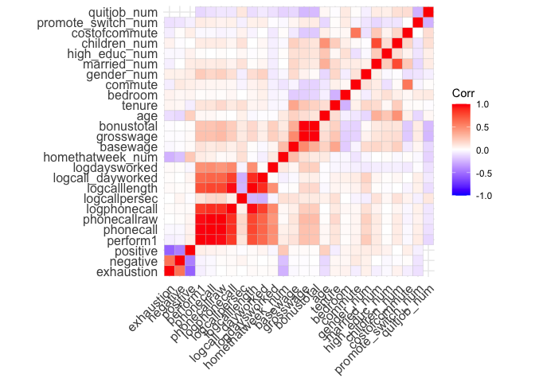<!-- -->

Here we can see that the performance metric “perform1” has a correlation
to phonecall, phonecallraw, logphonecall, logcalllength, which gives us
a hint on how this metrics was calculated. Furthermore we can see, a
negative correlation between “negative” and “positive” from the attitude
dataset, which makes sense as these are opposites. Because of the
timeseries data of the performance data set, the light correlation can
be explained as the attitude may change from day to day, or not (what we
can not infer from that). There is also a slight correlation between
exhaustion and negative attitude, which seems logical. What we cannot
see are significant correlations between quit_job and any variable and
other than the cluster itself between perfrom1 and any other variable.
Quit_job has moderate negative correlations to bonuses/grosswage and
promotions.

We cannot see any clear indicators on how to fight churn rate and/or
what motivates people to perform better. Therefore we will have a look
on different groups of people.

# Detailed exploration analysis

## Quitter vs no-quitters

Lets compare quitter vs non-quitter to better understand both groups:

``` r
df <- volunteer_endperiod_attitude_performance_wage
quitter_df <- df %>% filter(quitjob == TRUE)
non_quitter_df <- df %>% filter(quitjob == FALSE)

# general impression
stargazer(as.data.frame(quitter_df), type = "text", median = TRUE, header = TRUE)
```

    ## 
    ## =======================================================================
    ## Statistic            N     Mean    St. Dev.  Min    Median      Max    
    ## -----------------------------------------------------------------------
    ## perform1           2,383  -0.239    1.020   -3.031  -0.209     3.367   
    ## phonecall          2,316  -0.182    1.036   -3.113  -0.145     5.828   
    ## phonecallraw       2,272  419.832  150.751    1       419      1,264   
    ## homethatweek       2,401   0.088    0.283     0        0         1     
    ## logphonecall       2,267   5.939    0.563   0.000    6.038     7.142   
    ## logcallpersec      2,264  -5.141    0.192   -5.721  -5.148     -1.099  
    ## logcalllength      2,266  11.075    0.608   2.485   11.198     12.002  
    ## logcall_dayworked  2,266   9.414    0.517   2.485    9.506     10.210  
    ## logdaysworked      2,398   1.636    0.327   0.000    1.609     1.946   
    ## homethatweek_num   2,401   0.088    0.283     0        0         1     
    ## basewage           2,365 1,561.818 185.091   650     1,550     2,450   
    ## grosswage          2,379 2,655.609 815.264  48.850 2,490.450 10,761.100
    ## bonustotal         2,370 1,125.712 726.929  0.000   971.690  9,330.070 
    ## age                2,401  23.676    3.088     19      23         32    
    ## tenure             2,401  23.439    28.649    2       10        150    
    ## children           2,401   0.221    0.415     0        0         1     
    ## bedroom            2,401   1.000    0.000     1        1         1     
    ## commute            2,118  104.710   76.718    1       120       300    
    ## high_educ          2,401   0.461    0.499     0        0         1     
    ## gender_num         2,401   0.450    0.498     0        0         1     
    ## married_num        2,401   0.239    0.427     0        0         1     
    ## high_educ_num      2,401   0.461    0.499     0        0         1     
    ## children_num       2,401   0.221    0.415     0        0         1     
    ## promote_switch     2,401   0.000    0.000     0        0         0     
    ## quitjob            2,401   1.000    0.000     1        1         1     
    ## costofcommute      2,289   9.209    10.494  0.000    8.000     55.000  
    ## promote_switch_num 2,401   0.000    0.000     0        0         0     
    ## quitjob_num        2,401   1.000    0.000     1        1         1     
    ## -----------------------------------------------------------------------

``` r
stargazer(as.data.frame(non_quitter_df), type = "text", median = TRUE, header = TRUE)
```

    ## 
    ## =========================================================================
    ## Statistic            N     Mean    St. Dev.    Min    Median      Max    
    ## -------------------------------------------------------------------------
    ## exhaustion         2,379   8.612     7.794    0.000    7.000     36.000  
    ## negative           2,379  16.651     6.848    8.000   16.000     40.000  
    ## positive           2,379  24.215     6.668    8.000   24.000     40.000  
    ## perform1           7,444   0.057     0.966   -3.031    0.119     4.163   
    ## phonecall          7,400   0.049     0.932   -3.113    0.127     3.758   
    ## phonecallraw       7,317  446.543   139.282     1       452      1,141   
    ## homethatweek       7,469   0.231     0.422      0        0         1     
    ## logphonecall       7,307   6.031     0.451    0.000    6.114     7.040   
    ## logcallpersec      7,312  -5.179     0.147   -5.951   -5.175     -3.296  
    ## logcalllength      7,310  11.205     0.487    3.989   11.296     12.116  
    ## logcall_dayworked  7,310   9.492     0.435    2.639    9.567     10.359  
    ## logdaysworked      7,457   1.701     0.263    0.000    1.792     1.946   
    ## homethatweek_num   7,469   0.231     0.422      0        0         1     
    ## basewage           7,588 1,615.188  171.712    650     1,600     2,300   
    ## grosswage          7,622 3,213.324 1,015.850 956.440 2,997.000 14,553.000
    ## bonustotal         7,609 1,608.148  933.670   0.000  1,381.860 12,853.000
    ## age                7,678  23.426     4.479      1       23         35    
    ## tenure             7,678  24.035    23.430      2       19        150    
    ## children           7,678   0.116     0.320      0        0         1     
    ## bedroom            7,678   0.966     0.182      0        1         1     
    ## commute            7,000  103.158   64.618      2       80        300    
    ## high_educ          7,678   0.380     0.486      0        0         1     
    ## gender_num         7,678   0.513     0.500      0        1         1     
    ## married_num        7,678   0.163     0.369      0        0         1     
    ## high_educ_num      7,678   0.380     0.486      0        0         1     
    ## children_num       7,678   0.116     0.320      0        0         1     
    ## promote_switch     7,678   0.239     0.427      0        0         1     
    ## quitjob            7,678   0.000     0.000      0        0         0     
    ## costofcommute      7,445   6.840     5.881    0.000    6.000     30.000  
    ## promote_switch_num 7,678   0.239     0.427      0        0         1     
    ## quitjob_num        7,678   0.000     0.000      0        0         0     
    ## -------------------------------------------------------------------------

``` r
stargazer(as.data.frame(df), type = "text", median = TRUE, header = TRUE)
```

    ## 
    ## =========================================================================
    ## Statistic            N      Mean    St. Dev.   Min    Median      Max    
    ## -------------------------------------------------------------------------
    ## exhaustion         2,379    8.612     7.794   0.000    7.000     36.000  
    ## negative           2,379   16.651     6.848   8.000   16.000     40.000  
    ## positive           2,379   24.215     6.668   8.000   24.000     40.000  
    ## perform1           9,827   -0.015     0.988   -3.031   0.049     4.163   
    ## phonecall          9,716   -0.006     0.963   -3.113   0.070     5.828   
    ## phonecallraw       9,589   440.214   142.528    1       445      1,264   
    ## homethatweek       9,870    0.196     0.397     0        0         1     
    ## logphonecall       9,574    6.009     0.481   0.000    6.098     7.142   
    ## logcallpersec      9,576   -5.170     0.160   -5.951  -5.169     -1.099  
    ## logcalllength      9,576   11.175     0.521   2.485   11.273     12.116  
    ## logcall_dayworked  9,576    9.474     0.457   2.485    9.552     10.359  
    ## logdaysworked      9,855    1.685     0.282   0.000    1.792     1.946   
    ## homethatweek_num   9,870    0.196     0.397     0        0         1     
    ## basewage           9,953  1,602.507  176.442   650     1,600     2,450   
    ## grosswage          10,001 3,080.657 1,000.450 48.850 2,864.000 14,553.000
    ## bonustotal         9,979  1,493.570  912.302  0.000  1,284.430 12,853.000
    ## age                10,079  23.485     4.191     1       23         35    
    ## tenure             10,079  23.893    24.773     2       18        150    
    ## children           10,079   0.141     0.348     0        0         1     
    ## bedroom            10,079   0.974     0.160     0        1         1     
    ## commute            9,118   103.519   67.620     1       80        300    
    ## high_educ          10,079   0.400     0.490     0        0         1     
    ## gender_num         10,079   0.498     0.500     0        0         1     
    ## married_num        10,079   0.181     0.385     0        0         1     
    ## high_educ_num      10,079   0.400     0.490     0        0         1     
    ## children_num       10,079   0.141     0.348     0        0         1     
    ## promote_switch     10,079   0.182     0.386     0        0         1     
    ## quitjob            10,079   0.238     0.426     0        0         1     
    ## costofcommute      9,734    7.397     7.304   0.000    6.000     55.000  
    ## promote_switch_num 10,079   0.182     0.386     0        0         1     
    ## quitjob_num        10,079   0.238     0.426     0        0         1     
    ## -------------------------------------------------------------------------

``` r
# plot per numeric variable
ggplot(df, aes(x=quitjob, y=perform1)) + geom_boxplot()
```

    ## Warning: Removed 252 rows containing non-finite outside the scale range
    ## (`stat_boxplot()`).

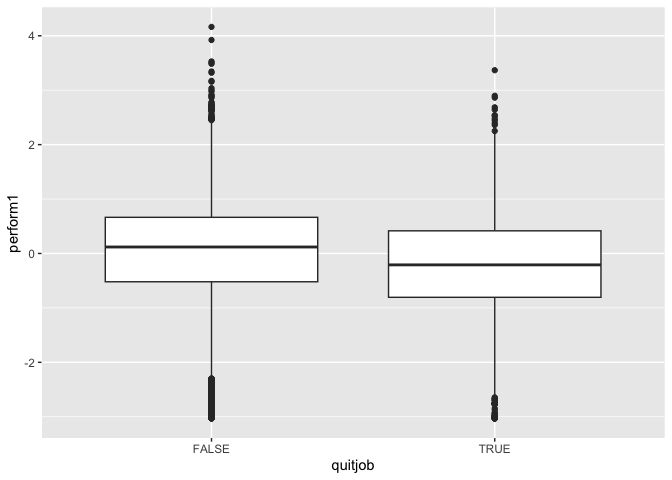<!-- -->

``` r
ggplot(df, aes(x=quitjob, y=tenure)) + geom_boxplot()
```

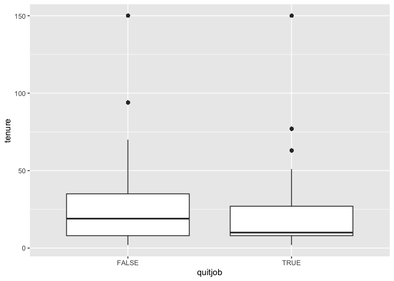<!-- -->

``` r
ggplot(df, aes(x=quitjob, y=age)) + geom_boxplot()
```

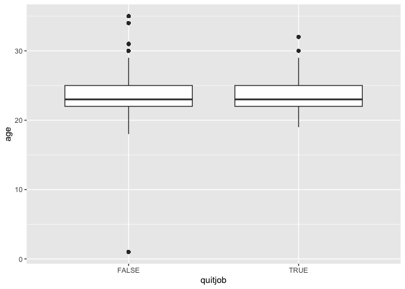<!-- -->

``` r
ggplot(df, aes(x=quitjob, y=commute)) + geom_boxplot()
```

    ## Warning: Removed 961 rows containing non-finite outside the scale range
    ## (`stat_boxplot()`).

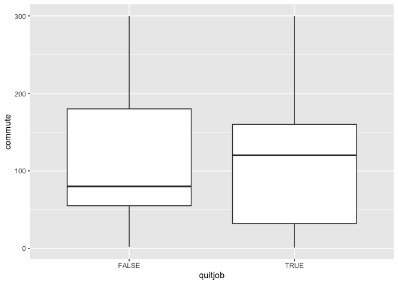<!-- -->

``` r
ggplot(df, aes(x=quitjob, y=costofcommute)) + geom_boxplot()
```

    ## Warning: Removed 345 rows containing non-finite outside the scale range
    ## (`stat_boxplot()`).

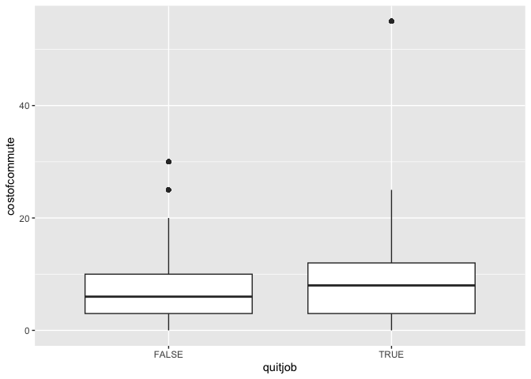<!-- -->

``` r
ggplot(df, aes(x=quitjob, y=basewage)) + geom_boxplot()
```

    ## Warning: Removed 126 rows containing non-finite outside the scale range
    ## (`stat_boxplot()`).

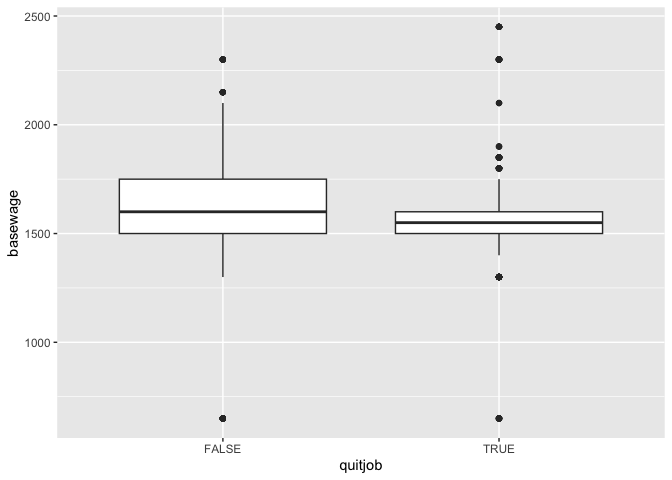<!-- -->

``` r
ggplot(df, aes(x=quitjob, y=bonustotal)) + geom_boxplot()
```

    ## Warning: Removed 100 rows containing non-finite outside the scale range
    ## (`stat_boxplot()`).

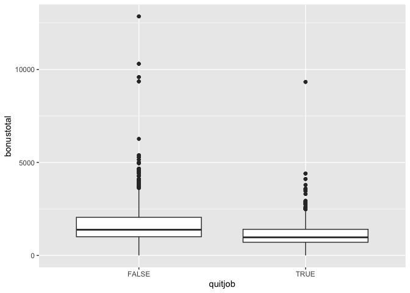<!-- -->

``` r
ggplot(df, aes(x=quitjob, y=grosswage)) + geom_boxplot()
```

    ## Warning: Removed 78 rows containing non-finite outside the scale range
    ## (`stat_boxplot()`).

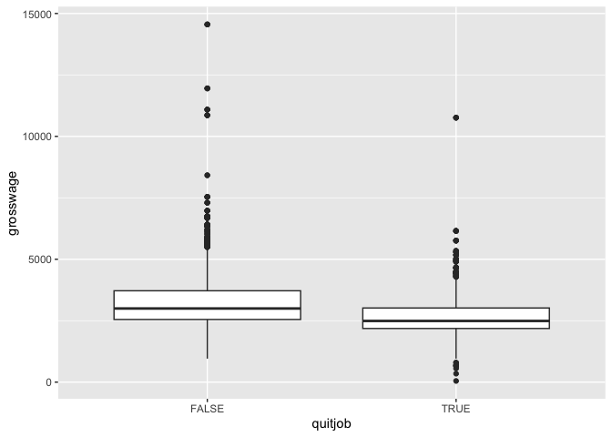<!-- -->

``` r
# Look at correlations
# subselect variable available in both groups (e.g. attitude data not available for quitters)
non_quitter_df <- non_quitter_df %>% select(costofcommute,commute,tenure,age,grosswage,basewage,bonustotal,logdaysworked,logcall_dayworked,logcalllength,logcallpersec,logphonecall,phonecallraw,phonecall,perform1, children_num, high_educ_num, married_num, gender_num, homethatweek_num)

quitter_df <- quitter_df %>% select(costofcommute,commute,tenure,age,grosswage,basewage,bonustotal,logdaysworked,logcall_dayworked,logcalllength,logcallpersec,logphonecall,phonecallraw,phonecall,perform1, children_num, high_educ_num, married_num, gender_num, homethatweek_num)

nums <- dplyr::select(quitter_df, where(is.numeric))
cm <- cor(nums, use = "pairwise.complete.obs")
ggcorrplot(cm, lab = FALSE)
```

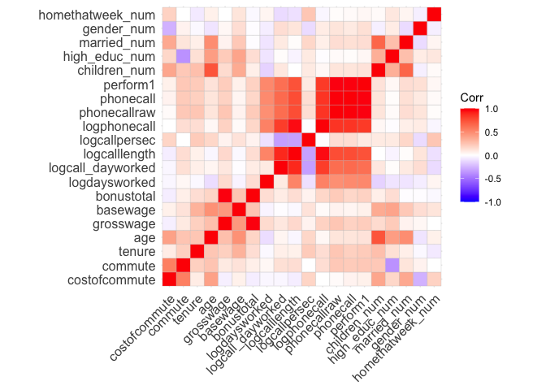<!-- -->

``` r
nums <- dplyr::select(non_quitter_df, where(is.numeric))
cm <- cor(nums, use = "pairwise.complete.obs")
ggcorrplot(cm, lab = FALSE)
```

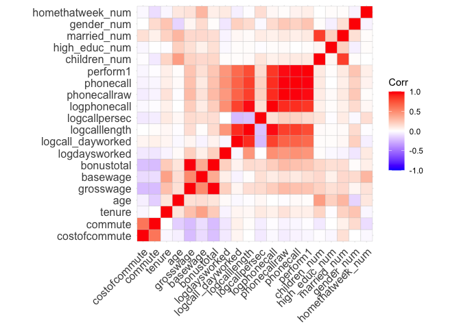<!-- -->

Generally speaking quitters perform less, work for the company shorter
than average, have an average age, have slightly higher costs of commute
while commuting about the same in minutes per week, earn less and work
not from home in comparison to workers who stay. When begin older,
quitters have a higher tendency to have children, being married and have
higher education. People who were older and left at some point generally
performed better than younger quitters. People who stay, tend to have
lower cost of commute and lower commute times (maybe because they commit
to working for the company and move closer to it).

We can already get a clue from this comparison of the differences
between quitters and non quitters about the group constellation and
personas.

## Groups

Lets have a look on all possible combinations of categorical values and
which are represented within the volunteer dataset with a threshold of
at least 100 people-work-performances per group. We choose this sample
size to increase our confidence. Afterwards we will do the same general
analysis we did for the whole population for each group.

### Available groups

``` r
# make it easier to process
df <- volunteer_endperiod_attitude_performance_wage
# define categorical variables
cat_cols <- c("gender","married","high_educ","bedroom","children","promote_switch","quitjob", "homethatweek")

# factors
df <- df %>% mutate(across(all_of(cat_cols), ~ factor(.x)))

# build grid of categories
lvls <- lapply(df[cat_cols], levels)
grid <- tidyr::expand_grid(!!!lvls)

# create summary for each category/group of people working at the company
summary_df <- df %>%
  group_by(across(all_of(cat_cols))) %>%
  summarise(
    # add number per category to filter later
    n = n(),
    across(where(is.numeric),
           list(mean = ~mean(.x, na.rm = TRUE),
                sd   = ~sd(.x,   na.rm = TRUE),
                se = ~sd(.x, na.rm = TRUE) / sqrt(sum(!is.na(.x))),
                med  = ~median(.x, na.rm = TRUE),
                min  = ~min(.x, na.rm = TRUE),
                max  = ~max(.x, na.rm = TRUE)),
           .names = "{.col}_{.fn}"
           ),
    .groups = "drop"
) %>%
  mutate(group_index = row_number()) %>% # create an index for each group for bettler handling
  arrange(desc(n))
```

    ## Warning: There were 396 warnings in `summarise()`.
    ## The first warning was:
    ## ℹ In argument: `across(...)`.
    ## ℹ In group 7: `gender = female`, `married = FALSE`, `high_educ = FALSE`,
    ##   `bedroom = 1`, `children = FALSE`, `promote_switch = FALSE`, `quitjob =
    ##   TRUE`, `homethatweek = FALSE`.
    ## Caused by warning in `min()`:
    ## ! no non-missing arguments to min; returning Inf
    ## ℹ Run `dplyr::last_dplyr_warnings()` to see the 395 remaining warnings.

``` r
# add group_index to the big d
group_characteristics <- summary_df %>% select(group_index, gender, married, bedroom, children, high_educ, promote_switch, quitjob, homethatweek)
volunteer_endperiod_attitude_performance_wage <- merge(volunteer_endperiod_attitude_performance_wage, group_characteristics, by=c("gender", "married", "bedroom", "children", "high_educ", "promote_switch", "quitjob", "homethatweek"))
# filter by number of rows per group
summary_df <- summary_df %>% filter(n>=100) 
```

As a result we receive 23 distinct groups out of 8x8=64 possible options
where each groups represents a work week of an employee:

### Top 6 groups by number

``` r
top <- summary_df %>% slice(1:6)

total_n <- summary_df %>% summarise(total_n = sum(n))
top_n <- top %>% summarise(top_n = sum(n))

top_n / total_n # about one quarter of the groups contain over 50% of the total observations
```

    ##       top_n
    ## 1 0.5245345

``` r
top %>% select(gender, married, bedroom, children, high_educ, promote_switch, quitjob, homethatweek)
```

    ## # A tibble: 6 × 8
    ##   gender married bedroom children high_educ promote_switch quitjob homethatweek
    ##   <fct>  <fct>   <fct>   <fct>    <fct>     <fct>          <fct>   <fct>       
    ## 1 female FALSE   1       FALSE    FALSE     FALSE          FALSE   FALSE       
    ## 2 male   FALSE   1       FALSE    FALSE     FALSE          FALSE   FALSE       
    ## 3 male   FALSE   1       FALSE    TRUE      FALSE          FALSE   FALSE       
    ## 4 male   FALSE   1       FALSE    FALSE     FALSE          TRUE    FALSE       
    ## 5 male   FALSE   1       FALSE    FALSE     TRUE           FALSE   FALSE       
    ## 6 female FALSE   1       FALSE    TRUE      FALSE          FALSE   FALSE

``` r
# 
```

``` r
# First we look at the quitters and try to see which are more likely to quit
ggplot(summary_df, aes(x = factor(group_index), y = quitjob_num_mean)) +
  geom_boxplot() +
  labs(x = "Group index", y = "percentage to quit (0-1)") +
  theme(axis.text.x = element_text(angle = 45, hjust = 1))
```

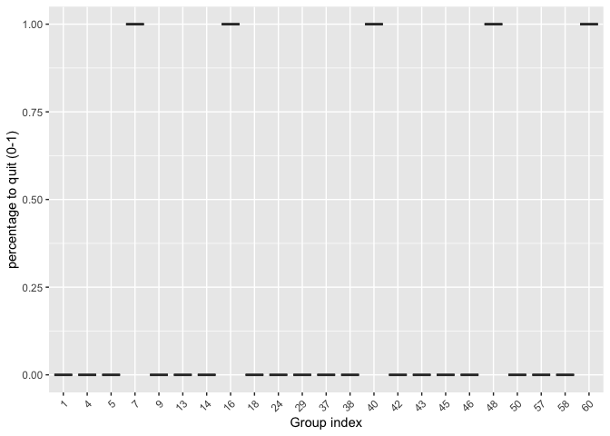<!-- -->

Here we can clearly identify groups 7,16,40,48 and 60 where all people
quit. Within the rest of the groups nobody quit.

### Analyze quitter groups

``` r
df <- volunteer_endperiod_attitude_performance_wage
```

#### Group 7

357 observations of 6 volunteer

**Persona observations:**  
female  
not married  
number of bedrooms: 1  
no children  
no high education  
no promotion  
worked for 7.6 months at the company when left (\< avg)  
20.5 years old (\< avg)  
  
**Other average weekly observations:**  
not working from home  
performed -0.308 (\< avg)  
basewage per month: 1453 (\< avg)  
bonus per month: 831 (\<\< avg)  
grosswage per month: 2265 (\< avg)  
cost of commute per month: 4 (\< avg)  
commute minutes per week: 103 (\<avg)  
logdaysworked: 1.6 (~= avg)

This groups shows a very similar correlation matrix in comparison to the
overall sample, no specialities.

*Interpretation*  
Looks like a group of female juniors (wage, performance, tenure, age),
living not close by, probably the first or second job after high
school(?) or even a job for a gap year. Probably left because of
pursuing with school or another job for a pay increase.

*Recommendation*

This group is amoung the youngest and has a worse performance than the
average. Offering working from home/remote working capabilities can be a
recommended, as these group could for example continue working during
university or traveling. When performance increases a raise would be
appropiate but now as first action.

``` r
# select group data
group7 <- df %>% filter(group_index==7)
stargazer(as.data.frame(group7), type = "text", median = TRUE, header = TRUE)
```

    ## 
    ## =====================================================================
    ## Statistic           N    Mean    St. Dev.   Min    Median      Max   
    ## ---------------------------------------------------------------------
    ## bedroom            357   1.000    0.000      1        1         1    
    ## children           357   0.000    0.000      0        0         0    
    ## high_educ          357   0.000    0.000      0        0         0    
    ## promote_switch     357   0.000    0.000      0        0         0    
    ## quitjob            357   1.000    0.000      1        1         1    
    ## homethatweek       357   0.000    0.000      0        0         0    
    ## perform1           345  -0.308    0.854   -3.031   -0.204     2.230  
    ## phonecall          320  -0.220    0.983   -3.054   -0.157     5.828  
    ## phonecallraw       316  410.668  138.199    22       419      1,264  
    ## logphonecall       315   5.941    0.443    3.091    6.038     7.142  
    ## logcallpersec      307  -5.217    0.114   -5.560   -5.198    -4.924  
    ## logcalllength      308  11.142    0.444    8.473   11.222    11.900  
    ## logcall_dayworked  308   9.493    0.369    7.087    9.566    10.049  
    ## logdaysworked      357   1.603    0.325    0.000    1.609     1.946  
    ## homethatweek_num   357   0.000    0.000      0        0         0    
    ## basewage           356 1,453.792 152.790    650     1,500     1,750  
    ## grosswage          357 2,265.992 490.587  698.070 2,208.000 4,487.660
    ## bonustotal         352  831.392  457.691   0.000   795.000  2,937.660
    ## age                357  20.501    1.315     19       21        22    
    ## tenure             357   7.622    2.661      2        9        10    
    ## commute            357  118.263   97.337    20       120       300   
    ## gender_num         357   1.000    0.000      1        1         1    
    ## married_num        357   0.000    0.000      0        0         0    
    ## high_educ_num      357   0.000    0.000      0        0         0    
    ## children_num       357   0.000    0.000      0        0         0    
    ## costofcommute      357   4.113    4.491    0.000    4.545    10.000  
    ## promote_switch_num 357   0.000    0.000      0        0         0    
    ## quitjob_num        357   1.000    0.000      1        1         1    
    ## group_index        357   7.000    0.000      7        7         7    
    ## ---------------------------------------------------------------------

``` r
# group definition
group7 %>% select(gender, married, bedroom, children, high_educ, promote_switch, quitjob, homethatweek)
```

    ##     gender married bedroom children high_educ promote_switch quitjob
    ## 1   female   FALSE       1    FALSE     FALSE          FALSE    TRUE
    ## 2   female   FALSE       1    FALSE     FALSE          FALSE    TRUE
    ## 3   female   FALSE       1    FALSE     FALSE          FALSE    TRUE
    ## 4   female   FALSE       1    FALSE     FALSE          FALSE    TRUE
    ## 5   female   FALSE       1    FALSE     FALSE          FALSE    TRUE
    ## 6   female   FALSE       1    FALSE     FALSE          FALSE    TRUE
    ## 7   female   FALSE       1    FALSE     FALSE          FALSE    TRUE
    ## 8   female   FALSE       1    FALSE     FALSE          FALSE    TRUE
    ## 9   female   FALSE       1    FALSE     FALSE          FALSE    TRUE
    ## 10  female   FALSE       1    FALSE     FALSE          FALSE    TRUE
    ## 11  female   FALSE       1    FALSE     FALSE          FALSE    TRUE
    ## 12  female   FALSE       1    FALSE     FALSE          FALSE    TRUE
    ## 13  female   FALSE       1    FALSE     FALSE          FALSE    TRUE
    ## 14  female   FALSE       1    FALSE     FALSE          FALSE    TRUE
    ## 15  female   FALSE       1    FALSE     FALSE          FALSE    TRUE
    ## 16  female   FALSE       1    FALSE     FALSE          FALSE    TRUE
    ## 17  female   FALSE       1    FALSE     FALSE          FALSE    TRUE
    ## 18  female   FALSE       1    FALSE     FALSE          FALSE    TRUE
    ## 19  female   FALSE       1    FALSE     FALSE          FALSE    TRUE
    ## 20  female   FALSE       1    FALSE     FALSE          FALSE    TRUE
    ## 21  female   FALSE       1    FALSE     FALSE          FALSE    TRUE
    ## 22  female   FALSE       1    FALSE     FALSE          FALSE    TRUE
    ## 23  female   FALSE       1    FALSE     FALSE          FALSE    TRUE
    ## 24  female   FALSE       1    FALSE     FALSE          FALSE    TRUE
    ## 25  female   FALSE       1    FALSE     FALSE          FALSE    TRUE
    ## 26  female   FALSE       1    FALSE     FALSE          FALSE    TRUE
    ## 27  female   FALSE       1    FALSE     FALSE          FALSE    TRUE
    ## 28  female   FALSE       1    FALSE     FALSE          FALSE    TRUE
    ## 29  female   FALSE       1    FALSE     FALSE          FALSE    TRUE
    ## 30  female   FALSE       1    FALSE     FALSE          FALSE    TRUE
    ## 31  female   FALSE       1    FALSE     FALSE          FALSE    TRUE
    ## 32  female   FALSE       1    FALSE     FALSE          FALSE    TRUE
    ## 33  female   FALSE       1    FALSE     FALSE          FALSE    TRUE
    ## 34  female   FALSE       1    FALSE     FALSE          FALSE    TRUE
    ## 35  female   FALSE       1    FALSE     FALSE          FALSE    TRUE
    ## 36  female   FALSE       1    FALSE     FALSE          FALSE    TRUE
    ## 37  female   FALSE       1    FALSE     FALSE          FALSE    TRUE
    ## 38  female   FALSE       1    FALSE     FALSE          FALSE    TRUE
    ## 39  female   FALSE       1    FALSE     FALSE          FALSE    TRUE
    ## 40  female   FALSE       1    FALSE     FALSE          FALSE    TRUE
    ## 41  female   FALSE       1    FALSE     FALSE          FALSE    TRUE
    ## 42  female   FALSE       1    FALSE     FALSE          FALSE    TRUE
    ## 43  female   FALSE       1    FALSE     FALSE          FALSE    TRUE
    ## 44  female   FALSE       1    FALSE     FALSE          FALSE    TRUE
    ## 45  female   FALSE       1    FALSE     FALSE          FALSE    TRUE
    ## 46  female   FALSE       1    FALSE     FALSE          FALSE    TRUE
    ## 47  female   FALSE       1    FALSE     FALSE          FALSE    TRUE
    ## 48  female   FALSE       1    FALSE     FALSE          FALSE    TRUE
    ## 49  female   FALSE       1    FALSE     FALSE          FALSE    TRUE
    ## 50  female   FALSE       1    FALSE     FALSE          FALSE    TRUE
    ## 51  female   FALSE       1    FALSE     FALSE          FALSE    TRUE
    ## 52  female   FALSE       1    FALSE     FALSE          FALSE    TRUE
    ## 53  female   FALSE       1    FALSE     FALSE          FALSE    TRUE
    ## 54  female   FALSE       1    FALSE     FALSE          FALSE    TRUE
    ## 55  female   FALSE       1    FALSE     FALSE          FALSE    TRUE
    ## 56  female   FALSE       1    FALSE     FALSE          FALSE    TRUE
    ## 57  female   FALSE       1    FALSE     FALSE          FALSE    TRUE
    ## 58  female   FALSE       1    FALSE     FALSE          FALSE    TRUE
    ## 59  female   FALSE       1    FALSE     FALSE          FALSE    TRUE
    ## 60  female   FALSE       1    FALSE     FALSE          FALSE    TRUE
    ## 61  female   FALSE       1    FALSE     FALSE          FALSE    TRUE
    ## 62  female   FALSE       1    FALSE     FALSE          FALSE    TRUE
    ## 63  female   FALSE       1    FALSE     FALSE          FALSE    TRUE
    ## 64  female   FALSE       1    FALSE     FALSE          FALSE    TRUE
    ## 65  female   FALSE       1    FALSE     FALSE          FALSE    TRUE
    ## 66  female   FALSE       1    FALSE     FALSE          FALSE    TRUE
    ## 67  female   FALSE       1    FALSE     FALSE          FALSE    TRUE
    ## 68  female   FALSE       1    FALSE     FALSE          FALSE    TRUE
    ## 69  female   FALSE       1    FALSE     FALSE          FALSE    TRUE
    ## 70  female   FALSE       1    FALSE     FALSE          FALSE    TRUE
    ## 71  female   FALSE       1    FALSE     FALSE          FALSE    TRUE
    ## 72  female   FALSE       1    FALSE     FALSE          FALSE    TRUE
    ## 73  female   FALSE       1    FALSE     FALSE          FALSE    TRUE
    ## 74  female   FALSE       1    FALSE     FALSE          FALSE    TRUE
    ## 75  female   FALSE       1    FALSE     FALSE          FALSE    TRUE
    ## 76  female   FALSE       1    FALSE     FALSE          FALSE    TRUE
    ## 77  female   FALSE       1    FALSE     FALSE          FALSE    TRUE
    ## 78  female   FALSE       1    FALSE     FALSE          FALSE    TRUE
    ## 79  female   FALSE       1    FALSE     FALSE          FALSE    TRUE
    ## 80  female   FALSE       1    FALSE     FALSE          FALSE    TRUE
    ## 81  female   FALSE       1    FALSE     FALSE          FALSE    TRUE
    ## 82  female   FALSE       1    FALSE     FALSE          FALSE    TRUE
    ## 83  female   FALSE       1    FALSE     FALSE          FALSE    TRUE
    ## 84  female   FALSE       1    FALSE     FALSE          FALSE    TRUE
    ## 85  female   FALSE       1    FALSE     FALSE          FALSE    TRUE
    ## 86  female   FALSE       1    FALSE     FALSE          FALSE    TRUE
    ## 87  female   FALSE       1    FALSE     FALSE          FALSE    TRUE
    ## 88  female   FALSE       1    FALSE     FALSE          FALSE    TRUE
    ## 89  female   FALSE       1    FALSE     FALSE          FALSE    TRUE
    ## 90  female   FALSE       1    FALSE     FALSE          FALSE    TRUE
    ## 91  female   FALSE       1    FALSE     FALSE          FALSE    TRUE
    ## 92  female   FALSE       1    FALSE     FALSE          FALSE    TRUE
    ## 93  female   FALSE       1    FALSE     FALSE          FALSE    TRUE
    ## 94  female   FALSE       1    FALSE     FALSE          FALSE    TRUE
    ## 95  female   FALSE       1    FALSE     FALSE          FALSE    TRUE
    ## 96  female   FALSE       1    FALSE     FALSE          FALSE    TRUE
    ## 97  female   FALSE       1    FALSE     FALSE          FALSE    TRUE
    ## 98  female   FALSE       1    FALSE     FALSE          FALSE    TRUE
    ## 99  female   FALSE       1    FALSE     FALSE          FALSE    TRUE
    ## 100 female   FALSE       1    FALSE     FALSE          FALSE    TRUE
    ## 101 female   FALSE       1    FALSE     FALSE          FALSE    TRUE
    ## 102 female   FALSE       1    FALSE     FALSE          FALSE    TRUE
    ## 103 female   FALSE       1    FALSE     FALSE          FALSE    TRUE
    ## 104 female   FALSE       1    FALSE     FALSE          FALSE    TRUE
    ## 105 female   FALSE       1    FALSE     FALSE          FALSE    TRUE
    ## 106 female   FALSE       1    FALSE     FALSE          FALSE    TRUE
    ## 107 female   FALSE       1    FALSE     FALSE          FALSE    TRUE
    ## 108 female   FALSE       1    FALSE     FALSE          FALSE    TRUE
    ## 109 female   FALSE       1    FALSE     FALSE          FALSE    TRUE
    ## 110 female   FALSE       1    FALSE     FALSE          FALSE    TRUE
    ## 111 female   FALSE       1    FALSE     FALSE          FALSE    TRUE
    ## 112 female   FALSE       1    FALSE     FALSE          FALSE    TRUE
    ## 113 female   FALSE       1    FALSE     FALSE          FALSE    TRUE
    ## 114 female   FALSE       1    FALSE     FALSE          FALSE    TRUE
    ## 115 female   FALSE       1    FALSE     FALSE          FALSE    TRUE
    ## 116 female   FALSE       1    FALSE     FALSE          FALSE    TRUE
    ## 117 female   FALSE       1    FALSE     FALSE          FALSE    TRUE
    ## 118 female   FALSE       1    FALSE     FALSE          FALSE    TRUE
    ## 119 female   FALSE       1    FALSE     FALSE          FALSE    TRUE
    ## 120 female   FALSE       1    FALSE     FALSE          FALSE    TRUE
    ## 121 female   FALSE       1    FALSE     FALSE          FALSE    TRUE
    ## 122 female   FALSE       1    FALSE     FALSE          FALSE    TRUE
    ## 123 female   FALSE       1    FALSE     FALSE          FALSE    TRUE
    ## 124 female   FALSE       1    FALSE     FALSE          FALSE    TRUE
    ## 125 female   FALSE       1    FALSE     FALSE          FALSE    TRUE
    ## 126 female   FALSE       1    FALSE     FALSE          FALSE    TRUE
    ## 127 female   FALSE       1    FALSE     FALSE          FALSE    TRUE
    ## 128 female   FALSE       1    FALSE     FALSE          FALSE    TRUE
    ## 129 female   FALSE       1    FALSE     FALSE          FALSE    TRUE
    ## 130 female   FALSE       1    FALSE     FALSE          FALSE    TRUE
    ## 131 female   FALSE       1    FALSE     FALSE          FALSE    TRUE
    ## 132 female   FALSE       1    FALSE     FALSE          FALSE    TRUE
    ## 133 female   FALSE       1    FALSE     FALSE          FALSE    TRUE
    ## 134 female   FALSE       1    FALSE     FALSE          FALSE    TRUE
    ## 135 female   FALSE       1    FALSE     FALSE          FALSE    TRUE
    ## 136 female   FALSE       1    FALSE     FALSE          FALSE    TRUE
    ## 137 female   FALSE       1    FALSE     FALSE          FALSE    TRUE
    ## 138 female   FALSE       1    FALSE     FALSE          FALSE    TRUE
    ## 139 female   FALSE       1    FALSE     FALSE          FALSE    TRUE
    ## 140 female   FALSE       1    FALSE     FALSE          FALSE    TRUE
    ## 141 female   FALSE       1    FALSE     FALSE          FALSE    TRUE
    ## 142 female   FALSE       1    FALSE     FALSE          FALSE    TRUE
    ## 143 female   FALSE       1    FALSE     FALSE          FALSE    TRUE
    ## 144 female   FALSE       1    FALSE     FALSE          FALSE    TRUE
    ## 145 female   FALSE       1    FALSE     FALSE          FALSE    TRUE
    ## 146 female   FALSE       1    FALSE     FALSE          FALSE    TRUE
    ## 147 female   FALSE       1    FALSE     FALSE          FALSE    TRUE
    ## 148 female   FALSE       1    FALSE     FALSE          FALSE    TRUE
    ## 149 female   FALSE       1    FALSE     FALSE          FALSE    TRUE
    ## 150 female   FALSE       1    FALSE     FALSE          FALSE    TRUE
    ## 151 female   FALSE       1    FALSE     FALSE          FALSE    TRUE
    ## 152 female   FALSE       1    FALSE     FALSE          FALSE    TRUE
    ## 153 female   FALSE       1    FALSE     FALSE          FALSE    TRUE
    ## 154 female   FALSE       1    FALSE     FALSE          FALSE    TRUE
    ## 155 female   FALSE       1    FALSE     FALSE          FALSE    TRUE
    ## 156 female   FALSE       1    FALSE     FALSE          FALSE    TRUE
    ## 157 female   FALSE       1    FALSE     FALSE          FALSE    TRUE
    ## 158 female   FALSE       1    FALSE     FALSE          FALSE    TRUE
    ## 159 female   FALSE       1    FALSE     FALSE          FALSE    TRUE
    ## 160 female   FALSE       1    FALSE     FALSE          FALSE    TRUE
    ## 161 female   FALSE       1    FALSE     FALSE          FALSE    TRUE
    ## 162 female   FALSE       1    FALSE     FALSE          FALSE    TRUE
    ## 163 female   FALSE       1    FALSE     FALSE          FALSE    TRUE
    ## 164 female   FALSE       1    FALSE     FALSE          FALSE    TRUE
    ## 165 female   FALSE       1    FALSE     FALSE          FALSE    TRUE
    ## 166 female   FALSE       1    FALSE     FALSE          FALSE    TRUE
    ## 167 female   FALSE       1    FALSE     FALSE          FALSE    TRUE
    ## 168 female   FALSE       1    FALSE     FALSE          FALSE    TRUE
    ## 169 female   FALSE       1    FALSE     FALSE          FALSE    TRUE
    ## 170 female   FALSE       1    FALSE     FALSE          FALSE    TRUE
    ## 171 female   FALSE       1    FALSE     FALSE          FALSE    TRUE
    ## 172 female   FALSE       1    FALSE     FALSE          FALSE    TRUE
    ## 173 female   FALSE       1    FALSE     FALSE          FALSE    TRUE
    ## 174 female   FALSE       1    FALSE     FALSE          FALSE    TRUE
    ## 175 female   FALSE       1    FALSE     FALSE          FALSE    TRUE
    ## 176 female   FALSE       1    FALSE     FALSE          FALSE    TRUE
    ## 177 female   FALSE       1    FALSE     FALSE          FALSE    TRUE
    ## 178 female   FALSE       1    FALSE     FALSE          FALSE    TRUE
    ## 179 female   FALSE       1    FALSE     FALSE          FALSE    TRUE
    ## 180 female   FALSE       1    FALSE     FALSE          FALSE    TRUE
    ## 181 female   FALSE       1    FALSE     FALSE          FALSE    TRUE
    ## 182 female   FALSE       1    FALSE     FALSE          FALSE    TRUE
    ## 183 female   FALSE       1    FALSE     FALSE          FALSE    TRUE
    ## 184 female   FALSE       1    FALSE     FALSE          FALSE    TRUE
    ## 185 female   FALSE       1    FALSE     FALSE          FALSE    TRUE
    ## 186 female   FALSE       1    FALSE     FALSE          FALSE    TRUE
    ## 187 female   FALSE       1    FALSE     FALSE          FALSE    TRUE
    ## 188 female   FALSE       1    FALSE     FALSE          FALSE    TRUE
    ## 189 female   FALSE       1    FALSE     FALSE          FALSE    TRUE
    ## 190 female   FALSE       1    FALSE     FALSE          FALSE    TRUE
    ## 191 female   FALSE       1    FALSE     FALSE          FALSE    TRUE
    ## 192 female   FALSE       1    FALSE     FALSE          FALSE    TRUE
    ## 193 female   FALSE       1    FALSE     FALSE          FALSE    TRUE
    ## 194 female   FALSE       1    FALSE     FALSE          FALSE    TRUE
    ## 195 female   FALSE       1    FALSE     FALSE          FALSE    TRUE
    ## 196 female   FALSE       1    FALSE     FALSE          FALSE    TRUE
    ## 197 female   FALSE       1    FALSE     FALSE          FALSE    TRUE
    ## 198 female   FALSE       1    FALSE     FALSE          FALSE    TRUE
    ## 199 female   FALSE       1    FALSE     FALSE          FALSE    TRUE
    ## 200 female   FALSE       1    FALSE     FALSE          FALSE    TRUE
    ## 201 female   FALSE       1    FALSE     FALSE          FALSE    TRUE
    ## 202 female   FALSE       1    FALSE     FALSE          FALSE    TRUE
    ## 203 female   FALSE       1    FALSE     FALSE          FALSE    TRUE
    ## 204 female   FALSE       1    FALSE     FALSE          FALSE    TRUE
    ## 205 female   FALSE       1    FALSE     FALSE          FALSE    TRUE
    ## 206 female   FALSE       1    FALSE     FALSE          FALSE    TRUE
    ## 207 female   FALSE       1    FALSE     FALSE          FALSE    TRUE
    ## 208 female   FALSE       1    FALSE     FALSE          FALSE    TRUE
    ## 209 female   FALSE       1    FALSE     FALSE          FALSE    TRUE
    ## 210 female   FALSE       1    FALSE     FALSE          FALSE    TRUE
    ## 211 female   FALSE       1    FALSE     FALSE          FALSE    TRUE
    ## 212 female   FALSE       1    FALSE     FALSE          FALSE    TRUE
    ## 213 female   FALSE       1    FALSE     FALSE          FALSE    TRUE
    ## 214 female   FALSE       1    FALSE     FALSE          FALSE    TRUE
    ## 215 female   FALSE       1    FALSE     FALSE          FALSE    TRUE
    ## 216 female   FALSE       1    FALSE     FALSE          FALSE    TRUE
    ## 217 female   FALSE       1    FALSE     FALSE          FALSE    TRUE
    ## 218 female   FALSE       1    FALSE     FALSE          FALSE    TRUE
    ## 219 female   FALSE       1    FALSE     FALSE          FALSE    TRUE
    ## 220 female   FALSE       1    FALSE     FALSE          FALSE    TRUE
    ## 221 female   FALSE       1    FALSE     FALSE          FALSE    TRUE
    ## 222 female   FALSE       1    FALSE     FALSE          FALSE    TRUE
    ## 223 female   FALSE       1    FALSE     FALSE          FALSE    TRUE
    ## 224 female   FALSE       1    FALSE     FALSE          FALSE    TRUE
    ## 225 female   FALSE       1    FALSE     FALSE          FALSE    TRUE
    ## 226 female   FALSE       1    FALSE     FALSE          FALSE    TRUE
    ## 227 female   FALSE       1    FALSE     FALSE          FALSE    TRUE
    ## 228 female   FALSE       1    FALSE     FALSE          FALSE    TRUE
    ## 229 female   FALSE       1    FALSE     FALSE          FALSE    TRUE
    ## 230 female   FALSE       1    FALSE     FALSE          FALSE    TRUE
    ## 231 female   FALSE       1    FALSE     FALSE          FALSE    TRUE
    ## 232 female   FALSE       1    FALSE     FALSE          FALSE    TRUE
    ## 233 female   FALSE       1    FALSE     FALSE          FALSE    TRUE
    ## 234 female   FALSE       1    FALSE     FALSE          FALSE    TRUE
    ## 235 female   FALSE       1    FALSE     FALSE          FALSE    TRUE
    ## 236 female   FALSE       1    FALSE     FALSE          FALSE    TRUE
    ## 237 female   FALSE       1    FALSE     FALSE          FALSE    TRUE
    ## 238 female   FALSE       1    FALSE     FALSE          FALSE    TRUE
    ## 239 female   FALSE       1    FALSE     FALSE          FALSE    TRUE
    ## 240 female   FALSE       1    FALSE     FALSE          FALSE    TRUE
    ## 241 female   FALSE       1    FALSE     FALSE          FALSE    TRUE
    ## 242 female   FALSE       1    FALSE     FALSE          FALSE    TRUE
    ## 243 female   FALSE       1    FALSE     FALSE          FALSE    TRUE
    ## 244 female   FALSE       1    FALSE     FALSE          FALSE    TRUE
    ## 245 female   FALSE       1    FALSE     FALSE          FALSE    TRUE
    ## 246 female   FALSE       1    FALSE     FALSE          FALSE    TRUE
    ## 247 female   FALSE       1    FALSE     FALSE          FALSE    TRUE
    ## 248 female   FALSE       1    FALSE     FALSE          FALSE    TRUE
    ## 249 female   FALSE       1    FALSE     FALSE          FALSE    TRUE
    ## 250 female   FALSE       1    FALSE     FALSE          FALSE    TRUE
    ## 251 female   FALSE       1    FALSE     FALSE          FALSE    TRUE
    ## 252 female   FALSE       1    FALSE     FALSE          FALSE    TRUE
    ## 253 female   FALSE       1    FALSE     FALSE          FALSE    TRUE
    ## 254 female   FALSE       1    FALSE     FALSE          FALSE    TRUE
    ## 255 female   FALSE       1    FALSE     FALSE          FALSE    TRUE
    ## 256 female   FALSE       1    FALSE     FALSE          FALSE    TRUE
    ## 257 female   FALSE       1    FALSE     FALSE          FALSE    TRUE
    ## 258 female   FALSE       1    FALSE     FALSE          FALSE    TRUE
    ## 259 female   FALSE       1    FALSE     FALSE          FALSE    TRUE
    ## 260 female   FALSE       1    FALSE     FALSE          FALSE    TRUE
    ## 261 female   FALSE       1    FALSE     FALSE          FALSE    TRUE
    ## 262 female   FALSE       1    FALSE     FALSE          FALSE    TRUE
    ## 263 female   FALSE       1    FALSE     FALSE          FALSE    TRUE
    ## 264 female   FALSE       1    FALSE     FALSE          FALSE    TRUE
    ## 265 female   FALSE       1    FALSE     FALSE          FALSE    TRUE
    ## 266 female   FALSE       1    FALSE     FALSE          FALSE    TRUE
    ## 267 female   FALSE       1    FALSE     FALSE          FALSE    TRUE
    ## 268 female   FALSE       1    FALSE     FALSE          FALSE    TRUE
    ## 269 female   FALSE       1    FALSE     FALSE          FALSE    TRUE
    ## 270 female   FALSE       1    FALSE     FALSE          FALSE    TRUE
    ## 271 female   FALSE       1    FALSE     FALSE          FALSE    TRUE
    ## 272 female   FALSE       1    FALSE     FALSE          FALSE    TRUE
    ## 273 female   FALSE       1    FALSE     FALSE          FALSE    TRUE
    ## 274 female   FALSE       1    FALSE     FALSE          FALSE    TRUE
    ## 275 female   FALSE       1    FALSE     FALSE          FALSE    TRUE
    ## 276 female   FALSE       1    FALSE     FALSE          FALSE    TRUE
    ## 277 female   FALSE       1    FALSE     FALSE          FALSE    TRUE
    ## 278 female   FALSE       1    FALSE     FALSE          FALSE    TRUE
    ## 279 female   FALSE       1    FALSE     FALSE          FALSE    TRUE
    ## 280 female   FALSE       1    FALSE     FALSE          FALSE    TRUE
    ## 281 female   FALSE       1    FALSE     FALSE          FALSE    TRUE
    ## 282 female   FALSE       1    FALSE     FALSE          FALSE    TRUE
    ## 283 female   FALSE       1    FALSE     FALSE          FALSE    TRUE
    ## 284 female   FALSE       1    FALSE     FALSE          FALSE    TRUE
    ## 285 female   FALSE       1    FALSE     FALSE          FALSE    TRUE
    ## 286 female   FALSE       1    FALSE     FALSE          FALSE    TRUE
    ## 287 female   FALSE       1    FALSE     FALSE          FALSE    TRUE
    ## 288 female   FALSE       1    FALSE     FALSE          FALSE    TRUE
    ## 289 female   FALSE       1    FALSE     FALSE          FALSE    TRUE
    ## 290 female   FALSE       1    FALSE     FALSE          FALSE    TRUE
    ## 291 female   FALSE       1    FALSE     FALSE          FALSE    TRUE
    ## 292 female   FALSE       1    FALSE     FALSE          FALSE    TRUE
    ## 293 female   FALSE       1    FALSE     FALSE          FALSE    TRUE
    ## 294 female   FALSE       1    FALSE     FALSE          FALSE    TRUE
    ## 295 female   FALSE       1    FALSE     FALSE          FALSE    TRUE
    ## 296 female   FALSE       1    FALSE     FALSE          FALSE    TRUE
    ## 297 female   FALSE       1    FALSE     FALSE          FALSE    TRUE
    ## 298 female   FALSE       1    FALSE     FALSE          FALSE    TRUE
    ## 299 female   FALSE       1    FALSE     FALSE          FALSE    TRUE
    ## 300 female   FALSE       1    FALSE     FALSE          FALSE    TRUE
    ## 301 female   FALSE       1    FALSE     FALSE          FALSE    TRUE
    ## 302 female   FALSE       1    FALSE     FALSE          FALSE    TRUE
    ## 303 female   FALSE       1    FALSE     FALSE          FALSE    TRUE
    ## 304 female   FALSE       1    FALSE     FALSE          FALSE    TRUE
    ## 305 female   FALSE       1    FALSE     FALSE          FALSE    TRUE
    ## 306 female   FALSE       1    FALSE     FALSE          FALSE    TRUE
    ## 307 female   FALSE       1    FALSE     FALSE          FALSE    TRUE
    ## 308 female   FALSE       1    FALSE     FALSE          FALSE    TRUE
    ## 309 female   FALSE       1    FALSE     FALSE          FALSE    TRUE
    ## 310 female   FALSE       1    FALSE     FALSE          FALSE    TRUE
    ## 311 female   FALSE       1    FALSE     FALSE          FALSE    TRUE
    ## 312 female   FALSE       1    FALSE     FALSE          FALSE    TRUE
    ## 313 female   FALSE       1    FALSE     FALSE          FALSE    TRUE
    ## 314 female   FALSE       1    FALSE     FALSE          FALSE    TRUE
    ## 315 female   FALSE       1    FALSE     FALSE          FALSE    TRUE
    ## 316 female   FALSE       1    FALSE     FALSE          FALSE    TRUE
    ## 317 female   FALSE       1    FALSE     FALSE          FALSE    TRUE
    ## 318 female   FALSE       1    FALSE     FALSE          FALSE    TRUE
    ## 319 female   FALSE       1    FALSE     FALSE          FALSE    TRUE
    ## 320 female   FALSE       1    FALSE     FALSE          FALSE    TRUE
    ## 321 female   FALSE       1    FALSE     FALSE          FALSE    TRUE
    ## 322 female   FALSE       1    FALSE     FALSE          FALSE    TRUE
    ## 323 female   FALSE       1    FALSE     FALSE          FALSE    TRUE
    ## 324 female   FALSE       1    FALSE     FALSE          FALSE    TRUE
    ## 325 female   FALSE       1    FALSE     FALSE          FALSE    TRUE
    ## 326 female   FALSE       1    FALSE     FALSE          FALSE    TRUE
    ## 327 female   FALSE       1    FALSE     FALSE          FALSE    TRUE
    ## 328 female   FALSE       1    FALSE     FALSE          FALSE    TRUE
    ## 329 female   FALSE       1    FALSE     FALSE          FALSE    TRUE
    ## 330 female   FALSE       1    FALSE     FALSE          FALSE    TRUE
    ## 331 female   FALSE       1    FALSE     FALSE          FALSE    TRUE
    ## 332 female   FALSE       1    FALSE     FALSE          FALSE    TRUE
    ## 333 female   FALSE       1    FALSE     FALSE          FALSE    TRUE
    ## 334 female   FALSE       1    FALSE     FALSE          FALSE    TRUE
    ## 335 female   FALSE       1    FALSE     FALSE          FALSE    TRUE
    ## 336 female   FALSE       1    FALSE     FALSE          FALSE    TRUE
    ## 337 female   FALSE       1    FALSE     FALSE          FALSE    TRUE
    ## 338 female   FALSE       1    FALSE     FALSE          FALSE    TRUE
    ## 339 female   FALSE       1    FALSE     FALSE          FALSE    TRUE
    ## 340 female   FALSE       1    FALSE     FALSE          FALSE    TRUE
    ## 341 female   FALSE       1    FALSE     FALSE          FALSE    TRUE
    ## 342 female   FALSE       1    FALSE     FALSE          FALSE    TRUE
    ## 343 female   FALSE       1    FALSE     FALSE          FALSE    TRUE
    ## 344 female   FALSE       1    FALSE     FALSE          FALSE    TRUE
    ## 345 female   FALSE       1    FALSE     FALSE          FALSE    TRUE
    ## 346 female   FALSE       1    FALSE     FALSE          FALSE    TRUE
    ## 347 female   FALSE       1    FALSE     FALSE          FALSE    TRUE
    ## 348 female   FALSE       1    FALSE     FALSE          FALSE    TRUE
    ## 349 female   FALSE       1    FALSE     FALSE          FALSE    TRUE
    ## 350 female   FALSE       1    FALSE     FALSE          FALSE    TRUE
    ## 351 female   FALSE       1    FALSE     FALSE          FALSE    TRUE
    ## 352 female   FALSE       1    FALSE     FALSE          FALSE    TRUE
    ## 353 female   FALSE       1    FALSE     FALSE          FALSE    TRUE
    ## 354 female   FALSE       1    FALSE     FALSE          FALSE    TRUE
    ## 355 female   FALSE       1    FALSE     FALSE          FALSE    TRUE
    ## 356 female   FALSE       1    FALSE     FALSE          FALSE    TRUE
    ## 357 female   FALSE       1    FALSE     FALSE          FALSE    TRUE
    ##     homethatweek
    ## 1          FALSE
    ## 2          FALSE
    ## 3          FALSE
    ## 4          FALSE
    ## 5          FALSE
    ## 6          FALSE
    ## 7          FALSE
    ## 8          FALSE
    ## 9          FALSE
    ## 10         FALSE
    ## 11         FALSE
    ## 12         FALSE
    ## 13         FALSE
    ## 14         FALSE
    ## 15         FALSE
    ## 16         FALSE
    ## 17         FALSE
    ## 18         FALSE
    ## 19         FALSE
    ## 20         FALSE
    ## 21         FALSE
    ## 22         FALSE
    ## 23         FALSE
    ## 24         FALSE
    ## 25         FALSE
    ## 26         FALSE
    ## 27         FALSE
    ## 28         FALSE
    ## 29         FALSE
    ## 30         FALSE
    ## 31         FALSE
    ## 32         FALSE
    ## 33         FALSE
    ## 34         FALSE
    ## 35         FALSE
    ## 36         FALSE
    ## 37         FALSE
    ## 38         FALSE
    ## 39         FALSE
    ## 40         FALSE
    ## 41         FALSE
    ## 42         FALSE
    ## 43         FALSE
    ## 44         FALSE
    ## 45         FALSE
    ## 46         FALSE
    ## 47         FALSE
    ## 48         FALSE
    ## 49         FALSE
    ## 50         FALSE
    ## 51         FALSE
    ## 52         FALSE
    ## 53         FALSE
    ## 54         FALSE
    ## 55         FALSE
    ## 56         FALSE
    ## 57         FALSE
    ## 58         FALSE
    ## 59         FALSE
    ## 60         FALSE
    ## 61         FALSE
    ## 62         FALSE
    ## 63         FALSE
    ## 64         FALSE
    ## 65         FALSE
    ## 66         FALSE
    ## 67         FALSE
    ## 68         FALSE
    ## 69         FALSE
    ## 70         FALSE
    ## 71         FALSE
    ## 72         FALSE
    ## 73         FALSE
    ## 74         FALSE
    ## 75         FALSE
    ## 76         FALSE
    ## 77         FALSE
    ## 78         FALSE
    ## 79         FALSE
    ## 80         FALSE
    ## 81         FALSE
    ## 82         FALSE
    ## 83         FALSE
    ## 84         FALSE
    ## 85         FALSE
    ## 86         FALSE
    ## 87         FALSE
    ## 88         FALSE
    ## 89         FALSE
    ## 90         FALSE
    ## 91         FALSE
    ## 92         FALSE
    ## 93         FALSE
    ## 94         FALSE
    ## 95         FALSE
    ## 96         FALSE
    ## 97         FALSE
    ## 98         FALSE
    ## 99         FALSE
    ## 100        FALSE
    ## 101        FALSE
    ## 102        FALSE
    ## 103        FALSE
    ## 104        FALSE
    ## 105        FALSE
    ## 106        FALSE
    ## 107        FALSE
    ## 108        FALSE
    ## 109        FALSE
    ## 110        FALSE
    ## 111        FALSE
    ## 112        FALSE
    ## 113        FALSE
    ## 114        FALSE
    ## 115        FALSE
    ## 116        FALSE
    ## 117        FALSE
    ## 118        FALSE
    ## 119        FALSE
    ## 120        FALSE
    ## 121        FALSE
    ## 122        FALSE
    ## 123        FALSE
    ## 124        FALSE
    ## 125        FALSE
    ## 126        FALSE
    ## 127        FALSE
    ## 128        FALSE
    ## 129        FALSE
    ## 130        FALSE
    ## 131        FALSE
    ## 132        FALSE
    ## 133        FALSE
    ## 134        FALSE
    ## 135        FALSE
    ## 136        FALSE
    ## 137        FALSE
    ## 138        FALSE
    ## 139        FALSE
    ## 140        FALSE
    ## 141        FALSE
    ## 142        FALSE
    ## 143        FALSE
    ## 144        FALSE
    ## 145        FALSE
    ## 146        FALSE
    ## 147        FALSE
    ## 148        FALSE
    ## 149        FALSE
    ## 150        FALSE
    ## 151        FALSE
    ## 152        FALSE
    ## 153        FALSE
    ## 154        FALSE
    ## 155        FALSE
    ## 156        FALSE
    ## 157        FALSE
    ## 158        FALSE
    ## 159        FALSE
    ## 160        FALSE
    ## 161        FALSE
    ## 162        FALSE
    ## 163        FALSE
    ## 164        FALSE
    ## 165        FALSE
    ## 166        FALSE
    ## 167        FALSE
    ## 168        FALSE
    ## 169        FALSE
    ## 170        FALSE
    ## 171        FALSE
    ## 172        FALSE
    ## 173        FALSE
    ## 174        FALSE
    ## 175        FALSE
    ## 176        FALSE
    ## 177        FALSE
    ## 178        FALSE
    ## 179        FALSE
    ## 180        FALSE
    ## 181        FALSE
    ## 182        FALSE
    ## 183        FALSE
    ## 184        FALSE
    ## 185        FALSE
    ## 186        FALSE
    ## 187        FALSE
    ## 188        FALSE
    ## 189        FALSE
    ## 190        FALSE
    ## 191        FALSE
    ## 192        FALSE
    ## 193        FALSE
    ## 194        FALSE
    ## 195        FALSE
    ## 196        FALSE
    ## 197        FALSE
    ## 198        FALSE
    ## 199        FALSE
    ## 200        FALSE
    ## 201        FALSE
    ## 202        FALSE
    ## 203        FALSE
    ## 204        FALSE
    ## 205        FALSE
    ## 206        FALSE
    ## 207        FALSE
    ## 208        FALSE
    ## 209        FALSE
    ## 210        FALSE
    ## 211        FALSE
    ## 212        FALSE
    ## 213        FALSE
    ## 214        FALSE
    ## 215        FALSE
    ## 216        FALSE
    ## 217        FALSE
    ## 218        FALSE
    ## 219        FALSE
    ## 220        FALSE
    ## 221        FALSE
    ## 222        FALSE
    ## 223        FALSE
    ## 224        FALSE
    ## 225        FALSE
    ## 226        FALSE
    ## 227        FALSE
    ## 228        FALSE
    ## 229        FALSE
    ## 230        FALSE
    ## 231        FALSE
    ## 232        FALSE
    ## 233        FALSE
    ## 234        FALSE
    ## 235        FALSE
    ## 236        FALSE
    ## 237        FALSE
    ## 238        FALSE
    ## 239        FALSE
    ## 240        FALSE
    ## 241        FALSE
    ## 242        FALSE
    ## 243        FALSE
    ## 244        FALSE
    ## 245        FALSE
    ## 246        FALSE
    ## 247        FALSE
    ## 248        FALSE
    ## 249        FALSE
    ## 250        FALSE
    ## 251        FALSE
    ## 252        FALSE
    ## 253        FALSE
    ## 254        FALSE
    ## 255        FALSE
    ## 256        FALSE
    ## 257        FALSE
    ## 258        FALSE
    ## 259        FALSE
    ## 260        FALSE
    ## 261        FALSE
    ## 262        FALSE
    ## 263        FALSE
    ## 264        FALSE
    ## 265        FALSE
    ## 266        FALSE
    ## 267        FALSE
    ## 268        FALSE
    ## 269        FALSE
    ## 270        FALSE
    ## 271        FALSE
    ## 272        FALSE
    ## 273        FALSE
    ## 274        FALSE
    ## 275        FALSE
    ## 276        FALSE
    ## 277        FALSE
    ## 278        FALSE
    ## 279        FALSE
    ## 280        FALSE
    ## 281        FALSE
    ## 282        FALSE
    ## 283        FALSE
    ## 284        FALSE
    ## 285        FALSE
    ## 286        FALSE
    ## 287        FALSE
    ## 288        FALSE
    ## 289        FALSE
    ## 290        FALSE
    ## 291        FALSE
    ## 292        FALSE
    ## 293        FALSE
    ## 294        FALSE
    ## 295        FALSE
    ## 296        FALSE
    ## 297        FALSE
    ## 298        FALSE
    ## 299        FALSE
    ## 300        FALSE
    ## 301        FALSE
    ## 302        FALSE
    ## 303        FALSE
    ## 304        FALSE
    ## 305        FALSE
    ## 306        FALSE
    ## 307        FALSE
    ## 308        FALSE
    ## 309        FALSE
    ## 310        FALSE
    ## 311        FALSE
    ## 312        FALSE
    ## 313        FALSE
    ## 314        FALSE
    ## 315        FALSE
    ## 316        FALSE
    ## 317        FALSE
    ## 318        FALSE
    ## 319        FALSE
    ## 320        FALSE
    ## 321        FALSE
    ## 322        FALSE
    ## 323        FALSE
    ## 324        FALSE
    ## 325        FALSE
    ## 326        FALSE
    ## 327        FALSE
    ## 328        FALSE
    ## 329        FALSE
    ## 330        FALSE
    ## 331        FALSE
    ## 332        FALSE
    ## 333        FALSE
    ## 334        FALSE
    ## 335        FALSE
    ## 336        FALSE
    ## 337        FALSE
    ## 338        FALSE
    ## 339        FALSE
    ## 340        FALSE
    ## 341        FALSE
    ## 342        FALSE
    ## 343        FALSE
    ## 344        FALSE
    ## 345        FALSE
    ## 346        FALSE
    ## 347        FALSE
    ## 348        FALSE
    ## 349        FALSE
    ## 350        FALSE
    ## 351        FALSE
    ## 352        FALSE
    ## 353        FALSE
    ## 354        FALSE
    ## 355        FALSE
    ## 356        FALSE
    ## 357        FALSE

``` r
# distinct persons
unique(group7 %>%select(personid))
```

    ##     personid
    ## 1      40034
    ## 2      38862
    ## 4      44256
    ## 5      40346
    ## 26     42104
    ## 110    39478

``` r
nums <- dplyr::select(group7, where(is.numeric))
cm <- cor(nums, use = "pairwise.complete.obs")
```

    ## Warning in cor(nums, use = "pairwise.complete.obs"): the standard deviation is
    ## zero

``` r
ggcorrplot(cm, lab = FALSE)
```

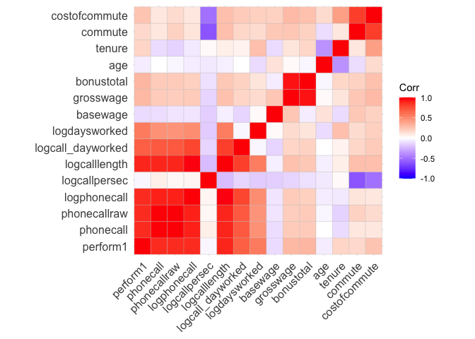<!-- -->

#### Group 16

338 observations for 6 volunteers

**Persona observations:**  
female  
not married  
number of bedrooms: 1  
no children  
high education  
no promotion  
worked for 23.5 months at the company when left (= avg)  
23.7 years old (\>= avg)  
  
**Other average weekly observations:**  
not working from home  
performed: 0 (= avg)  
basewage per month: 1598 (\< avg)  
bonus per month: 1362 (\< avg)  
grosswage per month: 2940 (\<=avg)  
cost of commute per month: 3.9 (\< avg)  
commute min per week: 52 (\<\< avg)  
logdaysworked: 1.65 (~= avg)

For this group the strong positive correlation between tenure and age
stands out. For the full sample it is slightly negative. Commute and age
have a much stronger negative corrleation

*Interpretation*  
Looks like a group of female juniors (wage, performance, tenure, age),
who already worked for almost 2 years, living somewhat central, probably
the first or second job college. Decent performance, not a top performer
but average. Probably left because they did not receive a promotion and
went for a higher paying job as their salary was still below average.

*Recommendation*  
As this group has an average performance while still being young, and
already has a higher education degree (so they probably wont leave for
education) our client should prioritize this group and try to give
employees in this group a raise and a promotion to keep them within the
company. Additionally offer working from home as a benifit, though is
not the greatest leverage for this group.

``` r
# select group data
group16 <- df %>% filter(group_index==16)
stargazer(as.data.frame(group16), type = "text", median = TRUE, header = TRUE)
```

    ## 
    ## =======================================================================
    ## Statistic           N    Mean    St. Dev.    Min     Median      Max   
    ## -----------------------------------------------------------------------
    ## bedroom            338   1.000    0.000       1         1         1    
    ## children           338   0.000    0.000       0         0         0    
    ## high_educ          338   1.000    0.000       1         1         1    
    ## promote_switch     338   0.000    0.000       0         0         0    
    ## quitjob            338   1.000    0.000       1         1         1    
    ## homethatweek       338   0.000    0.000       0         0         0    
    ## perform1           338  -0.0001   1.079    -3.031     0.049     2.863  
    ## phonecall          320  -0.038    1.045    -3.054     0.048     2.463  
    ## phonecallraw       307  454.397  154.865     51        457       910   
    ## logphonecall       306   6.046    0.419     3.932     6.124     6.813  
    ## logcallpersec      310  -5.159    0.141    -5.495    -5.151    -4.624  
    ## logcalllength      310  11.183    0.562     5.489    11.316    11.991  
    ## logcall_dayworked  310   9.483    0.485     3.697     9.552    10.100  
    ## logdaysworked      337   1.645    0.395     0.000     1.792     1.946  
    ## homethatweek_num   338   0.000    0.000       0         0         0    
    ## basewage           338 1,598.521  93.866    1,450     1,600     1,750  
    ## grosswage          334 2,940.331 837.862  1,215.600 2,713.000 6,153.380
    ## bonustotal         338 1,362.637 809.880    5.000   1,144.520 4,403.380
    ## age                338  23.683    1.309      22        23        26    
    ## tenure             338  23.485    6.243      13        24        30    
    ## commute            227  52.106    41.709      2        60        120   
    ## gender_num         338   1.000    0.000       1         1         1    
    ## married_num        338   0.000    0.000       0         0         0    
    ## high_educ_num      338   1.000    0.000       1         1         1    
    ## children_num       338   0.000    0.000       0         0         0    
    ## costofcommute      274   3.931    2.204       0         5         6    
    ## promote_switch_num 338   0.000    0.000       0         0         0    
    ## quitjob_num        338   1.000    0.000       1         1         1    
    ## group_index        338  16.000    0.000      16        16        16    
    ## -----------------------------------------------------------------------

``` r
# group definition
group16 %>% select(gender, married, bedroom, children, high_educ, promote_switch, quitjob, homethatweek)
```

    ##     gender married bedroom children high_educ promote_switch quitjob
    ## 1   female   FALSE       1    FALSE      TRUE          FALSE    TRUE
    ## 2   female   FALSE       1    FALSE      TRUE          FALSE    TRUE
    ## 3   female   FALSE       1    FALSE      TRUE          FALSE    TRUE
    ## 4   female   FALSE       1    FALSE      TRUE          FALSE    TRUE
    ## 5   female   FALSE       1    FALSE      TRUE          FALSE    TRUE
    ## 6   female   FALSE       1    FALSE      TRUE          FALSE    TRUE
    ## 7   female   FALSE       1    FALSE      TRUE          FALSE    TRUE
    ## 8   female   FALSE       1    FALSE      TRUE          FALSE    TRUE
    ## 9   female   FALSE       1    FALSE      TRUE          FALSE    TRUE
    ## 10  female   FALSE       1    FALSE      TRUE          FALSE    TRUE
    ## 11  female   FALSE       1    FALSE      TRUE          FALSE    TRUE
    ## 12  female   FALSE       1    FALSE      TRUE          FALSE    TRUE
    ## 13  female   FALSE       1    FALSE      TRUE          FALSE    TRUE
    ## 14  female   FALSE       1    FALSE      TRUE          FALSE    TRUE
    ## 15  female   FALSE       1    FALSE      TRUE          FALSE    TRUE
    ## 16  female   FALSE       1    FALSE      TRUE          FALSE    TRUE
    ## 17  female   FALSE       1    FALSE      TRUE          FALSE    TRUE
    ## 18  female   FALSE       1    FALSE      TRUE          FALSE    TRUE
    ## 19  female   FALSE       1    FALSE      TRUE          FALSE    TRUE
    ## 20  female   FALSE       1    FALSE      TRUE          FALSE    TRUE
    ## 21  female   FALSE       1    FALSE      TRUE          FALSE    TRUE
    ## 22  female   FALSE       1    FALSE      TRUE          FALSE    TRUE
    ## 23  female   FALSE       1    FALSE      TRUE          FALSE    TRUE
    ## 24  female   FALSE       1    FALSE      TRUE          FALSE    TRUE
    ## 25  female   FALSE       1    FALSE      TRUE          FALSE    TRUE
    ## 26  female   FALSE       1    FALSE      TRUE          FALSE    TRUE
    ## 27  female   FALSE       1    FALSE      TRUE          FALSE    TRUE
    ## 28  female   FALSE       1    FALSE      TRUE          FALSE    TRUE
    ## 29  female   FALSE       1    FALSE      TRUE          FALSE    TRUE
    ## 30  female   FALSE       1    FALSE      TRUE          FALSE    TRUE
    ## 31  female   FALSE       1    FALSE      TRUE          FALSE    TRUE
    ## 32  female   FALSE       1    FALSE      TRUE          FALSE    TRUE
    ## 33  female   FALSE       1    FALSE      TRUE          FALSE    TRUE
    ## 34  female   FALSE       1    FALSE      TRUE          FALSE    TRUE
    ## 35  female   FALSE       1    FALSE      TRUE          FALSE    TRUE
    ## 36  female   FALSE       1    FALSE      TRUE          FALSE    TRUE
    ## 37  female   FALSE       1    FALSE      TRUE          FALSE    TRUE
    ## 38  female   FALSE       1    FALSE      TRUE          FALSE    TRUE
    ## 39  female   FALSE       1    FALSE      TRUE          FALSE    TRUE
    ## 40  female   FALSE       1    FALSE      TRUE          FALSE    TRUE
    ## 41  female   FALSE       1    FALSE      TRUE          FALSE    TRUE
    ## 42  female   FALSE       1    FALSE      TRUE          FALSE    TRUE
    ## 43  female   FALSE       1    FALSE      TRUE          FALSE    TRUE
    ## 44  female   FALSE       1    FALSE      TRUE          FALSE    TRUE
    ## 45  female   FALSE       1    FALSE      TRUE          FALSE    TRUE
    ## 46  female   FALSE       1    FALSE      TRUE          FALSE    TRUE
    ## 47  female   FALSE       1    FALSE      TRUE          FALSE    TRUE
    ## 48  female   FALSE       1    FALSE      TRUE          FALSE    TRUE
    ## 49  female   FALSE       1    FALSE      TRUE          FALSE    TRUE
    ## 50  female   FALSE       1    FALSE      TRUE          FALSE    TRUE
    ## 51  female   FALSE       1    FALSE      TRUE          FALSE    TRUE
    ## 52  female   FALSE       1    FALSE      TRUE          FALSE    TRUE
    ## 53  female   FALSE       1    FALSE      TRUE          FALSE    TRUE
    ## 54  female   FALSE       1    FALSE      TRUE          FALSE    TRUE
    ## 55  female   FALSE       1    FALSE      TRUE          FALSE    TRUE
    ## 56  female   FALSE       1    FALSE      TRUE          FALSE    TRUE
    ## 57  female   FALSE       1    FALSE      TRUE          FALSE    TRUE
    ## 58  female   FALSE       1    FALSE      TRUE          FALSE    TRUE
    ## 59  female   FALSE       1    FALSE      TRUE          FALSE    TRUE
    ## 60  female   FALSE       1    FALSE      TRUE          FALSE    TRUE
    ## 61  female   FALSE       1    FALSE      TRUE          FALSE    TRUE
    ## 62  female   FALSE       1    FALSE      TRUE          FALSE    TRUE
    ## 63  female   FALSE       1    FALSE      TRUE          FALSE    TRUE
    ## 64  female   FALSE       1    FALSE      TRUE          FALSE    TRUE
    ## 65  female   FALSE       1    FALSE      TRUE          FALSE    TRUE
    ## 66  female   FALSE       1    FALSE      TRUE          FALSE    TRUE
    ## 67  female   FALSE       1    FALSE      TRUE          FALSE    TRUE
    ## 68  female   FALSE       1    FALSE      TRUE          FALSE    TRUE
    ## 69  female   FALSE       1    FALSE      TRUE          FALSE    TRUE
    ## 70  female   FALSE       1    FALSE      TRUE          FALSE    TRUE
    ## 71  female   FALSE       1    FALSE      TRUE          FALSE    TRUE
    ## 72  female   FALSE       1    FALSE      TRUE          FALSE    TRUE
    ## 73  female   FALSE       1    FALSE      TRUE          FALSE    TRUE
    ## 74  female   FALSE       1    FALSE      TRUE          FALSE    TRUE
    ## 75  female   FALSE       1    FALSE      TRUE          FALSE    TRUE
    ## 76  female   FALSE       1    FALSE      TRUE          FALSE    TRUE
    ## 77  female   FALSE       1    FALSE      TRUE          FALSE    TRUE
    ## 78  female   FALSE       1    FALSE      TRUE          FALSE    TRUE
    ## 79  female   FALSE       1    FALSE      TRUE          FALSE    TRUE
    ## 80  female   FALSE       1    FALSE      TRUE          FALSE    TRUE
    ## 81  female   FALSE       1    FALSE      TRUE          FALSE    TRUE
    ## 82  female   FALSE       1    FALSE      TRUE          FALSE    TRUE
    ## 83  female   FALSE       1    FALSE      TRUE          FALSE    TRUE
    ## 84  female   FALSE       1    FALSE      TRUE          FALSE    TRUE
    ## 85  female   FALSE       1    FALSE      TRUE          FALSE    TRUE
    ## 86  female   FALSE       1    FALSE      TRUE          FALSE    TRUE
    ## 87  female   FALSE       1    FALSE      TRUE          FALSE    TRUE
    ## 88  female   FALSE       1    FALSE      TRUE          FALSE    TRUE
    ## 89  female   FALSE       1    FALSE      TRUE          FALSE    TRUE
    ## 90  female   FALSE       1    FALSE      TRUE          FALSE    TRUE
    ## 91  female   FALSE       1    FALSE      TRUE          FALSE    TRUE
    ## 92  female   FALSE       1    FALSE      TRUE          FALSE    TRUE
    ## 93  female   FALSE       1    FALSE      TRUE          FALSE    TRUE
    ## 94  female   FALSE       1    FALSE      TRUE          FALSE    TRUE
    ## 95  female   FALSE       1    FALSE      TRUE          FALSE    TRUE
    ## 96  female   FALSE       1    FALSE      TRUE          FALSE    TRUE
    ## 97  female   FALSE       1    FALSE      TRUE          FALSE    TRUE
    ## 98  female   FALSE       1    FALSE      TRUE          FALSE    TRUE
    ## 99  female   FALSE       1    FALSE      TRUE          FALSE    TRUE
    ## 100 female   FALSE       1    FALSE      TRUE          FALSE    TRUE
    ## 101 female   FALSE       1    FALSE      TRUE          FALSE    TRUE
    ## 102 female   FALSE       1    FALSE      TRUE          FALSE    TRUE
    ## 103 female   FALSE       1    FALSE      TRUE          FALSE    TRUE
    ## 104 female   FALSE       1    FALSE      TRUE          FALSE    TRUE
    ## 105 female   FALSE       1    FALSE      TRUE          FALSE    TRUE
    ## 106 female   FALSE       1    FALSE      TRUE          FALSE    TRUE
    ## 107 female   FALSE       1    FALSE      TRUE          FALSE    TRUE
    ## 108 female   FALSE       1    FALSE      TRUE          FALSE    TRUE
    ## 109 female   FALSE       1    FALSE      TRUE          FALSE    TRUE
    ## 110 female   FALSE       1    FALSE      TRUE          FALSE    TRUE
    ## 111 female   FALSE       1    FALSE      TRUE          FALSE    TRUE
    ## 112 female   FALSE       1    FALSE      TRUE          FALSE    TRUE
    ## 113 female   FALSE       1    FALSE      TRUE          FALSE    TRUE
    ## 114 female   FALSE       1    FALSE      TRUE          FALSE    TRUE
    ## 115 female   FALSE       1    FALSE      TRUE          FALSE    TRUE
    ## 116 female   FALSE       1    FALSE      TRUE          FALSE    TRUE
    ## 117 female   FALSE       1    FALSE      TRUE          FALSE    TRUE
    ## 118 female   FALSE       1    FALSE      TRUE          FALSE    TRUE
    ## 119 female   FALSE       1    FALSE      TRUE          FALSE    TRUE
    ## 120 female   FALSE       1    FALSE      TRUE          FALSE    TRUE
    ## 121 female   FALSE       1    FALSE      TRUE          FALSE    TRUE
    ## 122 female   FALSE       1    FALSE      TRUE          FALSE    TRUE
    ## 123 female   FALSE       1    FALSE      TRUE          FALSE    TRUE
    ## 124 female   FALSE       1    FALSE      TRUE          FALSE    TRUE
    ## 125 female   FALSE       1    FALSE      TRUE          FALSE    TRUE
    ## 126 female   FALSE       1    FALSE      TRUE          FALSE    TRUE
    ## 127 female   FALSE       1    FALSE      TRUE          FALSE    TRUE
    ## 128 female   FALSE       1    FALSE      TRUE          FALSE    TRUE
    ## 129 female   FALSE       1    FALSE      TRUE          FALSE    TRUE
    ## 130 female   FALSE       1    FALSE      TRUE          FALSE    TRUE
    ## 131 female   FALSE       1    FALSE      TRUE          FALSE    TRUE
    ## 132 female   FALSE       1    FALSE      TRUE          FALSE    TRUE
    ## 133 female   FALSE       1    FALSE      TRUE          FALSE    TRUE
    ## 134 female   FALSE       1    FALSE      TRUE          FALSE    TRUE
    ## 135 female   FALSE       1    FALSE      TRUE          FALSE    TRUE
    ## 136 female   FALSE       1    FALSE      TRUE          FALSE    TRUE
    ## 137 female   FALSE       1    FALSE      TRUE          FALSE    TRUE
    ## 138 female   FALSE       1    FALSE      TRUE          FALSE    TRUE
    ## 139 female   FALSE       1    FALSE      TRUE          FALSE    TRUE
    ## 140 female   FALSE       1    FALSE      TRUE          FALSE    TRUE
    ## 141 female   FALSE       1    FALSE      TRUE          FALSE    TRUE
    ## 142 female   FALSE       1    FALSE      TRUE          FALSE    TRUE
    ## 143 female   FALSE       1    FALSE      TRUE          FALSE    TRUE
    ## 144 female   FALSE       1    FALSE      TRUE          FALSE    TRUE
    ## 145 female   FALSE       1    FALSE      TRUE          FALSE    TRUE
    ## 146 female   FALSE       1    FALSE      TRUE          FALSE    TRUE
    ## 147 female   FALSE       1    FALSE      TRUE          FALSE    TRUE
    ## 148 female   FALSE       1    FALSE      TRUE          FALSE    TRUE
    ## 149 female   FALSE       1    FALSE      TRUE          FALSE    TRUE
    ## 150 female   FALSE       1    FALSE      TRUE          FALSE    TRUE
    ## 151 female   FALSE       1    FALSE      TRUE          FALSE    TRUE
    ## 152 female   FALSE       1    FALSE      TRUE          FALSE    TRUE
    ## 153 female   FALSE       1    FALSE      TRUE          FALSE    TRUE
    ## 154 female   FALSE       1    FALSE      TRUE          FALSE    TRUE
    ## 155 female   FALSE       1    FALSE      TRUE          FALSE    TRUE
    ## 156 female   FALSE       1    FALSE      TRUE          FALSE    TRUE
    ## 157 female   FALSE       1    FALSE      TRUE          FALSE    TRUE
    ## 158 female   FALSE       1    FALSE      TRUE          FALSE    TRUE
    ## 159 female   FALSE       1    FALSE      TRUE          FALSE    TRUE
    ## 160 female   FALSE       1    FALSE      TRUE          FALSE    TRUE
    ## 161 female   FALSE       1    FALSE      TRUE          FALSE    TRUE
    ## 162 female   FALSE       1    FALSE      TRUE          FALSE    TRUE
    ## 163 female   FALSE       1    FALSE      TRUE          FALSE    TRUE
    ## 164 female   FALSE       1    FALSE      TRUE          FALSE    TRUE
    ## 165 female   FALSE       1    FALSE      TRUE          FALSE    TRUE
    ## 166 female   FALSE       1    FALSE      TRUE          FALSE    TRUE
    ## 167 female   FALSE       1    FALSE      TRUE          FALSE    TRUE
    ## 168 female   FALSE       1    FALSE      TRUE          FALSE    TRUE
    ## 169 female   FALSE       1    FALSE      TRUE          FALSE    TRUE
    ## 170 female   FALSE       1    FALSE      TRUE          FALSE    TRUE
    ## 171 female   FALSE       1    FALSE      TRUE          FALSE    TRUE
    ## 172 female   FALSE       1    FALSE      TRUE          FALSE    TRUE
    ## 173 female   FALSE       1    FALSE      TRUE          FALSE    TRUE
    ## 174 female   FALSE       1    FALSE      TRUE          FALSE    TRUE
    ## 175 female   FALSE       1    FALSE      TRUE          FALSE    TRUE
    ## 176 female   FALSE       1    FALSE      TRUE          FALSE    TRUE
    ## 177 female   FALSE       1    FALSE      TRUE          FALSE    TRUE
    ## 178 female   FALSE       1    FALSE      TRUE          FALSE    TRUE
    ## 179 female   FALSE       1    FALSE      TRUE          FALSE    TRUE
    ## 180 female   FALSE       1    FALSE      TRUE          FALSE    TRUE
    ## 181 female   FALSE       1    FALSE      TRUE          FALSE    TRUE
    ## 182 female   FALSE       1    FALSE      TRUE          FALSE    TRUE
    ## 183 female   FALSE       1    FALSE      TRUE          FALSE    TRUE
    ## 184 female   FALSE       1    FALSE      TRUE          FALSE    TRUE
    ## 185 female   FALSE       1    FALSE      TRUE          FALSE    TRUE
    ## 186 female   FALSE       1    FALSE      TRUE          FALSE    TRUE
    ## 187 female   FALSE       1    FALSE      TRUE          FALSE    TRUE
    ## 188 female   FALSE       1    FALSE      TRUE          FALSE    TRUE
    ## 189 female   FALSE       1    FALSE      TRUE          FALSE    TRUE
    ## 190 female   FALSE       1    FALSE      TRUE          FALSE    TRUE
    ## 191 female   FALSE       1    FALSE      TRUE          FALSE    TRUE
    ## 192 female   FALSE       1    FALSE      TRUE          FALSE    TRUE
    ## 193 female   FALSE       1    FALSE      TRUE          FALSE    TRUE
    ## 194 female   FALSE       1    FALSE      TRUE          FALSE    TRUE
    ## 195 female   FALSE       1    FALSE      TRUE          FALSE    TRUE
    ## 196 female   FALSE       1    FALSE      TRUE          FALSE    TRUE
    ## 197 female   FALSE       1    FALSE      TRUE          FALSE    TRUE
    ## 198 female   FALSE       1    FALSE      TRUE          FALSE    TRUE
    ## 199 female   FALSE       1    FALSE      TRUE          FALSE    TRUE
    ## 200 female   FALSE       1    FALSE      TRUE          FALSE    TRUE
    ## 201 female   FALSE       1    FALSE      TRUE          FALSE    TRUE
    ## 202 female   FALSE       1    FALSE      TRUE          FALSE    TRUE
    ## 203 female   FALSE       1    FALSE      TRUE          FALSE    TRUE
    ## 204 female   FALSE       1    FALSE      TRUE          FALSE    TRUE
    ## 205 female   FALSE       1    FALSE      TRUE          FALSE    TRUE
    ## 206 female   FALSE       1    FALSE      TRUE          FALSE    TRUE
    ## 207 female   FALSE       1    FALSE      TRUE          FALSE    TRUE
    ## 208 female   FALSE       1    FALSE      TRUE          FALSE    TRUE
    ## 209 female   FALSE       1    FALSE      TRUE          FALSE    TRUE
    ## 210 female   FALSE       1    FALSE      TRUE          FALSE    TRUE
    ## 211 female   FALSE       1    FALSE      TRUE          FALSE    TRUE
    ## 212 female   FALSE       1    FALSE      TRUE          FALSE    TRUE
    ## 213 female   FALSE       1    FALSE      TRUE          FALSE    TRUE
    ## 214 female   FALSE       1    FALSE      TRUE          FALSE    TRUE
    ## 215 female   FALSE       1    FALSE      TRUE          FALSE    TRUE
    ## 216 female   FALSE       1    FALSE      TRUE          FALSE    TRUE
    ## 217 female   FALSE       1    FALSE      TRUE          FALSE    TRUE
    ## 218 female   FALSE       1    FALSE      TRUE          FALSE    TRUE
    ## 219 female   FALSE       1    FALSE      TRUE          FALSE    TRUE
    ## 220 female   FALSE       1    FALSE      TRUE          FALSE    TRUE
    ## 221 female   FALSE       1    FALSE      TRUE          FALSE    TRUE
    ## 222 female   FALSE       1    FALSE      TRUE          FALSE    TRUE
    ## 223 female   FALSE       1    FALSE      TRUE          FALSE    TRUE
    ## 224 female   FALSE       1    FALSE      TRUE          FALSE    TRUE
    ## 225 female   FALSE       1    FALSE      TRUE          FALSE    TRUE
    ## 226 female   FALSE       1    FALSE      TRUE          FALSE    TRUE
    ## 227 female   FALSE       1    FALSE      TRUE          FALSE    TRUE
    ## 228 female   FALSE       1    FALSE      TRUE          FALSE    TRUE
    ## 229 female   FALSE       1    FALSE      TRUE          FALSE    TRUE
    ## 230 female   FALSE       1    FALSE      TRUE          FALSE    TRUE
    ## 231 female   FALSE       1    FALSE      TRUE          FALSE    TRUE
    ## 232 female   FALSE       1    FALSE      TRUE          FALSE    TRUE
    ## 233 female   FALSE       1    FALSE      TRUE          FALSE    TRUE
    ## 234 female   FALSE       1    FALSE      TRUE          FALSE    TRUE
    ## 235 female   FALSE       1    FALSE      TRUE          FALSE    TRUE
    ## 236 female   FALSE       1    FALSE      TRUE          FALSE    TRUE
    ## 237 female   FALSE       1    FALSE      TRUE          FALSE    TRUE
    ## 238 female   FALSE       1    FALSE      TRUE          FALSE    TRUE
    ## 239 female   FALSE       1    FALSE      TRUE          FALSE    TRUE
    ## 240 female   FALSE       1    FALSE      TRUE          FALSE    TRUE
    ## 241 female   FALSE       1    FALSE      TRUE          FALSE    TRUE
    ## 242 female   FALSE       1    FALSE      TRUE          FALSE    TRUE
    ## 243 female   FALSE       1    FALSE      TRUE          FALSE    TRUE
    ## 244 female   FALSE       1    FALSE      TRUE          FALSE    TRUE
    ## 245 female   FALSE       1    FALSE      TRUE          FALSE    TRUE
    ## 246 female   FALSE       1    FALSE      TRUE          FALSE    TRUE
    ## 247 female   FALSE       1    FALSE      TRUE          FALSE    TRUE
    ## 248 female   FALSE       1    FALSE      TRUE          FALSE    TRUE
    ## 249 female   FALSE       1    FALSE      TRUE          FALSE    TRUE
    ## 250 female   FALSE       1    FALSE      TRUE          FALSE    TRUE
    ## 251 female   FALSE       1    FALSE      TRUE          FALSE    TRUE
    ## 252 female   FALSE       1    FALSE      TRUE          FALSE    TRUE
    ## 253 female   FALSE       1    FALSE      TRUE          FALSE    TRUE
    ## 254 female   FALSE       1    FALSE      TRUE          FALSE    TRUE
    ## 255 female   FALSE       1    FALSE      TRUE          FALSE    TRUE
    ## 256 female   FALSE       1    FALSE      TRUE          FALSE    TRUE
    ## 257 female   FALSE       1    FALSE      TRUE          FALSE    TRUE
    ## 258 female   FALSE       1    FALSE      TRUE          FALSE    TRUE
    ## 259 female   FALSE       1    FALSE      TRUE          FALSE    TRUE
    ## 260 female   FALSE       1    FALSE      TRUE          FALSE    TRUE
    ## 261 female   FALSE       1    FALSE      TRUE          FALSE    TRUE
    ## 262 female   FALSE       1    FALSE      TRUE          FALSE    TRUE
    ## 263 female   FALSE       1    FALSE      TRUE          FALSE    TRUE
    ## 264 female   FALSE       1    FALSE      TRUE          FALSE    TRUE
    ## 265 female   FALSE       1    FALSE      TRUE          FALSE    TRUE
    ## 266 female   FALSE       1    FALSE      TRUE          FALSE    TRUE
    ## 267 female   FALSE       1    FALSE      TRUE          FALSE    TRUE
    ## 268 female   FALSE       1    FALSE      TRUE          FALSE    TRUE
    ## 269 female   FALSE       1    FALSE      TRUE          FALSE    TRUE
    ## 270 female   FALSE       1    FALSE      TRUE          FALSE    TRUE
    ## 271 female   FALSE       1    FALSE      TRUE          FALSE    TRUE
    ## 272 female   FALSE       1    FALSE      TRUE          FALSE    TRUE
    ## 273 female   FALSE       1    FALSE      TRUE          FALSE    TRUE
    ## 274 female   FALSE       1    FALSE      TRUE          FALSE    TRUE
    ## 275 female   FALSE       1    FALSE      TRUE          FALSE    TRUE
    ## 276 female   FALSE       1    FALSE      TRUE          FALSE    TRUE
    ## 277 female   FALSE       1    FALSE      TRUE          FALSE    TRUE
    ## 278 female   FALSE       1    FALSE      TRUE          FALSE    TRUE
    ## 279 female   FALSE       1    FALSE      TRUE          FALSE    TRUE
    ## 280 female   FALSE       1    FALSE      TRUE          FALSE    TRUE
    ## 281 female   FALSE       1    FALSE      TRUE          FALSE    TRUE
    ## 282 female   FALSE       1    FALSE      TRUE          FALSE    TRUE
    ## 283 female   FALSE       1    FALSE      TRUE          FALSE    TRUE
    ## 284 female   FALSE       1    FALSE      TRUE          FALSE    TRUE
    ## 285 female   FALSE       1    FALSE      TRUE          FALSE    TRUE
    ## 286 female   FALSE       1    FALSE      TRUE          FALSE    TRUE
    ## 287 female   FALSE       1    FALSE      TRUE          FALSE    TRUE
    ## 288 female   FALSE       1    FALSE      TRUE          FALSE    TRUE
    ## 289 female   FALSE       1    FALSE      TRUE          FALSE    TRUE
    ## 290 female   FALSE       1    FALSE      TRUE          FALSE    TRUE
    ## 291 female   FALSE       1    FALSE      TRUE          FALSE    TRUE
    ## 292 female   FALSE       1    FALSE      TRUE          FALSE    TRUE
    ## 293 female   FALSE       1    FALSE      TRUE          FALSE    TRUE
    ## 294 female   FALSE       1    FALSE      TRUE          FALSE    TRUE
    ## 295 female   FALSE       1    FALSE      TRUE          FALSE    TRUE
    ## 296 female   FALSE       1    FALSE      TRUE          FALSE    TRUE
    ## 297 female   FALSE       1    FALSE      TRUE          FALSE    TRUE
    ## 298 female   FALSE       1    FALSE      TRUE          FALSE    TRUE
    ## 299 female   FALSE       1    FALSE      TRUE          FALSE    TRUE
    ## 300 female   FALSE       1    FALSE      TRUE          FALSE    TRUE
    ## 301 female   FALSE       1    FALSE      TRUE          FALSE    TRUE
    ## 302 female   FALSE       1    FALSE      TRUE          FALSE    TRUE
    ## 303 female   FALSE       1    FALSE      TRUE          FALSE    TRUE
    ## 304 female   FALSE       1    FALSE      TRUE          FALSE    TRUE
    ## 305 female   FALSE       1    FALSE      TRUE          FALSE    TRUE
    ## 306 female   FALSE       1    FALSE      TRUE          FALSE    TRUE
    ## 307 female   FALSE       1    FALSE      TRUE          FALSE    TRUE
    ## 308 female   FALSE       1    FALSE      TRUE          FALSE    TRUE
    ## 309 female   FALSE       1    FALSE      TRUE          FALSE    TRUE
    ## 310 female   FALSE       1    FALSE      TRUE          FALSE    TRUE
    ## 311 female   FALSE       1    FALSE      TRUE          FALSE    TRUE
    ## 312 female   FALSE       1    FALSE      TRUE          FALSE    TRUE
    ## 313 female   FALSE       1    FALSE      TRUE          FALSE    TRUE
    ## 314 female   FALSE       1    FALSE      TRUE          FALSE    TRUE
    ## 315 female   FALSE       1    FALSE      TRUE          FALSE    TRUE
    ## 316 female   FALSE       1    FALSE      TRUE          FALSE    TRUE
    ## 317 female   FALSE       1    FALSE      TRUE          FALSE    TRUE
    ## 318 female   FALSE       1    FALSE      TRUE          FALSE    TRUE
    ## 319 female   FALSE       1    FALSE      TRUE          FALSE    TRUE
    ## 320 female   FALSE       1    FALSE      TRUE          FALSE    TRUE
    ## 321 female   FALSE       1    FALSE      TRUE          FALSE    TRUE
    ## 322 female   FALSE       1    FALSE      TRUE          FALSE    TRUE
    ## 323 female   FALSE       1    FALSE      TRUE          FALSE    TRUE
    ## 324 female   FALSE       1    FALSE      TRUE          FALSE    TRUE
    ## 325 female   FALSE       1    FALSE      TRUE          FALSE    TRUE
    ## 326 female   FALSE       1    FALSE      TRUE          FALSE    TRUE
    ## 327 female   FALSE       1    FALSE      TRUE          FALSE    TRUE
    ## 328 female   FALSE       1    FALSE      TRUE          FALSE    TRUE
    ## 329 female   FALSE       1    FALSE      TRUE          FALSE    TRUE
    ## 330 female   FALSE       1    FALSE      TRUE          FALSE    TRUE
    ## 331 female   FALSE       1    FALSE      TRUE          FALSE    TRUE
    ## 332 female   FALSE       1    FALSE      TRUE          FALSE    TRUE
    ## 333 female   FALSE       1    FALSE      TRUE          FALSE    TRUE
    ## 334 female   FALSE       1    FALSE      TRUE          FALSE    TRUE
    ## 335 female   FALSE       1    FALSE      TRUE          FALSE    TRUE
    ## 336 female   FALSE       1    FALSE      TRUE          FALSE    TRUE
    ## 337 female   FALSE       1    FALSE      TRUE          FALSE    TRUE
    ## 338 female   FALSE       1    FALSE      TRUE          FALSE    TRUE
    ##     homethatweek
    ## 1          FALSE
    ## 2          FALSE
    ## 3          FALSE
    ## 4          FALSE
    ## 5          FALSE
    ## 6          FALSE
    ## 7          FALSE
    ## 8          FALSE
    ## 9          FALSE
    ## 10         FALSE
    ## 11         FALSE
    ## 12         FALSE
    ## 13         FALSE
    ## 14         FALSE
    ## 15         FALSE
    ## 16         FALSE
    ## 17         FALSE
    ## 18         FALSE
    ## 19         FALSE
    ## 20         FALSE
    ## 21         FALSE
    ## 22         FALSE
    ## 23         FALSE
    ## 24         FALSE
    ## 25         FALSE
    ## 26         FALSE
    ## 27         FALSE
    ## 28         FALSE
    ## 29         FALSE
    ## 30         FALSE
    ## 31         FALSE
    ## 32         FALSE
    ## 33         FALSE
    ## 34         FALSE
    ## 35         FALSE
    ## 36         FALSE
    ## 37         FALSE
    ## 38         FALSE
    ## 39         FALSE
    ## 40         FALSE
    ## 41         FALSE
    ## 42         FALSE
    ## 43         FALSE
    ## 44         FALSE
    ## 45         FALSE
    ## 46         FALSE
    ## 47         FALSE
    ## 48         FALSE
    ## 49         FALSE
    ## 50         FALSE
    ## 51         FALSE
    ## 52         FALSE
    ## 53         FALSE
    ## 54         FALSE
    ## 55         FALSE
    ## 56         FALSE
    ## 57         FALSE
    ## 58         FALSE
    ## 59         FALSE
    ## 60         FALSE
    ## 61         FALSE
    ## 62         FALSE
    ## 63         FALSE
    ## 64         FALSE
    ## 65         FALSE
    ## 66         FALSE
    ## 67         FALSE
    ## 68         FALSE
    ## 69         FALSE
    ## 70         FALSE
    ## 71         FALSE
    ## 72         FALSE
    ## 73         FALSE
    ## 74         FALSE
    ## 75         FALSE
    ## 76         FALSE
    ## 77         FALSE
    ## 78         FALSE
    ## 79         FALSE
    ## 80         FALSE
    ## 81         FALSE
    ## 82         FALSE
    ## 83         FALSE
    ## 84         FALSE
    ## 85         FALSE
    ## 86         FALSE
    ## 87         FALSE
    ## 88         FALSE
    ## 89         FALSE
    ## 90         FALSE
    ## 91         FALSE
    ## 92         FALSE
    ## 93         FALSE
    ## 94         FALSE
    ## 95         FALSE
    ## 96         FALSE
    ## 97         FALSE
    ## 98         FALSE
    ## 99         FALSE
    ## 100        FALSE
    ## 101        FALSE
    ## 102        FALSE
    ## 103        FALSE
    ## 104        FALSE
    ## 105        FALSE
    ## 106        FALSE
    ## 107        FALSE
    ## 108        FALSE
    ## 109        FALSE
    ## 110        FALSE
    ## 111        FALSE
    ## 112        FALSE
    ## 113        FALSE
    ## 114        FALSE
    ## 115        FALSE
    ## 116        FALSE
    ## 117        FALSE
    ## 118        FALSE
    ## 119        FALSE
    ## 120        FALSE
    ## 121        FALSE
    ## 122        FALSE
    ## 123        FALSE
    ## 124        FALSE
    ## 125        FALSE
    ## 126        FALSE
    ## 127        FALSE
    ## 128        FALSE
    ## 129        FALSE
    ## 130        FALSE
    ## 131        FALSE
    ## 132        FALSE
    ## 133        FALSE
    ## 134        FALSE
    ## 135        FALSE
    ## 136        FALSE
    ## 137        FALSE
    ## 138        FALSE
    ## 139        FALSE
    ## 140        FALSE
    ## 141        FALSE
    ## 142        FALSE
    ## 143        FALSE
    ## 144        FALSE
    ## 145        FALSE
    ## 146        FALSE
    ## 147        FALSE
    ## 148        FALSE
    ## 149        FALSE
    ## 150        FALSE
    ## 151        FALSE
    ## 152        FALSE
    ## 153        FALSE
    ## 154        FALSE
    ## 155        FALSE
    ## 156        FALSE
    ## 157        FALSE
    ## 158        FALSE
    ## 159        FALSE
    ## 160        FALSE
    ## 161        FALSE
    ## 162        FALSE
    ## 163        FALSE
    ## 164        FALSE
    ## 165        FALSE
    ## 166        FALSE
    ## 167        FALSE
    ## 168        FALSE
    ## 169        FALSE
    ## 170        FALSE
    ## 171        FALSE
    ## 172        FALSE
    ## 173        FALSE
    ## 174        FALSE
    ## 175        FALSE
    ## 176        FALSE
    ## 177        FALSE
    ## 178        FALSE
    ## 179        FALSE
    ## 180        FALSE
    ## 181        FALSE
    ## 182        FALSE
    ## 183        FALSE
    ## 184        FALSE
    ## 185        FALSE
    ## 186        FALSE
    ## 187        FALSE
    ## 188        FALSE
    ## 189        FALSE
    ## 190        FALSE
    ## 191        FALSE
    ## 192        FALSE
    ## 193        FALSE
    ## 194        FALSE
    ## 195        FALSE
    ## 196        FALSE
    ## 197        FALSE
    ## 198        FALSE
    ## 199        FALSE
    ## 200        FALSE
    ## 201        FALSE
    ## 202        FALSE
    ## 203        FALSE
    ## 204        FALSE
    ## 205        FALSE
    ## 206        FALSE
    ## 207        FALSE
    ## 208        FALSE
    ## 209        FALSE
    ## 210        FALSE
    ## 211        FALSE
    ## 212        FALSE
    ## 213        FALSE
    ## 214        FALSE
    ## 215        FALSE
    ## 216        FALSE
    ## 217        FALSE
    ## 218        FALSE
    ## 219        FALSE
    ## 220        FALSE
    ## 221        FALSE
    ## 222        FALSE
    ## 223        FALSE
    ## 224        FALSE
    ## 225        FALSE
    ## 226        FALSE
    ## 227        FALSE
    ## 228        FALSE
    ## 229        FALSE
    ## 230        FALSE
    ## 231        FALSE
    ## 232        FALSE
    ## 233        FALSE
    ## 234        FALSE
    ## 235        FALSE
    ## 236        FALSE
    ## 237        FALSE
    ## 238        FALSE
    ## 239        FALSE
    ## 240        FALSE
    ## 241        FALSE
    ## 242        FALSE
    ## 243        FALSE
    ## 244        FALSE
    ## 245        FALSE
    ## 246        FALSE
    ## 247        FALSE
    ## 248        FALSE
    ## 249        FALSE
    ## 250        FALSE
    ## 251        FALSE
    ## 252        FALSE
    ## 253        FALSE
    ## 254        FALSE
    ## 255        FALSE
    ## 256        FALSE
    ## 257        FALSE
    ## 258        FALSE
    ## 259        FALSE
    ## 260        FALSE
    ## 261        FALSE
    ## 262        FALSE
    ## 263        FALSE
    ## 264        FALSE
    ## 265        FALSE
    ## 266        FALSE
    ## 267        FALSE
    ## 268        FALSE
    ## 269        FALSE
    ## 270        FALSE
    ## 271        FALSE
    ## 272        FALSE
    ## 273        FALSE
    ## 274        FALSE
    ## 275        FALSE
    ## 276        FALSE
    ## 277        FALSE
    ## 278        FALSE
    ## 279        FALSE
    ## 280        FALSE
    ## 281        FALSE
    ## 282        FALSE
    ## 283        FALSE
    ## 284        FALSE
    ## 285        FALSE
    ## 286        FALSE
    ## 287        FALSE
    ## 288        FALSE
    ## 289        FALSE
    ## 290        FALSE
    ## 291        FALSE
    ## 292        FALSE
    ## 293        FALSE
    ## 294        FALSE
    ## 295        FALSE
    ## 296        FALSE
    ## 297        FALSE
    ## 298        FALSE
    ## 299        FALSE
    ## 300        FALSE
    ## 301        FALSE
    ## 302        FALSE
    ## 303        FALSE
    ## 304        FALSE
    ## 305        FALSE
    ## 306        FALSE
    ## 307        FALSE
    ## 308        FALSE
    ## 309        FALSE
    ## 310        FALSE
    ## 311        FALSE
    ## 312        FALSE
    ## 313        FALSE
    ## 314        FALSE
    ## 315        FALSE
    ## 316        FALSE
    ## 317        FALSE
    ## 318        FALSE
    ## 319        FALSE
    ## 320        FALSE
    ## 321        FALSE
    ## 322        FALSE
    ## 323        FALSE
    ## 324        FALSE
    ## 325        FALSE
    ## 326        FALSE
    ## 327        FALSE
    ## 328        FALSE
    ## 329        FALSE
    ## 330        FALSE
    ## 331        FALSE
    ## 332        FALSE
    ## 333        FALSE
    ## 334        FALSE
    ## 335        FALSE
    ## 336        FALSE
    ## 337        FALSE
    ## 338        FALSE

``` r
# distinct persons
unique(group16 %>%select(personid))
```

    ##    personid
    ## 1     31150
    ## 2     37276
    ## 3     26634
    ## 5     36494
    ## 41    29230
    ## 85    26934

``` r
nums <- dplyr::select(group16, where(is.numeric))
cm <- cor(nums, use = "pairwise.complete.obs")
```

    ## Warning in cor(nums, use = "pairwise.complete.obs"): the standard deviation is
    ## zero

``` r
ggcorrplot(cm, lab = FALSE)
```

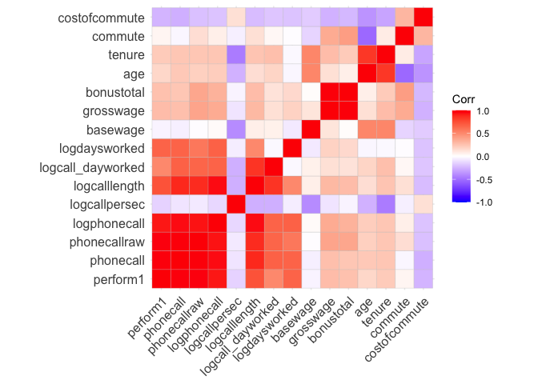<!-- -->

#### Group 40

643 observations for 12 volunteers

**Persona observations:**  
male  
not married  
number of bedrooms: 1  
no children  
no high education  
no promotion  
worked for 26.8 months at the company when left (= avg)  
22.8 years old (\<= avg)  
  
**Other average weekly observations:**  
not working from home  
performed: -0.46 (\<\< avg)  
basewage per month: 1492 (\< avg)  
bonus per month: 1149 (\< avg)  
grosswage per month: 2604 (\<=avg)  
cost of commute per month: 8.3 (\> avg)  
commute min per week: 119 (\<\< avg)  
logdaysworked: 1.7 (~= avg)

This correlation matrix is again very similar to the full sample matrix,
no outstanding differences.

*Interpretation*  
Young male group, with no high education and family, which has never
worked from home. Heavily underperformed, while working as many days as
the average. Lives somewhat far away (over avg) with avg cost for
commuting. Earns about 400 less than avereag despite the bad
performance. Group7 had similar circumstances, despite commute, but a
much better performance with lower salary. But the group is twice as big
as this group.

*Recommendation*

As the performance is worse than average, trying to keep this group of
workers should not be prioritized.

``` r
# select group data
group40 <- df %>% filter(group_index==40)
stargazer(as.data.frame(group40), type = "text", median = TRUE, header = TRUE)
```

    ## 
    ## =====================================================================
    ## Statistic           N    Mean    St. Dev.   Min    Median      Max   
    ## ---------------------------------------------------------------------
    ## bedroom            643   1.000    0.000      1        1         1    
    ## children           643   0.000    0.000      0        0         0    
    ## high_educ          643   0.000    0.000      0        0         0    
    ## promote_switch     643   0.000    0.000      0        0         0    
    ## quitjob            643   1.000    0.000      1        1         1    
    ## homethatweek       643   0.000    0.000      0        0         0    
    ## perform1           642  -0.462    0.899   -3.024   -0.446     2.540  
    ## phonecall          638  -0.392    0.900   -3.106   -0.377     2.554  
    ## phonecallraw       631  391.097  135.837     1       385       883   
    ## logphonecall       631   5.880    0.533    0.000    5.953     6.783  
    ## logcallpersec      629  -5.157    0.174   -5.609   -5.162    -3.178  
    ## logcalllength      630  11.038    0.572    3.178   11.131    11.824  
    ## logcall_dayworked  630   9.327    0.503    2.485    9.406    10.021  
    ## logdaysworked      642   1.697    0.265    0.000    1.792     1.946  
    ## homethatweek_num   643   0.000    0.000      0        0         0    
    ## basewage           629 1,492.130 142.227    650     1,500     1,900  
    ## grosswage          638 2,604.691 768.685  344.830 2,440.690 5,011.380
    ## bonustotal         638 1,149.647 684.029   0.000   966.000  3,461.380
    ## age                643  22.879    2.293     19       23        27    
    ## tenure             643  26.818    45.869     3       10        150   
    ## commute            612  119.649   51.741    30       120       200   
    ## gender_num         643   0.000    0.000      0        0         0    
    ## married_num        643   0.000    0.000      0        0         0    
    ## high_educ_num      643   0.000    0.000      0        0         0    
    ## children_num       643   0.000    0.000      0        0         0    
    ## costofcommute      643   8.283    2.400      4       10        12    
    ## promote_switch_num 643   0.000    0.000      0        0         0    
    ## quitjob_num        643   1.000    0.000      1        1         1    
    ## group_index        643  40.000    0.000     40       40        40    
    ## ---------------------------------------------------------------------

``` r
# group definition
group40 %>% select(gender, married, bedroom, children, high_educ, promote_switch, quitjob, homethatweek)
```

    ##     gender married bedroom children high_educ promote_switch quitjob
    ## 1     male   FALSE       1    FALSE     FALSE          FALSE    TRUE
    ## 2     male   FALSE       1    FALSE     FALSE          FALSE    TRUE
    ## 3     male   FALSE       1    FALSE     FALSE          FALSE    TRUE
    ## 4     male   FALSE       1    FALSE     FALSE          FALSE    TRUE
    ## 5     male   FALSE       1    FALSE     FALSE          FALSE    TRUE
    ## 6     male   FALSE       1    FALSE     FALSE          FALSE    TRUE
    ## 7     male   FALSE       1    FALSE     FALSE          FALSE    TRUE
    ## 8     male   FALSE       1    FALSE     FALSE          FALSE    TRUE
    ## 9     male   FALSE       1    FALSE     FALSE          FALSE    TRUE
    ## 10    male   FALSE       1    FALSE     FALSE          FALSE    TRUE
    ## 11    male   FALSE       1    FALSE     FALSE          FALSE    TRUE
    ## 12    male   FALSE       1    FALSE     FALSE          FALSE    TRUE
    ## 13    male   FALSE       1    FALSE     FALSE          FALSE    TRUE
    ## 14    male   FALSE       1    FALSE     FALSE          FALSE    TRUE
    ## 15    male   FALSE       1    FALSE     FALSE          FALSE    TRUE
    ## 16    male   FALSE       1    FALSE     FALSE          FALSE    TRUE
    ## 17    male   FALSE       1    FALSE     FALSE          FALSE    TRUE
    ## 18    male   FALSE       1    FALSE     FALSE          FALSE    TRUE
    ## 19    male   FALSE       1    FALSE     FALSE          FALSE    TRUE
    ## 20    male   FALSE       1    FALSE     FALSE          FALSE    TRUE
    ## 21    male   FALSE       1    FALSE     FALSE          FALSE    TRUE
    ## 22    male   FALSE       1    FALSE     FALSE          FALSE    TRUE
    ## 23    male   FALSE       1    FALSE     FALSE          FALSE    TRUE
    ## 24    male   FALSE       1    FALSE     FALSE          FALSE    TRUE
    ## 25    male   FALSE       1    FALSE     FALSE          FALSE    TRUE
    ## 26    male   FALSE       1    FALSE     FALSE          FALSE    TRUE
    ## 27    male   FALSE       1    FALSE     FALSE          FALSE    TRUE
    ## 28    male   FALSE       1    FALSE     FALSE          FALSE    TRUE
    ## 29    male   FALSE       1    FALSE     FALSE          FALSE    TRUE
    ## 30    male   FALSE       1    FALSE     FALSE          FALSE    TRUE
    ## 31    male   FALSE       1    FALSE     FALSE          FALSE    TRUE
    ## 32    male   FALSE       1    FALSE     FALSE          FALSE    TRUE
    ## 33    male   FALSE       1    FALSE     FALSE          FALSE    TRUE
    ## 34    male   FALSE       1    FALSE     FALSE          FALSE    TRUE
    ## 35    male   FALSE       1    FALSE     FALSE          FALSE    TRUE
    ## 36    male   FALSE       1    FALSE     FALSE          FALSE    TRUE
    ## 37    male   FALSE       1    FALSE     FALSE          FALSE    TRUE
    ## 38    male   FALSE       1    FALSE     FALSE          FALSE    TRUE
    ## 39    male   FALSE       1    FALSE     FALSE          FALSE    TRUE
    ## 40    male   FALSE       1    FALSE     FALSE          FALSE    TRUE
    ## 41    male   FALSE       1    FALSE     FALSE          FALSE    TRUE
    ## 42    male   FALSE       1    FALSE     FALSE          FALSE    TRUE
    ## 43    male   FALSE       1    FALSE     FALSE          FALSE    TRUE
    ## 44    male   FALSE       1    FALSE     FALSE          FALSE    TRUE
    ## 45    male   FALSE       1    FALSE     FALSE          FALSE    TRUE
    ## 46    male   FALSE       1    FALSE     FALSE          FALSE    TRUE
    ## 47    male   FALSE       1    FALSE     FALSE          FALSE    TRUE
    ## 48    male   FALSE       1    FALSE     FALSE          FALSE    TRUE
    ## 49    male   FALSE       1    FALSE     FALSE          FALSE    TRUE
    ## 50    male   FALSE       1    FALSE     FALSE          FALSE    TRUE
    ## 51    male   FALSE       1    FALSE     FALSE          FALSE    TRUE
    ## 52    male   FALSE       1    FALSE     FALSE          FALSE    TRUE
    ## 53    male   FALSE       1    FALSE     FALSE          FALSE    TRUE
    ## 54    male   FALSE       1    FALSE     FALSE          FALSE    TRUE
    ## 55    male   FALSE       1    FALSE     FALSE          FALSE    TRUE
    ## 56    male   FALSE       1    FALSE     FALSE          FALSE    TRUE
    ## 57    male   FALSE       1    FALSE     FALSE          FALSE    TRUE
    ## 58    male   FALSE       1    FALSE     FALSE          FALSE    TRUE
    ## 59    male   FALSE       1    FALSE     FALSE          FALSE    TRUE
    ## 60    male   FALSE       1    FALSE     FALSE          FALSE    TRUE
    ## 61    male   FALSE       1    FALSE     FALSE          FALSE    TRUE
    ## 62    male   FALSE       1    FALSE     FALSE          FALSE    TRUE
    ## 63    male   FALSE       1    FALSE     FALSE          FALSE    TRUE
    ## 64    male   FALSE       1    FALSE     FALSE          FALSE    TRUE
    ## 65    male   FALSE       1    FALSE     FALSE          FALSE    TRUE
    ## 66    male   FALSE       1    FALSE     FALSE          FALSE    TRUE
    ## 67    male   FALSE       1    FALSE     FALSE          FALSE    TRUE
    ## 68    male   FALSE       1    FALSE     FALSE          FALSE    TRUE
    ## 69    male   FALSE       1    FALSE     FALSE          FALSE    TRUE
    ## 70    male   FALSE       1    FALSE     FALSE          FALSE    TRUE
    ## 71    male   FALSE       1    FALSE     FALSE          FALSE    TRUE
    ## 72    male   FALSE       1    FALSE     FALSE          FALSE    TRUE
    ## 73    male   FALSE       1    FALSE     FALSE          FALSE    TRUE
    ## 74    male   FALSE       1    FALSE     FALSE          FALSE    TRUE
    ## 75    male   FALSE       1    FALSE     FALSE          FALSE    TRUE
    ## 76    male   FALSE       1    FALSE     FALSE          FALSE    TRUE
    ## 77    male   FALSE       1    FALSE     FALSE          FALSE    TRUE
    ## 78    male   FALSE       1    FALSE     FALSE          FALSE    TRUE
    ## 79    male   FALSE       1    FALSE     FALSE          FALSE    TRUE
    ## 80    male   FALSE       1    FALSE     FALSE          FALSE    TRUE
    ## 81    male   FALSE       1    FALSE     FALSE          FALSE    TRUE
    ## 82    male   FALSE       1    FALSE     FALSE          FALSE    TRUE
    ## 83    male   FALSE       1    FALSE     FALSE          FALSE    TRUE
    ## 84    male   FALSE       1    FALSE     FALSE          FALSE    TRUE
    ## 85    male   FALSE       1    FALSE     FALSE          FALSE    TRUE
    ## 86    male   FALSE       1    FALSE     FALSE          FALSE    TRUE
    ## 87    male   FALSE       1    FALSE     FALSE          FALSE    TRUE
    ## 88    male   FALSE       1    FALSE     FALSE          FALSE    TRUE
    ## 89    male   FALSE       1    FALSE     FALSE          FALSE    TRUE
    ## 90    male   FALSE       1    FALSE     FALSE          FALSE    TRUE
    ## 91    male   FALSE       1    FALSE     FALSE          FALSE    TRUE
    ## 92    male   FALSE       1    FALSE     FALSE          FALSE    TRUE
    ## 93    male   FALSE       1    FALSE     FALSE          FALSE    TRUE
    ## 94    male   FALSE       1    FALSE     FALSE          FALSE    TRUE
    ## 95    male   FALSE       1    FALSE     FALSE          FALSE    TRUE
    ## 96    male   FALSE       1    FALSE     FALSE          FALSE    TRUE
    ## 97    male   FALSE       1    FALSE     FALSE          FALSE    TRUE
    ## 98    male   FALSE       1    FALSE     FALSE          FALSE    TRUE
    ## 99    male   FALSE       1    FALSE     FALSE          FALSE    TRUE
    ## 100   male   FALSE       1    FALSE     FALSE          FALSE    TRUE
    ## 101   male   FALSE       1    FALSE     FALSE          FALSE    TRUE
    ## 102   male   FALSE       1    FALSE     FALSE          FALSE    TRUE
    ## 103   male   FALSE       1    FALSE     FALSE          FALSE    TRUE
    ## 104   male   FALSE       1    FALSE     FALSE          FALSE    TRUE
    ## 105   male   FALSE       1    FALSE     FALSE          FALSE    TRUE
    ## 106   male   FALSE       1    FALSE     FALSE          FALSE    TRUE
    ## 107   male   FALSE       1    FALSE     FALSE          FALSE    TRUE
    ## 108   male   FALSE       1    FALSE     FALSE          FALSE    TRUE
    ## 109   male   FALSE       1    FALSE     FALSE          FALSE    TRUE
    ## 110   male   FALSE       1    FALSE     FALSE          FALSE    TRUE
    ## 111   male   FALSE       1    FALSE     FALSE          FALSE    TRUE
    ## 112   male   FALSE       1    FALSE     FALSE          FALSE    TRUE
    ## 113   male   FALSE       1    FALSE     FALSE          FALSE    TRUE
    ## 114   male   FALSE       1    FALSE     FALSE          FALSE    TRUE
    ## 115   male   FALSE       1    FALSE     FALSE          FALSE    TRUE
    ## 116   male   FALSE       1    FALSE     FALSE          FALSE    TRUE
    ## 117   male   FALSE       1    FALSE     FALSE          FALSE    TRUE
    ## 118   male   FALSE       1    FALSE     FALSE          FALSE    TRUE
    ## 119   male   FALSE       1    FALSE     FALSE          FALSE    TRUE
    ## 120   male   FALSE       1    FALSE     FALSE          FALSE    TRUE
    ## 121   male   FALSE       1    FALSE     FALSE          FALSE    TRUE
    ## 122   male   FALSE       1    FALSE     FALSE          FALSE    TRUE
    ## 123   male   FALSE       1    FALSE     FALSE          FALSE    TRUE
    ## 124   male   FALSE       1    FALSE     FALSE          FALSE    TRUE
    ## 125   male   FALSE       1    FALSE     FALSE          FALSE    TRUE
    ## 126   male   FALSE       1    FALSE     FALSE          FALSE    TRUE
    ## 127   male   FALSE       1    FALSE     FALSE          FALSE    TRUE
    ## 128   male   FALSE       1    FALSE     FALSE          FALSE    TRUE
    ## 129   male   FALSE       1    FALSE     FALSE          FALSE    TRUE
    ## 130   male   FALSE       1    FALSE     FALSE          FALSE    TRUE
    ## 131   male   FALSE       1    FALSE     FALSE          FALSE    TRUE
    ## 132   male   FALSE       1    FALSE     FALSE          FALSE    TRUE
    ## 133   male   FALSE       1    FALSE     FALSE          FALSE    TRUE
    ## 134   male   FALSE       1    FALSE     FALSE          FALSE    TRUE
    ## 135   male   FALSE       1    FALSE     FALSE          FALSE    TRUE
    ## 136   male   FALSE       1    FALSE     FALSE          FALSE    TRUE
    ## 137   male   FALSE       1    FALSE     FALSE          FALSE    TRUE
    ## 138   male   FALSE       1    FALSE     FALSE          FALSE    TRUE
    ## 139   male   FALSE       1    FALSE     FALSE          FALSE    TRUE
    ## 140   male   FALSE       1    FALSE     FALSE          FALSE    TRUE
    ## 141   male   FALSE       1    FALSE     FALSE          FALSE    TRUE
    ## 142   male   FALSE       1    FALSE     FALSE          FALSE    TRUE
    ## 143   male   FALSE       1    FALSE     FALSE          FALSE    TRUE
    ## 144   male   FALSE       1    FALSE     FALSE          FALSE    TRUE
    ## 145   male   FALSE       1    FALSE     FALSE          FALSE    TRUE
    ## 146   male   FALSE       1    FALSE     FALSE          FALSE    TRUE
    ## 147   male   FALSE       1    FALSE     FALSE          FALSE    TRUE
    ## 148   male   FALSE       1    FALSE     FALSE          FALSE    TRUE
    ## 149   male   FALSE       1    FALSE     FALSE          FALSE    TRUE
    ## 150   male   FALSE       1    FALSE     FALSE          FALSE    TRUE
    ## 151   male   FALSE       1    FALSE     FALSE          FALSE    TRUE
    ## 152   male   FALSE       1    FALSE     FALSE          FALSE    TRUE
    ## 153   male   FALSE       1    FALSE     FALSE          FALSE    TRUE
    ## 154   male   FALSE       1    FALSE     FALSE          FALSE    TRUE
    ## 155   male   FALSE       1    FALSE     FALSE          FALSE    TRUE
    ## 156   male   FALSE       1    FALSE     FALSE          FALSE    TRUE
    ## 157   male   FALSE       1    FALSE     FALSE          FALSE    TRUE
    ## 158   male   FALSE       1    FALSE     FALSE          FALSE    TRUE
    ## 159   male   FALSE       1    FALSE     FALSE          FALSE    TRUE
    ## 160   male   FALSE       1    FALSE     FALSE          FALSE    TRUE
    ## 161   male   FALSE       1    FALSE     FALSE          FALSE    TRUE
    ## 162   male   FALSE       1    FALSE     FALSE          FALSE    TRUE
    ## 163   male   FALSE       1    FALSE     FALSE          FALSE    TRUE
    ## 164   male   FALSE       1    FALSE     FALSE          FALSE    TRUE
    ## 165   male   FALSE       1    FALSE     FALSE          FALSE    TRUE
    ## 166   male   FALSE       1    FALSE     FALSE          FALSE    TRUE
    ## 167   male   FALSE       1    FALSE     FALSE          FALSE    TRUE
    ## 168   male   FALSE       1    FALSE     FALSE          FALSE    TRUE
    ## 169   male   FALSE       1    FALSE     FALSE          FALSE    TRUE
    ## 170   male   FALSE       1    FALSE     FALSE          FALSE    TRUE
    ## 171   male   FALSE       1    FALSE     FALSE          FALSE    TRUE
    ## 172   male   FALSE       1    FALSE     FALSE          FALSE    TRUE
    ## 173   male   FALSE       1    FALSE     FALSE          FALSE    TRUE
    ## 174   male   FALSE       1    FALSE     FALSE          FALSE    TRUE
    ## 175   male   FALSE       1    FALSE     FALSE          FALSE    TRUE
    ## 176   male   FALSE       1    FALSE     FALSE          FALSE    TRUE
    ## 177   male   FALSE       1    FALSE     FALSE          FALSE    TRUE
    ## 178   male   FALSE       1    FALSE     FALSE          FALSE    TRUE
    ## 179   male   FALSE       1    FALSE     FALSE          FALSE    TRUE
    ## 180   male   FALSE       1    FALSE     FALSE          FALSE    TRUE
    ## 181   male   FALSE       1    FALSE     FALSE          FALSE    TRUE
    ## 182   male   FALSE       1    FALSE     FALSE          FALSE    TRUE
    ## 183   male   FALSE       1    FALSE     FALSE          FALSE    TRUE
    ## 184   male   FALSE       1    FALSE     FALSE          FALSE    TRUE
    ## 185   male   FALSE       1    FALSE     FALSE          FALSE    TRUE
    ## 186   male   FALSE       1    FALSE     FALSE          FALSE    TRUE
    ## 187   male   FALSE       1    FALSE     FALSE          FALSE    TRUE
    ## 188   male   FALSE       1    FALSE     FALSE          FALSE    TRUE
    ## 189   male   FALSE       1    FALSE     FALSE          FALSE    TRUE
    ## 190   male   FALSE       1    FALSE     FALSE          FALSE    TRUE
    ## 191   male   FALSE       1    FALSE     FALSE          FALSE    TRUE
    ## 192   male   FALSE       1    FALSE     FALSE          FALSE    TRUE
    ## 193   male   FALSE       1    FALSE     FALSE          FALSE    TRUE
    ## 194   male   FALSE       1    FALSE     FALSE          FALSE    TRUE
    ## 195   male   FALSE       1    FALSE     FALSE          FALSE    TRUE
    ## 196   male   FALSE       1    FALSE     FALSE          FALSE    TRUE
    ## 197   male   FALSE       1    FALSE     FALSE          FALSE    TRUE
    ## 198   male   FALSE       1    FALSE     FALSE          FALSE    TRUE
    ## 199   male   FALSE       1    FALSE     FALSE          FALSE    TRUE
    ## 200   male   FALSE       1    FALSE     FALSE          FALSE    TRUE
    ## 201   male   FALSE       1    FALSE     FALSE          FALSE    TRUE
    ## 202   male   FALSE       1    FALSE     FALSE          FALSE    TRUE
    ## 203   male   FALSE       1    FALSE     FALSE          FALSE    TRUE
    ## 204   male   FALSE       1    FALSE     FALSE          FALSE    TRUE
    ## 205   male   FALSE       1    FALSE     FALSE          FALSE    TRUE
    ## 206   male   FALSE       1    FALSE     FALSE          FALSE    TRUE
    ## 207   male   FALSE       1    FALSE     FALSE          FALSE    TRUE
    ## 208   male   FALSE       1    FALSE     FALSE          FALSE    TRUE
    ## 209   male   FALSE       1    FALSE     FALSE          FALSE    TRUE
    ## 210   male   FALSE       1    FALSE     FALSE          FALSE    TRUE
    ## 211   male   FALSE       1    FALSE     FALSE          FALSE    TRUE
    ## 212   male   FALSE       1    FALSE     FALSE          FALSE    TRUE
    ## 213   male   FALSE       1    FALSE     FALSE          FALSE    TRUE
    ## 214   male   FALSE       1    FALSE     FALSE          FALSE    TRUE
    ## 215   male   FALSE       1    FALSE     FALSE          FALSE    TRUE
    ## 216   male   FALSE       1    FALSE     FALSE          FALSE    TRUE
    ## 217   male   FALSE       1    FALSE     FALSE          FALSE    TRUE
    ## 218   male   FALSE       1    FALSE     FALSE          FALSE    TRUE
    ## 219   male   FALSE       1    FALSE     FALSE          FALSE    TRUE
    ## 220   male   FALSE       1    FALSE     FALSE          FALSE    TRUE
    ## 221   male   FALSE       1    FALSE     FALSE          FALSE    TRUE
    ## 222   male   FALSE       1    FALSE     FALSE          FALSE    TRUE
    ## 223   male   FALSE       1    FALSE     FALSE          FALSE    TRUE
    ## 224   male   FALSE       1    FALSE     FALSE          FALSE    TRUE
    ## 225   male   FALSE       1    FALSE     FALSE          FALSE    TRUE
    ## 226   male   FALSE       1    FALSE     FALSE          FALSE    TRUE
    ## 227   male   FALSE       1    FALSE     FALSE          FALSE    TRUE
    ## 228   male   FALSE       1    FALSE     FALSE          FALSE    TRUE
    ## 229   male   FALSE       1    FALSE     FALSE          FALSE    TRUE
    ## 230   male   FALSE       1    FALSE     FALSE          FALSE    TRUE
    ## 231   male   FALSE       1    FALSE     FALSE          FALSE    TRUE
    ## 232   male   FALSE       1    FALSE     FALSE          FALSE    TRUE
    ## 233   male   FALSE       1    FALSE     FALSE          FALSE    TRUE
    ## 234   male   FALSE       1    FALSE     FALSE          FALSE    TRUE
    ## 235   male   FALSE       1    FALSE     FALSE          FALSE    TRUE
    ## 236   male   FALSE       1    FALSE     FALSE          FALSE    TRUE
    ## 237   male   FALSE       1    FALSE     FALSE          FALSE    TRUE
    ## 238   male   FALSE       1    FALSE     FALSE          FALSE    TRUE
    ## 239   male   FALSE       1    FALSE     FALSE          FALSE    TRUE
    ## 240   male   FALSE       1    FALSE     FALSE          FALSE    TRUE
    ## 241   male   FALSE       1    FALSE     FALSE          FALSE    TRUE
    ## 242   male   FALSE       1    FALSE     FALSE          FALSE    TRUE
    ## 243   male   FALSE       1    FALSE     FALSE          FALSE    TRUE
    ## 244   male   FALSE       1    FALSE     FALSE          FALSE    TRUE
    ## 245   male   FALSE       1    FALSE     FALSE          FALSE    TRUE
    ## 246   male   FALSE       1    FALSE     FALSE          FALSE    TRUE
    ## 247   male   FALSE       1    FALSE     FALSE          FALSE    TRUE
    ## 248   male   FALSE       1    FALSE     FALSE          FALSE    TRUE
    ## 249   male   FALSE       1    FALSE     FALSE          FALSE    TRUE
    ## 250   male   FALSE       1    FALSE     FALSE          FALSE    TRUE
    ## 251   male   FALSE       1    FALSE     FALSE          FALSE    TRUE
    ## 252   male   FALSE       1    FALSE     FALSE          FALSE    TRUE
    ## 253   male   FALSE       1    FALSE     FALSE          FALSE    TRUE
    ## 254   male   FALSE       1    FALSE     FALSE          FALSE    TRUE
    ## 255   male   FALSE       1    FALSE     FALSE          FALSE    TRUE
    ## 256   male   FALSE       1    FALSE     FALSE          FALSE    TRUE
    ## 257   male   FALSE       1    FALSE     FALSE          FALSE    TRUE
    ## 258   male   FALSE       1    FALSE     FALSE          FALSE    TRUE
    ## 259   male   FALSE       1    FALSE     FALSE          FALSE    TRUE
    ## 260   male   FALSE       1    FALSE     FALSE          FALSE    TRUE
    ## 261   male   FALSE       1    FALSE     FALSE          FALSE    TRUE
    ## 262   male   FALSE       1    FALSE     FALSE          FALSE    TRUE
    ## 263   male   FALSE       1    FALSE     FALSE          FALSE    TRUE
    ## 264   male   FALSE       1    FALSE     FALSE          FALSE    TRUE
    ## 265   male   FALSE       1    FALSE     FALSE          FALSE    TRUE
    ## 266   male   FALSE       1    FALSE     FALSE          FALSE    TRUE
    ## 267   male   FALSE       1    FALSE     FALSE          FALSE    TRUE
    ## 268   male   FALSE       1    FALSE     FALSE          FALSE    TRUE
    ## 269   male   FALSE       1    FALSE     FALSE          FALSE    TRUE
    ## 270   male   FALSE       1    FALSE     FALSE          FALSE    TRUE
    ## 271   male   FALSE       1    FALSE     FALSE          FALSE    TRUE
    ## 272   male   FALSE       1    FALSE     FALSE          FALSE    TRUE
    ## 273   male   FALSE       1    FALSE     FALSE          FALSE    TRUE
    ## 274   male   FALSE       1    FALSE     FALSE          FALSE    TRUE
    ## 275   male   FALSE       1    FALSE     FALSE          FALSE    TRUE
    ## 276   male   FALSE       1    FALSE     FALSE          FALSE    TRUE
    ## 277   male   FALSE       1    FALSE     FALSE          FALSE    TRUE
    ## 278   male   FALSE       1    FALSE     FALSE          FALSE    TRUE
    ## 279   male   FALSE       1    FALSE     FALSE          FALSE    TRUE
    ## 280   male   FALSE       1    FALSE     FALSE          FALSE    TRUE
    ## 281   male   FALSE       1    FALSE     FALSE          FALSE    TRUE
    ## 282   male   FALSE       1    FALSE     FALSE          FALSE    TRUE
    ## 283   male   FALSE       1    FALSE     FALSE          FALSE    TRUE
    ## 284   male   FALSE       1    FALSE     FALSE          FALSE    TRUE
    ## 285   male   FALSE       1    FALSE     FALSE          FALSE    TRUE
    ## 286   male   FALSE       1    FALSE     FALSE          FALSE    TRUE
    ## 287   male   FALSE       1    FALSE     FALSE          FALSE    TRUE
    ## 288   male   FALSE       1    FALSE     FALSE          FALSE    TRUE
    ## 289   male   FALSE       1    FALSE     FALSE          FALSE    TRUE
    ## 290   male   FALSE       1    FALSE     FALSE          FALSE    TRUE
    ## 291   male   FALSE       1    FALSE     FALSE          FALSE    TRUE
    ## 292   male   FALSE       1    FALSE     FALSE          FALSE    TRUE
    ## 293   male   FALSE       1    FALSE     FALSE          FALSE    TRUE
    ## 294   male   FALSE       1    FALSE     FALSE          FALSE    TRUE
    ## 295   male   FALSE       1    FALSE     FALSE          FALSE    TRUE
    ## 296   male   FALSE       1    FALSE     FALSE          FALSE    TRUE
    ## 297   male   FALSE       1    FALSE     FALSE          FALSE    TRUE
    ## 298   male   FALSE       1    FALSE     FALSE          FALSE    TRUE
    ## 299   male   FALSE       1    FALSE     FALSE          FALSE    TRUE
    ## 300   male   FALSE       1    FALSE     FALSE          FALSE    TRUE
    ## 301   male   FALSE       1    FALSE     FALSE          FALSE    TRUE
    ## 302   male   FALSE       1    FALSE     FALSE          FALSE    TRUE
    ## 303   male   FALSE       1    FALSE     FALSE          FALSE    TRUE
    ## 304   male   FALSE       1    FALSE     FALSE          FALSE    TRUE
    ## 305   male   FALSE       1    FALSE     FALSE          FALSE    TRUE
    ## 306   male   FALSE       1    FALSE     FALSE          FALSE    TRUE
    ## 307   male   FALSE       1    FALSE     FALSE          FALSE    TRUE
    ## 308   male   FALSE       1    FALSE     FALSE          FALSE    TRUE
    ## 309   male   FALSE       1    FALSE     FALSE          FALSE    TRUE
    ## 310   male   FALSE       1    FALSE     FALSE          FALSE    TRUE
    ## 311   male   FALSE       1    FALSE     FALSE          FALSE    TRUE
    ## 312   male   FALSE       1    FALSE     FALSE          FALSE    TRUE
    ## 313   male   FALSE       1    FALSE     FALSE          FALSE    TRUE
    ## 314   male   FALSE       1    FALSE     FALSE          FALSE    TRUE
    ## 315   male   FALSE       1    FALSE     FALSE          FALSE    TRUE
    ## 316   male   FALSE       1    FALSE     FALSE          FALSE    TRUE
    ## 317   male   FALSE       1    FALSE     FALSE          FALSE    TRUE
    ## 318   male   FALSE       1    FALSE     FALSE          FALSE    TRUE
    ## 319   male   FALSE       1    FALSE     FALSE          FALSE    TRUE
    ## 320   male   FALSE       1    FALSE     FALSE          FALSE    TRUE
    ## 321   male   FALSE       1    FALSE     FALSE          FALSE    TRUE
    ## 322   male   FALSE       1    FALSE     FALSE          FALSE    TRUE
    ## 323   male   FALSE       1    FALSE     FALSE          FALSE    TRUE
    ## 324   male   FALSE       1    FALSE     FALSE          FALSE    TRUE
    ## 325   male   FALSE       1    FALSE     FALSE          FALSE    TRUE
    ## 326   male   FALSE       1    FALSE     FALSE          FALSE    TRUE
    ## 327   male   FALSE       1    FALSE     FALSE          FALSE    TRUE
    ## 328   male   FALSE       1    FALSE     FALSE          FALSE    TRUE
    ## 329   male   FALSE       1    FALSE     FALSE          FALSE    TRUE
    ## 330   male   FALSE       1    FALSE     FALSE          FALSE    TRUE
    ## 331   male   FALSE       1    FALSE     FALSE          FALSE    TRUE
    ## 332   male   FALSE       1    FALSE     FALSE          FALSE    TRUE
    ## 333   male   FALSE       1    FALSE     FALSE          FALSE    TRUE
    ## 334   male   FALSE       1    FALSE     FALSE          FALSE    TRUE
    ## 335   male   FALSE       1    FALSE     FALSE          FALSE    TRUE
    ## 336   male   FALSE       1    FALSE     FALSE          FALSE    TRUE
    ## 337   male   FALSE       1    FALSE     FALSE          FALSE    TRUE
    ## 338   male   FALSE       1    FALSE     FALSE          FALSE    TRUE
    ## 339   male   FALSE       1    FALSE     FALSE          FALSE    TRUE
    ## 340   male   FALSE       1    FALSE     FALSE          FALSE    TRUE
    ## 341   male   FALSE       1    FALSE     FALSE          FALSE    TRUE
    ## 342   male   FALSE       1    FALSE     FALSE          FALSE    TRUE
    ## 343   male   FALSE       1    FALSE     FALSE          FALSE    TRUE
    ## 344   male   FALSE       1    FALSE     FALSE          FALSE    TRUE
    ## 345   male   FALSE       1    FALSE     FALSE          FALSE    TRUE
    ## 346   male   FALSE       1    FALSE     FALSE          FALSE    TRUE
    ## 347   male   FALSE       1    FALSE     FALSE          FALSE    TRUE
    ## 348   male   FALSE       1    FALSE     FALSE          FALSE    TRUE
    ## 349   male   FALSE       1    FALSE     FALSE          FALSE    TRUE
    ## 350   male   FALSE       1    FALSE     FALSE          FALSE    TRUE
    ## 351   male   FALSE       1    FALSE     FALSE          FALSE    TRUE
    ## 352   male   FALSE       1    FALSE     FALSE          FALSE    TRUE
    ## 353   male   FALSE       1    FALSE     FALSE          FALSE    TRUE
    ## 354   male   FALSE       1    FALSE     FALSE          FALSE    TRUE
    ## 355   male   FALSE       1    FALSE     FALSE          FALSE    TRUE
    ## 356   male   FALSE       1    FALSE     FALSE          FALSE    TRUE
    ## 357   male   FALSE       1    FALSE     FALSE          FALSE    TRUE
    ## 358   male   FALSE       1    FALSE     FALSE          FALSE    TRUE
    ## 359   male   FALSE       1    FALSE     FALSE          FALSE    TRUE
    ## 360   male   FALSE       1    FALSE     FALSE          FALSE    TRUE
    ## 361   male   FALSE       1    FALSE     FALSE          FALSE    TRUE
    ## 362   male   FALSE       1    FALSE     FALSE          FALSE    TRUE
    ## 363   male   FALSE       1    FALSE     FALSE          FALSE    TRUE
    ## 364   male   FALSE       1    FALSE     FALSE          FALSE    TRUE
    ## 365   male   FALSE       1    FALSE     FALSE          FALSE    TRUE
    ## 366   male   FALSE       1    FALSE     FALSE          FALSE    TRUE
    ## 367   male   FALSE       1    FALSE     FALSE          FALSE    TRUE
    ## 368   male   FALSE       1    FALSE     FALSE          FALSE    TRUE
    ## 369   male   FALSE       1    FALSE     FALSE          FALSE    TRUE
    ## 370   male   FALSE       1    FALSE     FALSE          FALSE    TRUE
    ## 371   male   FALSE       1    FALSE     FALSE          FALSE    TRUE
    ## 372   male   FALSE       1    FALSE     FALSE          FALSE    TRUE
    ## 373   male   FALSE       1    FALSE     FALSE          FALSE    TRUE
    ## 374   male   FALSE       1    FALSE     FALSE          FALSE    TRUE
    ## 375   male   FALSE       1    FALSE     FALSE          FALSE    TRUE
    ## 376   male   FALSE       1    FALSE     FALSE          FALSE    TRUE
    ## 377   male   FALSE       1    FALSE     FALSE          FALSE    TRUE
    ## 378   male   FALSE       1    FALSE     FALSE          FALSE    TRUE
    ## 379   male   FALSE       1    FALSE     FALSE          FALSE    TRUE
    ## 380   male   FALSE       1    FALSE     FALSE          FALSE    TRUE
    ## 381   male   FALSE       1    FALSE     FALSE          FALSE    TRUE
    ## 382   male   FALSE       1    FALSE     FALSE          FALSE    TRUE
    ## 383   male   FALSE       1    FALSE     FALSE          FALSE    TRUE
    ## 384   male   FALSE       1    FALSE     FALSE          FALSE    TRUE
    ## 385   male   FALSE       1    FALSE     FALSE          FALSE    TRUE
    ## 386   male   FALSE       1    FALSE     FALSE          FALSE    TRUE
    ## 387   male   FALSE       1    FALSE     FALSE          FALSE    TRUE
    ## 388   male   FALSE       1    FALSE     FALSE          FALSE    TRUE
    ## 389   male   FALSE       1    FALSE     FALSE          FALSE    TRUE
    ## 390   male   FALSE       1    FALSE     FALSE          FALSE    TRUE
    ## 391   male   FALSE       1    FALSE     FALSE          FALSE    TRUE
    ## 392   male   FALSE       1    FALSE     FALSE          FALSE    TRUE
    ## 393   male   FALSE       1    FALSE     FALSE          FALSE    TRUE
    ## 394   male   FALSE       1    FALSE     FALSE          FALSE    TRUE
    ## 395   male   FALSE       1    FALSE     FALSE          FALSE    TRUE
    ## 396   male   FALSE       1    FALSE     FALSE          FALSE    TRUE
    ## 397   male   FALSE       1    FALSE     FALSE          FALSE    TRUE
    ## 398   male   FALSE       1    FALSE     FALSE          FALSE    TRUE
    ## 399   male   FALSE       1    FALSE     FALSE          FALSE    TRUE
    ## 400   male   FALSE       1    FALSE     FALSE          FALSE    TRUE
    ## 401   male   FALSE       1    FALSE     FALSE          FALSE    TRUE
    ## 402   male   FALSE       1    FALSE     FALSE          FALSE    TRUE
    ## 403   male   FALSE       1    FALSE     FALSE          FALSE    TRUE
    ## 404   male   FALSE       1    FALSE     FALSE          FALSE    TRUE
    ## 405   male   FALSE       1    FALSE     FALSE          FALSE    TRUE
    ## 406   male   FALSE       1    FALSE     FALSE          FALSE    TRUE
    ## 407   male   FALSE       1    FALSE     FALSE          FALSE    TRUE
    ## 408   male   FALSE       1    FALSE     FALSE          FALSE    TRUE
    ## 409   male   FALSE       1    FALSE     FALSE          FALSE    TRUE
    ## 410   male   FALSE       1    FALSE     FALSE          FALSE    TRUE
    ## 411   male   FALSE       1    FALSE     FALSE          FALSE    TRUE
    ## 412   male   FALSE       1    FALSE     FALSE          FALSE    TRUE
    ## 413   male   FALSE       1    FALSE     FALSE          FALSE    TRUE
    ## 414   male   FALSE       1    FALSE     FALSE          FALSE    TRUE
    ## 415   male   FALSE       1    FALSE     FALSE          FALSE    TRUE
    ## 416   male   FALSE       1    FALSE     FALSE          FALSE    TRUE
    ## 417   male   FALSE       1    FALSE     FALSE          FALSE    TRUE
    ## 418   male   FALSE       1    FALSE     FALSE          FALSE    TRUE
    ## 419   male   FALSE       1    FALSE     FALSE          FALSE    TRUE
    ## 420   male   FALSE       1    FALSE     FALSE          FALSE    TRUE
    ## 421   male   FALSE       1    FALSE     FALSE          FALSE    TRUE
    ## 422   male   FALSE       1    FALSE     FALSE          FALSE    TRUE
    ## 423   male   FALSE       1    FALSE     FALSE          FALSE    TRUE
    ## 424   male   FALSE       1    FALSE     FALSE          FALSE    TRUE
    ## 425   male   FALSE       1    FALSE     FALSE          FALSE    TRUE
    ## 426   male   FALSE       1    FALSE     FALSE          FALSE    TRUE
    ## 427   male   FALSE       1    FALSE     FALSE          FALSE    TRUE
    ## 428   male   FALSE       1    FALSE     FALSE          FALSE    TRUE
    ## 429   male   FALSE       1    FALSE     FALSE          FALSE    TRUE
    ## 430   male   FALSE       1    FALSE     FALSE          FALSE    TRUE
    ## 431   male   FALSE       1    FALSE     FALSE          FALSE    TRUE
    ## 432   male   FALSE       1    FALSE     FALSE          FALSE    TRUE
    ## 433   male   FALSE       1    FALSE     FALSE          FALSE    TRUE
    ## 434   male   FALSE       1    FALSE     FALSE          FALSE    TRUE
    ## 435   male   FALSE       1    FALSE     FALSE          FALSE    TRUE
    ## 436   male   FALSE       1    FALSE     FALSE          FALSE    TRUE
    ## 437   male   FALSE       1    FALSE     FALSE          FALSE    TRUE
    ## 438   male   FALSE       1    FALSE     FALSE          FALSE    TRUE
    ## 439   male   FALSE       1    FALSE     FALSE          FALSE    TRUE
    ## 440   male   FALSE       1    FALSE     FALSE          FALSE    TRUE
    ## 441   male   FALSE       1    FALSE     FALSE          FALSE    TRUE
    ## 442   male   FALSE       1    FALSE     FALSE          FALSE    TRUE
    ## 443   male   FALSE       1    FALSE     FALSE          FALSE    TRUE
    ## 444   male   FALSE       1    FALSE     FALSE          FALSE    TRUE
    ## 445   male   FALSE       1    FALSE     FALSE          FALSE    TRUE
    ## 446   male   FALSE       1    FALSE     FALSE          FALSE    TRUE
    ## 447   male   FALSE       1    FALSE     FALSE          FALSE    TRUE
    ## 448   male   FALSE       1    FALSE     FALSE          FALSE    TRUE
    ## 449   male   FALSE       1    FALSE     FALSE          FALSE    TRUE
    ## 450   male   FALSE       1    FALSE     FALSE          FALSE    TRUE
    ## 451   male   FALSE       1    FALSE     FALSE          FALSE    TRUE
    ## 452   male   FALSE       1    FALSE     FALSE          FALSE    TRUE
    ## 453   male   FALSE       1    FALSE     FALSE          FALSE    TRUE
    ## 454   male   FALSE       1    FALSE     FALSE          FALSE    TRUE
    ## 455   male   FALSE       1    FALSE     FALSE          FALSE    TRUE
    ## 456   male   FALSE       1    FALSE     FALSE          FALSE    TRUE
    ## 457   male   FALSE       1    FALSE     FALSE          FALSE    TRUE
    ## 458   male   FALSE       1    FALSE     FALSE          FALSE    TRUE
    ## 459   male   FALSE       1    FALSE     FALSE          FALSE    TRUE
    ## 460   male   FALSE       1    FALSE     FALSE          FALSE    TRUE
    ## 461   male   FALSE       1    FALSE     FALSE          FALSE    TRUE
    ## 462   male   FALSE       1    FALSE     FALSE          FALSE    TRUE
    ## 463   male   FALSE       1    FALSE     FALSE          FALSE    TRUE
    ## 464   male   FALSE       1    FALSE     FALSE          FALSE    TRUE
    ## 465   male   FALSE       1    FALSE     FALSE          FALSE    TRUE
    ## 466   male   FALSE       1    FALSE     FALSE          FALSE    TRUE
    ## 467   male   FALSE       1    FALSE     FALSE          FALSE    TRUE
    ## 468   male   FALSE       1    FALSE     FALSE          FALSE    TRUE
    ## 469   male   FALSE       1    FALSE     FALSE          FALSE    TRUE
    ## 470   male   FALSE       1    FALSE     FALSE          FALSE    TRUE
    ## 471   male   FALSE       1    FALSE     FALSE          FALSE    TRUE
    ## 472   male   FALSE       1    FALSE     FALSE          FALSE    TRUE
    ## 473   male   FALSE       1    FALSE     FALSE          FALSE    TRUE
    ## 474   male   FALSE       1    FALSE     FALSE          FALSE    TRUE
    ## 475   male   FALSE       1    FALSE     FALSE          FALSE    TRUE
    ## 476   male   FALSE       1    FALSE     FALSE          FALSE    TRUE
    ## 477   male   FALSE       1    FALSE     FALSE          FALSE    TRUE
    ## 478   male   FALSE       1    FALSE     FALSE          FALSE    TRUE
    ## 479   male   FALSE       1    FALSE     FALSE          FALSE    TRUE
    ## 480   male   FALSE       1    FALSE     FALSE          FALSE    TRUE
    ## 481   male   FALSE       1    FALSE     FALSE          FALSE    TRUE
    ## 482   male   FALSE       1    FALSE     FALSE          FALSE    TRUE
    ## 483   male   FALSE       1    FALSE     FALSE          FALSE    TRUE
    ## 484   male   FALSE       1    FALSE     FALSE          FALSE    TRUE
    ## 485   male   FALSE       1    FALSE     FALSE          FALSE    TRUE
    ## 486   male   FALSE       1    FALSE     FALSE          FALSE    TRUE
    ## 487   male   FALSE       1    FALSE     FALSE          FALSE    TRUE
    ## 488   male   FALSE       1    FALSE     FALSE          FALSE    TRUE
    ## 489   male   FALSE       1    FALSE     FALSE          FALSE    TRUE
    ## 490   male   FALSE       1    FALSE     FALSE          FALSE    TRUE
    ## 491   male   FALSE       1    FALSE     FALSE          FALSE    TRUE
    ## 492   male   FALSE       1    FALSE     FALSE          FALSE    TRUE
    ## 493   male   FALSE       1    FALSE     FALSE          FALSE    TRUE
    ## 494   male   FALSE       1    FALSE     FALSE          FALSE    TRUE
    ## 495   male   FALSE       1    FALSE     FALSE          FALSE    TRUE
    ## 496   male   FALSE       1    FALSE     FALSE          FALSE    TRUE
    ## 497   male   FALSE       1    FALSE     FALSE          FALSE    TRUE
    ## 498   male   FALSE       1    FALSE     FALSE          FALSE    TRUE
    ## 499   male   FALSE       1    FALSE     FALSE          FALSE    TRUE
    ## 500   male   FALSE       1    FALSE     FALSE          FALSE    TRUE
    ## 501   male   FALSE       1    FALSE     FALSE          FALSE    TRUE
    ## 502   male   FALSE       1    FALSE     FALSE          FALSE    TRUE
    ## 503   male   FALSE       1    FALSE     FALSE          FALSE    TRUE
    ## 504   male   FALSE       1    FALSE     FALSE          FALSE    TRUE
    ## 505   male   FALSE       1    FALSE     FALSE          FALSE    TRUE
    ## 506   male   FALSE       1    FALSE     FALSE          FALSE    TRUE
    ## 507   male   FALSE       1    FALSE     FALSE          FALSE    TRUE
    ## 508   male   FALSE       1    FALSE     FALSE          FALSE    TRUE
    ## 509   male   FALSE       1    FALSE     FALSE          FALSE    TRUE
    ## 510   male   FALSE       1    FALSE     FALSE          FALSE    TRUE
    ## 511   male   FALSE       1    FALSE     FALSE          FALSE    TRUE
    ## 512   male   FALSE       1    FALSE     FALSE          FALSE    TRUE
    ## 513   male   FALSE       1    FALSE     FALSE          FALSE    TRUE
    ## 514   male   FALSE       1    FALSE     FALSE          FALSE    TRUE
    ## 515   male   FALSE       1    FALSE     FALSE          FALSE    TRUE
    ## 516   male   FALSE       1    FALSE     FALSE          FALSE    TRUE
    ## 517   male   FALSE       1    FALSE     FALSE          FALSE    TRUE
    ## 518   male   FALSE       1    FALSE     FALSE          FALSE    TRUE
    ## 519   male   FALSE       1    FALSE     FALSE          FALSE    TRUE
    ## 520   male   FALSE       1    FALSE     FALSE          FALSE    TRUE
    ## 521   male   FALSE       1    FALSE     FALSE          FALSE    TRUE
    ## 522   male   FALSE       1    FALSE     FALSE          FALSE    TRUE
    ## 523   male   FALSE       1    FALSE     FALSE          FALSE    TRUE
    ## 524   male   FALSE       1    FALSE     FALSE          FALSE    TRUE
    ## 525   male   FALSE       1    FALSE     FALSE          FALSE    TRUE
    ## 526   male   FALSE       1    FALSE     FALSE          FALSE    TRUE
    ## 527   male   FALSE       1    FALSE     FALSE          FALSE    TRUE
    ## 528   male   FALSE       1    FALSE     FALSE          FALSE    TRUE
    ## 529   male   FALSE       1    FALSE     FALSE          FALSE    TRUE
    ## 530   male   FALSE       1    FALSE     FALSE          FALSE    TRUE
    ## 531   male   FALSE       1    FALSE     FALSE          FALSE    TRUE
    ## 532   male   FALSE       1    FALSE     FALSE          FALSE    TRUE
    ## 533   male   FALSE       1    FALSE     FALSE          FALSE    TRUE
    ## 534   male   FALSE       1    FALSE     FALSE          FALSE    TRUE
    ## 535   male   FALSE       1    FALSE     FALSE          FALSE    TRUE
    ## 536   male   FALSE       1    FALSE     FALSE          FALSE    TRUE
    ## 537   male   FALSE       1    FALSE     FALSE          FALSE    TRUE
    ## 538   male   FALSE       1    FALSE     FALSE          FALSE    TRUE
    ## 539   male   FALSE       1    FALSE     FALSE          FALSE    TRUE
    ## 540   male   FALSE       1    FALSE     FALSE          FALSE    TRUE
    ## 541   male   FALSE       1    FALSE     FALSE          FALSE    TRUE
    ## 542   male   FALSE       1    FALSE     FALSE          FALSE    TRUE
    ## 543   male   FALSE       1    FALSE     FALSE          FALSE    TRUE
    ## 544   male   FALSE       1    FALSE     FALSE          FALSE    TRUE
    ## 545   male   FALSE       1    FALSE     FALSE          FALSE    TRUE
    ## 546   male   FALSE       1    FALSE     FALSE          FALSE    TRUE
    ## 547   male   FALSE       1    FALSE     FALSE          FALSE    TRUE
    ## 548   male   FALSE       1    FALSE     FALSE          FALSE    TRUE
    ## 549   male   FALSE       1    FALSE     FALSE          FALSE    TRUE
    ## 550   male   FALSE       1    FALSE     FALSE          FALSE    TRUE
    ## 551   male   FALSE       1    FALSE     FALSE          FALSE    TRUE
    ## 552   male   FALSE       1    FALSE     FALSE          FALSE    TRUE
    ## 553   male   FALSE       1    FALSE     FALSE          FALSE    TRUE
    ## 554   male   FALSE       1    FALSE     FALSE          FALSE    TRUE
    ## 555   male   FALSE       1    FALSE     FALSE          FALSE    TRUE
    ## 556   male   FALSE       1    FALSE     FALSE          FALSE    TRUE
    ## 557   male   FALSE       1    FALSE     FALSE          FALSE    TRUE
    ## 558   male   FALSE       1    FALSE     FALSE          FALSE    TRUE
    ## 559   male   FALSE       1    FALSE     FALSE          FALSE    TRUE
    ## 560   male   FALSE       1    FALSE     FALSE          FALSE    TRUE
    ## 561   male   FALSE       1    FALSE     FALSE          FALSE    TRUE
    ## 562   male   FALSE       1    FALSE     FALSE          FALSE    TRUE
    ## 563   male   FALSE       1    FALSE     FALSE          FALSE    TRUE
    ## 564   male   FALSE       1    FALSE     FALSE          FALSE    TRUE
    ## 565   male   FALSE       1    FALSE     FALSE          FALSE    TRUE
    ## 566   male   FALSE       1    FALSE     FALSE          FALSE    TRUE
    ## 567   male   FALSE       1    FALSE     FALSE          FALSE    TRUE
    ## 568   male   FALSE       1    FALSE     FALSE          FALSE    TRUE
    ## 569   male   FALSE       1    FALSE     FALSE          FALSE    TRUE
    ## 570   male   FALSE       1    FALSE     FALSE          FALSE    TRUE
    ## 571   male   FALSE       1    FALSE     FALSE          FALSE    TRUE
    ## 572   male   FALSE       1    FALSE     FALSE          FALSE    TRUE
    ## 573   male   FALSE       1    FALSE     FALSE          FALSE    TRUE
    ## 574   male   FALSE       1    FALSE     FALSE          FALSE    TRUE
    ## 575   male   FALSE       1    FALSE     FALSE          FALSE    TRUE
    ## 576   male   FALSE       1    FALSE     FALSE          FALSE    TRUE
    ## 577   male   FALSE       1    FALSE     FALSE          FALSE    TRUE
    ## 578   male   FALSE       1    FALSE     FALSE          FALSE    TRUE
    ## 579   male   FALSE       1    FALSE     FALSE          FALSE    TRUE
    ## 580   male   FALSE       1    FALSE     FALSE          FALSE    TRUE
    ## 581   male   FALSE       1    FALSE     FALSE          FALSE    TRUE
    ## 582   male   FALSE       1    FALSE     FALSE          FALSE    TRUE
    ## 583   male   FALSE       1    FALSE     FALSE          FALSE    TRUE
    ## 584   male   FALSE       1    FALSE     FALSE          FALSE    TRUE
    ## 585   male   FALSE       1    FALSE     FALSE          FALSE    TRUE
    ## 586   male   FALSE       1    FALSE     FALSE          FALSE    TRUE
    ## 587   male   FALSE       1    FALSE     FALSE          FALSE    TRUE
    ## 588   male   FALSE       1    FALSE     FALSE          FALSE    TRUE
    ## 589   male   FALSE       1    FALSE     FALSE          FALSE    TRUE
    ## 590   male   FALSE       1    FALSE     FALSE          FALSE    TRUE
    ## 591   male   FALSE       1    FALSE     FALSE          FALSE    TRUE
    ## 592   male   FALSE       1    FALSE     FALSE          FALSE    TRUE
    ## 593   male   FALSE       1    FALSE     FALSE          FALSE    TRUE
    ## 594   male   FALSE       1    FALSE     FALSE          FALSE    TRUE
    ## 595   male   FALSE       1    FALSE     FALSE          FALSE    TRUE
    ## 596   male   FALSE       1    FALSE     FALSE          FALSE    TRUE
    ## 597   male   FALSE       1    FALSE     FALSE          FALSE    TRUE
    ## 598   male   FALSE       1    FALSE     FALSE          FALSE    TRUE
    ## 599   male   FALSE       1    FALSE     FALSE          FALSE    TRUE
    ## 600   male   FALSE       1    FALSE     FALSE          FALSE    TRUE
    ## 601   male   FALSE       1    FALSE     FALSE          FALSE    TRUE
    ## 602   male   FALSE       1    FALSE     FALSE          FALSE    TRUE
    ## 603   male   FALSE       1    FALSE     FALSE          FALSE    TRUE
    ## 604   male   FALSE       1    FALSE     FALSE          FALSE    TRUE
    ## 605   male   FALSE       1    FALSE     FALSE          FALSE    TRUE
    ## 606   male   FALSE       1    FALSE     FALSE          FALSE    TRUE
    ## 607   male   FALSE       1    FALSE     FALSE          FALSE    TRUE
    ## 608   male   FALSE       1    FALSE     FALSE          FALSE    TRUE
    ## 609   male   FALSE       1    FALSE     FALSE          FALSE    TRUE
    ## 610   male   FALSE       1    FALSE     FALSE          FALSE    TRUE
    ## 611   male   FALSE       1    FALSE     FALSE          FALSE    TRUE
    ## 612   male   FALSE       1    FALSE     FALSE          FALSE    TRUE
    ## 613   male   FALSE       1    FALSE     FALSE          FALSE    TRUE
    ## 614   male   FALSE       1    FALSE     FALSE          FALSE    TRUE
    ## 615   male   FALSE       1    FALSE     FALSE          FALSE    TRUE
    ## 616   male   FALSE       1    FALSE     FALSE          FALSE    TRUE
    ## 617   male   FALSE       1    FALSE     FALSE          FALSE    TRUE
    ## 618   male   FALSE       1    FALSE     FALSE          FALSE    TRUE
    ## 619   male   FALSE       1    FALSE     FALSE          FALSE    TRUE
    ## 620   male   FALSE       1    FALSE     FALSE          FALSE    TRUE
    ## 621   male   FALSE       1    FALSE     FALSE          FALSE    TRUE
    ## 622   male   FALSE       1    FALSE     FALSE          FALSE    TRUE
    ## 623   male   FALSE       1    FALSE     FALSE          FALSE    TRUE
    ## 624   male   FALSE       1    FALSE     FALSE          FALSE    TRUE
    ## 625   male   FALSE       1    FALSE     FALSE          FALSE    TRUE
    ## 626   male   FALSE       1    FALSE     FALSE          FALSE    TRUE
    ## 627   male   FALSE       1    FALSE     FALSE          FALSE    TRUE
    ## 628   male   FALSE       1    FALSE     FALSE          FALSE    TRUE
    ## 629   male   FALSE       1    FALSE     FALSE          FALSE    TRUE
    ## 630   male   FALSE       1    FALSE     FALSE          FALSE    TRUE
    ## 631   male   FALSE       1    FALSE     FALSE          FALSE    TRUE
    ## 632   male   FALSE       1    FALSE     FALSE          FALSE    TRUE
    ## 633   male   FALSE       1    FALSE     FALSE          FALSE    TRUE
    ## 634   male   FALSE       1    FALSE     FALSE          FALSE    TRUE
    ## 635   male   FALSE       1    FALSE     FALSE          FALSE    TRUE
    ## 636   male   FALSE       1    FALSE     FALSE          FALSE    TRUE
    ## 637   male   FALSE       1    FALSE     FALSE          FALSE    TRUE
    ## 638   male   FALSE       1    FALSE     FALSE          FALSE    TRUE
    ## 639   male   FALSE       1    FALSE     FALSE          FALSE    TRUE
    ## 640   male   FALSE       1    FALSE     FALSE          FALSE    TRUE
    ## 641   male   FALSE       1    FALSE     FALSE          FALSE    TRUE
    ## 642   male   FALSE       1    FALSE     FALSE          FALSE    TRUE
    ## 643   male   FALSE       1    FALSE     FALSE          FALSE    TRUE
    ##     homethatweek
    ## 1          FALSE
    ## 2          FALSE
    ## 3          FALSE
    ## 4          FALSE
    ## 5          FALSE
    ## 6          FALSE
    ## 7          FALSE
    ## 8          FALSE
    ## 9          FALSE
    ## 10         FALSE
    ## 11         FALSE
    ## 12         FALSE
    ## 13         FALSE
    ## 14         FALSE
    ## 15         FALSE
    ## 16         FALSE
    ## 17         FALSE
    ## 18         FALSE
    ## 19         FALSE
    ## 20         FALSE
    ## 21         FALSE
    ## 22         FALSE
    ## 23         FALSE
    ## 24         FALSE
    ## 25         FALSE
    ## 26         FALSE
    ## 27         FALSE
    ## 28         FALSE
    ## 29         FALSE
    ## 30         FALSE
    ## 31         FALSE
    ## 32         FALSE
    ## 33         FALSE
    ## 34         FALSE
    ## 35         FALSE
    ## 36         FALSE
    ## 37         FALSE
    ## 38         FALSE
    ## 39         FALSE
    ## 40         FALSE
    ## 41         FALSE
    ## 42         FALSE
    ## 43         FALSE
    ## 44         FALSE
    ## 45         FALSE
    ## 46         FALSE
    ## 47         FALSE
    ## 48         FALSE
    ## 49         FALSE
    ## 50         FALSE
    ## 51         FALSE
    ## 52         FALSE
    ## 53         FALSE
    ## 54         FALSE
    ## 55         FALSE
    ## 56         FALSE
    ## 57         FALSE
    ## 58         FALSE
    ## 59         FALSE
    ## 60         FALSE
    ## 61         FALSE
    ## 62         FALSE
    ## 63         FALSE
    ## 64         FALSE
    ## 65         FALSE
    ## 66         FALSE
    ## 67         FALSE
    ## 68         FALSE
    ## 69         FALSE
    ## 70         FALSE
    ## 71         FALSE
    ## 72         FALSE
    ## 73         FALSE
    ## 74         FALSE
    ## 75         FALSE
    ## 76         FALSE
    ## 77         FALSE
    ## 78         FALSE
    ## 79         FALSE
    ## 80         FALSE
    ## 81         FALSE
    ## 82         FALSE
    ## 83         FALSE
    ## 84         FALSE
    ## 85         FALSE
    ## 86         FALSE
    ## 87         FALSE
    ## 88         FALSE
    ## 89         FALSE
    ## 90         FALSE
    ## 91         FALSE
    ## 92         FALSE
    ## 93         FALSE
    ## 94         FALSE
    ## 95         FALSE
    ## 96         FALSE
    ## 97         FALSE
    ## 98         FALSE
    ## 99         FALSE
    ## 100        FALSE
    ## 101        FALSE
    ## 102        FALSE
    ## 103        FALSE
    ## 104        FALSE
    ## 105        FALSE
    ## 106        FALSE
    ## 107        FALSE
    ## 108        FALSE
    ## 109        FALSE
    ## 110        FALSE
    ## 111        FALSE
    ## 112        FALSE
    ## 113        FALSE
    ## 114        FALSE
    ## 115        FALSE
    ## 116        FALSE
    ## 117        FALSE
    ## 118        FALSE
    ## 119        FALSE
    ## 120        FALSE
    ## 121        FALSE
    ## 122        FALSE
    ## 123        FALSE
    ## 124        FALSE
    ## 125        FALSE
    ## 126        FALSE
    ## 127        FALSE
    ## 128        FALSE
    ## 129        FALSE
    ## 130        FALSE
    ## 131        FALSE
    ## 132        FALSE
    ## 133        FALSE
    ## 134        FALSE
    ## 135        FALSE
    ## 136        FALSE
    ## 137        FALSE
    ## 138        FALSE
    ## 139        FALSE
    ## 140        FALSE
    ## 141        FALSE
    ## 142        FALSE
    ## 143        FALSE
    ## 144        FALSE
    ## 145        FALSE
    ## 146        FALSE
    ## 147        FALSE
    ## 148        FALSE
    ## 149        FALSE
    ## 150        FALSE
    ## 151        FALSE
    ## 152        FALSE
    ## 153        FALSE
    ## 154        FALSE
    ## 155        FALSE
    ## 156        FALSE
    ## 157        FALSE
    ## 158        FALSE
    ## 159        FALSE
    ## 160        FALSE
    ## 161        FALSE
    ## 162        FALSE
    ## 163        FALSE
    ## 164        FALSE
    ## 165        FALSE
    ## 166        FALSE
    ## 167        FALSE
    ## 168        FALSE
    ## 169        FALSE
    ## 170        FALSE
    ## 171        FALSE
    ## 172        FALSE
    ## 173        FALSE
    ## 174        FALSE
    ## 175        FALSE
    ## 176        FALSE
    ## 177        FALSE
    ## 178        FALSE
    ## 179        FALSE
    ## 180        FALSE
    ## 181        FALSE
    ## 182        FALSE
    ## 183        FALSE
    ## 184        FALSE
    ## 185        FALSE
    ## 186        FALSE
    ## 187        FALSE
    ## 188        FALSE
    ## 189        FALSE
    ## 190        FALSE
    ## 191        FALSE
    ## 192        FALSE
    ## 193        FALSE
    ## 194        FALSE
    ## 195        FALSE
    ## 196        FALSE
    ## 197        FALSE
    ## 198        FALSE
    ## 199        FALSE
    ## 200        FALSE
    ## 201        FALSE
    ## 202        FALSE
    ## 203        FALSE
    ## 204        FALSE
    ## 205        FALSE
    ## 206        FALSE
    ## 207        FALSE
    ## 208        FALSE
    ## 209        FALSE
    ## 210        FALSE
    ## 211        FALSE
    ## 212        FALSE
    ## 213        FALSE
    ## 214        FALSE
    ## 215        FALSE
    ## 216        FALSE
    ## 217        FALSE
    ## 218        FALSE
    ## 219        FALSE
    ## 220        FALSE
    ## 221        FALSE
    ## 222        FALSE
    ## 223        FALSE
    ## 224        FALSE
    ## 225        FALSE
    ## 226        FALSE
    ## 227        FALSE
    ## 228        FALSE
    ## 229        FALSE
    ## 230        FALSE
    ## 231        FALSE
    ## 232        FALSE
    ## 233        FALSE
    ## 234        FALSE
    ## 235        FALSE
    ## 236        FALSE
    ## 237        FALSE
    ## 238        FALSE
    ## 239        FALSE
    ## 240        FALSE
    ## 241        FALSE
    ## 242        FALSE
    ## 243        FALSE
    ## 244        FALSE
    ## 245        FALSE
    ## 246        FALSE
    ## 247        FALSE
    ## 248        FALSE
    ## 249        FALSE
    ## 250        FALSE
    ## 251        FALSE
    ## 252        FALSE
    ## 253        FALSE
    ## 254        FALSE
    ## 255        FALSE
    ## 256        FALSE
    ## 257        FALSE
    ## 258        FALSE
    ## 259        FALSE
    ## 260        FALSE
    ## 261        FALSE
    ## 262        FALSE
    ## 263        FALSE
    ## 264        FALSE
    ## 265        FALSE
    ## 266        FALSE
    ## 267        FALSE
    ## 268        FALSE
    ## 269        FALSE
    ## 270        FALSE
    ## 271        FALSE
    ## 272        FALSE
    ## 273        FALSE
    ## 274        FALSE
    ## 275        FALSE
    ## 276        FALSE
    ## 277        FALSE
    ## 278        FALSE
    ## 279        FALSE
    ## 280        FALSE
    ## 281        FALSE
    ## 282        FALSE
    ## 283        FALSE
    ## 284        FALSE
    ## 285        FALSE
    ## 286        FALSE
    ## 287        FALSE
    ## 288        FALSE
    ## 289        FALSE
    ## 290        FALSE
    ## 291        FALSE
    ## 292        FALSE
    ## 293        FALSE
    ## 294        FALSE
    ## 295        FALSE
    ## 296        FALSE
    ## 297        FALSE
    ## 298        FALSE
    ## 299        FALSE
    ## 300        FALSE
    ## 301        FALSE
    ## 302        FALSE
    ## 303        FALSE
    ## 304        FALSE
    ## 305        FALSE
    ## 306        FALSE
    ## 307        FALSE
    ## 308        FALSE
    ## 309        FALSE
    ## 310        FALSE
    ## 311        FALSE
    ## 312        FALSE
    ## 313        FALSE
    ## 314        FALSE
    ## 315        FALSE
    ## 316        FALSE
    ## 317        FALSE
    ## 318        FALSE
    ## 319        FALSE
    ## 320        FALSE
    ## 321        FALSE
    ## 322        FALSE
    ## 323        FALSE
    ## 324        FALSE
    ## 325        FALSE
    ## 326        FALSE
    ## 327        FALSE
    ## 328        FALSE
    ## 329        FALSE
    ## 330        FALSE
    ## 331        FALSE
    ## 332        FALSE
    ## 333        FALSE
    ## 334        FALSE
    ## 335        FALSE
    ## 336        FALSE
    ## 337        FALSE
    ## 338        FALSE
    ## 339        FALSE
    ## 340        FALSE
    ## 341        FALSE
    ## 342        FALSE
    ## 343        FALSE
    ## 344        FALSE
    ## 345        FALSE
    ## 346        FALSE
    ## 347        FALSE
    ## 348        FALSE
    ## 349        FALSE
    ## 350        FALSE
    ## 351        FALSE
    ## 352        FALSE
    ## 353        FALSE
    ## 354        FALSE
    ## 355        FALSE
    ## 356        FALSE
    ## 357        FALSE
    ## 358        FALSE
    ## 359        FALSE
    ## 360        FALSE
    ## 361        FALSE
    ## 362        FALSE
    ## 363        FALSE
    ## 364        FALSE
    ## 365        FALSE
    ## 366        FALSE
    ## 367        FALSE
    ## 368        FALSE
    ## 369        FALSE
    ## 370        FALSE
    ## 371        FALSE
    ## 372        FALSE
    ## 373        FALSE
    ## 374        FALSE
    ## 375        FALSE
    ## 376        FALSE
    ## 377        FALSE
    ## 378        FALSE
    ## 379        FALSE
    ## 380        FALSE
    ## 381        FALSE
    ## 382        FALSE
    ## 383        FALSE
    ## 384        FALSE
    ## 385        FALSE
    ## 386        FALSE
    ## 387        FALSE
    ## 388        FALSE
    ## 389        FALSE
    ## 390        FALSE
    ## 391        FALSE
    ## 392        FALSE
    ## 393        FALSE
    ## 394        FALSE
    ## 395        FALSE
    ## 396        FALSE
    ## 397        FALSE
    ## 398        FALSE
    ## 399        FALSE
    ## 400        FALSE
    ## 401        FALSE
    ## 402        FALSE
    ## 403        FALSE
    ## 404        FALSE
    ## 405        FALSE
    ## 406        FALSE
    ## 407        FALSE
    ## 408        FALSE
    ## 409        FALSE
    ## 410        FALSE
    ## 411        FALSE
    ## 412        FALSE
    ## 413        FALSE
    ## 414        FALSE
    ## 415        FALSE
    ## 416        FALSE
    ## 417        FALSE
    ## 418        FALSE
    ## 419        FALSE
    ## 420        FALSE
    ## 421        FALSE
    ## 422        FALSE
    ## 423        FALSE
    ## 424        FALSE
    ## 425        FALSE
    ## 426        FALSE
    ## 427        FALSE
    ## 428        FALSE
    ## 429        FALSE
    ## 430        FALSE
    ## 431        FALSE
    ## 432        FALSE
    ## 433        FALSE
    ## 434        FALSE
    ## 435        FALSE
    ## 436        FALSE
    ## 437        FALSE
    ## 438        FALSE
    ## 439        FALSE
    ## 440        FALSE
    ## 441        FALSE
    ## 442        FALSE
    ## 443        FALSE
    ## 444        FALSE
    ## 445        FALSE
    ## 446        FALSE
    ## 447        FALSE
    ## 448        FALSE
    ## 449        FALSE
    ## 450        FALSE
    ## 451        FALSE
    ## 452        FALSE
    ## 453        FALSE
    ## 454        FALSE
    ## 455        FALSE
    ## 456        FALSE
    ## 457        FALSE
    ## 458        FALSE
    ## 459        FALSE
    ## 460        FALSE
    ## 461        FALSE
    ## 462        FALSE
    ## 463        FALSE
    ## 464        FALSE
    ## 465        FALSE
    ## 466        FALSE
    ## 467        FALSE
    ## 468        FALSE
    ## 469        FALSE
    ## 470        FALSE
    ## 471        FALSE
    ## 472        FALSE
    ## 473        FALSE
    ## 474        FALSE
    ## 475        FALSE
    ## 476        FALSE
    ## 477        FALSE
    ## 478        FALSE
    ## 479        FALSE
    ## 480        FALSE
    ## 481        FALSE
    ## 482        FALSE
    ## 483        FALSE
    ## 484        FALSE
    ## 485        FALSE
    ## 486        FALSE
    ## 487        FALSE
    ## 488        FALSE
    ## 489        FALSE
    ## 490        FALSE
    ## 491        FALSE
    ## 492        FALSE
    ## 493        FALSE
    ## 494        FALSE
    ## 495        FALSE
    ## 496        FALSE
    ## 497        FALSE
    ## 498        FALSE
    ## 499        FALSE
    ## 500        FALSE
    ## 501        FALSE
    ## 502        FALSE
    ## 503        FALSE
    ## 504        FALSE
    ## 505        FALSE
    ## 506        FALSE
    ## 507        FALSE
    ## 508        FALSE
    ## 509        FALSE
    ## 510        FALSE
    ## 511        FALSE
    ## 512        FALSE
    ## 513        FALSE
    ## 514        FALSE
    ## 515        FALSE
    ## 516        FALSE
    ## 517        FALSE
    ## 518        FALSE
    ## 519        FALSE
    ## 520        FALSE
    ## 521        FALSE
    ## 522        FALSE
    ## 523        FALSE
    ## 524        FALSE
    ## 525        FALSE
    ## 526        FALSE
    ## 527        FALSE
    ## 528        FALSE
    ## 529        FALSE
    ## 530        FALSE
    ## 531        FALSE
    ## 532        FALSE
    ## 533        FALSE
    ## 534        FALSE
    ## 535        FALSE
    ## 536        FALSE
    ## 537        FALSE
    ## 538        FALSE
    ## 539        FALSE
    ## 540        FALSE
    ## 541        FALSE
    ## 542        FALSE
    ## 543        FALSE
    ## 544        FALSE
    ## 545        FALSE
    ## 546        FALSE
    ## 547        FALSE
    ## 548        FALSE
    ## 549        FALSE
    ## 550        FALSE
    ## 551        FALSE
    ## 552        FALSE
    ## 553        FALSE
    ## 554        FALSE
    ## 555        FALSE
    ## 556        FALSE
    ## 557        FALSE
    ## 558        FALSE
    ## 559        FALSE
    ## 560        FALSE
    ## 561        FALSE
    ## 562        FALSE
    ## 563        FALSE
    ## 564        FALSE
    ## 565        FALSE
    ## 566        FALSE
    ## 567        FALSE
    ## 568        FALSE
    ## 569        FALSE
    ## 570        FALSE
    ## 571        FALSE
    ## 572        FALSE
    ## 573        FALSE
    ## 574        FALSE
    ## 575        FALSE
    ## 576        FALSE
    ## 577        FALSE
    ## 578        FALSE
    ## 579        FALSE
    ## 580        FALSE
    ## 581        FALSE
    ## 582        FALSE
    ## 583        FALSE
    ## 584        FALSE
    ## 585        FALSE
    ## 586        FALSE
    ## 587        FALSE
    ## 588        FALSE
    ## 589        FALSE
    ## 590        FALSE
    ## 591        FALSE
    ## 592        FALSE
    ## 593        FALSE
    ## 594        FALSE
    ## 595        FALSE
    ## 596        FALSE
    ## 597        FALSE
    ## 598        FALSE
    ## 599        FALSE
    ## 600        FALSE
    ## 601        FALSE
    ## 602        FALSE
    ## 603        FALSE
    ## 604        FALSE
    ## 605        FALSE
    ## 606        FALSE
    ## 607        FALSE
    ## 608        FALSE
    ## 609        FALSE
    ## 610        FALSE
    ## 611        FALSE
    ## 612        FALSE
    ## 613        FALSE
    ## 614        FALSE
    ## 615        FALSE
    ## 616        FALSE
    ## 617        FALSE
    ## 618        FALSE
    ## 619        FALSE
    ## 620        FALSE
    ## 621        FALSE
    ## 622        FALSE
    ## 623        FALSE
    ## 624        FALSE
    ## 625        FALSE
    ## 626        FALSE
    ## 627        FALSE
    ## 628        FALSE
    ## 629        FALSE
    ## 630        FALSE
    ## 631        FALSE
    ## 632        FALSE
    ## 633        FALSE
    ## 634        FALSE
    ## 635        FALSE
    ## 636        FALSE
    ## 637        FALSE
    ## 638        FALSE
    ## 639        FALSE
    ## 640        FALSE
    ## 641        FALSE
    ## 642        FALSE
    ## 643        FALSE

``` r
# distinct persons
unique(group40 %>%select(personid))
```

    ##     personid
    ## 1      44794
    ## 3      43288
    ## 4      38552
    ## 7      38842
    ## 19     41332
    ## 55     40008
    ## 128    43524
    ## 136    35822
    ## 177    34890
    ## 184    41320
    ## 275    39096
    ## 405    42096

``` r
nums <- dplyr::select(group40, where(is.numeric))
cm <- cor(nums, use = "pairwise.complete.obs")
```

    ## Warning in cor(nums, use = "pairwise.complete.obs"): the standard deviation is
    ## zero

``` r
ggcorrplot(cm, lab = FALSE)
```

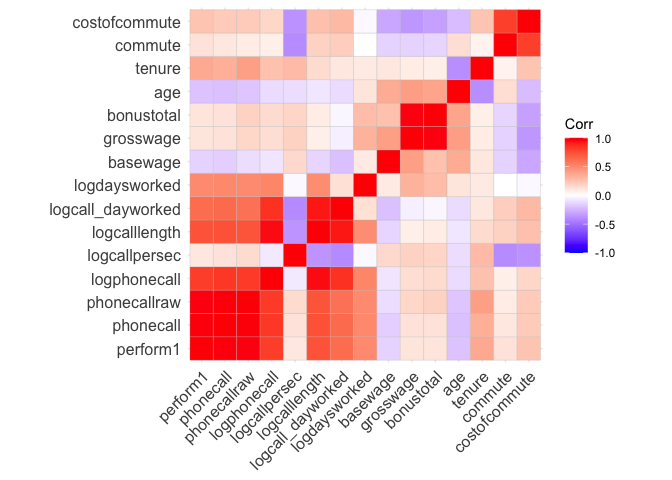<!-- -->

#### Group 48

218 observations for 4 volunteers

**Persona observations:**  
male  
not married  
number of bedrooms: 1  
no children  
high education  
no promotion  
worked for 15.4 months at the company when left (= avg)  
21.8 years old (\<= avg)  
  
**Other average weekly observations:**  
not working from home  
performed: -0.612 (\<\< avg)  
basewage per month: 1566 (\< avg)  
bonus per month: 1087 (\< avg)  
grosswage per month: 2627 (\<=avg)  
cost of commute per month: 9.5 (\> avg)  
commute min per week: 33.4 (\<\< avg)  
logdaysworked: 1.7 (~= avg)

We can see a strong correlation between costofcommute, tenure and age
and a rather negative one between costofcommute, commute, tenure, age
and grosswage/bonustotal. But small sample size (less confidence).

*Interpretation*  
Young male group, with no education and no family, which has never
worked from home. Heavily underperformed, even more than males with high
education who quit, while working as many days as the average. Lives
closer to work than the average with slightly higher than avg cost for
commuting. Earns about 400 less than average despite the bad
performance. Unclear why they left, probably also because they wanted
more money/a promotion.

*Recommendation*

Because of the small sample size confidence is low. Tough, as the
performance is bad, trying to keep this group of workers should not be
prioritized. The company has to ask itself if it is willing to pay more
money for this performance,

``` r
# select group data
group48 <- df %>% filter(group_index==48)
stargazer(as.data.frame(group48), type = "text", median = TRUE, header = TRUE)
```

    ## 
    ## =====================================================================
    ## Statistic           N    Mean    St. Dev.   Min    Median      Max   
    ## ---------------------------------------------------------------------
    ## bedroom            218   1.000    0.000      1        1         1    
    ## children           218   0.000    0.000      0        0         0    
    ## high_educ          218   1.000    0.000      1        1         1    
    ## promote_switch     218   0.000    0.000      0        0         0    
    ## quitjob            218   1.000    0.000      1        1         1    
    ## homethatweek       218   0.000    0.000      0        0         0    
    ## perform1           218  -0.627    0.690   -2.601   -0.614     1.202  
    ## phonecall          216  -0.446    0.750   -2.618   -0.401     2.029  
    ## phonecallraw       218  365.362  104.638    65      373.5      695   
    ## logphonecall       216   5.845    0.379    4.174    5.923     6.544  
    ## logcallpersec      217  -5.210    0.159   -5.721   -5.193    -4.581  
    ## logcalllength      218  11.054    0.336    9.594   11.143    11.468  
    ## logcall_dayworked  218   9.379    0.298    8.157    9.422     9.880  
    ## logdaysworked      218   1.675    0.208    0.693    1.792     1.946  
    ## homethatweek_num   218   0.000    0.000      0        0         0    
    ## basewage           214 1,566.355 106.099   1,300    1,600     1,850  
    ## grosswage          218 2,627.424 519.862  971.380 2,523.000 3,784.760
    ## bonustotal         218 1,087.269 438.508  30.000   985.340  2,134.760
    ## age                218  21.844    1.314     20       22        23    
    ## tenure             218  15.486    12.637     4        4        34    
    ## commute            218  33.482    27.988     1       30        75    
    ## gender_num         218   0.000    0.000      0        0         0    
    ## married_num        218   0.000    0.000      0        0         0    
    ## high_educ_num      218   1.000    0.000      1        1         1    
    ## children_num       218   0.000    0.000      0        0         0    
    ## costofcommute      173   9.526    10.197     0        8        25    
    ## promote_switch_num 218   0.000    0.000      0        0         0    
    ## quitjob_num        218   1.000    0.000      1        1         1    
    ## group_index        218  48.000    0.000     48       48        48    
    ## ---------------------------------------------------------------------

``` r
# group definition
group48 %>% select(gender, married, bedroom, children, high_educ, promote_switch, quitjob, homethatweek)
```

    ##     gender married bedroom children high_educ promote_switch quitjob
    ## 1     male   FALSE       1    FALSE      TRUE          FALSE    TRUE
    ## 2     male   FALSE       1    FALSE      TRUE          FALSE    TRUE
    ## 3     male   FALSE       1    FALSE      TRUE          FALSE    TRUE
    ## 4     male   FALSE       1    FALSE      TRUE          FALSE    TRUE
    ## 5     male   FALSE       1    FALSE      TRUE          FALSE    TRUE
    ## 6     male   FALSE       1    FALSE      TRUE          FALSE    TRUE
    ## 7     male   FALSE       1    FALSE      TRUE          FALSE    TRUE
    ## 8     male   FALSE       1    FALSE      TRUE          FALSE    TRUE
    ## 9     male   FALSE       1    FALSE      TRUE          FALSE    TRUE
    ## 10    male   FALSE       1    FALSE      TRUE          FALSE    TRUE
    ## 11    male   FALSE       1    FALSE      TRUE          FALSE    TRUE
    ## 12    male   FALSE       1    FALSE      TRUE          FALSE    TRUE
    ## 13    male   FALSE       1    FALSE      TRUE          FALSE    TRUE
    ## 14    male   FALSE       1    FALSE      TRUE          FALSE    TRUE
    ## 15    male   FALSE       1    FALSE      TRUE          FALSE    TRUE
    ## 16    male   FALSE       1    FALSE      TRUE          FALSE    TRUE
    ## 17    male   FALSE       1    FALSE      TRUE          FALSE    TRUE
    ## 18    male   FALSE       1    FALSE      TRUE          FALSE    TRUE
    ## 19    male   FALSE       1    FALSE      TRUE          FALSE    TRUE
    ## 20    male   FALSE       1    FALSE      TRUE          FALSE    TRUE
    ## 21    male   FALSE       1    FALSE      TRUE          FALSE    TRUE
    ## 22    male   FALSE       1    FALSE      TRUE          FALSE    TRUE
    ## 23    male   FALSE       1    FALSE      TRUE          FALSE    TRUE
    ## 24    male   FALSE       1    FALSE      TRUE          FALSE    TRUE
    ## 25    male   FALSE       1    FALSE      TRUE          FALSE    TRUE
    ## 26    male   FALSE       1    FALSE      TRUE          FALSE    TRUE
    ## 27    male   FALSE       1    FALSE      TRUE          FALSE    TRUE
    ## 28    male   FALSE       1    FALSE      TRUE          FALSE    TRUE
    ## 29    male   FALSE       1    FALSE      TRUE          FALSE    TRUE
    ## 30    male   FALSE       1    FALSE      TRUE          FALSE    TRUE
    ## 31    male   FALSE       1    FALSE      TRUE          FALSE    TRUE
    ## 32    male   FALSE       1    FALSE      TRUE          FALSE    TRUE
    ## 33    male   FALSE       1    FALSE      TRUE          FALSE    TRUE
    ## 34    male   FALSE       1    FALSE      TRUE          FALSE    TRUE
    ## 35    male   FALSE       1    FALSE      TRUE          FALSE    TRUE
    ## 36    male   FALSE       1    FALSE      TRUE          FALSE    TRUE
    ## 37    male   FALSE       1    FALSE      TRUE          FALSE    TRUE
    ## 38    male   FALSE       1    FALSE      TRUE          FALSE    TRUE
    ## 39    male   FALSE       1    FALSE      TRUE          FALSE    TRUE
    ## 40    male   FALSE       1    FALSE      TRUE          FALSE    TRUE
    ## 41    male   FALSE       1    FALSE      TRUE          FALSE    TRUE
    ## 42    male   FALSE       1    FALSE      TRUE          FALSE    TRUE
    ## 43    male   FALSE       1    FALSE      TRUE          FALSE    TRUE
    ## 44    male   FALSE       1    FALSE      TRUE          FALSE    TRUE
    ## 45    male   FALSE       1    FALSE      TRUE          FALSE    TRUE
    ## 46    male   FALSE       1    FALSE      TRUE          FALSE    TRUE
    ## 47    male   FALSE       1    FALSE      TRUE          FALSE    TRUE
    ## 48    male   FALSE       1    FALSE      TRUE          FALSE    TRUE
    ## 49    male   FALSE       1    FALSE      TRUE          FALSE    TRUE
    ## 50    male   FALSE       1    FALSE      TRUE          FALSE    TRUE
    ## 51    male   FALSE       1    FALSE      TRUE          FALSE    TRUE
    ## 52    male   FALSE       1    FALSE      TRUE          FALSE    TRUE
    ## 53    male   FALSE       1    FALSE      TRUE          FALSE    TRUE
    ## 54    male   FALSE       1    FALSE      TRUE          FALSE    TRUE
    ## 55    male   FALSE       1    FALSE      TRUE          FALSE    TRUE
    ## 56    male   FALSE       1    FALSE      TRUE          FALSE    TRUE
    ## 57    male   FALSE       1    FALSE      TRUE          FALSE    TRUE
    ## 58    male   FALSE       1    FALSE      TRUE          FALSE    TRUE
    ## 59    male   FALSE       1    FALSE      TRUE          FALSE    TRUE
    ## 60    male   FALSE       1    FALSE      TRUE          FALSE    TRUE
    ## 61    male   FALSE       1    FALSE      TRUE          FALSE    TRUE
    ## 62    male   FALSE       1    FALSE      TRUE          FALSE    TRUE
    ## 63    male   FALSE       1    FALSE      TRUE          FALSE    TRUE
    ## 64    male   FALSE       1    FALSE      TRUE          FALSE    TRUE
    ## 65    male   FALSE       1    FALSE      TRUE          FALSE    TRUE
    ## 66    male   FALSE       1    FALSE      TRUE          FALSE    TRUE
    ## 67    male   FALSE       1    FALSE      TRUE          FALSE    TRUE
    ## 68    male   FALSE       1    FALSE      TRUE          FALSE    TRUE
    ## 69    male   FALSE       1    FALSE      TRUE          FALSE    TRUE
    ## 70    male   FALSE       1    FALSE      TRUE          FALSE    TRUE
    ## 71    male   FALSE       1    FALSE      TRUE          FALSE    TRUE
    ## 72    male   FALSE       1    FALSE      TRUE          FALSE    TRUE
    ## 73    male   FALSE       1    FALSE      TRUE          FALSE    TRUE
    ## 74    male   FALSE       1    FALSE      TRUE          FALSE    TRUE
    ## 75    male   FALSE       1    FALSE      TRUE          FALSE    TRUE
    ## 76    male   FALSE       1    FALSE      TRUE          FALSE    TRUE
    ## 77    male   FALSE       1    FALSE      TRUE          FALSE    TRUE
    ## 78    male   FALSE       1    FALSE      TRUE          FALSE    TRUE
    ## 79    male   FALSE       1    FALSE      TRUE          FALSE    TRUE
    ## 80    male   FALSE       1    FALSE      TRUE          FALSE    TRUE
    ## 81    male   FALSE       1    FALSE      TRUE          FALSE    TRUE
    ## 82    male   FALSE       1    FALSE      TRUE          FALSE    TRUE
    ## 83    male   FALSE       1    FALSE      TRUE          FALSE    TRUE
    ## 84    male   FALSE       1    FALSE      TRUE          FALSE    TRUE
    ## 85    male   FALSE       1    FALSE      TRUE          FALSE    TRUE
    ## 86    male   FALSE       1    FALSE      TRUE          FALSE    TRUE
    ## 87    male   FALSE       1    FALSE      TRUE          FALSE    TRUE
    ## 88    male   FALSE       1    FALSE      TRUE          FALSE    TRUE
    ## 89    male   FALSE       1    FALSE      TRUE          FALSE    TRUE
    ## 90    male   FALSE       1    FALSE      TRUE          FALSE    TRUE
    ## 91    male   FALSE       1    FALSE      TRUE          FALSE    TRUE
    ## 92    male   FALSE       1    FALSE      TRUE          FALSE    TRUE
    ## 93    male   FALSE       1    FALSE      TRUE          FALSE    TRUE
    ## 94    male   FALSE       1    FALSE      TRUE          FALSE    TRUE
    ## 95    male   FALSE       1    FALSE      TRUE          FALSE    TRUE
    ## 96    male   FALSE       1    FALSE      TRUE          FALSE    TRUE
    ## 97    male   FALSE       1    FALSE      TRUE          FALSE    TRUE
    ## 98    male   FALSE       1    FALSE      TRUE          FALSE    TRUE
    ## 99    male   FALSE       1    FALSE      TRUE          FALSE    TRUE
    ## 100   male   FALSE       1    FALSE      TRUE          FALSE    TRUE
    ## 101   male   FALSE       1    FALSE      TRUE          FALSE    TRUE
    ## 102   male   FALSE       1    FALSE      TRUE          FALSE    TRUE
    ## 103   male   FALSE       1    FALSE      TRUE          FALSE    TRUE
    ## 104   male   FALSE       1    FALSE      TRUE          FALSE    TRUE
    ## 105   male   FALSE       1    FALSE      TRUE          FALSE    TRUE
    ## 106   male   FALSE       1    FALSE      TRUE          FALSE    TRUE
    ## 107   male   FALSE       1    FALSE      TRUE          FALSE    TRUE
    ## 108   male   FALSE       1    FALSE      TRUE          FALSE    TRUE
    ## 109   male   FALSE       1    FALSE      TRUE          FALSE    TRUE
    ## 110   male   FALSE       1    FALSE      TRUE          FALSE    TRUE
    ## 111   male   FALSE       1    FALSE      TRUE          FALSE    TRUE
    ## 112   male   FALSE       1    FALSE      TRUE          FALSE    TRUE
    ## 113   male   FALSE       1    FALSE      TRUE          FALSE    TRUE
    ## 114   male   FALSE       1    FALSE      TRUE          FALSE    TRUE
    ## 115   male   FALSE       1    FALSE      TRUE          FALSE    TRUE
    ## 116   male   FALSE       1    FALSE      TRUE          FALSE    TRUE
    ## 117   male   FALSE       1    FALSE      TRUE          FALSE    TRUE
    ## 118   male   FALSE       1    FALSE      TRUE          FALSE    TRUE
    ## 119   male   FALSE       1    FALSE      TRUE          FALSE    TRUE
    ## 120   male   FALSE       1    FALSE      TRUE          FALSE    TRUE
    ## 121   male   FALSE       1    FALSE      TRUE          FALSE    TRUE
    ## 122   male   FALSE       1    FALSE      TRUE          FALSE    TRUE
    ## 123   male   FALSE       1    FALSE      TRUE          FALSE    TRUE
    ## 124   male   FALSE       1    FALSE      TRUE          FALSE    TRUE
    ## 125   male   FALSE       1    FALSE      TRUE          FALSE    TRUE
    ## 126   male   FALSE       1    FALSE      TRUE          FALSE    TRUE
    ## 127   male   FALSE       1    FALSE      TRUE          FALSE    TRUE
    ## 128   male   FALSE       1    FALSE      TRUE          FALSE    TRUE
    ## 129   male   FALSE       1    FALSE      TRUE          FALSE    TRUE
    ## 130   male   FALSE       1    FALSE      TRUE          FALSE    TRUE
    ## 131   male   FALSE       1    FALSE      TRUE          FALSE    TRUE
    ## 132   male   FALSE       1    FALSE      TRUE          FALSE    TRUE
    ## 133   male   FALSE       1    FALSE      TRUE          FALSE    TRUE
    ## 134   male   FALSE       1    FALSE      TRUE          FALSE    TRUE
    ## 135   male   FALSE       1    FALSE      TRUE          FALSE    TRUE
    ## 136   male   FALSE       1    FALSE      TRUE          FALSE    TRUE
    ## 137   male   FALSE       1    FALSE      TRUE          FALSE    TRUE
    ## 138   male   FALSE       1    FALSE      TRUE          FALSE    TRUE
    ## 139   male   FALSE       1    FALSE      TRUE          FALSE    TRUE
    ## 140   male   FALSE       1    FALSE      TRUE          FALSE    TRUE
    ## 141   male   FALSE       1    FALSE      TRUE          FALSE    TRUE
    ## 142   male   FALSE       1    FALSE      TRUE          FALSE    TRUE
    ## 143   male   FALSE       1    FALSE      TRUE          FALSE    TRUE
    ## 144   male   FALSE       1    FALSE      TRUE          FALSE    TRUE
    ## 145   male   FALSE       1    FALSE      TRUE          FALSE    TRUE
    ## 146   male   FALSE       1    FALSE      TRUE          FALSE    TRUE
    ## 147   male   FALSE       1    FALSE      TRUE          FALSE    TRUE
    ## 148   male   FALSE       1    FALSE      TRUE          FALSE    TRUE
    ## 149   male   FALSE       1    FALSE      TRUE          FALSE    TRUE
    ## 150   male   FALSE       1    FALSE      TRUE          FALSE    TRUE
    ## 151   male   FALSE       1    FALSE      TRUE          FALSE    TRUE
    ## 152   male   FALSE       1    FALSE      TRUE          FALSE    TRUE
    ## 153   male   FALSE       1    FALSE      TRUE          FALSE    TRUE
    ## 154   male   FALSE       1    FALSE      TRUE          FALSE    TRUE
    ## 155   male   FALSE       1    FALSE      TRUE          FALSE    TRUE
    ## 156   male   FALSE       1    FALSE      TRUE          FALSE    TRUE
    ## 157   male   FALSE       1    FALSE      TRUE          FALSE    TRUE
    ## 158   male   FALSE       1    FALSE      TRUE          FALSE    TRUE
    ## 159   male   FALSE       1    FALSE      TRUE          FALSE    TRUE
    ## 160   male   FALSE       1    FALSE      TRUE          FALSE    TRUE
    ## 161   male   FALSE       1    FALSE      TRUE          FALSE    TRUE
    ## 162   male   FALSE       1    FALSE      TRUE          FALSE    TRUE
    ## 163   male   FALSE       1    FALSE      TRUE          FALSE    TRUE
    ## 164   male   FALSE       1    FALSE      TRUE          FALSE    TRUE
    ## 165   male   FALSE       1    FALSE      TRUE          FALSE    TRUE
    ## 166   male   FALSE       1    FALSE      TRUE          FALSE    TRUE
    ## 167   male   FALSE       1    FALSE      TRUE          FALSE    TRUE
    ## 168   male   FALSE       1    FALSE      TRUE          FALSE    TRUE
    ## 169   male   FALSE       1    FALSE      TRUE          FALSE    TRUE
    ## 170   male   FALSE       1    FALSE      TRUE          FALSE    TRUE
    ## 171   male   FALSE       1    FALSE      TRUE          FALSE    TRUE
    ## 172   male   FALSE       1    FALSE      TRUE          FALSE    TRUE
    ## 173   male   FALSE       1    FALSE      TRUE          FALSE    TRUE
    ## 174   male   FALSE       1    FALSE      TRUE          FALSE    TRUE
    ## 175   male   FALSE       1    FALSE      TRUE          FALSE    TRUE
    ## 176   male   FALSE       1    FALSE      TRUE          FALSE    TRUE
    ## 177   male   FALSE       1    FALSE      TRUE          FALSE    TRUE
    ## 178   male   FALSE       1    FALSE      TRUE          FALSE    TRUE
    ## 179   male   FALSE       1    FALSE      TRUE          FALSE    TRUE
    ## 180   male   FALSE       1    FALSE      TRUE          FALSE    TRUE
    ## 181   male   FALSE       1    FALSE      TRUE          FALSE    TRUE
    ## 182   male   FALSE       1    FALSE      TRUE          FALSE    TRUE
    ## 183   male   FALSE       1    FALSE      TRUE          FALSE    TRUE
    ## 184   male   FALSE       1    FALSE      TRUE          FALSE    TRUE
    ## 185   male   FALSE       1    FALSE      TRUE          FALSE    TRUE
    ## 186   male   FALSE       1    FALSE      TRUE          FALSE    TRUE
    ## 187   male   FALSE       1    FALSE      TRUE          FALSE    TRUE
    ## 188   male   FALSE       1    FALSE      TRUE          FALSE    TRUE
    ## 189   male   FALSE       1    FALSE      TRUE          FALSE    TRUE
    ## 190   male   FALSE       1    FALSE      TRUE          FALSE    TRUE
    ## 191   male   FALSE       1    FALSE      TRUE          FALSE    TRUE
    ## 192   male   FALSE       1    FALSE      TRUE          FALSE    TRUE
    ## 193   male   FALSE       1    FALSE      TRUE          FALSE    TRUE
    ## 194   male   FALSE       1    FALSE      TRUE          FALSE    TRUE
    ## 195   male   FALSE       1    FALSE      TRUE          FALSE    TRUE
    ## 196   male   FALSE       1    FALSE      TRUE          FALSE    TRUE
    ## 197   male   FALSE       1    FALSE      TRUE          FALSE    TRUE
    ## 198   male   FALSE       1    FALSE      TRUE          FALSE    TRUE
    ## 199   male   FALSE       1    FALSE      TRUE          FALSE    TRUE
    ## 200   male   FALSE       1    FALSE      TRUE          FALSE    TRUE
    ## 201   male   FALSE       1    FALSE      TRUE          FALSE    TRUE
    ## 202   male   FALSE       1    FALSE      TRUE          FALSE    TRUE
    ## 203   male   FALSE       1    FALSE      TRUE          FALSE    TRUE
    ## 204   male   FALSE       1    FALSE      TRUE          FALSE    TRUE
    ## 205   male   FALSE       1    FALSE      TRUE          FALSE    TRUE
    ## 206   male   FALSE       1    FALSE      TRUE          FALSE    TRUE
    ## 207   male   FALSE       1    FALSE      TRUE          FALSE    TRUE
    ## 208   male   FALSE       1    FALSE      TRUE          FALSE    TRUE
    ## 209   male   FALSE       1    FALSE      TRUE          FALSE    TRUE
    ## 210   male   FALSE       1    FALSE      TRUE          FALSE    TRUE
    ## 211   male   FALSE       1    FALSE      TRUE          FALSE    TRUE
    ## 212   male   FALSE       1    FALSE      TRUE          FALSE    TRUE
    ## 213   male   FALSE       1    FALSE      TRUE          FALSE    TRUE
    ## 214   male   FALSE       1    FALSE      TRUE          FALSE    TRUE
    ## 215   male   FALSE       1    FALSE      TRUE          FALSE    TRUE
    ## 216   male   FALSE       1    FALSE      TRUE          FALSE    TRUE
    ## 217   male   FALSE       1    FALSE      TRUE          FALSE    TRUE
    ## 218   male   FALSE       1    FALSE      TRUE          FALSE    TRUE
    ##     homethatweek
    ## 1          FALSE
    ## 2          FALSE
    ## 3          FALSE
    ## 4          FALSE
    ## 5          FALSE
    ## 6          FALSE
    ## 7          FALSE
    ## 8          FALSE
    ## 9          FALSE
    ## 10         FALSE
    ## 11         FALSE
    ## 12         FALSE
    ## 13         FALSE
    ## 14         FALSE
    ## 15         FALSE
    ## 16         FALSE
    ## 17         FALSE
    ## 18         FALSE
    ## 19         FALSE
    ## 20         FALSE
    ## 21         FALSE
    ## 22         FALSE
    ## 23         FALSE
    ## 24         FALSE
    ## 25         FALSE
    ## 26         FALSE
    ## 27         FALSE
    ## 28         FALSE
    ## 29         FALSE
    ## 30         FALSE
    ## 31         FALSE
    ## 32         FALSE
    ## 33         FALSE
    ## 34         FALSE
    ## 35         FALSE
    ## 36         FALSE
    ## 37         FALSE
    ## 38         FALSE
    ## 39         FALSE
    ## 40         FALSE
    ## 41         FALSE
    ## 42         FALSE
    ## 43         FALSE
    ## 44         FALSE
    ## 45         FALSE
    ## 46         FALSE
    ## 47         FALSE
    ## 48         FALSE
    ## 49         FALSE
    ## 50         FALSE
    ## 51         FALSE
    ## 52         FALSE
    ## 53         FALSE
    ## 54         FALSE
    ## 55         FALSE
    ## 56         FALSE
    ## 57         FALSE
    ## 58         FALSE
    ## 59         FALSE
    ## 60         FALSE
    ## 61         FALSE
    ## 62         FALSE
    ## 63         FALSE
    ## 64         FALSE
    ## 65         FALSE
    ## 66         FALSE
    ## 67         FALSE
    ## 68         FALSE
    ## 69         FALSE
    ## 70         FALSE
    ## 71         FALSE
    ## 72         FALSE
    ## 73         FALSE
    ## 74         FALSE
    ## 75         FALSE
    ## 76         FALSE
    ## 77         FALSE
    ## 78         FALSE
    ## 79         FALSE
    ## 80         FALSE
    ## 81         FALSE
    ## 82         FALSE
    ## 83         FALSE
    ## 84         FALSE
    ## 85         FALSE
    ## 86         FALSE
    ## 87         FALSE
    ## 88         FALSE
    ## 89         FALSE
    ## 90         FALSE
    ## 91         FALSE
    ## 92         FALSE
    ## 93         FALSE
    ## 94         FALSE
    ## 95         FALSE
    ## 96         FALSE
    ## 97         FALSE
    ## 98         FALSE
    ## 99         FALSE
    ## 100        FALSE
    ## 101        FALSE
    ## 102        FALSE
    ## 103        FALSE
    ## 104        FALSE
    ## 105        FALSE
    ## 106        FALSE
    ## 107        FALSE
    ## 108        FALSE
    ## 109        FALSE
    ## 110        FALSE
    ## 111        FALSE
    ## 112        FALSE
    ## 113        FALSE
    ## 114        FALSE
    ## 115        FALSE
    ## 116        FALSE
    ## 117        FALSE
    ## 118        FALSE
    ## 119        FALSE
    ## 120        FALSE
    ## 121        FALSE
    ## 122        FALSE
    ## 123        FALSE
    ## 124        FALSE
    ## 125        FALSE
    ## 126        FALSE
    ## 127        FALSE
    ## 128        FALSE
    ## 129        FALSE
    ## 130        FALSE
    ## 131        FALSE
    ## 132        FALSE
    ## 133        FALSE
    ## 134        FALSE
    ## 135        FALSE
    ## 136        FALSE
    ## 137        FALSE
    ## 138        FALSE
    ## 139        FALSE
    ## 140        FALSE
    ## 141        FALSE
    ## 142        FALSE
    ## 143        FALSE
    ## 144        FALSE
    ## 145        FALSE
    ## 146        FALSE
    ## 147        FALSE
    ## 148        FALSE
    ## 149        FALSE
    ## 150        FALSE
    ## 151        FALSE
    ## 152        FALSE
    ## 153        FALSE
    ## 154        FALSE
    ## 155        FALSE
    ## 156        FALSE
    ## 157        FALSE
    ## 158        FALSE
    ## 159        FALSE
    ## 160        FALSE
    ## 161        FALSE
    ## 162        FALSE
    ## 163        FALSE
    ## 164        FALSE
    ## 165        FALSE
    ## 166        FALSE
    ## 167        FALSE
    ## 168        FALSE
    ## 169        FALSE
    ## 170        FALSE
    ## 171        FALSE
    ## 172        FALSE
    ## 173        FALSE
    ## 174        FALSE
    ## 175        FALSE
    ## 176        FALSE
    ## 177        FALSE
    ## 178        FALSE
    ## 179        FALSE
    ## 180        FALSE
    ## 181        FALSE
    ## 182        FALSE
    ## 183        FALSE
    ## 184        FALSE
    ## 185        FALSE
    ## 186        FALSE
    ## 187        FALSE
    ## 188        FALSE
    ## 189        FALSE
    ## 190        FALSE
    ## 191        FALSE
    ## 192        FALSE
    ## 193        FALSE
    ## 194        FALSE
    ## 195        FALSE
    ## 196        FALSE
    ## 197        FALSE
    ## 198        FALSE
    ## 199        FALSE
    ## 200        FALSE
    ## 201        FALSE
    ## 202        FALSE
    ## 203        FALSE
    ## 204        FALSE
    ## 205        FALSE
    ## 206        FALSE
    ## 207        FALSE
    ## 208        FALSE
    ## 209        FALSE
    ## 210        FALSE
    ## 211        FALSE
    ## 212        FALSE
    ## 213        FALSE
    ## 214        FALSE
    ## 215        FALSE
    ## 216        FALSE
    ## 217        FALSE
    ## 218        FALSE

``` r
# distinct persons
unique(group48 %>%select(personid))
```

    ##    personid
    ## 1     32804
    ## 2     24324
    ## 9     42618
    ## 48    42634

``` r
nums <- dplyr::select(group48, where(is.numeric))
cm <- cor(nums, use = "pairwise.complete.obs")
```

    ## Warning in cor(nums, use = "pairwise.complete.obs"): the standard deviation is
    ## zero

``` r
ggcorrplot(cm, lab = FALSE)
```

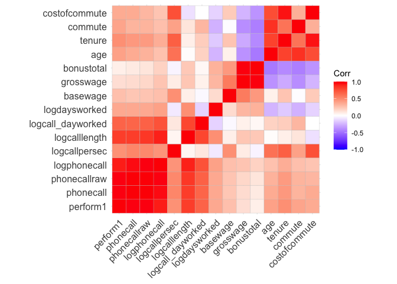<!-- -->

#### Group 60

202 observations for 4 volunteers

**Persona observations:**  
male  
married  
number of bedrooms: 1  
children  
high education  
no promotion  
worked for 22 months at the company when left (\> avg)  
27.8 years old (\> avg)  
  
**Other average weekly observations:**  
not working from home  
performed: -0.22 (\< avg)  
basewage per month: 1555 (\< avg)  
bonus per month: 1256 (\< avg)  
grosswage per month: 2784 (\<=avg)  
cost of commute per month: 20.5 (\>\> avg)  
commute min per week: 101.5 (= avg)  
logdaysworked: 1.5 (\<= avg)

We can see a strong correlation age, tenure and commute. And a moderate
between tenure, bonustotal, grosswage, basewage (steady salary raises(?)
But small sample size (less confidence).

*Interpretation*  
Older than avg. male group, with high education and family, which has
never worked from home. Underperformance a bit, while working as a
little less days as the average. Earn about the same amount less than
what they perform less. High cost of commute and average commute minutes
per week. Probably left because of this, and maybe the performance also
was affect by that. As the salary was steadily improved while working
their, this was probably not the main reason.

*Recommendation*

Because of the small sample size confidence is low. Tough, as the
performance is probably worse because of the high commute cost in
combination with having a family. A first important action can be the
offering of working from home to reduce negative aspects of commuting
and increasing performance. If performance actually rises, salary should
be increased as well according to that.

``` r
# select group data
group60 <- df %>% filter(group_index==60)
stargazer(as.data.frame(group60), type = "text", median = TRUE, header = TRUE)
```

    ## 
    ## =====================================================================
    ## Statistic           N    Mean    St. Dev.   Min    Median      Max   
    ## ---------------------------------------------------------------------
    ## bedroom            202   1.000    0.000      1        1         1    
    ## children           202   1.000    0.000      1        1         1    
    ## high_educ          202   1.000    0.000      1        1         1    
    ## promote_switch     202   0.000    0.000      0        0         0    
    ## quitjob            202   1.000    0.000      1        1         1    
    ## homethatweek       202   0.000    0.000      0        0         0    
    ## perform1           201  -0.216    1.292   -2.996   -0.008     2.164  
    ## phonecall          202  -0.182    1.343   -3.113    0.077     2.729  
    ## phonecallraw       184  435.120  181.523     2       461       823   
    ## logphonecall       184   5.904    0.790    0.693    6.133     6.713  
    ## logcallpersec      184  -5.074    0.196   -5.578   -5.124    -4.533  
    ## logcalllength      183  10.976    0.754    6.271   11.183    11.880  
    ## logcall_dayworked  183   9.416    0.631    5.578    9.599    10.088  
    ## logdaysworked      202   1.532    0.364    0.000    1.609     1.946  
    ## homethatweek_num   202   0.000    0.000      0        0         0    
    ## basewage           195 1,555.128 109.941   1,400    1,550     1,800  
    ## grosswage          195 2,784.271 680.297  672.590 2,549.860 4,434.900
    ## bonustotal         195 1,256.063 592.845  20.000  1,054.000 2,734.900
    ## age                202  27.847    1.740     25       28        30    
    ## tenure             202  22.064    16.113     8        9        47    
    ## commute            154  101.494   99.220    30       32        240   
    ## gender_num         202   0.000    0.000      0        0         0    
    ## married_num        202   1.000    0.000      1        1         1    
    ## high_educ_num      202   1.000    0.000      1        1         1    
    ## children_num       202   1.000    0.000      1        1         1    
    ## costofcommute      202  20.515    21.521     2        2        55    
    ## promote_switch_num 202   0.000    0.000      0        0         0    
    ## quitjob_num        202   1.000    0.000      1        1         1    
    ## group_index        202  60.000    0.000     60       60        60    
    ## ---------------------------------------------------------------------

``` r
# group definition
group60 %>% select(gender, married, bedroom, children, high_educ, promote_switch, quitjob, homethatweek)
```

    ##     gender married bedroom children high_educ promote_switch quitjob
    ## 1     male    TRUE       1     TRUE      TRUE          FALSE    TRUE
    ## 2     male    TRUE       1     TRUE      TRUE          FALSE    TRUE
    ## 3     male    TRUE       1     TRUE      TRUE          FALSE    TRUE
    ## 4     male    TRUE       1     TRUE      TRUE          FALSE    TRUE
    ## 5     male    TRUE       1     TRUE      TRUE          FALSE    TRUE
    ## 6     male    TRUE       1     TRUE      TRUE          FALSE    TRUE
    ## 7     male    TRUE       1     TRUE      TRUE          FALSE    TRUE
    ## 8     male    TRUE       1     TRUE      TRUE          FALSE    TRUE
    ## 9     male    TRUE       1     TRUE      TRUE          FALSE    TRUE
    ## 10    male    TRUE       1     TRUE      TRUE          FALSE    TRUE
    ## 11    male    TRUE       1     TRUE      TRUE          FALSE    TRUE
    ## 12    male    TRUE       1     TRUE      TRUE          FALSE    TRUE
    ## 13    male    TRUE       1     TRUE      TRUE          FALSE    TRUE
    ## 14    male    TRUE       1     TRUE      TRUE          FALSE    TRUE
    ## 15    male    TRUE       1     TRUE      TRUE          FALSE    TRUE
    ## 16    male    TRUE       1     TRUE      TRUE          FALSE    TRUE
    ## 17    male    TRUE       1     TRUE      TRUE          FALSE    TRUE
    ## 18    male    TRUE       1     TRUE      TRUE          FALSE    TRUE
    ## 19    male    TRUE       1     TRUE      TRUE          FALSE    TRUE
    ## 20    male    TRUE       1     TRUE      TRUE          FALSE    TRUE
    ## 21    male    TRUE       1     TRUE      TRUE          FALSE    TRUE
    ## 22    male    TRUE       1     TRUE      TRUE          FALSE    TRUE
    ## 23    male    TRUE       1     TRUE      TRUE          FALSE    TRUE
    ## 24    male    TRUE       1     TRUE      TRUE          FALSE    TRUE
    ## 25    male    TRUE       1     TRUE      TRUE          FALSE    TRUE
    ## 26    male    TRUE       1     TRUE      TRUE          FALSE    TRUE
    ## 27    male    TRUE       1     TRUE      TRUE          FALSE    TRUE
    ## 28    male    TRUE       1     TRUE      TRUE          FALSE    TRUE
    ## 29    male    TRUE       1     TRUE      TRUE          FALSE    TRUE
    ## 30    male    TRUE       1     TRUE      TRUE          FALSE    TRUE
    ## 31    male    TRUE       1     TRUE      TRUE          FALSE    TRUE
    ## 32    male    TRUE       1     TRUE      TRUE          FALSE    TRUE
    ## 33    male    TRUE       1     TRUE      TRUE          FALSE    TRUE
    ## 34    male    TRUE       1     TRUE      TRUE          FALSE    TRUE
    ## 35    male    TRUE       1     TRUE      TRUE          FALSE    TRUE
    ## 36    male    TRUE       1     TRUE      TRUE          FALSE    TRUE
    ## 37    male    TRUE       1     TRUE      TRUE          FALSE    TRUE
    ## 38    male    TRUE       1     TRUE      TRUE          FALSE    TRUE
    ## 39    male    TRUE       1     TRUE      TRUE          FALSE    TRUE
    ## 40    male    TRUE       1     TRUE      TRUE          FALSE    TRUE
    ## 41    male    TRUE       1     TRUE      TRUE          FALSE    TRUE
    ## 42    male    TRUE       1     TRUE      TRUE          FALSE    TRUE
    ## 43    male    TRUE       1     TRUE      TRUE          FALSE    TRUE
    ## 44    male    TRUE       1     TRUE      TRUE          FALSE    TRUE
    ## 45    male    TRUE       1     TRUE      TRUE          FALSE    TRUE
    ## 46    male    TRUE       1     TRUE      TRUE          FALSE    TRUE
    ## 47    male    TRUE       1     TRUE      TRUE          FALSE    TRUE
    ## 48    male    TRUE       1     TRUE      TRUE          FALSE    TRUE
    ## 49    male    TRUE       1     TRUE      TRUE          FALSE    TRUE
    ## 50    male    TRUE       1     TRUE      TRUE          FALSE    TRUE
    ## 51    male    TRUE       1     TRUE      TRUE          FALSE    TRUE
    ## 52    male    TRUE       1     TRUE      TRUE          FALSE    TRUE
    ## 53    male    TRUE       1     TRUE      TRUE          FALSE    TRUE
    ## 54    male    TRUE       1     TRUE      TRUE          FALSE    TRUE
    ## 55    male    TRUE       1     TRUE      TRUE          FALSE    TRUE
    ## 56    male    TRUE       1     TRUE      TRUE          FALSE    TRUE
    ## 57    male    TRUE       1     TRUE      TRUE          FALSE    TRUE
    ## 58    male    TRUE       1     TRUE      TRUE          FALSE    TRUE
    ## 59    male    TRUE       1     TRUE      TRUE          FALSE    TRUE
    ## 60    male    TRUE       1     TRUE      TRUE          FALSE    TRUE
    ## 61    male    TRUE       1     TRUE      TRUE          FALSE    TRUE
    ## 62    male    TRUE       1     TRUE      TRUE          FALSE    TRUE
    ## 63    male    TRUE       1     TRUE      TRUE          FALSE    TRUE
    ## 64    male    TRUE       1     TRUE      TRUE          FALSE    TRUE
    ## 65    male    TRUE       1     TRUE      TRUE          FALSE    TRUE
    ## 66    male    TRUE       1     TRUE      TRUE          FALSE    TRUE
    ## 67    male    TRUE       1     TRUE      TRUE          FALSE    TRUE
    ## 68    male    TRUE       1     TRUE      TRUE          FALSE    TRUE
    ## 69    male    TRUE       1     TRUE      TRUE          FALSE    TRUE
    ## 70    male    TRUE       1     TRUE      TRUE          FALSE    TRUE
    ## 71    male    TRUE       1     TRUE      TRUE          FALSE    TRUE
    ## 72    male    TRUE       1     TRUE      TRUE          FALSE    TRUE
    ## 73    male    TRUE       1     TRUE      TRUE          FALSE    TRUE
    ## 74    male    TRUE       1     TRUE      TRUE          FALSE    TRUE
    ## 75    male    TRUE       1     TRUE      TRUE          FALSE    TRUE
    ## 76    male    TRUE       1     TRUE      TRUE          FALSE    TRUE
    ## 77    male    TRUE       1     TRUE      TRUE          FALSE    TRUE
    ## 78    male    TRUE       1     TRUE      TRUE          FALSE    TRUE
    ## 79    male    TRUE       1     TRUE      TRUE          FALSE    TRUE
    ## 80    male    TRUE       1     TRUE      TRUE          FALSE    TRUE
    ## 81    male    TRUE       1     TRUE      TRUE          FALSE    TRUE
    ## 82    male    TRUE       1     TRUE      TRUE          FALSE    TRUE
    ## 83    male    TRUE       1     TRUE      TRUE          FALSE    TRUE
    ## 84    male    TRUE       1     TRUE      TRUE          FALSE    TRUE
    ## 85    male    TRUE       1     TRUE      TRUE          FALSE    TRUE
    ## 86    male    TRUE       1     TRUE      TRUE          FALSE    TRUE
    ## 87    male    TRUE       1     TRUE      TRUE          FALSE    TRUE
    ## 88    male    TRUE       1     TRUE      TRUE          FALSE    TRUE
    ## 89    male    TRUE       1     TRUE      TRUE          FALSE    TRUE
    ## 90    male    TRUE       1     TRUE      TRUE          FALSE    TRUE
    ## 91    male    TRUE       1     TRUE      TRUE          FALSE    TRUE
    ## 92    male    TRUE       1     TRUE      TRUE          FALSE    TRUE
    ## 93    male    TRUE       1     TRUE      TRUE          FALSE    TRUE
    ## 94    male    TRUE       1     TRUE      TRUE          FALSE    TRUE
    ## 95    male    TRUE       1     TRUE      TRUE          FALSE    TRUE
    ## 96    male    TRUE       1     TRUE      TRUE          FALSE    TRUE
    ## 97    male    TRUE       1     TRUE      TRUE          FALSE    TRUE
    ## 98    male    TRUE       1     TRUE      TRUE          FALSE    TRUE
    ## 99    male    TRUE       1     TRUE      TRUE          FALSE    TRUE
    ## 100   male    TRUE       1     TRUE      TRUE          FALSE    TRUE
    ## 101   male    TRUE       1     TRUE      TRUE          FALSE    TRUE
    ## 102   male    TRUE       1     TRUE      TRUE          FALSE    TRUE
    ## 103   male    TRUE       1     TRUE      TRUE          FALSE    TRUE
    ## 104   male    TRUE       1     TRUE      TRUE          FALSE    TRUE
    ## 105   male    TRUE       1     TRUE      TRUE          FALSE    TRUE
    ## 106   male    TRUE       1     TRUE      TRUE          FALSE    TRUE
    ## 107   male    TRUE       1     TRUE      TRUE          FALSE    TRUE
    ## 108   male    TRUE       1     TRUE      TRUE          FALSE    TRUE
    ## 109   male    TRUE       1     TRUE      TRUE          FALSE    TRUE
    ## 110   male    TRUE       1     TRUE      TRUE          FALSE    TRUE
    ## 111   male    TRUE       1     TRUE      TRUE          FALSE    TRUE
    ## 112   male    TRUE       1     TRUE      TRUE          FALSE    TRUE
    ## 113   male    TRUE       1     TRUE      TRUE          FALSE    TRUE
    ## 114   male    TRUE       1     TRUE      TRUE          FALSE    TRUE
    ## 115   male    TRUE       1     TRUE      TRUE          FALSE    TRUE
    ## 116   male    TRUE       1     TRUE      TRUE          FALSE    TRUE
    ## 117   male    TRUE       1     TRUE      TRUE          FALSE    TRUE
    ## 118   male    TRUE       1     TRUE      TRUE          FALSE    TRUE
    ## 119   male    TRUE       1     TRUE      TRUE          FALSE    TRUE
    ## 120   male    TRUE       1     TRUE      TRUE          FALSE    TRUE
    ## 121   male    TRUE       1     TRUE      TRUE          FALSE    TRUE
    ## 122   male    TRUE       1     TRUE      TRUE          FALSE    TRUE
    ## 123   male    TRUE       1     TRUE      TRUE          FALSE    TRUE
    ## 124   male    TRUE       1     TRUE      TRUE          FALSE    TRUE
    ## 125   male    TRUE       1     TRUE      TRUE          FALSE    TRUE
    ## 126   male    TRUE       1     TRUE      TRUE          FALSE    TRUE
    ## 127   male    TRUE       1     TRUE      TRUE          FALSE    TRUE
    ## 128   male    TRUE       1     TRUE      TRUE          FALSE    TRUE
    ## 129   male    TRUE       1     TRUE      TRUE          FALSE    TRUE
    ## 130   male    TRUE       1     TRUE      TRUE          FALSE    TRUE
    ## 131   male    TRUE       1     TRUE      TRUE          FALSE    TRUE
    ## 132   male    TRUE       1     TRUE      TRUE          FALSE    TRUE
    ## 133   male    TRUE       1     TRUE      TRUE          FALSE    TRUE
    ## 134   male    TRUE       1     TRUE      TRUE          FALSE    TRUE
    ## 135   male    TRUE       1     TRUE      TRUE          FALSE    TRUE
    ## 136   male    TRUE       1     TRUE      TRUE          FALSE    TRUE
    ## 137   male    TRUE       1     TRUE      TRUE          FALSE    TRUE
    ## 138   male    TRUE       1     TRUE      TRUE          FALSE    TRUE
    ## 139   male    TRUE       1     TRUE      TRUE          FALSE    TRUE
    ## 140   male    TRUE       1     TRUE      TRUE          FALSE    TRUE
    ## 141   male    TRUE       1     TRUE      TRUE          FALSE    TRUE
    ## 142   male    TRUE       1     TRUE      TRUE          FALSE    TRUE
    ## 143   male    TRUE       1     TRUE      TRUE          FALSE    TRUE
    ## 144   male    TRUE       1     TRUE      TRUE          FALSE    TRUE
    ## 145   male    TRUE       1     TRUE      TRUE          FALSE    TRUE
    ## 146   male    TRUE       1     TRUE      TRUE          FALSE    TRUE
    ## 147   male    TRUE       1     TRUE      TRUE          FALSE    TRUE
    ## 148   male    TRUE       1     TRUE      TRUE          FALSE    TRUE
    ## 149   male    TRUE       1     TRUE      TRUE          FALSE    TRUE
    ## 150   male    TRUE       1     TRUE      TRUE          FALSE    TRUE
    ## 151   male    TRUE       1     TRUE      TRUE          FALSE    TRUE
    ## 152   male    TRUE       1     TRUE      TRUE          FALSE    TRUE
    ## 153   male    TRUE       1     TRUE      TRUE          FALSE    TRUE
    ## 154   male    TRUE       1     TRUE      TRUE          FALSE    TRUE
    ## 155   male    TRUE       1     TRUE      TRUE          FALSE    TRUE
    ## 156   male    TRUE       1     TRUE      TRUE          FALSE    TRUE
    ## 157   male    TRUE       1     TRUE      TRUE          FALSE    TRUE
    ## 158   male    TRUE       1     TRUE      TRUE          FALSE    TRUE
    ## 159   male    TRUE       1     TRUE      TRUE          FALSE    TRUE
    ## 160   male    TRUE       1     TRUE      TRUE          FALSE    TRUE
    ## 161   male    TRUE       1     TRUE      TRUE          FALSE    TRUE
    ## 162   male    TRUE       1     TRUE      TRUE          FALSE    TRUE
    ## 163   male    TRUE       1     TRUE      TRUE          FALSE    TRUE
    ## 164   male    TRUE       1     TRUE      TRUE          FALSE    TRUE
    ## 165   male    TRUE       1     TRUE      TRUE          FALSE    TRUE
    ## 166   male    TRUE       1     TRUE      TRUE          FALSE    TRUE
    ## 167   male    TRUE       1     TRUE      TRUE          FALSE    TRUE
    ## 168   male    TRUE       1     TRUE      TRUE          FALSE    TRUE
    ## 169   male    TRUE       1     TRUE      TRUE          FALSE    TRUE
    ## 170   male    TRUE       1     TRUE      TRUE          FALSE    TRUE
    ## 171   male    TRUE       1     TRUE      TRUE          FALSE    TRUE
    ## 172   male    TRUE       1     TRUE      TRUE          FALSE    TRUE
    ## 173   male    TRUE       1     TRUE      TRUE          FALSE    TRUE
    ## 174   male    TRUE       1     TRUE      TRUE          FALSE    TRUE
    ## 175   male    TRUE       1     TRUE      TRUE          FALSE    TRUE
    ## 176   male    TRUE       1     TRUE      TRUE          FALSE    TRUE
    ## 177   male    TRUE       1     TRUE      TRUE          FALSE    TRUE
    ## 178   male    TRUE       1     TRUE      TRUE          FALSE    TRUE
    ## 179   male    TRUE       1     TRUE      TRUE          FALSE    TRUE
    ## 180   male    TRUE       1     TRUE      TRUE          FALSE    TRUE
    ## 181   male    TRUE       1     TRUE      TRUE          FALSE    TRUE
    ## 182   male    TRUE       1     TRUE      TRUE          FALSE    TRUE
    ## 183   male    TRUE       1     TRUE      TRUE          FALSE    TRUE
    ## 184   male    TRUE       1     TRUE      TRUE          FALSE    TRUE
    ## 185   male    TRUE       1     TRUE      TRUE          FALSE    TRUE
    ## 186   male    TRUE       1     TRUE      TRUE          FALSE    TRUE
    ## 187   male    TRUE       1     TRUE      TRUE          FALSE    TRUE
    ## 188   male    TRUE       1     TRUE      TRUE          FALSE    TRUE
    ## 189   male    TRUE       1     TRUE      TRUE          FALSE    TRUE
    ## 190   male    TRUE       1     TRUE      TRUE          FALSE    TRUE
    ## 191   male    TRUE       1     TRUE      TRUE          FALSE    TRUE
    ## 192   male    TRUE       1     TRUE      TRUE          FALSE    TRUE
    ## 193   male    TRUE       1     TRUE      TRUE          FALSE    TRUE
    ## 194   male    TRUE       1     TRUE      TRUE          FALSE    TRUE
    ## 195   male    TRUE       1     TRUE      TRUE          FALSE    TRUE
    ## 196   male    TRUE       1     TRUE      TRUE          FALSE    TRUE
    ## 197   male    TRUE       1     TRUE      TRUE          FALSE    TRUE
    ## 198   male    TRUE       1     TRUE      TRUE          FALSE    TRUE
    ## 199   male    TRUE       1     TRUE      TRUE          FALSE    TRUE
    ## 200   male    TRUE       1     TRUE      TRUE          FALSE    TRUE
    ## 201   male    TRUE       1     TRUE      TRUE          FALSE    TRUE
    ## 202   male    TRUE       1     TRUE      TRUE          FALSE    TRUE
    ##     homethatweek
    ## 1          FALSE
    ## 2          FALSE
    ## 3          FALSE
    ## 4          FALSE
    ## 5          FALSE
    ## 6          FALSE
    ## 7          FALSE
    ## 8          FALSE
    ## 9          FALSE
    ## 10         FALSE
    ## 11         FALSE
    ## 12         FALSE
    ## 13         FALSE
    ## 14         FALSE
    ## 15         FALSE
    ## 16         FALSE
    ## 17         FALSE
    ## 18         FALSE
    ## 19         FALSE
    ## 20         FALSE
    ## 21         FALSE
    ## 22         FALSE
    ## 23         FALSE
    ## 24         FALSE
    ## 25         FALSE
    ## 26         FALSE
    ## 27         FALSE
    ## 28         FALSE
    ## 29         FALSE
    ## 30         FALSE
    ## 31         FALSE
    ## 32         FALSE
    ## 33         FALSE
    ## 34         FALSE
    ## 35         FALSE
    ## 36         FALSE
    ## 37         FALSE
    ## 38         FALSE
    ## 39         FALSE
    ## 40         FALSE
    ## 41         FALSE
    ## 42         FALSE
    ## 43         FALSE
    ## 44         FALSE
    ## 45         FALSE
    ## 46         FALSE
    ## 47         FALSE
    ## 48         FALSE
    ## 49         FALSE
    ## 50         FALSE
    ## 51         FALSE
    ## 52         FALSE
    ## 53         FALSE
    ## 54         FALSE
    ## 55         FALSE
    ## 56         FALSE
    ## 57         FALSE
    ## 58         FALSE
    ## 59         FALSE
    ## 60         FALSE
    ## 61         FALSE
    ## 62         FALSE
    ## 63         FALSE
    ## 64         FALSE
    ## 65         FALSE
    ## 66         FALSE
    ## 67         FALSE
    ## 68         FALSE
    ## 69         FALSE
    ## 70         FALSE
    ## 71         FALSE
    ## 72         FALSE
    ## 73         FALSE
    ## 74         FALSE
    ## 75         FALSE
    ## 76         FALSE
    ## 77         FALSE
    ## 78         FALSE
    ## 79         FALSE
    ## 80         FALSE
    ## 81         FALSE
    ## 82         FALSE
    ## 83         FALSE
    ## 84         FALSE
    ## 85         FALSE
    ## 86         FALSE
    ## 87         FALSE
    ## 88         FALSE
    ## 89         FALSE
    ## 90         FALSE
    ## 91         FALSE
    ## 92         FALSE
    ## 93         FALSE
    ## 94         FALSE
    ## 95         FALSE
    ## 96         FALSE
    ## 97         FALSE
    ## 98         FALSE
    ## 99         FALSE
    ## 100        FALSE
    ## 101        FALSE
    ## 102        FALSE
    ## 103        FALSE
    ## 104        FALSE
    ## 105        FALSE
    ## 106        FALSE
    ## 107        FALSE
    ## 108        FALSE
    ## 109        FALSE
    ## 110        FALSE
    ## 111        FALSE
    ## 112        FALSE
    ## 113        FALSE
    ## 114        FALSE
    ## 115        FALSE
    ## 116        FALSE
    ## 117        FALSE
    ## 118        FALSE
    ## 119        FALSE
    ## 120        FALSE
    ## 121        FALSE
    ## 122        FALSE
    ## 123        FALSE
    ## 124        FALSE
    ## 125        FALSE
    ## 126        FALSE
    ## 127        FALSE
    ## 128        FALSE
    ## 129        FALSE
    ## 130        FALSE
    ## 131        FALSE
    ## 132        FALSE
    ## 133        FALSE
    ## 134        FALSE
    ## 135        FALSE
    ## 136        FALSE
    ## 137        FALSE
    ## 138        FALSE
    ## 139        FALSE
    ## 140        FALSE
    ## 141        FALSE
    ## 142        FALSE
    ## 143        FALSE
    ## 144        FALSE
    ## 145        FALSE
    ## 146        FALSE
    ## 147        FALSE
    ## 148        FALSE
    ## 149        FALSE
    ## 150        FALSE
    ## 151        FALSE
    ## 152        FALSE
    ## 153        FALSE
    ## 154        FALSE
    ## 155        FALSE
    ## 156        FALSE
    ## 157        FALSE
    ## 158        FALSE
    ## 159        FALSE
    ## 160        FALSE
    ## 161        FALSE
    ## 162        FALSE
    ## 163        FALSE
    ## 164        FALSE
    ## 165        FALSE
    ## 166        FALSE
    ## 167        FALSE
    ## 168        FALSE
    ## 169        FALSE
    ## 170        FALSE
    ## 171        FALSE
    ## 172        FALSE
    ## 173        FALSE
    ## 174        FALSE
    ## 175        FALSE
    ## 176        FALSE
    ## 177        FALSE
    ## 178        FALSE
    ## 179        FALSE
    ## 180        FALSE
    ## 181        FALSE
    ## 182        FALSE
    ## 183        FALSE
    ## 184        FALSE
    ## 185        FALSE
    ## 186        FALSE
    ## 187        FALSE
    ## 188        FALSE
    ## 189        FALSE
    ## 190        FALSE
    ## 191        FALSE
    ## 192        FALSE
    ## 193        FALSE
    ## 194        FALSE
    ## 195        FALSE
    ## 196        FALSE
    ## 197        FALSE
    ## 198        FALSE
    ## 199        FALSE
    ## 200        FALSE
    ## 201        FALSE
    ## 202        FALSE

``` r
# distinct persons
unique(group60 %>%select(personid))
```

    ##    personid
    ## 1     40174
    ## 2     39942
    ## 6     16334
    ## 17    29808

``` r
nums <- dplyr::select(group60, where(is.numeric))
cm <- cor(nums, use = "pairwise.complete.obs")
```

    ## Warning in cor(nums, use = "pairwise.complete.obs"): the standard deviation is
    ## zero

``` r
ggcorrplot(cm, lab = FALSE)
```

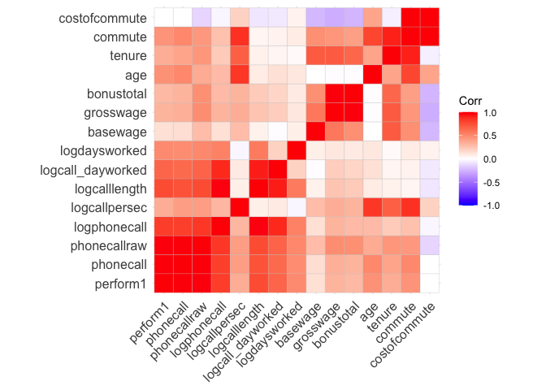<!-- -->

## Top performing 10%

### Select

``` r
df <- volunteer_endperiod_attitude_performance_wage

#df <- na.omit(df$perform1)

# define threshold
threshold <- quantile(df$perform1, 0.9, na.rm = TRUE)

# select data
df <- df %>%
  mutate(isTop10 = if_else(perform1 >= threshold, TRUE, FALSE)) %>% filter(!is.na(isTop10))

top10 <- df %>% filter(isTop10 == TRUE)
bottom90 <- df %>% filter(isTop10 == FALSE)
```

### Compare

Here we use the same approach as for the quitters:

``` r
# compare general statistics
stargazer(as.data.frame(top10), type = "text", median = TRUE, header = TRUE)
```

    ## 
    ## ========================================================================
    ## Statistic           N    Mean    St. Dev.     Min     Median      Max   
    ## ------------------------------------------------------------------------
    ## bedroom            983   0.961     0.193       0         1         1    
    ## children           983   0.239     0.427       0         0         1    
    ## high_educ          983   0.481     0.500       0         0         1    
    ## promote_switch     983   0.217     0.412       0         0         1    
    ## quitjob            983   0.182     0.386       0         0         1    
    ## homethatweek       983   0.254     0.436       0         0         1    
    ## exhaustion         189   6.804     6.105       0         6        25    
    ## negative           189  14.947     5.966       8        13        40    
    ## positive           189  26.619     5.710       8        28        40    
    ## perform1           983   1.643     0.430     1.169     1.522     4.163  
    ## phonecall          982   1.480     0.488     0.039     1.415     5.828  
    ## phonecallraw       982  665.302   93.572      426       649      1,264  
    ## logphonecall       980   6.491     0.134     6.054     6.475     7.142  
    ## logcallpersec      979  -5.125     0.140    -5.458    -5.120    -3.832  
    ## logcalllength      980  11.615     0.160    10.231    11.610    12.116  
    ## logcall_dayworked  981   9.818     0.162     8.285     9.827    10.359  
    ## logdaysworked      982   1.796     0.137     1.386     1.792     1.946  
    ## homethatweek_num   983   0.254     0.436       0         0         1    
    ## basewage           980 1,658.520  183.865    1,300     1,600     2,300  
    ## grosswage          978 3,746.791 1,058.139 1,375.000 3,532.000 8,418.000
    ## bonustotal         969 2,092.682  951.870   70.000   1,941.000 6,268.000
    ## age                983  23.834     5.606       1        23        34    
    ## tenure             983  32.765    25.032       2        28        150   
    ## commute            947  107.360   69.337       2        80        300   
    ## gender_num         983   0.752     0.432       0         1         1    
    ## married_num        983   0.308     0.462       0         0         1    
    ## high_educ_num      983   0.481     0.500       0         0         1    
    ## children_num       983   0.239     0.427       0         0         1    
    ## costofcommute      955   7.019     7.280     0.000     5.000    55.000  
    ## promote_switch_num 983   0.217     0.412       0         0         1    
    ## quitjob_num        983   0.182     0.386       0         0         1    
    ## group_index        983  23.146    17.373       1        16        62    
    ## isTop10            983   1.000     0.000       1         1         1    
    ## ------------------------------------------------------------------------

``` r
stargazer(as.data.frame(bottom90), type = "text", median = TRUE, header = TRUE)
```

    ## 
    ## =======================================================================
    ## Statistic            N     Mean    St. Dev.  Min    Median      Max    
    ## -----------------------------------------------------------------------
    ## bedroom            8,844   0.975    0.156     0        1         1     
    ## children           8,844   0.132    0.339     0        0         1     
    ## high_educ          8,844   0.392    0.488     0        0         1     
    ## promote_switch     8,844   0.177    0.381     0        0         1     
    ## quitjob            8,844   0.249    0.433     0        0         1     
    ## homethatweek       8,844   0.190    0.392     0        0         1     
    ## exhaustion         1,976   8.742    7.861   0.000    8.000     36.000  
    ## negative           1,976  16.800    6.861   8.000   16.000     40.000  
    ## positive           1,976  23.948    6.699   8.000   24.000     40.000  
    ## perform1           8,844  -0.199    0.851   -3.031  -0.073     1.169   
    ## phonecall          8,714  -0.172    0.854   -3.113  -0.046     3.812   
    ## phonecallraw       8,587  414.708  123.300    1       429       977    
    ## logphonecall       8,574   5.955    0.476   0.000    6.061     6.884   
    ## logcallpersec      8,571  -5.175    0.160   -5.951  -5.173     -1.099  
    ## logcalllength      8,571  11.128    0.511   2.485   11.237     11.883  
    ## logcall_dayworked  8,569   9.438    0.448   2.485    9.514     10.186  
    ## logdaysworked      8,830   1.674    0.288   0.000    1.792     1.946   
    ## homethatweek_num   8,844   0.190    0.392     0        0         1     
    ## basewage           8,727 1,591.062 170.406   650     1,550     2,450   
    ## grosswage          8,774 2,990.829 951.818  48.850 2,792.915 14,553.000
    ## bonustotal         8,761 1,416.748 872.868  0.000  1,207.000 12,853.000
    ## age                8,844  23.444    4.026     1       23         35    
    ## tenure             8,844  23.011    24.617    2       13        150    
    ## commute            7,936  103.154   67.580    1       80        300    
    ## gender_num         8,844   0.472    0.499     0        0         1     
    ## married_num        8,844   0.170    0.375     0        0         1     
    ## high_educ_num      8,844   0.392    0.488     0        0         1     
    ## children_num       8,844   0.132    0.339     0        0         1     
    ## costofcommute      8,532   7.471    7.346   0.000    6.000     55.000  
    ## promote_switch_num 8,844   0.177    0.381     0        0         1     
    ## quitjob_num        8,844   0.249    0.433     0        0         1     
    ## group_index        8,844  29.117    17.646    1       37         62    
    ## isTop10            8,844   0.000    0.000     0        0         0     
    ## -----------------------------------------------------------------------

``` r
# compare distributions
ggplot(df, aes(x=isTop10, y=perform1)) + geom_boxplot()
```

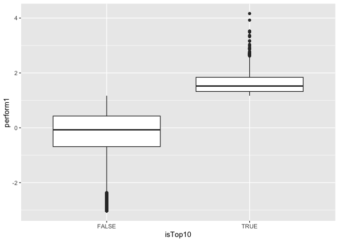<!-- -->

``` r
ggplot(df, aes(x=isTop10, y=tenure)) + geom_boxplot()
```

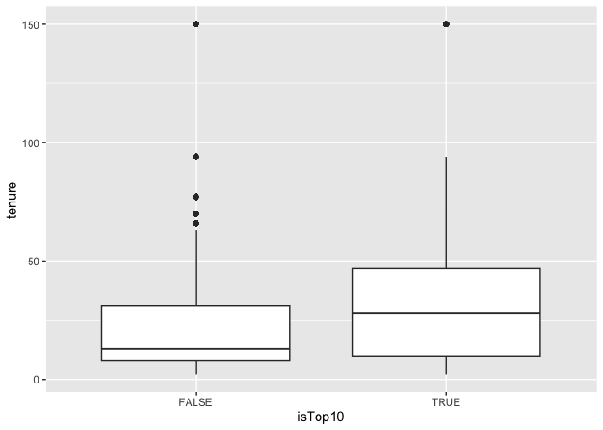<!-- -->

``` r
ggplot(df, aes(x=isTop10, y=age)) + geom_boxplot()
```

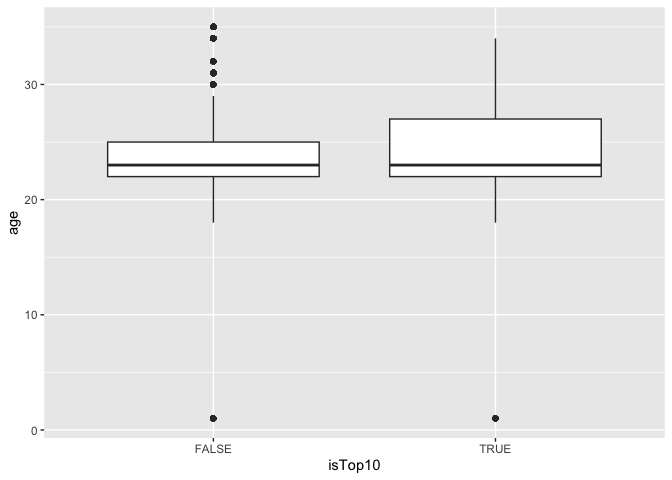<!-- -->

``` r
ggplot(df, aes(x=isTop10, y=commute)) + geom_boxplot()
```

    ## Warning: Removed 944 rows containing non-finite outside the scale range
    ## (`stat_boxplot()`).

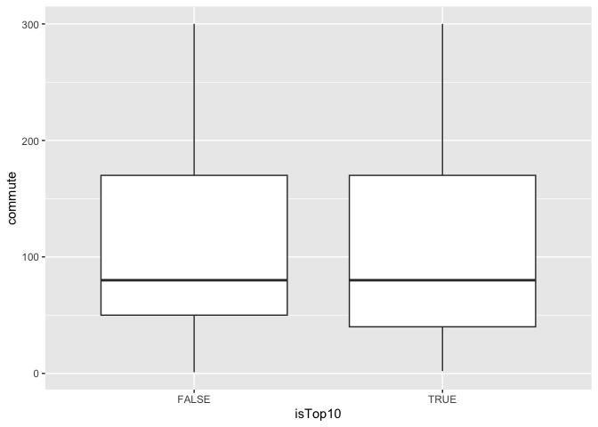<!-- -->

``` r
ggplot(df, aes(x=isTop10, y=costofcommute)) + geom_boxplot()
```

    ## Warning: Removed 340 rows containing non-finite outside the scale range
    ## (`stat_boxplot()`).

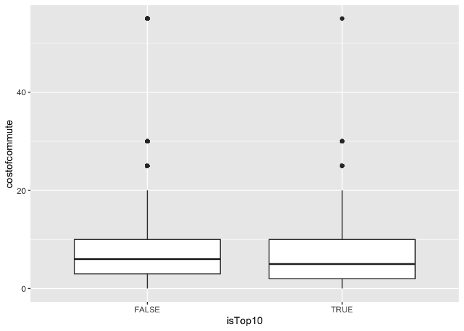<!-- -->

``` r
ggplot(df, aes(x=isTop10, y=basewage)) + geom_boxplot()
```

    ## Warning: Removed 120 rows containing non-finite outside the scale range
    ## (`stat_boxplot()`).

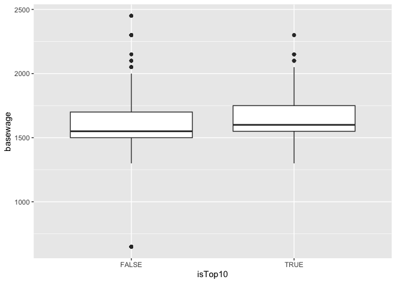<!-- -->

``` r
ggplot(df, aes(x=isTop10, y=bonustotal)) + geom_boxplot()
```

    ## Warning: Removed 97 rows containing non-finite outside the scale range
    ## (`stat_boxplot()`).

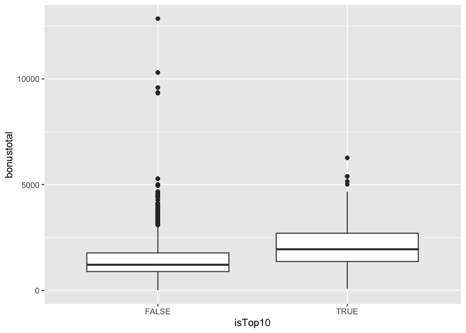<!-- -->

``` r
ggplot(df, aes(x=isTop10, y=grosswage)) + geom_boxplot()
```

    ## Warning: Removed 75 rows containing non-finite outside the scale range
    ## (`stat_boxplot()`).

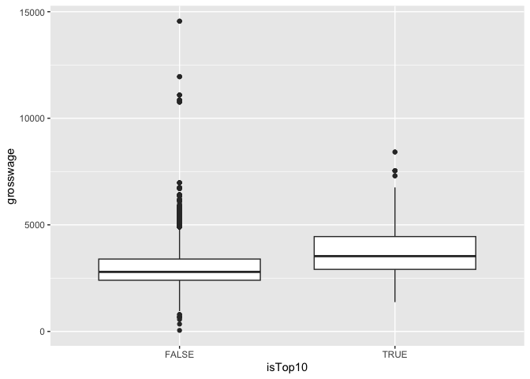<!-- -->

``` r
# create correlation matrices
nums <- dplyr::select(top10, where(is.numeric))
cm <- cor(nums, use = "pairwise.complete.obs")
```

    ## Warning in cor(nums, use = "pairwise.complete.obs"): the standard deviation is
    ## zero

``` r
ggcorrplot(cm, lab = FALSE)
```

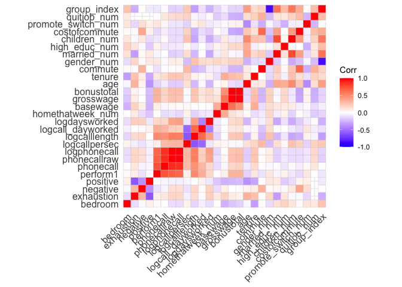<!-- -->

``` r
nums <- dplyr::select(bottom90, where(is.numeric))
cm <- cor(nums, use = "pairwise.complete.obs")
```

    ## Warning in cor(nums, use = "pairwise.complete.obs"): the standard deviation is
    ## zero

``` r
ggcorrplot(cm, lab = FALSE)
```

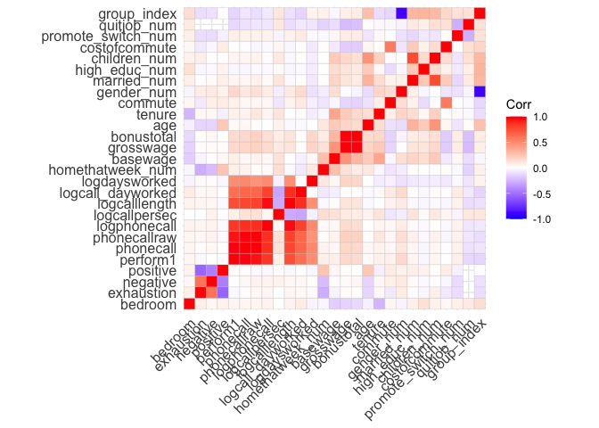<!-- -->

The average employee among the top 10% performing ones, has no children,
though it is more likely than for the other 90%, works 25% oft the time
from home, is almost 24 years old, works for 32 months at the company
and an average commute and average cost of commute. Almost 22% receive a
promotion, whereas 17.7% of lower performing people receive one. They
earn over the average by bonuses, but have a average base salary. Though
some not high performing individuals receive enormous bonuses. Only 18%
high performing people quit while 25% quit from the other 90%.

Top performer are less likely to quit when receiving a higher bonus than
non performer, but more likely if they have a long commute as this is
negatively correlative with their negative attitude. Working from home
does not affect performance of both groups. Working from home increases
positivity while lowering negativity and exhaustion for the top
performer.

*Recommendations*

- Bonuses combined with goals/milestones to motivate people and increase
  performance, but only if you reach them

- check existing bonuses for not high performing people and reevaluate
  if that is fair, this might be a motivation killer

- offer more working from home for high performer, as it does not affect
  their performance and rather increases positivity

# Hypothesis testing
